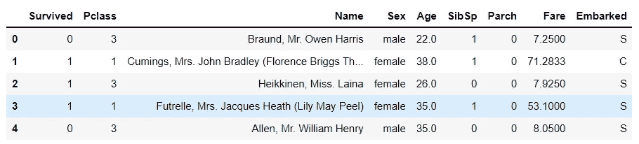
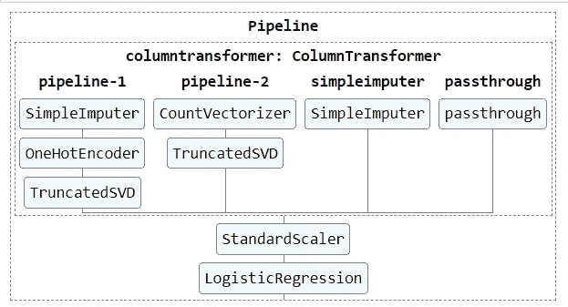

# 用于端到端 ML 模型的交互式管道和复合估算器

> 原文：<https://towardsdatascience.com/interactive-pipeline-and-composite-estimators-for-your-ml-tasks-b739854500bf?source=collection_archive---------26----------------------->

## 训练和显示流水线、列变换器和链式估算器的基本指南


图片由来自 [Pixabay](https://pixabay.com/?utm_source=link-attribution&amp;utm_medium=referral&amp;utm_campaign=image&amp;utm_content=1694404) 的[埃里克·斯坦](https://pixabay.com/users/erik_stein-2524241/?utm_source=link-attribution&amp;utm_medium=referral&amp;utm_campaign=image&amp;utm_content=1694404)拍摄

数据科学模型开发管道涉及各种组件，包括数据注入、数据预处理、特征工程、特征缩放和建模。数据科学家需要为所有组件编写学习和推理代码。对于具有异构数据的机器学习项目，代码结构有时会变得更加混乱，难以为其他团队成员解释。

管道是一个非常方便的功能，它可以顺序地集合所有的模型开发组件。使用流水线，人们可以容易地在相对干净的代码结构中执行学习和推理任务。

在本文中，我们将讨论在开发端到端机器学习模型时，如何使用 scikit-learn 管道通过链接估计器和列转换器来构建您的代码。

# 什么是管道？

管道可以在干净的代码结构中顺序列出所有的数据处理和特征工程估算器。基本上，它将多个估算器连接成一个。使用管道进行学习和推理任务非常方便，并且可以避免数据泄漏。人们也可以一次对管道中所有估计器的参数执行[网格搜索](https://scikit-learn.org/stable/modules/grid_search.html#grid-search)。

我将为具有异构特征的二进制样本数据集开发一个端到端的机器学习模型。二进制样本数据集具有文本、数字和分类数据类型的 8 个独立特征。



(图片由作者提供)，样本数据集快照

## 用法:

样本数据集包括文本特征(姓名)、分类特征(性别、已登机)和数字特征(PClass、年龄、SibSp、Parch、Fare)。

原始真实数据集可能包含大量缺失的数据值。我们可以使用 scikit-learn 包中的[simple imputr](https://scikit-learn.org/stable/modules/generated/sklearn.impute.SimpleImputer.html)函数来估算缺失值。对于分类特征，我们可以将一个独热编码器和一个 SVD 估计器连接起来进行特征分解。

对于文本特征，我们可以使用计数矢量器或 Tf-Idf 矢量器对文本进行矢量化，将文本数据转换为数字嵌入，然后使用降维估计器。

```
Pipeline 1 (For categoircal features):
1) Most Frequent value Imputer
2) One Hot Encoder
3) Truncated SVD decompositionPipeline 2 (For Text based features):
1) Tf-Idf Vectorizer
2) Truncated SVD decomposition
```

(作者代码)

# 异构数据的列转换器:

样本数据集包含从文本数据类型到浮点和对象数据类型的各种要素数据类型。因此，每种类型的特性都需要单独的特性工程策略。

Column Transformer 是一个 scikit-learn 功能，使开发人员能够针对不同的功能集执行不同的功能工程和数据转换步骤。列转换器的优点是可以在管道内执行数据转换，不会出现数据泄漏问题。

## 用法:

我对不同的特性集执行了不同的特性转换策略。

*   管道 1 用于分类特征，如“性”和“已上船”
*   管道 2 用于基于文本的功能，如“名称”
*   数字特征“年龄”的平均估算值，因为它有许多缺失值。
*   其余的数字特性不需要任何特性转换，因此可以使用“passthrough”关键字传递它

(作者代码)

## 建模管道:

在执行数据转换步骤之后，我们可以移动到模型组件。我将使用逻辑回归估计器来训练转换后的数据集。但是，在进入建模阶段之前，我们还可以包括一个 StandardScaler 估计器来标准化转换后的数据集。

(作者代码)

# 可视化管道:

整个管道的可视化表示很容易解释案例研究的端到端流程。Scikit-learn 提供了一个`**set_config**` 函数，使开发人员能够显示整个端到端管道的图形表示。

默认情况下，`set_config`显示参数为“文本”,显示整个管道的文本格式。更改为“图表”关键字将使其工作。

```
**from sklearn import set_config
set_config(display='diagram')**
```



(图片由作者提供)，整个管道的图解说明

# 学习和推理:

可以使用`**.fit()**`函数训练模型管道，并使用`**.predict()**`函数进行推理。

(作者代码)，整个实现

# 结论:

管道是一个非常方便的功能，它可以顺序地将所有的估算器组合成一个，并准备一个干净的、结构良好的代码。使用管道，学习和推理任务变得非常容易运行。您可以在可解释的表示中显示整个端到端管道。

# 参考资料:

[1] Scikit-learn 文档:[https://scikit-learn.org/stable/modules/compose.html](https://scikit-learn.org/stable/modules/compose.html)

*喜欢这篇文章吗？成为* [*中等会员*](https://satyam-kumar.medium.com/membership) *继续无限制学习。如果你使用下面的链接，我会收到你的一小部分会员费，不需要你额外付费。*

<https://satyam-kumar.medium.com/membership>  

> 感谢您的阅读