# 使用 Tableau 和 Jupytab 进行交互式模拟

> 原文：<https://towardsdatascience.com/interactive-simulation-with-tableau-and-jupytab-c26adb1be564?source=collection_archive---------3----------------------->

## 通过将 Tableau 直接连接到您的 Python Jupyter 笔记本，快速创建和部署模拟工具和仪表盘，并将您的时间花在数据上，而不是构建可视化

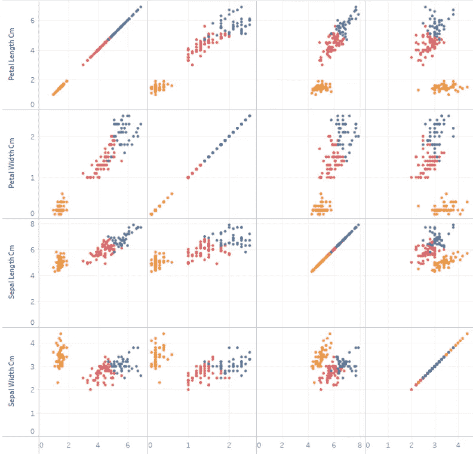

虹膜数据集的多维概述

# 概观

本文展示了如何让领先的交互式数据可视化工具 [Tableau](https://www.tableau.com) 访问动态数据，而不是静态数据。这开启了新的应用，例如可以显示实时数据的仪表板，或者用户显示由机器学习模型获得的动态预测的能力。

我们从通过 Tableau 的本地语言和 Python(通过分析扩展)对 Tableau 中的动态数据访问的简单介绍开始。由于这是一篇实践文章，我们描述如何安装必要的组件(Tableau，和 [Jupyter](https://jupyter.org) 笔记本)，然后说明如何配置它们，并快速获得一个 Tableau 仪表板，显示基于机器学习的动态数据。

# （舞台上由人扮的）静态画面

Tableau 是一个被业界广泛使用的商业智能工具(与 PowerBI 和 QlikView 一起使用)。它允许非技术人员通过拖放界面来创建和部署 web 应用程序。

唯一的缺点是，默认情况下，数据需要在受支持的数据库中随时可用，而数据库本身不能通过界面更新。但是，您可以创建速度惊人的交互式仪表盘，连接到众多数据源，并快速获得大规模数据的概览。

# Tableau 中的动态数据

## Tableau 的脚本语言

Tableau 提供了一种类似 Excel 的语言，允许用户创建自定义计算并操作不同类型的数据(数字、字符串、布尔)。然而，这种脚本语言的局限性非常令人沮丧，因为没有像数据透视表那样的数据操作，甚至一些简单的转换(如将一个字段拆分成多列)也经常需要许多步骤。

Tableau 的脚本语言主要用于在单元级别转换值，或者对整个数据集进行操作，以进行过滤或计算聚合。也就是说，您的选择相当有限，您将不得不主要在 Tableau 之外准备您的数据，并创建一个预先计算的数据集来包含您想要显示的所有数据。

但是，如果您想要创建一个模拟或应用一些机器学习技术，并在更新一些参数后可视化产生的变化，该怎么办呢？Tableau 处理数据源的方式不允许这种操作，否则将迫使您在没有任何库的情况下编写算法，这是完全不切实际的。

## 分析扩展到救援

为了实现 Tableau 的实时分析，或者至少是使用自定义算法的即时计算，Tableau 的一个非常有趣的功能隐藏在*帮助* → *设置和性能* → *管理分析扩展连接……*。它允许你实现我们对 web 应用程序的期望。

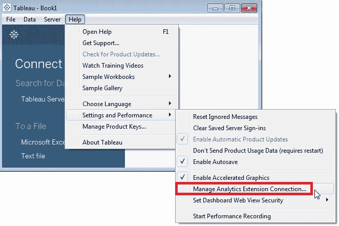

分析扩展-按作者分类的图像

以下是*分析扩展连接*在 Tableau 数据生态系统中的位置:

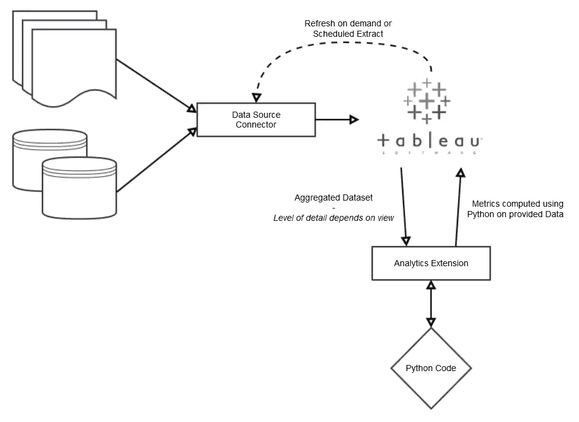

Tableau 中的数据源-按作者分类的图像

## Tableau 生态系统中的 Python

在 Tableau 中，我们可以期待 Python 代码的两个地方是**数据源创建**和**实时计算**(基于显示的数据)。

**数据源创建**

数据源通常是现有的数据库。可以编写一个自定义的数据注入器来写入这个数据库。这种方法应该很快，但是它显然需要一个成熟的数据库，还需要一个定期调用数据注入程序的调度程序。

另一种方法是直接连接到自定义数据源。因此，Tableau 允许我们创建自定义 Web 数据连接器(WDC)并使用 WDC API。有相当数量的连接器可用，其中一些可能符合您的需求。如果不是这种情况，您将不得不创建一个自定义连接器，但是要注意:学习曲线很陡。

另一个选择是本文中所展示的:通过使用 Jupytab，你可以直接从 Jupyter 笔记本中导出你的熊猫数据帧到 Tableau。(这种方法使用了 WDC API，因此您不必与之争论。)通过使用 Jupytab，您还可以免费获得预定的数据刷新，因为您可以使用 Tableau 内部调度程序按需轮询数据。这种方法的一个小限制是数据源的最大大小:具有 10 亿行的数据集通常不容易放入 Pandas 数据框架中！

**实时计算**

除了 Jupytab，没有多少其他 Tableau 工具执行动态数据源创建和计算。然而，我们必须提到 [TabPy](https://github.com/tableau/TabPy) ，这是 Tableau 自己的 Python 交互式分析工具。它创建了一个服务器，通过按需执行代码，允许您在 Tableau 中使用 Python 代码。

Jupytab 服务于完全相同的目的，但是有一些关键的区别:

*   你所有的 Python 代码都来自一个笔记本:你创建数据源*并且*在那里为 Tableau 公开它。
*   你不用 Tableau 写 Python 代码，你总是从你的笔记本里调用一个 Python 函数。
*   可用库的集合被链接到笔记本。这意味着您可以使用不同的库集创建多个执行环境，并在 Tableau 中使用它们，可能是从多个笔记本中。

如果您的主要开发工具是带有熊猫和一些数据科学库的 Jupyter 笔记本，并且您希望快速创建用于生产的交互式仪表盘，那么 Jupytab 是一个值得一试的工具。

# Jupytab 安装

我们假设你熟悉 Python、 [Conda](https://docs.conda.io/en/latest/) (或`virtualenv`)、Jupyter 并使用 Linux/macOS 进行开发。Jupytab 可以在 Windows 上运行，但是没有经过很好的测试——不过，使用 WSL(Linux 的 Windows 子系统)可以在本文中运行。我们将使用`conda`进行安装，但它也应该与`pip`一起工作。

Jupytab 有两个组件，`jupytab`和`jupytab-server`，需要安装在它们自己的环境中:

*   jupytab :一个非常简单的 API，从一个笔记本中公开数据帧和自定义函数。它需要安装在笔记本环境中，并且只需要熊猫作为依赖。
*   **jupytab-server** :提供 Web 数据连接器，生成内核，管理配置等…不要将此组件安装在与笔记本相同的环境中，以免冲突。

## 在笔记本电脑方面

我们首先使用 Python 3.7 创建一个虚拟环境，以保持一切的整洁和可再现性(如果您准备在已经拥有的 Conda 环境中继续学习，也可以跳过这一部分):

```
(base) % conda create -n jupytab-notebook-env python=3.7
(base) % conda activate jupytab-notebook-env
```

然后我们安装最新的`jupytab`版本和`ipykernel`库，这样我们的 Jupyter 内核就可以在笔记本上使用了:

```
(jupytab-notebook-env) % conda install jupytab=0.9.11
```

然后我们在 Jupyter 中安装内核:

```
(jupytab-notebook-env) % conda install ipykernel
(jupytab-notebook-env) % python -m ipykernel install --user --name jupytab-simulation-demo
```

您现在可以在 Jupyter 中创建一个笔记本，它将使用新安装的内核。

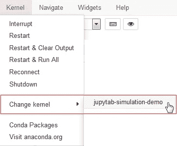

Jupytab 模拟内核—图片由作者提供

最好通过检查其版本来检查 Jupytab 是否已正确安装，例如，通过执行以下操作:

```
import jupytab
print(jupytab.__version__)
```

> ***【输出】*** *: 0.9.11*

## 在服务器端

我们还基于 Python 3.7 创建了一个新的虚拟环境。您可以使用命令`conda deactivate`打开一个新的终端或者只是停用您以前的环境:

```
(base) % conda create -n jupytab-server-env python=3.7
(base) % conda activate jupytab-server-env
```

然后我们安装最新的 jupytab-server 版本，就这样！

```
(jupytab-server-env) % conda install jupytab-server=0.9.11
```

# 将 Tableau 连接到笔记本

## 写笔记本

激发本文灵感的笔记本和仪表盘是免费提供的:不要犹豫，下载它们并使用它们跟随。

对于我们的模拟，我们将只使用熊猫和 scikit-learn，但你当然可以安装自己的库。我们首先在 jupytab-notebook-env 中安装 scikit-learn(从基础环境开始，所以要么在新的终端中，要么在`conda deactivate`之后):

```
(base) % conda activate jupytab-notebook-env
# No need to install pandas, it is already installed with jupytab:
(jupytab-notebook-env) % conda install scikit-learn
```

我们创建一个名为*jupytab-simulation-notebook*的新笔记本

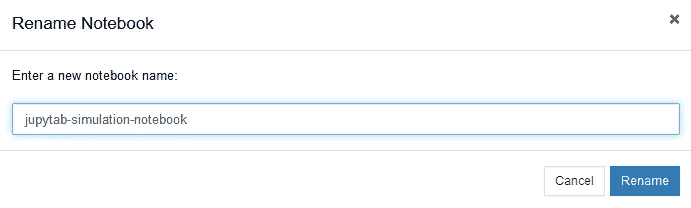

笔记本创作—作者图片

我们将使用众所周知的 [iris 数据集](https://en.wikipedia.org/wiki/Iris_flower_data_set)，它包含在 scikit-learn 中，并加载 Pandas 数据帧中的所有内容:

```
import pandas as pd
import jupytab
from sklearn.datasets import load_irisiris = load_iris()iris_data_df = pd.DataFrame(columns=iris.feature_names, data=iris.data)
iris_target_df = pd.DataFrame(columns=['target'], data=iris.target)
iris_target_class_df = pd.DataFrame(columns=['target_name'], data=iris.target_names)iris_data_df.sample(2)
```

> **【输出】**:

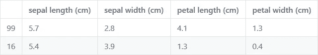

虹膜数据集中的萼片样本—图片由作者提供

然后，我们将 dataframe 加载到 Jupytab `Tables`字典中，以表明我们希望将这些数据公开给 Tableau:

```
tables = jupytab.Tables()tables['iris'] = jupytab.DataFrameTable("Iris DataSet", iris_data_df, include_index=True)
tables['iris_target'] = jupytab.DataFrameTable("Iris Classification Target", iris_target_df, include_index=True)
tables['iris_target_class'] = jupytab.DataFrameTable("Iris Classes", iris_target_class_df, include_index=True)
```

一个`DataFrameTable`定义了如何将数据暴露给 Tableau:

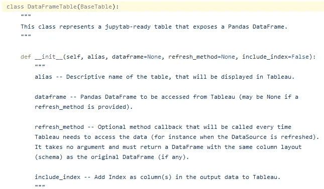

Jupytab 数据框架文档—作者图片

这里，我们简单地公开了静态数据帧及其索引。

为了允许`jupytab-server`检索数据，我们需要添加两个单元格。

第一个单元生成一个模式，声明我们所有的数据帧。它需要与下面的单元格*完全一样*(您可以直接在笔记本中复制并粘贴):

```
# GET /schema
tables.render_schema()
```

执行此单元格将打印导出到 Tableau 的模式。

> ***【输出】*** *: [{"id": "iris "，" alias": "Iris DataSet "，" columns": [{"id": "index "，" dataType": "int"}，{"id": "sepal_length_cm_，" dataType": "float"}，{"id": "sepal_width_cm_，" dataType": "float"}，{"id": "petal_length_cm_，" dataType": "float"}，{"id " "*

第二个单元格是数据导出的位置:

```
# GET /data
tables.render_data(REQUEST)
```

执行这个单元格会在笔记本中产生一个无害的错误:`REQUEST`变量只有在笔记本由 Jupytab 服务器执行时才可用；

> ***【输出】****:*
> name error trace back(最近一次调用 last)
> <ipython-input-1-C5 E1 a 6 B1 cfcd>in<模块>
> 1 # GET/data
> —→2 tables . render _ data(REQUEST)

如果不想在执行过程中得到错误，可以用一个简单的`try`块包装`render_data()`:

```
# GET /data
try:
    tables.render_data(REQUEST)
except NameError:
    print("Not available outside jupytab context")
```

就是这样！您还可以在`[jupitab-server/samples](https://github.com/CFMTech/Jupytab/tree/master/jupytab-server/samples)` [目录](https://github.com/CFMTech/Jupytab/tree/master/jupytab-server/samples)下的 Jupytab GitHub 资源库中找到几个 Jupytab 笔记本示例。

## 配置并启动 Jupytab 服务器

在 Jupytab 服务器环境中，我们需要创建一个配置文件，允许我们配置一些参数，如服务器端口、秘密令牌，当然还有服务器必须公开的笔记本列表。

可以使用简单的`cat`命令(在 Unix 下)创建配置文件，或者使用任何文本编辑器编写一个`config.ini`文件:

```
(base) % conda activate jupytab-server-env
(jupytab-server-env) % cat << EOF > config.ini
[main]
listen_port = 8123
notebooks = JupytabSimulator

[JupytabSimulator]
path = /path/to/your/notebook/jupytab-simulation-notebook.ipynb
EOF
```

[还提供更多配置选项](https://github.com/CFMTech/Jupytab#configuration-file)。

完成后，您只需要启动 Jupytab 服务器:

```
(jupytab-server-env) % jupytab --config=/path/to/your/config.ini
Starting Jupytab-Server 0.9.11
SSL not enabled
Start notebook /path/to/your/notebook/jupytab-simulation-notebook.ipynb on 127.0.0.1:35453
You have no defined token. Please note your process is not secured !
        Please open : [http://computer_name:8123](http://computer_name:8123)
INFO:[KernelGatewayApp] Kernel started: a6abe896-2cb8-403a-8661-3236e16d8def
INFO:[KernelGatewayApp] Registering resource: /schema, methods: (['GET'])
INFO:[KernelGatewayApp] Registering resource: /data, methods: (['GET'])
INFO:[KernelGatewayApp] Registering resource: /_api/spec/swagger.json, methods: (GET)
INFO:[KernelGatewayApp] Jupyter Kernel Gateway at [http://127.0.0.1:35453](http://127.0.0.1:35453)
```

这将运行笔记本并创建一个允许您访问它的服务器。

请注意，您需要等待您的笔记本资源的注册出现在日志中，否则您将无法从 Tableau 访问它。这是下面的部分:

```
INFO:[KernelGatewayApp] Registering resource: /schema, methods: (['GET'])
INFO:[KernelGatewayApp] Registering resource: /data, methods: (['GET'])
```

如果您的笔记本需要时间进行计算，这可能需要几分钟才能显示出来。

# 导入 Tableau 中的数据

如果你还没有安装 Tableau，你可以[下载并免费试用](https://www.tableau.com/products/trial)。本文是用 Tableau 2020.2 测试的，所以您可能需要根据需要稍微修改一下说明。

从开始屏幕中选择 Web 数据连接器:

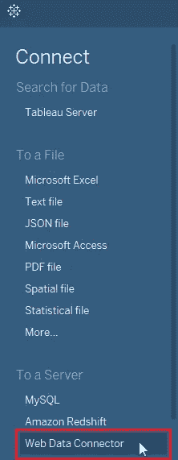

Tableau 连接器—作者图片

然后，您可以输入在终端中打印的 web 数据连接器 URL:

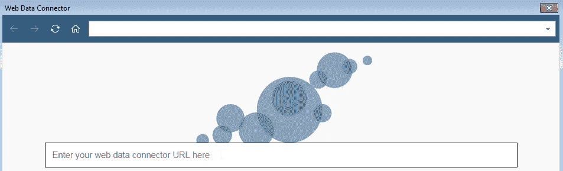

Web 数据连接器浏览器-作者图片

```
Start notebook /path/to/your/notebook/jupytab-simulation-notebook.ipynb on 127.0.0.1:35453
You have no defined token. Please note your process is not secured !
        Please open : http://computer_name:8123
```

您应该能够选择您的第一个笔记本并查看所有可用的操作:

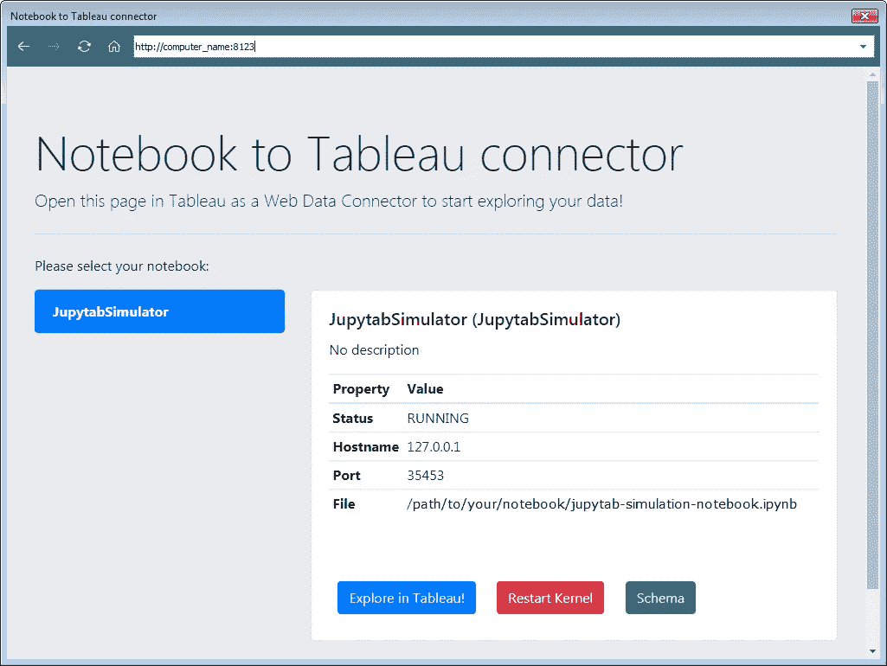

Jupytab UI 的欢迎屏幕—作者图片

继续在 Tableau 中探索，并使用提供的表格创建您的数据集。注意表之间的顺序和连接:

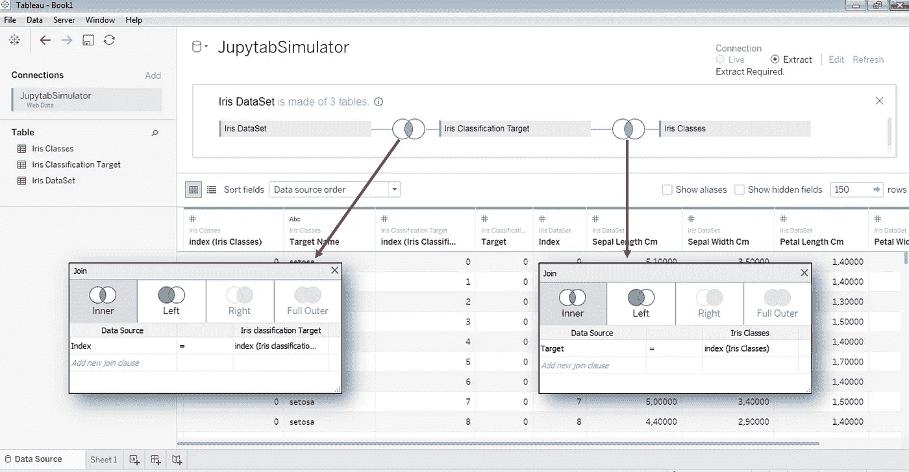

Tableau 中的数据源关系—按作者分类的图像

我们现在有了一个数据集，它是从 Jupyter 笔记本中导入的。

# 创建虹膜模拟器

我们将创建一个基于[虹膜数据集](https://scikit-learn.org/stable/auto_examples/datasets/plot_iris_dataset.html)的 Tableau 模拟器。它经常被用作常见的机器学习示例。手头的任务包括仅根据四个维度(萼片和花瓣长度/宽度)对 3 种类型的鸢尾进行分类。

这个模拟器的目标仅仅是对使用 Tableau 创建仪表板有一个大概的了解。它们无需编写任何代码就可以创建，更重要的是，只需几分钟。

## 更新笔记本以添加预测功能

我们将使用一个多层感知器(MLP)分类器，并用数据集的全部内容训练它。我们的目标不是实现任何类型的高精度预测，而是展示如何通过 Jupytab 在 Tableau 中动态地进行预测。

正如我们对`jupytab.Tables`所做的那样，我们需要添加一个`jupytab.Functions`字典来注册我们的预测器方法:

```
from sklearn.neural_network import MLPClassifierclf = MLPClassifier(max_iter=600).fit(iris.data, iris.target)def predictor(sepal_length_cm, sepal_width_cm, petal_length_cm, petal_width_cm):
    class_predict = clf.predict([[sepal_length_cm, sepal_width_cm, petal_length_cm, petal_width_cm]])
    return iris.target_names[class_predict][0]  # We return the only predictionfunctions = jupytab.Functions()
functions['predict'] = jupytab.Function('A predictor for the Iris DataSet', predictor)predictor(0.5, 5, 4, 2)
```

> ***【输出】*** *:《处女座》*

我们还需要定义一个将由 Jupytab 服务器使用的新端点:

```
# POST /evaluate
try:
    functions.render_evaluate(REQUEST)
except NameError:
    print("Not available outside jupytab context")
```

> ***【输出】*** *:在 jupytab 上下文之外不可用*

然后，我们必须保存笔记本并从 Tableau 重新启动内核，以便 Tableau 能够考虑我们的更改。


笔记本可用的 Jupytab 操作-按作者排序的图片

# 在 Tableau 中动态预测

## 通过分析扩展连接到 Jupytab

在 Tableau 中使用 predictor 函数之前，我们需要将我们的 Jupytab 服务器注册为 Tableau 中的分析扩展。

这可以通过 Tableau 桌面菜单中的*帮助* → *设置和性能* → *管理分析扩展连接*项轻松完成。

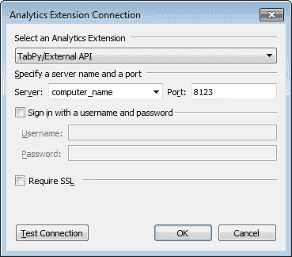

分析扩展设置-按作者分类的图像

使用*测试连接*按钮检查一切正常:

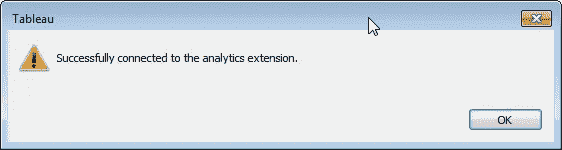

成功连接分析扩展-按作者分类的图像

## 仪表板创建

为了显示每个样本的数据点，我们需要将 Iris 数据集索引转换为一个维度:

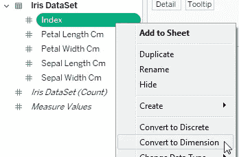

Tableau 桌面中的维度属性-按作者排序的图像

然后将该值作为详细信息删除:

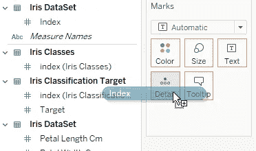

Tableau 桌面中的标记版本—作者图片

我们得到以下结果:

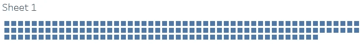

带有索引维度的默认绘图-按作者排序的图像

然后，我们将显示一个网格来可视化所有维度之间的相互关系。从 Iris 数据集中选择所有测量:

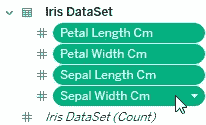

度量选择-按作者排序的图像

和下拉列表:

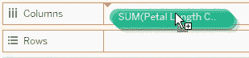

Iris 数据集按列测量-按作者分类的图像

对行执行相同的操作:

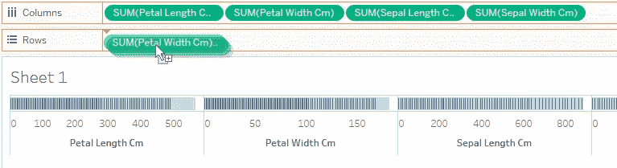

Iris 数据集按行测量-按作者分类的图像

你的视觉化差不多准备好了！

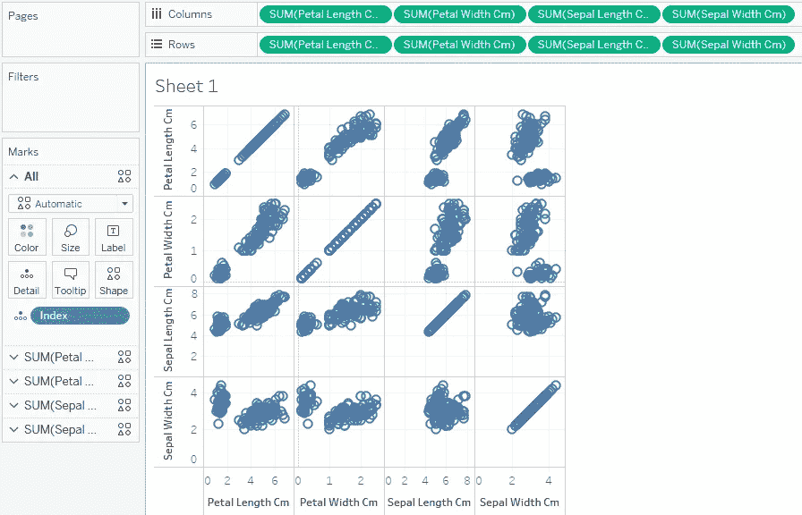

Tableau 桌面中的多维情节—图片由作者提供

只需在颜色标记中删除虹膜类的目标名称。

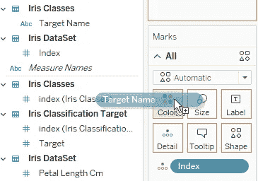

使用彩色聚类的目标名称-按作者分类的图像

输出允许您将结果可视化为比较所有维度的网格图:

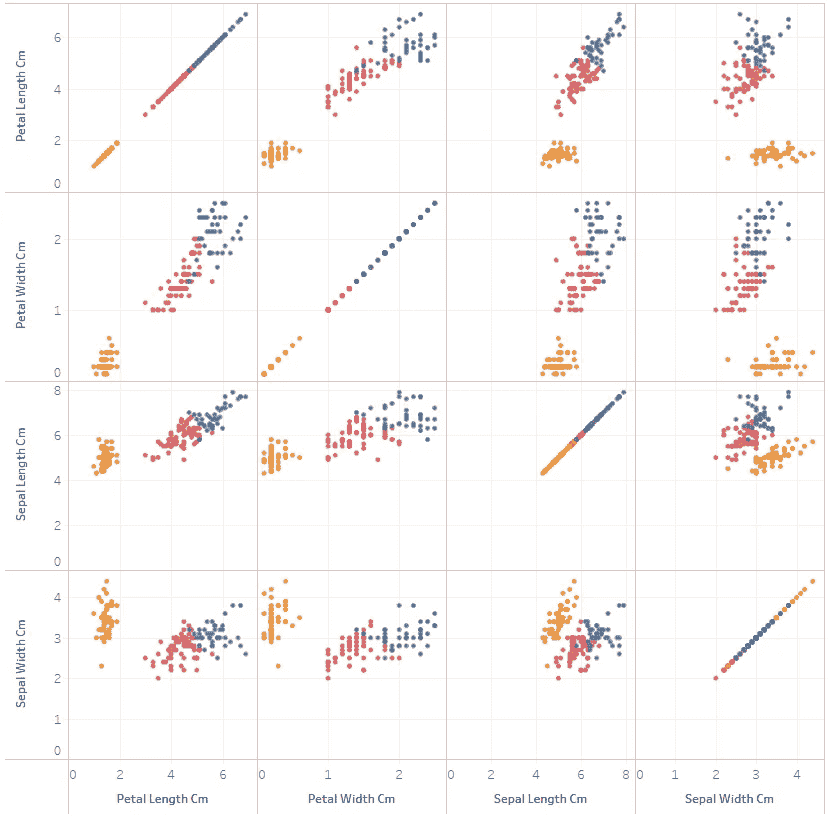

作者图片

现在，我们将检查我们的模型是否正确预测虹膜类型。我们希望为每个虹膜样本调用预测器，并在上图中显示错误分类的数据。为此，我们需要创建一个计算字段:

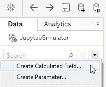

作者图片

以下公式返回预测的虹膜类型:

```
SCRIPT_STR("JupytabSimulator.predict", AVG([Sepal Length Cm]), AVG([Sepal Width Cm]), AVG([Petal Length Cm]), AVG([Petal Width Cm]))
```

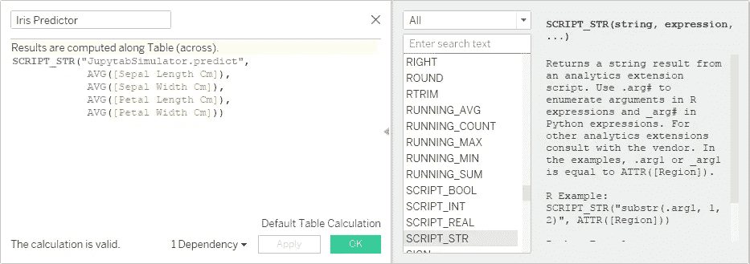

Tableau 桌面中计算字段的代码编辑器-按作者排序的图像

`**JupytabSimulator**`是我们在`config.ini`文件中注册的笔记本的名称，`**predict**`是我们注册的函数的名称。两个值的结合是目标。这意味着您可以针对不同的笔记本电脑，每台笔记本电脑都使用自己的虚拟环境和一组库。

函数参数是您在预测函数中定义的四个参数，当然它们需要以相同的顺序插入。

我们还需要另一个函数，将实际虹膜类型与预测值进行比较，如果不匹配，则返回`False`。需要`ATTR`函数，因为*虹膜预测器*已经是一个聚集数据:

```
ATTR([Target Name]) = [Iris Predictor]
```

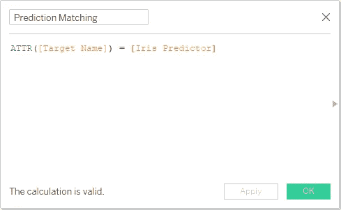

有效预测的布尔指示器-按作者排序的图像

然后，我们将使用*预测匹配*替换当前的聚类颜色，并选择圆形作为表示。

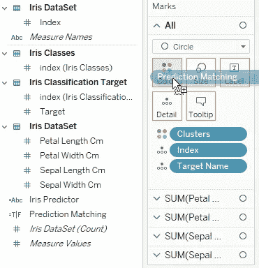

预测匹配用作颜色标记—作者图片

Tableau 将与 Jupytab 通信几分钟，因为它需要预测所有显示标记(即数据点)的虹膜类别:

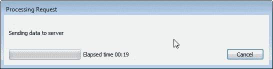

对 Jupytab 的分析扩展请求—按作者排序的图像

这是 Tableau Analytics 扩展的重要一点:你需要尽量减少显示在仪表盘上的标记数量，以保证快速的结果和更具交互性的体验。

由于上面的*预测匹配*计算，错误的预测可能会显示出来:

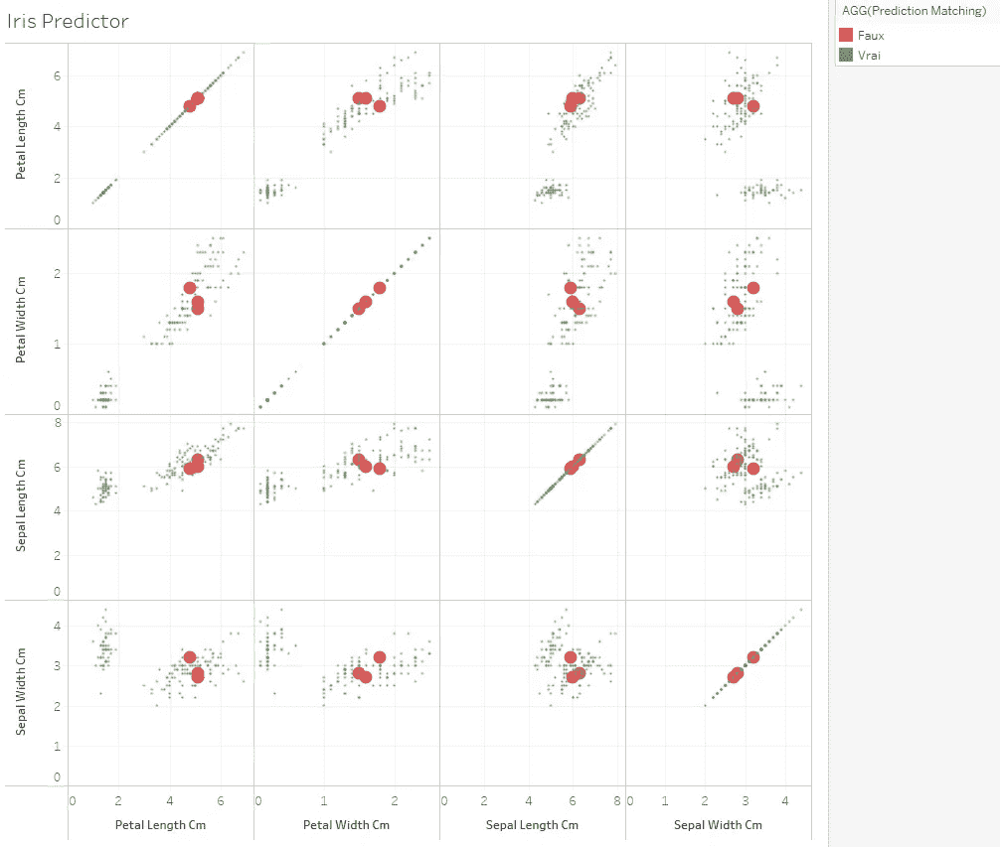

可视化中的预测误差—作者提供的图像

通过将此图与上一个图进行比较，我们可以看到错误预测的虹膜类型是如何出现在虹膜组之间的边界上的。

一个只给我们错配数量的可视化，将极大地增加标记的数量，同时仍然提供一些重要的信息。我们只需要从列和行中删除所有度量，用我们的*预测匹配*计算来替换它们。这个新的可视化将在几秒钟内加载:

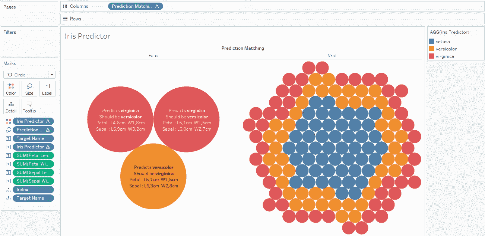

虹膜数据集的“花形图”——作者提供的图片

最后但同样重要的是，我们希望了解 MLP 培训的迭代次数如何影响我们的结果。这就需要我们使用 Tableau 的另一个很酷的特性:*参数*。

我们首先更新笔记本中的预测函数，添加一个新的可选变量来训练(再次)我们的 MLP。我们只需要缓存结果，以避免在每次调用时进行相同次数的迭代训练:

```
from sklearn.neural_network import MLPClassifierlast_max_iter = 0
clf = Nonedef train(request_max_iter):
    global clf, last_max_iter
    if not clf or last_max_iter != request_max_iter:
        clf = MLPClassifier(max_iter=request_max_iter, random_state=1).fit(iris.data, iris.target)
        last_max_iter = request_max_iter
    return clfdef predictor(sepal_length_cm, sepal_width_cm, petal_length_cm, petal_width_cm, request_max_iter=1000):
    clf = train(request_max_iter)  # We now train as needed

    class_predict = clf.predict([[sepal_length_cm, sepal_width_cm, petal_length_cm, petal_width_cm]])
    return iris.target_names[class_predict][0]functions = jupytab.Functions()
functions['predict'] = jupytab.Function('A predictor for the Iris DataSet', predictor)predictor(0.5, 5, 4, 2)
```

**【输出】**:“弗吉尼亚”

不要忘记通过 Jupytab UI 在 Tableau 中重启内核，以便应用更改。

在 Tableau 端，我们将创建一个范围从 10 到 1000 的参数，以直观显示训练迭代次数对我们预测的影响:

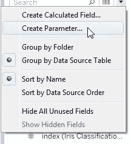

Tableau 桌面中的参数创建—由作者创建的图像

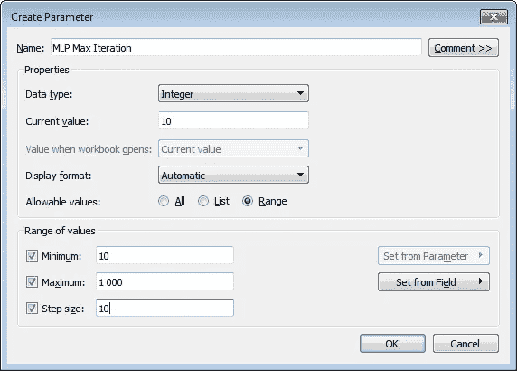

参数设置—按作者分类的图像

然后，我们将这个参数添加到视图中:

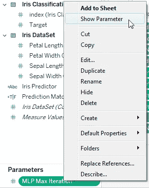

在 Tableau 仪表板中查看参数—按作者分类的图像

我们现在可以动态地改变 MLP 的最大训练迭代次数:

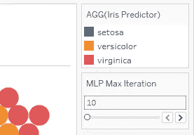

MLP 最大迭代设置-按作者分类的图像

我们还需要更新虹膜预测值计算，并添加这个新参数:

```
SCRIPT_STR("JupytabSimulator.predict", AVG([Sepal Length Cm]), AVG([Sepal Width Cm]), AVG([Petal Length Cm]), AVG([Petal Width Cm]), [MLP Max Iteration])
```

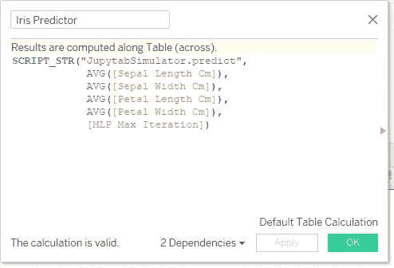

用 MLP 最大迭代更新虹膜预测值计算——图片由作者提供

就在单击 apply 之后，结果会立即更新为默认值 10 次迭代。

**MLP 训练 10 次迭代**

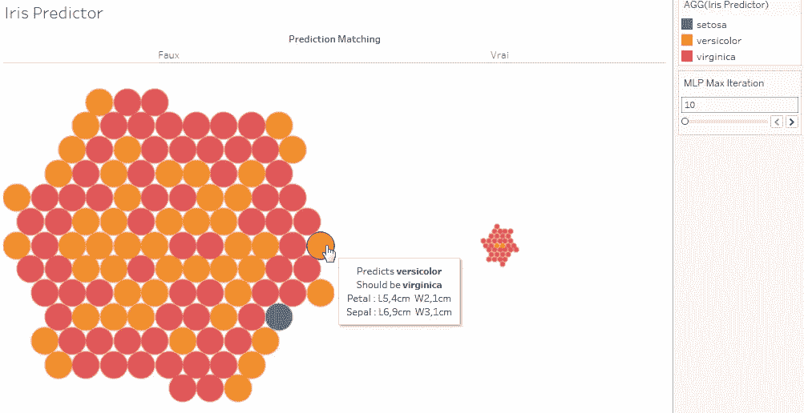

MLP 训练 10 次迭代—作者图片

**MLP 训练 100 次迭代**

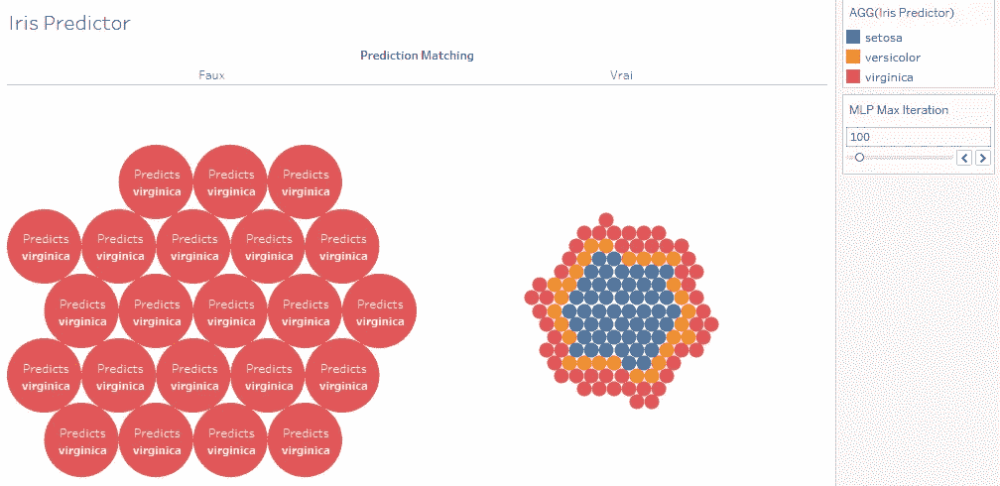

MLP 训练 100 次迭代—作者图片

# 结论

Tableau 是一个非常强大的数据可视化工具。使用 Jupyter 笔记本电脑计算数据并获得几乎即时的反馈非常方便。

我们几乎没有触及 Tableau 特性的表面，并且您可以在您的仪表板中创建的可视化和交互的种类几乎没有限制。

Jupytab 项目是开源的，可以在 MIT 许可下在 GitHub 上访问。

你也可以在网上阅读许多用 Tableau 制作的令人印象深刻的仪表盘。

# 感谢

这是我在 GitHub 上发布的第一个项目，如果没有 CFM 开源项目的大力支持和那里工作人员的帮助，它可能永远不会离开我的电脑。

我要特别感谢[Jean-sébastien Dieu](https://github.com/js-dieu)[、Eric Lebigot](https://github.com/lebigot) 和 [Florent Zara](https://github.com/flzara) 对 Jupytab 各方面的支持，并帮助我发表这篇文章。