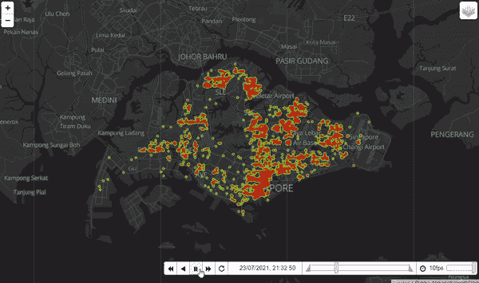
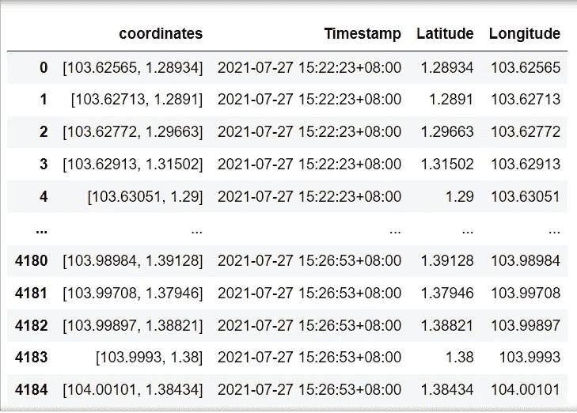
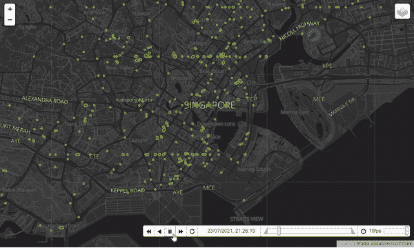

# 使用 Python 和 API 的交互式时间序列:生成新加坡出租车的热图

> 原文：<https://towardsdatascience.com/interactive-time-series-with-python-and-api-generating-heatmap-of-taxis-in-singapore-4d84adbd4c54?source=collection_archive---------12----------------------->

## 地理空间可视化是讲述故事的一种强大方法，尤其是在热图中。在这个例子中，我使用了一个时间序列热图，通过坐标和时间来表达出租车的移动。通过混合使用热图和来自 API 的实时数据，用户将能够分析实时出租车运动。

新加坡陆路交通管理局(LTA)有一个 API，显示所有出租车的实时坐标。这是一个相当酷的 API，显示实时的出租车运动，每 30 秒刷新一次。然而，在搜索了更多关于这个 API 的信息之后，人们对它做了很少的工作。因此，在本文中，我将介绍如何从这个 API 收集数据的步骤，并在下面的时间序列热图中使用 follow！



新加坡周五晚上的出租车运动

**第一步:导入相关包**

```
import folium
import folium.plugins as plugins
import pandas as pd
import json
import requests
import time
from folium.plugins import HeatMapWithTime
import datetime
```

**第二步:从 API 提取数据并将其存储为数据集**

我首先创建一个空的数据框，这样我就可以将动态数据追加到其中。

```
cumulative = pd.DataFrame()
```

接下来，使用一个简单的输入功能，我能够键入滑行运动的持续时间。这将决定循环运行的次数。

```
mins = input('How many mins do you want to see? ')
number_of_times = (int(mins)*60)/30
```

接下来，编写一个 for 循环，不断地从 API 中提取数据。因为 API 每 30 秒刷新一次，所以我使用 Python 时间模块每 30 秒重新运行一次脚本。同时，我只从 Geojson 对象中提取坐标和时间戳，并将其附加到我的 pandas 数据框中。这将允许我将过去的数据编译到一个数据框架中，以便于以后操作。

```
startTime = time.time()
for i in range(int(number_of_times)):
    url = ("[https://api.data.gov.sg/v1/transport/taxi-availability](https://api.data.gov.sg/v1/transport/taxi-availability)")
    response = requests.get(url)
    data = response.json()
    df = pd.io.json.json_normalize(data['features'])
    coordinateslist = df['geometry.coordinates'].tolist()
    df1 = pd.DataFrame(coordinateslist)
    result = df1.transpose()
    result.columns = ['coordinates']
    result['Timestamp'] = (df['properties.timestamp'][0])
    cumulative = cumulative.append(result) 
    time.sleep(30)
endTime = time.time()
elapsedTime = endTime - startTime
print("Elapsed Time = %s" % elapsedTime,'seconds')
```

**步骤 3:与 for 循环的数据争论**

现在是处理数据的时候了，这样我们就可以很容易地利用它。我首先将坐标分成纬度和经度两列。

```
cumulative['coordinates'] = cumulative['coordinates'].astype(str)
Latitude = []
Longitude = []
coordinates = []
for i in cumulative['coordinates']:
    i = i.split(", ")
    lat = i[1][:-1]
    long = i[0][1:]
    Latitude.append(lat)
    Longitude.append(long)
cumulative['Latitude'] = Latitude
cumulative['Longitude'] = Longitude
```

在我们将数据框处理成我们想要的格式以便将其绘制到 leav 之前，您的数据框应该类似于下图。



操作后产生的数据框

接下来，我们需要将纬度和经度放入一个嵌套列表中，以便我们使用`folium.plugins.**HeatMapWithTime**` 来生成时间序列热图。

```
lat_long_list = []
for i in cumulative['Timestamp'].unique():
    temp=[]
    for index, instance in cumulative[cumulative['Timestamp'] == i].iterrows():
        temp.append([instance['Latitude'],instance['Longitude']])
    lat_long_list.append(temp)
```

**步骤 4:创建时间索引并格式化**

接下来，我们必须将时间戳转换成 datetime 格式，这样我们就可以将其转换成更整洁、可读性更好的布局。这也将是播放按钮中用来显示时间和日期的索引。

```
#converting it to datetime format
cumulative['Timestamp']= pd.to_datetime(cumulative['Timestamp'])#creating a time index
time_index = []
for i in cumulative['Timestamp'].unique():
    time_index.append(i)#formatting the index
date_strings = [d.strftime('%d/%m/%Y, %H:%M:%S') for d in time_index]
```

**第五步:绘制时间序列热图**

终于可以生成地图了！我选择了一个深色主题的新加坡地图，这样热图看起来会更有活力。

```
#Choosing the map type 
m = folium.Map(location=[1.352083,103.819839],zoom_start = 11, tiles="[https://tiles.stadiamaps.com/tiles/alidade_smooth_dark/{z}/{x}/{y}{r}.png](https://tiles.stadiamaps.com/tiles/alidade_smooth_dark/{z}/{x}/{y}{r}.png)",attr="Stadia.AlidadeSmoothDark")#Plot it on the map
HeatMapWithTime(lat_long_list,radius=5,auto_play=True,position='bottomright',name="cluster",index=date_strings,max_opacity=0.7).add_to(m)# Display the map
m
```



你的地图完成了！可以放大看新加坡市区的动静。

**总结**

*   步骤 1:导入相关的包
*   步骤 2:从 API 提取数据并将其存储为数据集
*   步骤 3:用 for 循环处理数据
*   步骤 4:创建时间索引并格式化它
*   步骤 5:绘制时间序列热图

请随意将其保存为 html 文件，以便发送给朋友和同事。你可以在我的 Github 上查看完整的代码。