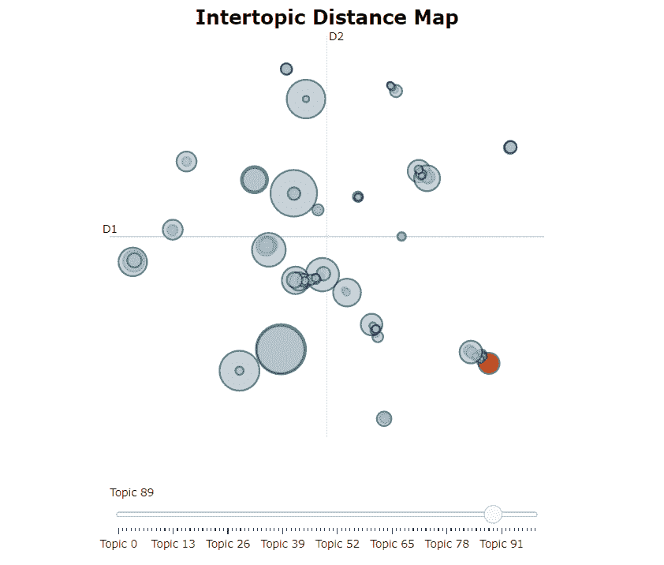
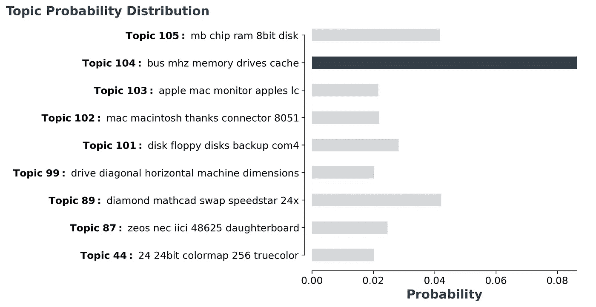

# 用 BERTopic 进行交互式主题建模

> 原文：<https://towardsdatascience.com/interactive-topic-modeling-with-bertopic-1ea55e7d73d8?source=collection_archive---------2----------------------->



图片由作者提供。

## NLP — [入门](https://towardsdatascience.com/tagged/getting-started)

## 使用 BERTopic 进行主题建模的深入指南

每天，企业都要处理大量的非结构化文本。从电子邮件中的客户互动到在线反馈和评论。为了处理如此大量的文本，我们期待**主题建模**。一种通过识别重复出现的主题从文档中自动提取含义的技术。

几个月前，我写了一篇关于利用 **BERT** 进行主题建模的文章。它出乎意料地爆发了，我对我得到的积极反馈感到惊讶！

</topic-modeling-with-bert-779f7db187e6>  

我决定专注于进一步开发本文所基于的主题建模技术，即 BERTopic。

[**ber topic**](https://github.com/MaartenGr/BERTopic)**是一种主题建模技术，它利用 BERT 嵌入和基于类的 TF-IDF 来创建密集的集群，从而允许轻松解释主题，同时保留主题描述中的重要单词。**

**我现在处在一个点上，BERTopic 已经获得了足够的牵引力和发展，我相信它可以取代或补充其他主题建模技术，如 LDA。**

**<https://github.com/MaartenGr/BERTopic/>  

本文的主要目的是向您深入介绍 BERTopic 的特性和教程，以及如何最好地将其应用于您自己的项目。

# 1.装置

和往常一样，我们从通过 [pypi](https://pypi.org/project/bertopic/) 安装包开始:

```
pip install bertopic
```

要使用可视化选项，请按如下方式安装 BERTopic:

```
pip install bertopic[visualization]
```

# 2.基本用法

使用 BERTopic 开箱即用非常简单。您将文档作为字符串列表加载，并简单地将其传递给`fit_transform`方法。

举个例子，下面我们将使用 [20 个新闻组](https://scikit-learn.org/0.19/datasets/twenty_newsgroups.html)数据集:

生成了两个输出，`topics`和`probabilities`。主题中的值只代表它被分配到的主题。另一方面，概率展示了文档落入任何可能主题的可能性。

接下来，我们可以访问根据其相对频率生成的主题:

在上面的输出中，似乎 Topic **-1** 最大。-1 表示没有分配主题的所有离群值。在主题中强制文档可能会导致性能下降。因此，我们忽略主题 1。

相反，让我们来看看第二个最频繁生成的主题，即主题 **49** :

由于我创建了这个模型，我显然有偏见，但对我来说，这似乎是一个连贯和容易解释的主题！

## 语言

在幕后，BERTopic 正在使用`sentence-transformers`为您传递给它的文档创建嵌入。默认情况下，BERTopic 被设置为使用英语模型，但它支持任何存在嵌入模型的语言。

您可以通过简单地设置 BERTopic 中的`language`参数来选择语言:

当您选择一种语言时，相应的`sentence-transformers`模型将被加载。这是一个典型的支持多种语言的多语言模型。

话虽如此，如果您的文档中有多种语言，您可以使用`BERTopic(language="multilingual")`来选择支持 50 多种语言的模型！

## 嵌入模型

要选择不同的预训练嵌入模型，我们只需通过将变量`embedding_model`指向相应的句子变形模型来传递它:

点击[此处](https://www.sbert.net/docs/pretrained_models.html)查看支持的句子转换模型列表。

## 保存/加载 BERTopic 模型

我们可以通过调用`save`来轻松保存一个经过训练的 BERTopic 模型:

然后，我们可以在一行中加载模型:

# 3.形象化

现在，我们已经涵盖了基础知识并生成了我们的主题，我们将它们可视化！对主题有一个总体的了解，可以让我们对主题模型的质量产生一个内在的认识。

## 可视化主题

为了可视化我们的主题，我从 LDAvis 中获得了灵感，LDAvis 是一个可视化 LDA 主题模型的框架。它允许您交互式地探索主题和描述它们的词语。

为了在 BERTopic 中实现类似的效果，我使用 Umap 嵌入了我们在 2D 的主题的基于类的 TF-IDF 表示。然后，使用 Plotly 创建一个交互式视图，这是一个可视化维度的简单问题。

为此，只需调用`model.visualize_topics()`来可视化我们的主题:


图片由作者提供。

将生成一个交互式绘图图形，可按照上面动画中的指示使用。每个圆圈表示一个主题，其大小是该主题在所有文档中的出现频率。

要自己尝试一下，看一下文档[这里](https://maartengr.github.io/BERTopic/tutorial/visualization/visualization.html)你可以找到一个交互式版本！

## 想象概率

对于每个文档，我们还可以可视化该文档属于每个可能主题的概率。为此，我们在运行 BERTopic 后使用变量`probabilities`来了解该模型对于该实例的可信度。

由于要可视化的主题太多，我们可视化最可能的主题的概率分布:



对于这个文档，模型在选择正确的主题时似乎有一些困难，因为它们是多个彼此非常相似的主题。

# 4.话题缩减

正如我们之前看到的，可能会产生数百个主题。有时，这可能对您来说太难了，或者是一个太细粒度的解决方案。

幸运的是，我们可以通过合并彼此最相似的主题对来减少主题的数量，如 c-TF-IDF 向量之间的余弦相似性所示。

下面，我将介绍三种减少来自 BERTopic 的主题数量的方法。

## 手动主题缩减

在启动 BERTopic 模型时，您可能已经对文档中可能包含的主题数量有所了解。

通过设置`nr_topics`变量，BERTopic 将找到最相似的主题对，并将它们合并，从最不频繁的主题开始，直到我们达到`nr_topics`的值:

但是，建议保持一个合适的高值，比如 50，以防止不应该合并的主题被合并。

## 自动主题缩减

如上所述，如果您将主题合并到一个较低的`nr_topics`中，那么主题将被强制合并，即使它们实际上可能并不相似。

相反，只要找到一对超过最小相似度 0.9 的主题，我们就可以迭代地减少主题的数量。

要使用此选项，我们只需在训练模型之前将`nr_topics`设置为`"auto"`:

## 训练后话题减少

如果在花了很多时间的培训后，你留下了太多的话题，该怎么办？如果只是为了试验主题的数量而不得不重新训练你的模型，那就太可惜了。

幸运的是，在训练了 BERTopic 模型之后，我们可以减少主题的数量。这样做的另一个好处是，您可以在知道实际创建了多少个主题后决定主题的数量:

使用上面的代码，在训练完模型后，我们将主题的数量减少到 30 个。这允许您根据您的用例来选择合适的主题数量！

# 5.主题表征

主题通常由一组单词表示。在 BERTopic 中，这些单词是使用基于类的 TF-IDF 从文档中提取的。

有时，您可能对创建的主题的表示不满意。当您选择仅使用 1-gram 单词作为表示时，这是可能的。也许您想尝试不同的 n-gram 范围，或者您有一个想要使用的自定义矢量器。

为了在训练后更新主题表示，我们可以使用函数`update_topics`用 c-TF-IDF 的新参数来更新主题表示:

我们也可以使用自定义的计数矢量器来代替:

# 6.自定义嵌入

为什么要将自己局限于公开可用的预训练嵌入？您可能有非常具体的数据，您已经为这些数据创建了一个嵌入模型，但是您无法找到可用的预训练模型。

## 变压器型号

要使用您自己训练的任何嵌入模型，您只需用该模型嵌入您的文档。然后，您可以传入嵌入，BERTopic 将完成剩下的工作:

正如您在上面看到的，我们使用了一个 SentenceTransformer 模型来创建嵌入。您也可以使用`🤗 transformers`、`Doc2Vec`或任何其他嵌入方法。

## TF-IDF

既然如此，为什么要局限于变形金刚模型呢？TF-IDF 等统计模型仍然存在是有原因的。它们开箱即用，无需太多调整！

正如您可能已经猜到的，也可以在文档上使用 TF-IDF，并将它们用作 BERTopic 的输入。我们简单地创建一个 TF-IDF 矩阵，并将其传递给`fit_transform`:

在这里，你可能会注意到创建嵌入非常快，而`fit_transform`非常慢。这是意料之中的，因为降低大型稀疏矩阵的维数需要一些时间。使用 transformer 嵌入的反过来也是正确的:创建嵌入很慢，而`fit_transform`非常快。

# 感谢您的阅读！

如果你和我一样，对人工智能、数据科学或心理学充满热情，请随时在 [LinkedIn](https://www.linkedin.com/in/mgrootendorst/) 上添加我，或者在 [Twitter](https://twitter.com/MaartenGr) 上关注我。

您可以在下面找到 BERTopic 及其文档:

<https://github.com/MaartenGr/BERTopic> **