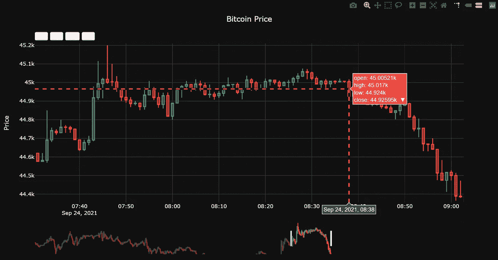
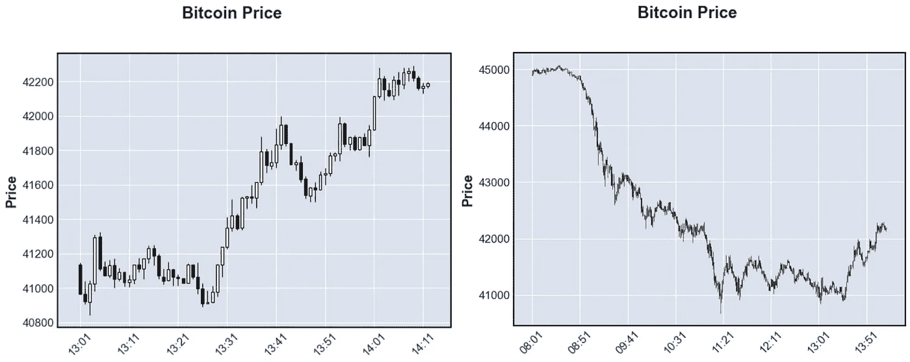

# Plotly 和 Datapane 的交互式可视化

> 原文：<https://towardsdatascience.com/interactive-visualization-with-plotly-and-datapane-97472017cb54?source=collection_archive---------15----------------------->

## 使用 Plotly 和 Datapane 从您的可视化中获得更多

Plotly 中的交互式烛台图(图片由作者提供)

可视化是任何分析的一个重要方面。但是静态图限制了我们理解数据的能力。Plotly 和 Datapane 解决了这个问题。

本文将展示如何创建交互式烛台时序图来可视化比特币的价格。但是，所提供的代码很容易修改以支持其他时间序列数据。

这篇文章分成几个部分:

1.  用 Alpha Vantage 提取数据
2.  Matplotlib 中静态图的比较
3.  用 Plotly 和 Datapane 嵌入图
4.  具有高级功能的 Plotly 中的交互式绘图

# 阿尔法优势

Alpha vantage 是一个金融服务 API，支持多种编程语言，包括 Python、NodeJS、PDP、C#/。Net 和许多其他语言。一个强大的开源社区已经为 Alpha Vantage 开发了超过 600 个跨越这些编程语言的库。

Alpha Vantage 使程序员能够提取各种股票和加密货币的当天定价。该 API 易于使用，并允许很大的灵活性。因此，对于那些想要对大量数据进行回溯测试机器学习算法、创建可视化和执行财务分析的人来说，它是理想的选择。

如果你对在金融领域使用数据科学感兴趣，Alpha Vantage 是一个完美的工具。

## 要求

该工具需要一个个性化的 API 密钥来提取数据。注册一个免费帐户后就可以使用这个密钥，但是由于明显的原因，免费层中的呼叫次数是有限的。

**您收到的 API 密匙允许每分钟最多 5 个请求，每天最多 500 个请求** —对于大量金融数据的实验来说绰绰有余。

但是，如果您确实需要更多财务数据，请考虑高级选项。该选项还允许附加历史数据。对于希望用更多数据对模型进行回溯测试的用户来说，这个选项可能更好。

## 提取数据

对于本文，我将使用 Python 中的 API。您将使用的主要功能可能是股票或加密的当天功能。

接下来，您可以使用相关的货币代码指定您选择的货币的价格。然后，使用 interval 命令设置数据间隔，其中选项为每分钟、5 分钟、15 分钟、30 分钟或 60 分钟。

最后，输出大小决定了您想要接收多少数据。在这里，我使用完整的输出大小来获取尽可能多的信息。

将比特币数据加载到 DataFrame 中(由作者编写代码)

确保用 API 键替换 API_KEY 变量。

API 返回元信息和价格信息。价格信息包括开盘价、收盘价、最高价和最低价。

# 使用 Matplotlib 的静态图

python 中最常见的绘图库可能是 Matplotlib。它是许多 python 教程的主要内容，并被集成到许多包中。然而，它有一些明显的缺点。首先，您必须指定轴的范围。虽然这最初看起来不像是 Matplotlib 的一个突出的贬损者，但当更多的不稳定数据出现时，它就成了一个问题。

当时间序列发生变化时，您只能选择一个较短的时间段进行详细观察，或者查看一个更重要的时间段并查看整体趋势。

## mplfinance

我已经通过使用“mplfinance”包展示了这一点。这个包是建立在 Matplotlib 之上的，可以很容易地创建蜡烛图。虽然易于设置和使用，但轴范围被设置为传递给函数的数据帧的总范围。

Matplotlib 中的蜡烛图(作者代码)

基于 Matplotlib 的静态绘图(图由作者提供)

为了正确地研究不同时期的数据，你必须重建整个图。虽然金融数据的焦点通常是最近的数据，但深入历史数据对于回溯测试算法至关重要。只有通过密切观察数据，你才能看到你的算法崩溃的场景。

# 用数据面板嵌入图

Plotly 是一个漂亮的库，默认情况下提供交互式绘图。然而，简单地将这些情节插入到文章中并不会自动允许交互性。

相反，可以使用 Datapane 来管理这些图。

Datapane 是一个开源的 Python 库，允许用户快速构建交互式绘图。此外，Datapane 提供 Datapane Studio，这是免费的，将使您能够上传公共和私人报告。

使用 Datapane 的免费层，您可以使用电子邮件共享、无限公共报告托管和社交嵌入 API 创建五个私人报告。

本文使用社交嵌入 API 来展示 Plotly 图表。

**注意:** Plotly 确实允许写入 html，这样剧情的交互功能就可以持续。当您想保持交互方面的完整性时，将图发送给其他人时，此选项非常有用。

## 嵌入图

在数据面板上显示图表。首先安装 Datapane。接下来，使用注册时收到的令牌登录 Datapane。大概是这样的:

初始化数据面板(由作者编写代码)

简单地创建一个 Plotly 图表，并用 Datapane 报告功能将报告上传到 Datapane。这里，日期滑块被自动添加到绘图中，因为索引是日期时间类型。如果沿 x 轴看到日期时间值，则类型为字符串，并且无法生成日期滑块。

上传嵌入图表(作者代码)

要确保报告正确集成到介质中，您必须设置一个集成令牌。然后将这个令牌保存到您的 Datapane 帐户。这里有一个简单的演练:

 [## 导出到介质

### 在介质上写很多？Datapane 允许您将现有的 Datapane 报告转换为中等故事草稿，保留…

docs.datapane.com](https://docs.datapane.com/reports/publishing-and-sharing/export-to-medium) 

# 与 Plotly 的互动情节

默认情况下，Plotly 允许用户动态调整绘图的轴范围。此外，默认图允许缩放、保存图、添加或删除迹线、双击重置图以及尖峰线切换。

基本绘图图(作者代码)

基本 Plotly 时间序列(作者提供的图表)

虽然上面的图表无疑是一个进步，但还是有一些局限性。

首先，虽然您可以放大多个周期，但 y 轴保持不变。不幸的是，默认图表的这个属性使得烛台图表变得毫无意义，因为蜡烛变平了。

经过深入研究，我发现可以在更新时动态更新 y 轴。这次更新需要对以前的情节做一些改动。

首先是将图形对象导入从***plotly . graph _ objects***改为 ***plotly_graph_obs*** 。接下来是将你的人物对象初始化为一个 ***人物小部件*** 而不仅仅是一个人物。该导入要求安装 ***ipywidgets*** 。

使用活动 Python 内核动态调整 Y 轴(代码由作者编写)

第二个变化是取消了日期间隔。虽然比特币不需要这样做，但其他金融股票在时间序列上也有缺口。这种模式是由于市场关闭，可以掩盖情节。

为了避免这个问题，不存在值的日期将被删除。首先，为整个范围生成一个日期列表以防止此问题。则不存在值的日期将被删除。然后轴被更新以反映该变化。

删除日期差距代码(作者代码)

我做了最后的修改来改善烛台图:着色(使用 seaborn 主题)、格式改变和日期滑块按钮。这些更多的是生活质量的提高。由于日期滑块可能相当麻烦，日期按钮简化了日期范围的选择。

按钮遵循标准格式。“步骤”被指定为日期时间频率，如分钟、小时、天、月或年。那么“计数”被设置为指示范围的大小。这些按钮可以从日期时间图的起点或终点选择数据，支持自定义标签和自定义日期范围。

> 注意 Datapane 不支持上传 FigureWidgets，chart-studio(来自 Plotly 的 chart hosting)不提供内核来更新日期选择的 y 轴值。但是，在 Jupyter 笔记本中运行图表时，您可以看到动态的 y 轴变化。

详细 Plotly 时间序列图的代码(作者代码)

改进了 Plotly 中的蜡烛图(图由作者提供)

# 最后的想法

当利益相关者需要从分析或初始数据调查中获得一些有形的输出时，在整个数据科学项目中使用可视化。

然而，如果可视化工具过于死板，您可能会错过一些对数据的关键见解。交互式图表确保您的数据中令人兴奋的方面易于观察。

在这篇文章中，使用了比特币数据。但应该清楚的是，交互式绘图的好处适用于数据科学的许多不同领域。

这些图有助于传达故事、传递信息，并帮助我们调查数据。

Plotly 提供了一个开箱即用的解决方案来实现绘图交互性。与 Datapane 结合，您可以将完全交互式的图发送给相关的利益相关者，并揭示数据的复杂性。

如果你有兴趣阅读关于新颖的数据科学工具和理解机器学习算法的文章，可以考虑在 Medium 上关注我。

*如果你对我的写作感兴趣，想直接支持我，请通过以下链接订阅。这个链接确保我会收到你的会员费的一部分。*

 [## 通过我的推荐链接加入 Medium-Zachary Warnes

### 阅读扎卡里·沃恩斯(以及媒体上成千上万的其他作家)的每一个故事。您的会员费直接支持…

zjwarnes.medium.com](https://zjwarnes.medium.com/membership)