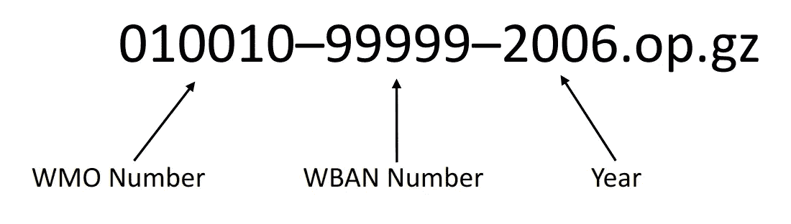

# 用 Plotly 实现交互式气象数据可视化

> 原文：<https://towardsdatascience.com/interactive-weather-data-visualizations-with-plotly-d304fe87b57f?source=collection_archive---------6----------------------->

## [理解大数据](https://towardsdatascience.com/tagged/making-sense-of-big-data)

## 使用 Python 探索 NOAA 全球地表概要


照片由[迈克尔 D](https://unsplash.com/@alienaperture?utm_source=unsplash&utm_medium=referral&utm_content=creditCopyText) 在 [Unsplash](/s/photos/storm?utm_source=unsplash&utm_medium=referral&utm_content=creditCopyText) 上拍摄

全球地表日摘要(GSOD)是从 1929 年开始的 9000 多个气象站的天气数据集。它由美国国家海洋和大气管理局(NOAA)创建和维护，生成 18 个气候变量(如平均露点、平均风速和最小/最大温度)的每小时地表测量的每日摘要。

这是一个用于实践可视化空间数据的很好的数据集，因为它在全球范围内有许多站点，具有相对较大的时间序列。它还每天更新，这使它成为使用仪表板练习的一个很好的候选。

虽然 Python 可能不是人们想到的第一种可视化空间数据的语言或工具，但有几个库能够创建奇妙的地理可视化。Plotly 已经成为一个非常全面的 Python 交互式绘图库，它的地理绘图功能在过去几年里已经有了长足的进步。因为它出色的文档和受欢迎的程度，在这篇文章中我将只关注 Plotly，但是请记住，还有其他可用的库。

这个数据集有点大，只有 4.2 GB，所以将它加载到 Python 需要一点努力；无论如何，它都不是一个海量数据集，但它比我们遇到的平均“实践”数据集要大。我们将从如何访问数据开始，然后探索如何使用 Plotly 在交互式地图上可视化处理后的数据。泡一杯咖啡，舒服一下，让我们处理更大的天气数据集，用 Plotly 可视化我们的发现。

# 文件结构

有多种方法可以获得这个数据集。从 [Kaggle](https://www.kaggle.com/noaa/noaa-global-surface-summary-of-the-day) 可以获得一个易于下载的版本，但它不像 [NOAA 仓库](https://www.ncei.noaa.gov/metadata/geoportal/rest/metadata/item/gov.noaa.ncdc%3AC00516/html#)那样每天更新，而且 Kaggle 版本更难以用 Python 格式化。这是 NOAA 知识库的结构:

```
1929.tar.gz/
1930.tar.gz/
    03005099999.csv
    03026099999.csv
    ...
...
```

数据存储在每年压缩的 tarballs 中，其中包含。当年每个电台的 csv 文件。每一个。csv 文件根据其站点 ID 命名，站点 ID 由站点的 WMO 和 WBAN 编号组成。


NOAA CSV 文件结构(由作者创建)



Kaggle Gzip 文件结构(由作者创建)

## WMO 编号

世界气象组织(WMO)是联合国负责天气、气候和水资源的机构。前两位数字是国家代码，接下来的三位数字由国家气象局(NMS)设定。如果最后一个数字是零，这意味着世界气象组织的数字是官方的，或者过去是官方的。

## WBAN 数

WBAN 代表天气-天气-陆军-海军。WBAN 号是数字数据存储的标识符，最初是美国气象局、加拿大交通部和三大军事部门相互共享数据的一种方式。后来它扩展到包括一些德国和韩国的电台。

**注**:需要记住的重要一点是，世界气象组织和 WBAN 的编号创建了一个唯一的气象站 ID，一旦加载到 pandas 中，这就是我们引用每个气象站的主要方式。

# 下载我们的数据

获取这些数据的最佳方式是直接从 NOAA 下载，你可以下载每年的 tarball，其中包含当年每个站点的 csv 文件。我包含了一个简单的 Python 模块，用于下载和处理所有数据，您可以在最后的文档部分找到这些数据。

用 Python 下载 GSOD 数据(由作者创建)

为了下载 NOAA 数据，我决定使用请求创建一个简单的抓取功能。它从数据集的主目录开始，使用 regex 从基本 URL 页面的文本中查找所有可用的年份。在列表中的每一年，很容易构建最终的 URL 并下载每个 tarball。请记住，所有这些代码都可以在 Github 上[获得，并且可以作为 Python 中的本地模块导入。](https://github.com/wino6687/gsodpy)

# 数据处理

在加载大型数据集时，最重要的问题是，一旦将数据加载到数据帧中，您希望访问哪些数据。2020 年有超过 11，000 个站点，这意味着大约 10 年的每日数据将是相当多的信息。相反，您可能希望进行一些聚合。对于本文，我决定按月汇总数据，并且只保存每年一天的每日数据。按月汇总数据将极大地减少我们最终数据框架的大小，同时还能让我们发现相当长时间序列的趋势。

保持某一天不聚合看起来很奇怪，事实也的确如此！我们想要保存一天的数据的真正原因是，我们可以在未来的帖子中使用 Dash 将最近一天的数据加载到实时仪表板中。就目前而言，它对于创建与我们稍后将使用 Dash 探索的内容相似的情节仍然有用。

## 步骤 0:导入

由于处理这些数据比大多数实践数据集要复杂一些，所以我包含了一个 GitHub 存储库，其中有一个本地模块，可以本地导入到您的 Python 环境中。

```
import gsodpy.gsodProcess as gsod
import gsodpy.gsodDownloader as gsodDown
import datetime
```

为了像这样在本地导入模块，“gsodpy”目录必须在您的项目目录中。

## 步骤 1:定义时间序列

我们需要做的第一件事是决定包括多少年，以及哪一天我们将存储未聚合的数据。然后我们可以使用 regex 来创建我们想要的文件列表。

```
num_years = 10
target_day = datetime.datetime(2020,3,20)
years, files = get_years_files(num_years)
```

为我们的时间系列寻找 tarballs(由作者创建)

## 步骤 2:在时间范围内处理文件

一旦我们定义了时间序列，我们就可以开始破解 tarballs 并进行处理了。csv 文件！以下是我编写的解包数据的函数。

将 GSOD 数据处理成 Python(由作者创建)

为了节省您的时间，以下是该工作流的基本伪代码:

```
- Loop through each tarball (years)
    - Loop through each csv file stored in tarball (stations)
        - Open .csv file for current station/year with pandas 
        - Call process_df() to clean the dataframe
        - Append all data for this station on target_day to df_day
        - Aggregate data by month
        - Append monthly aggregate to df
- Call add_meta() to create metadata column on df and df_day
- Return completed df and df_day 
```

总的来说，这个过程并不复杂，如果给我更多的时间，我相信我可以让它更简洁。请记住，由于每年有大量的站点，加载所有这些数据需要相当长的时间。

我们可以继续调用处理函数来获取数据帧:

```
df, df_day = gsod.process_all_years(files, target_day)
```

> **注意**:如果你注意到你的机器正在努力处理所有的数据，试着从一个短的时间序列(2-3 年)开始。如果您想要更长的时间序列，您也可以在 tarball 中选择一个随机的电台样本，以减少您需要处理的电台文件的数量。

## 步骤 3:保存处理过的数据

我强烈推荐酸洗你完成的数据帧，这样你以后可以更快地加载它们。

```
import pandas as pd# Save DataFrames to pickle in current directory
df.to_pickle("df_monthly.pkl")
df_day.to_pickle("df_daily.pkl")# Read them back in later:
df = pd.read_pickle("df_monthly.pkl")
df_day = pd.read_pickle("df_daily.pkl")
```

# 形象化

现在我们已经将一些有意义的数据加载到 Python 中，我们可以开始有趣的部分，开始用 Plotly 制作可视化效果了！

如果你使用免费版的 Plotly，你只能上传 512kb。如果你在本地制作你的地块，这不是一个问题。然而，对于我来说，在这里分享互动的情节，我需要使用 Plotly 的图表工作室上传到他们的云。这意味着我只能使用这个功能随机选择大约 300 个气象站:

## 基本地图

首先，让我们看一下时间序列中的一个月，看看我们的一些站点在地图上的位置。这是我们可以用 Plotly 和这些数据创建的基本地图；考虑到它的配置如此之少，我认为它看起来相当不错。

Plotly 的主要数据结构是`figure`，它是`plotly.graph_objects.Figure`类的一个实例。`figure`是使用 JavaScript 通过 Plotly.js 渲染的，这就是为什么我们能够用 Python 访问高质量的地图。

用 Plotly 创建基本的散点图(由作者创建)

带 Plotly 的基本散点图(由作者创建)

我喜欢用 Plotly 绘制空间数据，因为它的界面简洁、响应迅速，几乎可以嵌入到任何地方。我一直很难在 Python 包中找到高质量的底图，但 Plotly 的很棒。

虽然这个情节可能很好，但我绝对会对它进行一些风格上的改变。海岸线很突出，颜色比例需要调整。总的来说，它可以被改变，使我们的数据点更加突出。幸运的是，所有这些事情都很容易用 Plotly 完成！

## 风格图:给定日期的极端温度

我选择保留某一天的数据而不是只记录每月的汇总数据的一个原因是，这样我们可以看到某一天最暖和最冷的地方。

首先我们需要找到我们的极端温度:

从 df_day 中查找极端温度(由作者创建)

这个图使用了与第一个图相同的结构，但是我花了更多的时间来定制标记和图形属性。您会注意到，我能够将一个字典传递给某些参数，如`marker`，以便进一步定制它们。在大多数情况下，这些参数是由字典中的信息初始化的对象。例如，`marker`参数初始化一个`plotly.graph_objects.scattergeo.Marker`对象。虽然这增加了复杂性，但你可以从[散射图中看到。标记](https://plotly.github.io/plotly.py-docs/generated/plotly.graph_objects.scattergeo.html#plotly.graph_objects.scattergeo.Marker)文档这给了我们对图上标记的控制。

使用 Plotly 的散点图(由作者创建)

## 地图框集成

我一直很喜欢地图盒子。它有很棒的基本地图，而且反应超级快。Plotly 有限的地图框集成可以增强您的地理地块。特别是当放大时，你会注意到与基本绘图版本相比，基本地图中的细节数量令人满意。Mapbox 对 Plotly 地图的渲染方式有很多影响，所以我将在整个帖子中讨论 Mapbox 的集成。

带有 Plotly 的散点图框(由作者创建)

## 添加滑块:2012 年各月的平均温度

我非常喜欢 Plotly 的一个特性是，添加一个滑块来查看数据随时间的变化是多么容易。例如，让我们看看 2012 年的月平均气温。

你会注意到我使用了一个稍微不同的语法来格式化这个图。从技术上讲，这是用 Plotly 绘图的“旧”方法。但是对于像这样更复杂的图，能够单独格式化数据是很好的。

使用 Plotly 在 Geo Plot 上滑动(由作者创建)

创造这个情节看起来比其他的更复杂。但实际上，大部分代码只是简单地将数据按月分组，以便 Plotly 轻松地发送到它的 JavaScript 库。如果您曾经处理过 json 数据，您可能会看到字典列表是如何轻松地转换成 json 的。

# 包扎

在 Python 中，空间数据从来都不是最容易处理的。它是多维的，通常非常大，普通的 2d 绘图空间不太适合绘制地理坐标。Plotly 通过提供易于使用的高质量底图功能，消除了许多令人头痛的问题，几年前我通常不得不使用 javascript 来访问这些底图。说到用 Python 进行空间绘图，Ploty 一般是我的首选。

使用 Plotly 绘制空间数据需要学习的东西太多了，所以不要害怕浏览在线文档和示例。同样的开发人员还开发了 Dash，这是构建实时仪表板的一个很好的工具。

# 证明文件

*   [用于处理 GSOD 数据的 Github Repo】](https://github.com/wino6687/gsodpy)
*   [GSOD 数据储存库(NOAA)](https://www.ncei.noaa.gov/metadata/geoportal/rest/metadata/item/gov.noaa.ncdc%3AC00516/html#)
*   [Kaggle GSOD 数据](https://www.kaggle.com/noaa/noaa-global-surface-summary-of-the-day)
*   [阴谋地](https://plotly.com/)
*   [地图框](https://www.mapbox.com/)