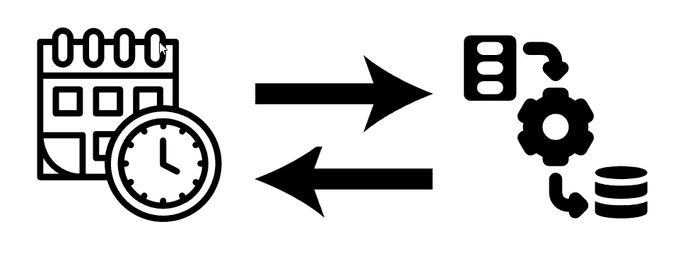
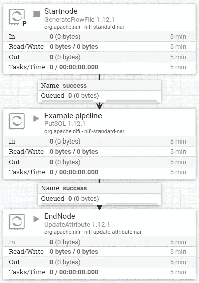
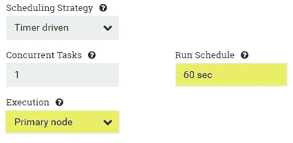
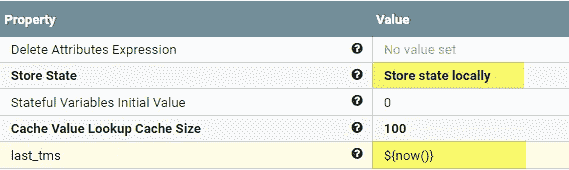
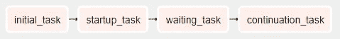
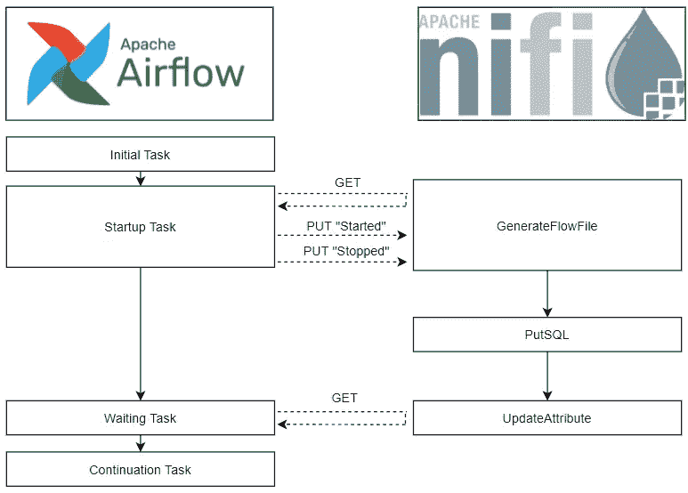

# 如何用 NiFi ETL 管道连接气流

> 原文：<https://towardsdatascience.com/interconnecting-airflow-with-a-nifi-etl-pipeline-8abea0667b8a?source=collection_archive---------8----------------------->

## NiFi 和 Airflow 都是数据项目中经常使用的强大工具，但是同时使用它们并不容易。

计划数据加载—由作者创建的图像。

在本文中，我将展示一个结构，并介绍如何将一个 NiFi ETL 管道插入到一个 Airflow DAG 的计划流中。

所需的流程如下所示:

1.  预定气流 DAG 执行准备任务，
2.  气流触发了 Apache NiFi 中的处理器，
3.  NiFi 执行一个 ETL 过程，
4.  气流等待 NiFi 完成，
5.  气流继续执行其他任务。

为了理解本文，在任何需要的地方都会提供 Python 代码，但是您可以在 [GitHub](https://github.com/CribberSix/nifi-airflow-connection/) 上查看整个代码库(包括文章中没有显示的子功能)。

# **关于基础设施和关注点分离的想法**

虽然 NiFi 可以选择用 CRON 字符串调度处理器，但是在 NiFi 内部调度作业通常不是一个好主意——除非您别无选择。使用 Airflow，我们可以在一个地方监控和调度我们所有的任务，无论它们可能在哪里，界面简单美观，可以访问日志和高度可定制的调度管道，它们可以相互交互、相互排斥或相互依赖。

类似地，虽然 Airflow 也可以执行 ETL 任务(例如用 Python 编码的),但理想情况下应该在 NiFi 中实现，你*真的*不应该使用 Airflow 来这样做。一方面，Airflow 是一个监控和调度软件，另一方面，我们将失去 NiFi 在数据提取、转换和加载方面的所有固有优势。

仅使用 Airflow 作为调度程序，让 NiFi 在我们的后端完成繁重的工作，我们可以两全其美:Airflow 能够利用 NiFi 的可扩展、强大和高度可配置的有向图来路由和转换数据，从而创作、调度和监控工作流。此外，如果您在 EC2 实例上执行用于调度任务的数据密集型任务时没有造成 100%的 CPU 利用率和过载的 RAM，您的同事也会感谢您。

# **总体结构**

我们有两个主要的联系点:

*   **启动/触发**:DAG 将触发 NiFi 的 ETL 管道的起点。
*   **等待完成**:每当 NiFi 完成了它在整个管道中的部分，DAG 就需要得到一个信号。

系统的连接——作者创造的图像。

我们将在下一章从配置 NiFi 开始，这样一旦我们编写了气流 DAG 并需要指定处理器 id，我们就已经设置好了一切。

# **NiFi 配置**

我们需要两个强制处理器:

*   一个`GenerateFlowFile`处理器，作为我们管道的起始节点，可以由气流触发。
*   一个`UpdateAttribute`处理器作为我们管道的终端节点，它的状态可以被气流查询。

我们在这两个处理器之间实现了我们的流水线，由我们想要的任意数量的处理器组成。为了使这个例子简短，我们使用一个单一的`PutSQL`处理器作为整个 ETL 管道的替身。

在默认模式下，当所有后续处理器都在运行时，启动节点应该关闭，准备好被流文件触发。除了`GenerateFlowFile`处理器，您还可以使用`GenerateTableFetch`处理器——或者任何其他一旦打开就创建流文件的处理器。

您在 NiFi 中的管道可能如下所示:

处理器设置—由作者创建的图像。

## **开始节点**

为了能够从气流中触发我们的起始节点并创建**恰好一个**流文件(我们不想多次触发管道)，我们必须如下配置处理器:

处理器配置—由作者创建的图像。

通过将`Execution`设置为**主节点**，我们确保只有一个节点执行处理器。通过将`Run Schedule`设置为 **60 秒**，我们在创建第二个流文件之前给气流 DAG 足够的时间来停止处理器。

## **端节点**

在`UpdateAttribute`处理器中

*   将`Store State`设置为`Store state locally`并
*   添加一个名为`last_tms`的自定义属性，其值为`${now()}`。

处理器配置—由作者创建的图像。

每当流文件通过处理器时，代码`now()`将被执行，其结果(时间戳)将被存储在处理器状态的属性`last_tms`中。

我们可以通过手动运行我们的管道来检查这一点(打开`GenerateFlowFile`处理器，等待创建一个流文件，然后再次关闭它)，然后在`our.cluster.adress.com:9443/nifi-api/processors/{id}/state`下的浏览器中访问 NiFi-API。以下 JSON 示例向您展示了我们处理器的当前状态:

现在，我们在 NiFi 中拥有了我们需要的一切——一个 startnode 处理器、一个 endnode 处理器以及我们可能想要在两者之间打包的任何东西:数据提取、转换和/或加载任务。

# **气流配置**

气流 DAG 将由四个任务组成:中间的两个任务与 Apache NiFi 的 API 交互。第一个和最后一个是其他操作的替身，我们可能希望从 Airflow 中调度/执行这些操作，以准备或完成任务。

气流任务相关性—图片由作者创建。

为了与 NiFi API 交互，你可以编写自己的代码和 API 调用(完整的 API 在这里有详细的说明)，或者你可以使用像 [nipyapi](https://pypi.org/project/nipya) 这样的包。为了简洁并独立于任何包的实现，我为本文编写了自己的 API 调用。

## **初始任务**

这仅仅是我们可能想要做的一些其他准备工作的替身——本质上这个任务也可以被省去。

## **启动任务**

启动任务包括三个步骤

*   将`GenerateFlowFile` NiFi 处理器设置为`RUNNING`。
*   等待 15 秒钟(让处理器有时间创建流文件)。
*   将`GenerateFlowFile` NiFi 处理器设置为`STOPPED`。

您可以通过使用来自`/nifi-api/processors/{id}`的`GET`请求检索当前状态，在自定义 JSON 中本地设置状态，并使用`PUT`请求发送到`/nifi-api/processors/{id}/run-status`来更改处理器的状态

为了关注手头逻辑的基本结构，我从文章中排除了子功能，比如`get_token()`和`update_processor_status()`——但是你可以在公开的 [GitHub 库](https://github.com/CribberSix/nifi-airflow-connection/)上找到它们。该任务的 python 代码如下:

## **等待任务**

为了让 Airflow 注意到 NiFi 何时完成了 ETL 操作，我们需要不断地查询`nifi-api/processors/{id}/state`并解析结果 JSON 中的`last_tms`的值，直到状态发生变化。我们通过每 60 秒检查一次 API 在 while 循环中实现这一点:

`parse_state()`以及所有其他子功能可以在公共的 [GitHub 库](https://github.com/CribberSix/nifi-airflow-connection/)中找到。

## **延续任务**

最后一个任务是在 NiFi 管道之后，替代您想要执行的任何代码。

## **气流 DAG**

DAG 由上述函数组成，我们只需要配置它们的依赖关系。因为我们的任务应该一个接一个地运行，所以 DAG 就像箭一样直。

根据您的目的，您可能想要编辑 DAG 参数，但以下是一个好的开始:

# **概述和结束语**

下图展示了我们脚本的程序流程以及系统之间的交互。在 Airflow 中的一些准备任务之后，我们的 NiFi 管道被触发，Airflow 等待管道完成，然后继续其他任务。

虽然还有其他连接气流和 NiFi 的方法，但这里介绍的是一种简单的方法，没有太多的开销。设置完成后，很容易扩展到其他用例，集成数据管道而不改变整体设置，在 Airflow 或 NiFi 中添加/删除额外部件而不干扰两个部件之间的连接。

互连和流程——作者创建的图像。

我们现在还可以将 NiFi 管道中的虚拟`PutSQL`处理器替换为我们需要的任何处理器——我们只需要确保当我们准备好让气流继续工作时，流文件到达`UpdateAttribute`处理器。同样，我们可以在 Airflow 中为初始任务或延续任务添加内容。

我希望这篇文章能帮助您将 NiFi 管道插入到您预定的气流 Dag 中。

完整的代码包括所有使用过但没有在本文中显示的子功能，可以在 [GitHub](https://github.com/CribberSix/nifi-airflow-connection) 中找到。

一如既往，我们永远学不完。点击此处了解更多关于气流和 Nifi 的信息:

*   [阿帕奇气流](https://airflow.apache.org/)
*   [阿帕奇尼菲](https://nifi.apache.org/)

>关注我，以后会有更多围绕数据工程工具和方法的文章！