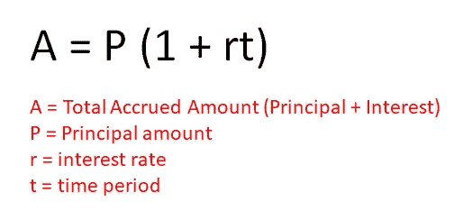
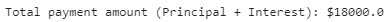
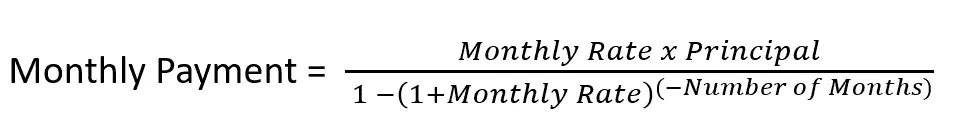
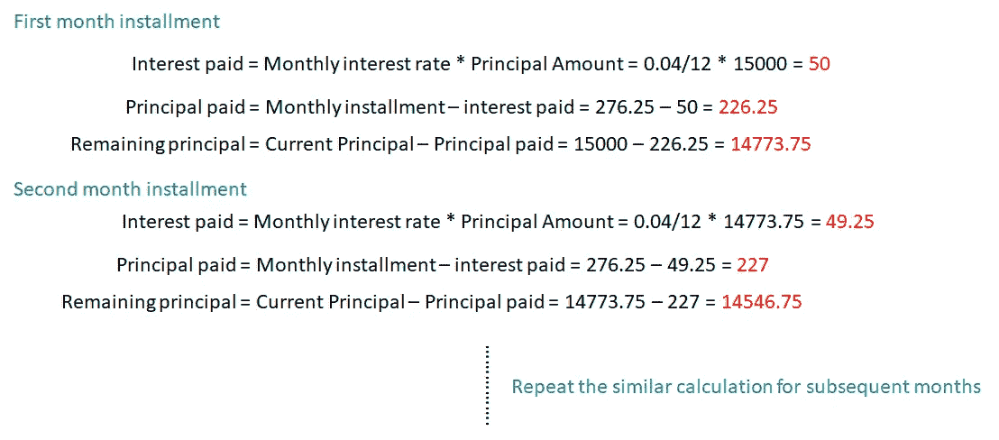
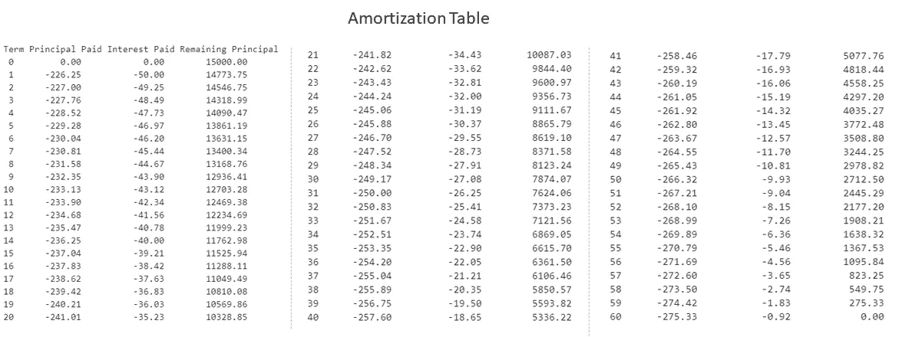
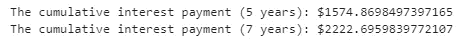

# Python 利率理论与实践—简单利率

> 原文：<https://towardsdatascience.com/interest-rate-theory-and-practice-with-python-simple-interest-rate-50415c58eaca?source=collection_archive---------12----------------------->

## 使用 Python 的利率实用介绍。对利率的良好理解将有助于我们做出更明智的金融决策

照片由[像素](https://www.pexels.com/photo/silver-and-gold-coins-128867/?utm_content=attributionCopyText&utm_medium=referral&utm_source=pexels)的[皮克斯拜](https://www.pexels.com/@pixabay?utm_content=attributionCopyText&utm_medium=referral&utm_source=pexels)拍摄

在金融中，**利息是我们借钱的价格。良好的资金管理和财务决策在很大程度上取决于我们对利率及其对财务健康的影响的了解程度。**

在这篇文章中，我们将研究简单利息是如何工作的。其实单纯的兴趣对我们来说并不少见。我将用我们日常生活中的一个例子如**汽车贷款**来说明这种兴趣背后的概念。很好地理解利息将有助于我们避免许多金融陷阱。

此外，我还将使用 **Python 演示利息的计算。**希望这能帮助你在做财务规划时重用代码来构建自己的财务计算器。

# 必备 Python 库

1.  **数字财政**——[https://numpy.org/numpy-financial/](https://numpy.org/numpy-financial/)

# 开源代码库

本文中的原始完整源代码可以在我的 [Github Repo](https://github.com/teobeeguan/Python-For-Finance/blob/45a0d770df9acbbc41798f8518e3db19017bf77d/Time%20Value%20of%20Money/SimpleInterestRate.ipynb) 上获得。如果您希望使用它来关注我的文章，请随意下载它(*simpleinterestrate . ipynb*)。

# 单利(汽车贷款)

***单利是一笔没有复利的贷款本身*** *。*单利来源于贷款的本金金额。基于单利的金融产品的一个典型例子是汽车贷款。

例如，我们购买一辆汽车，汽车贷款金额为 15000 美元，年利率为 4%，期限为 5 年。这里，我们有几个问题要回答:

## 五年内我们总共要付多少钱？(假设我们每月按时付款)

我们可以用下面的等式来解决这个问题:

作者准备的图像

现在，让我们试着把这个等式放到我们的第一个 Python 程序中。

**第 1–2 行:**导入 Python 库

**第 5–7 行:**为计算单利的所有变量定义并赋值。

**第 8 行:**应用单利方程得出 5 年后的应计支付额。

作者准备的图像

五年累计总支付金额(本金+利息)为 **$18000** 。

## 我们每月的分期付款是多少？

我们可以使用以下公式估算每月分期付款:

作者准备的图像

让我们再次尝试在 Python 脚本中应用该公式。我们可以利用 *Python Numpy pmt* 函数来计算每月的分期付款。

**第 1–3 行:**定义所有必需的参数(月利率、月数和贷款金额)，并相应地为其赋值。

**第 4 行:**使用 *Python Numpy pmt* 函数计算每月分期付款。计算公式已经封装在函数中。*(注意:原始结果值将是负值，这就是我们将该值乘以-1 以将其变为正值的原因。)*

第 5 行:显示结果。

作者准备的图像

每月分期付款约为**276.25 美元**

## C.我们每月要付多少本金和利息？

我们**不**支付等额利息和本金的贷款(例如 138.125 美元(*本金)*+138.125 美元(*利息*)= 276.25 美元)。我们的贷款通过 [**分期偿还**](https://www.investopedia.com/terms/a/amortization.asp) 支付，这是一个包括本金和利息的定期分期付款过程。对当前付款收取的利息是基于我们还欠多少贷款本金。

例如，在分期付款的第一个月，月利率适用于我们所借的全部贷款。对于第二个月和随后的几个月，利息费用将越来越少，因为当前的本金金额已经由上个月的分期付款支付(请参考下面的计算细节)。

作者准备的图像

基于上面显示的计算逻辑，我们可以使用 Python 为我们的每月分期付款构建一个摊销表。*Python Numpy-Financial library 的 ipmt 和 ppmt 函数*可以自动计算为我们支付的月利息和月本金。

**第 1 行:**将本金金额设置为 15000

**第 2 行:**创建一个包含 60 项(5 年* 12 个月)的 Numpy 数组

**第 3–4 行:**使用 *Numpy-Financial ipmt* 和 *ppmt 函数*计算每月支付的利息和本金。我们所需要的只是给函数分配正确的参数。

**第 6–8 行:**定义输出校准格式

**第 10–11 行:**应用第一个和第二个输出格式来显示表头和第一行记录。

**第 13–16 行:**创建一个 for 循环，并应用第三种输出格式来迭代显示已付本金、已付利息和剩余本金。

作者准备的图像

由此产生的分期偿还表将使我们清楚地了解我们每月分期付款所支付的每月利息和本金。

## D.贷款期限如何影响利息费用？

我们目前的贷款期限是 5 年，年利率是 4%，每月分期付款是 276.25 美元。假设银行向我们提供了另一个 7 年期的贷款计划。同样利率 4%的 7 年期贷款将只需要我们每月支付 205.03 美元的分期付款。

这听起来像是一笔 7 年期贷款的好交易，因为它节省了我们每月对贷款的财务承诺。然而，让我们比较一下 5 年期和 7 年期贷款的累计利息。我们可以重用 *Python Numpy-Financial ipmt 函数*来分别计算 5 年和 8 年贷款的每月利息承诺。

**第 2–5 行:**重复上一节给出的类似代码，使用 *Python Numpy-Financial ipmt 函数*计算 5 年期贷款的月利息费用。

**第 6 行:**由于 *interest_paids* 是一个保存一系列每月利息费用的 Numpy 数组，我们可以使用内置函数 sum 来获得 5 年内支付的累计利息。

**第 7 行:**显示 5 年内累计支付的利息。

**第 10–15 行:**重复与第 2–7 行类似的步骤，获得 7 年内支付的累计利息并显示结果。

作者准备的图像

结果表明，在相同利率下，7 年期贷款的累计利息支付高于 5 年期贷款。没有免费的午餐，以较低的月供采取更长的贷款期限。虽然我们可以为 7 年期贷款支付较低的分期付款金额，但我们必须向银行支付更多的利息(额外的 647.83 美元)作为回报。

# 结束语

如上所述，单利总是适用于剩余的本金金额。我们不应该延迟付款，否则剩余的本金会产生额外的利息费用。

相反，降低利息费用的一种方法是进行计划外/额外的支付，这会降低我们的贷款余额。这将加快我们偿还贷款的速度。但是，这里有几个注意事项:

1.  我们需要额外的现金来支付这笔额外的款项。在支付这笔款项之前，我们应该检查一下自己的财务状况。
2.  即使我们有多余的现金，有没有更好的方法来花这笔钱？例如，这可能值得使用额外的现金来开始投资，以产生更多的额外收入。
3.  或者，我们是否有其他贷款承诺，如信用卡，可能需要更优先关注？不要忘了一些债务，如信用卡未偿贷款会产生复利，这可能会更严重地影响我们的财务健康。

当我们对贷款利息有了足够的了解，我们就更容易为自己做出合理的财务决策。

我希望你喜欢阅读这篇文章。

**如果你喜欢我以 Python 为财经话题的文章，可以随时** [**订阅 Medium**](https://teobguan2013.medium.com/membership) **。我会坚持不懈地不时发表相关文章。**

# 参考

1.  [https://www.investopedia.com/terms/s/simple_interest.asp](https://www.investopedia.com/terms/s/simple_interest.asp)
2.  [https://mytresl.com/blog/car-loan-interest/](https://mytresl.com/blog/car-loan-interest/)
3.  [https://www . experian . com/blogs/ask-experian/can-you-pay-more-on-your-car-payment/](https://www.experian.com/blogs/ask-experian/can-you-pay-more-on-your-car-payment/)