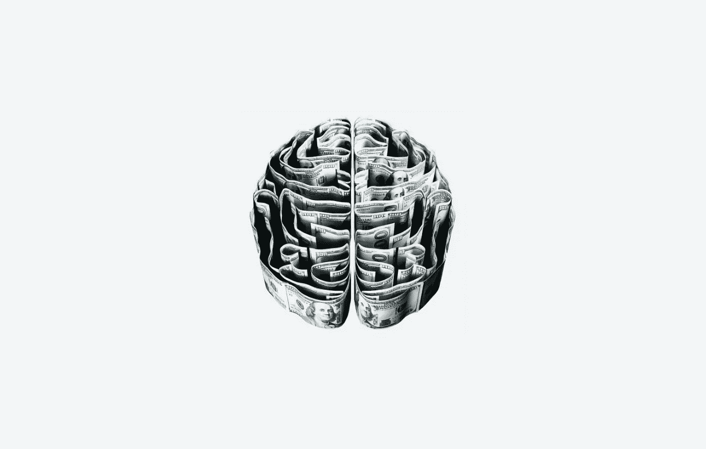
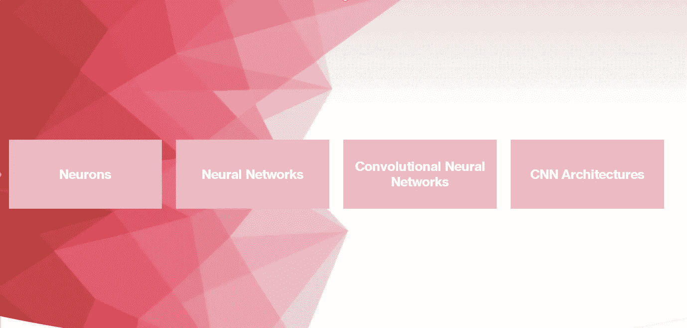
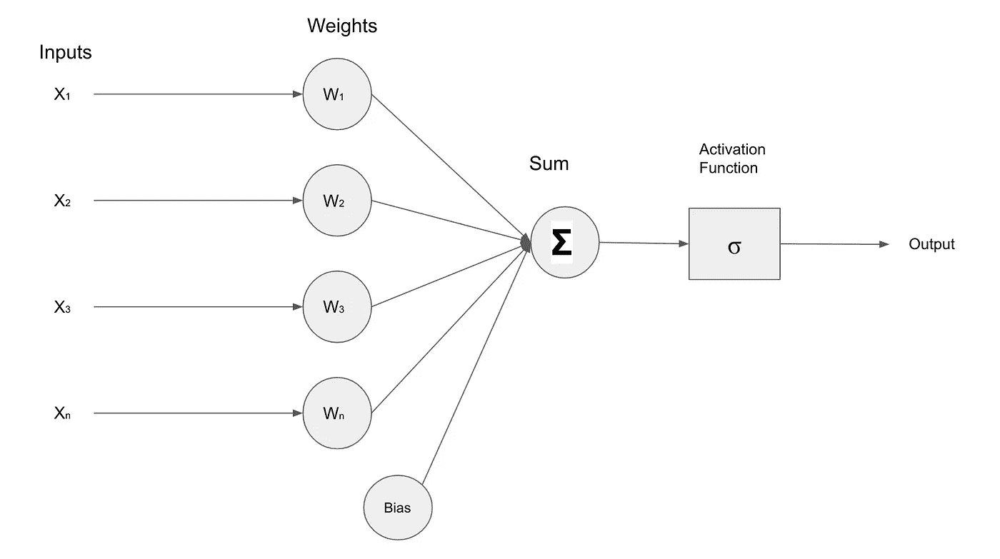
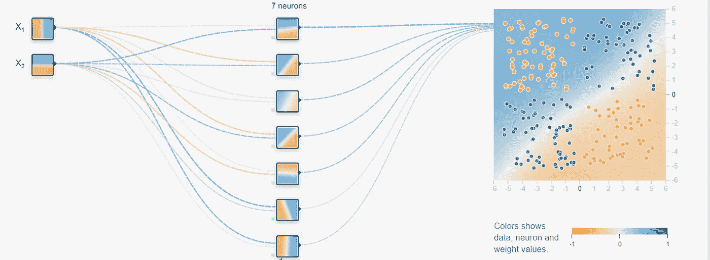
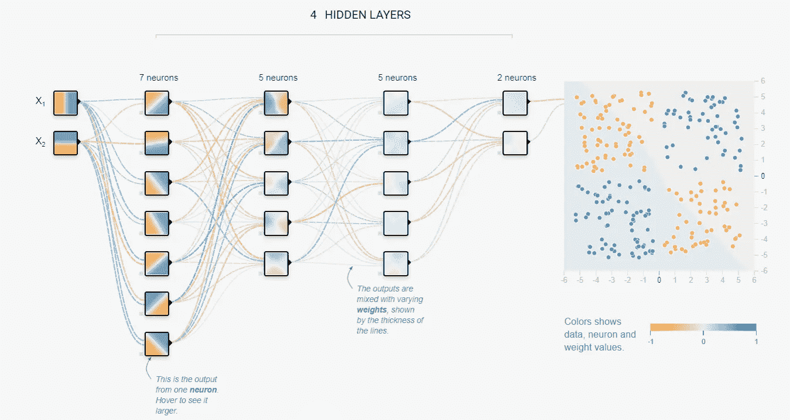
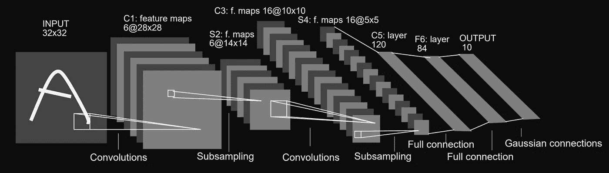
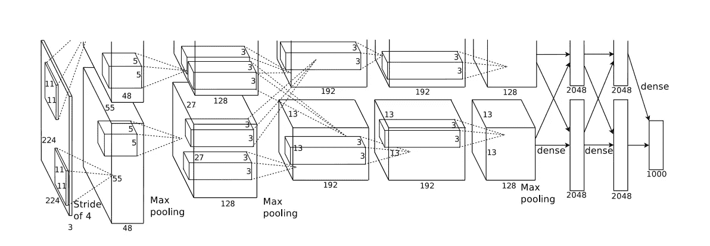

# 对深度学习感兴趣？

> 原文：<https://towardsdatascience.com/interested-in-deep-learning-d30241f6609?source=collection_archive---------16----------------------->

## 深度学习

## 本文包含针对初学者的深度学习和相关主题的介绍性信息。

摩根·豪斯尔在 [Unsplash](https://unsplash.com/s/photos/brain?utm_source=unsplash&utm_medium=referral&utm_content=creditCopyText) 上的照片

# 深度学习

**深度学习**是一个机器学习领域，它利用**人工神经网络**从数据中学习模式。

对深度学习工作方式的一个基本解释是，人工神经网络试图以某种形式模仿人脑的功能(*尽管这将过于简化它的工作方式*)。

人工神经网络的一个可能的限制因素是，它们被用于解决与用于训练人工神经网络的数据共享密切关联(*相似模式*)的任务。

深度学习的主要好处是，深度学习架构内的学习过程和特征提取是自动发生的。没有规定的要求。算法的预期数据的格式，或者利用特定领域的试探法来获得最终结果。

人工神经网络中的学习是由被称为神经元的逻辑单元驱动的，神经元被设计成模仿人脑中的生物神经元。

深度学习在多个行业和应用中普遍存在。本文包含对深度学习应用的评估，包括深度学习技术解决的问题类型。

# 机器学习

在我们进一步探索深度学习之前，让我们后退一步，参观机器学习，这是一个概括了教机器从数据中学习的努力的总体领域。

**机器学习**涉及开发自动学习的算法，而无需任何明确定义的关于如何“学习”的指令。在引入深度学习之前，传统的机器学习技术涉及非常动手的方法。

在深度学习被广泛采用之前，机器学习研究人员和工程师必须设计算法来检测要提取的特定特征。这些特征描述了图像中的对象并提供了上下文信息。例如，为了训练一个系统来识别猫，研究人员将明确定义猫之间的共同特征和属性，以便算法进行检测。

识别独特特征的过程很麻烦；本质上，传统机器学习算法中的特征工程任务是不可扩展的。

深度学习的出现带来了直接从输入数据中自动学习模式和特征的能力，而无需任何关于算法应该检测什么的事先指令。

# 深度学习的构建模块

作者图片

本节介绍了深度学习的组成部分，以及它们如何模拟人类中常见的学习。

## 感知器和神经元

大脑负责人类所有的认知功能；简而言之，大脑负责你学习、获取知识、保留信息和回忆知识的能力。

乔希·里默尔在 [Unsplash](https://unsplash.com/s/photos/brain?utm_source=unsplash&utm_medium=referral&utm_content=creditCopyText) 上的照片

大脑中学习系统的基本组成部分之一是生物**神经元**。神经元是一种负责向其他神经元传递信号的细胞，因此也负责向身体的其他部分传递信号。

研究人员以某种方式将生物神经元的功能复制到一个数学上有代表性的模型中，称为**感知器。**

*需要注意的一点是，感知机和神经元这两个术语在机器学习中可以互换使用。*

人工神经元是接收一些输入的处理单元，在对输入数据进行内部数学运算([激活函数](https://www.analyticsvidhya.com/blog/2020/01/fundamentals-deep-learning-activation-functions-when-to-use-them/))后，神经元提供输出。

## 神经元的内部运作

作者图片

如上图所示，神经元的输出来自不同的神经元组件。

传递给神经元的输入数据是数字的。诸如图像、视频、音频和文本的数字数据格式被转换成数字表示，作为输入数据提供给神经元。

下面是神经元内部工作的逐步过程。

1.  进入神经元的输入数据乘以**权重。**权重是神经元内的突触，其呈现随机值，随后随着神经网络的训练和通过**反向传播进行的权重更新而进行调整。**
2.  计算乘以数字输入数据的所有权重的总和。这个求和是由一个叫做**加法器**的神经元组件完成的。
3.  权重和输入数据的总和也与**偏差相结合。**
4.  然后将步骤 3 的结果传递给一个**激活函数。**激活函数的作用是强制神经元的输出落在一组值内，通常为-1，1 或 1，0。激活函数的例子有阈值逻辑单元、整流线性单元(ReLU)、泄漏 ReLU、tanh、sigmoid 等。

神经网络内的学习过程通过反向传播来促进。反向传播是一种计算成本函数相对于网络权重值的梯度的算法。有关反向传播及其在神经网络中所扮演角色的更多信息，请查看这个[视频](https://www.youtube.com/watch?v=Ilg3gGewQ5U&ab_channel=3Blue1Brown)。

# 深度神经网络

神经网络由多个神经元组成，这些神经元通常组织成层。典型的神经网络结构由输入和输出层组成。输入层是暴露给输入数据的第一层，而输出层关注分类结果或来自神经网络的期望输出。

当谈到**深度神经网络(DNNs)时，我们通常指的是**具有一个以上隐藏层的神经网络，即输入和输出层之间的神经元层。只有一层的神经网络称为**浅层网络。**

[浅网络的描述](https://playground.tensorflow.org/#activation=tanh&batchSize=10&dataset=xor&regDataset=reg-plane&learningRate=0.03&regularizationRate=0&noise=0&networkShape=7&seed=0.20173&showTestData=false&discretize=false&percTrainData=50&x=true&y=true&xTimesY=false&xSquared=false&ySquared=false&cosX=false&sinX=false&cosY=false&sinY=false&collectStats=false&problem=classification&initZero=false&hideText=false)

[深度神经网络的描绘](https://playground.tensorflow.org/#activation=tanh&batchSize=10&dataset=xor&regDataset=reg-plane&learningRate=0.03&regularizationRate=0&noise=0&networkShape=7,5,5,2&seed=0.20173&showTestData=false&discretize=false&percTrainData=50&x=true&y=true&xTimesY=false&xSquared=false&ySquared=false&cosX=false&sinX=false&cosY=false&sinY=false&collectStats=false&problem=classification&initZero=false&hideText=false)

如前所述，深度神经网络在神经元内包含一组权重，这些权重采用初始随机值，通过反向传播修改为将输入数据的特征映射到所需输出的值。权重值适于映射输入数据和输出结果之间的线性和复杂非线性关系。

在图像分类中，DNNs 可以从输入图像或一批训练数据中学习每个对象进行分类的概率。

你最有可能遇到的常见神经网络架构是**递归神经网络(RNNs)** 和**卷积神经网络(CNN)**。

rnn 用于解决语言相关的任务，例如语言建模、自然语言处理、语言翻译和图像字幕。

细胞神经网络用于解决计算机视觉任务，如物体检测，手势识别，语义分割和姿态估计。

# 卷积神经网络

从图像和视频中提取场景理解的应用程序具有巨大的价值。此类应用的示例包括人脸检测系统、支持对象识别的设备、自动驾驶汽车等。

**卷积神经网络**是神经网络架构的标准形式，用于解决与图像相关的任务。

卷积神经网络(CNN)具有能够对通过网络馈送的图像的仿射变换(缩放、移位、旋转)保持不变的特性。这提供了识别图像中偏移、倾斜或轻微扭曲的图案的能力。

传统前馈神经网络中的神经元通常执行输入数据和权重之间的乘法运算。在 CNN 中，这种数学运算是一种**卷积。**

卷积是一个数学术语，描述两个函数的结果，其中一个修改另一个。卷积运算本身是两个函数乘积的积分，其中一个函数被反转和移位。

卷积运算作用于卷积层内的滤波器/内核和图像数据阵列。

如果你想探索更多关于 CNN 的介绍性话题，斯坦福大学的这个[视频](https://www.youtube.com/watch?v=bNb2fEVKeEo&list=PLf7L7Kg8_FNxHATtLwDceyh72QQL9pvpQ&index=5&ab_channel=StanfordUniversitySchoolofEngineering)提供了一些关于 CNN 相关话题的有用信息。

[卷积神经网络](https://www.youtube.com/watch?v=bNb2fEVKeEo&list=PLf7L7Kg8_FNxHATtLwDceyh72QQL9pvpQ&index=5&ab_channel=StanfordUniversitySchoolofEngineering)

# CNN 架构

本节介绍两个对深度学习领域做出巨大贡献的关键 CNN 架构。它们被称为 LeNet-5 和 T2 Alex net。

LeNet 介绍了卷积神经网络在图像分类的计算机视觉任务中的应用。在 2012 年，卷积神经网络架构 AlexNet 引入了连续堆叠的卷积层的组成以及用图形处理单元(GPU)训练 CNN。

## LeNet-5

LeNet 是由 [Yann LeCun](http://yann.lecun.com/) 、 [Leon Bottou](https://leon.bottou.org/start) 、 [Yoshua Bengio](https://yoshuabengio.org/) 和 [Patrick Haffner](https://www.linkedin.com/in/patrick-haffner-bbb386/) 在 1998 年的研究论文“[基于梯度的学习应用于文档识别](http://vision.stanford.edu/cs598_spring07/papers/Lecun98.pdf)”中介绍的。该论文的许多列出的作者继续为深度学习领域提供了几项重要的学术贡献。

它被称为 LeNet-5，因为它由三个卷积层和两个子采样层组成。它还有两个完全连接的层，一个输出层和一个输入层。

[LeNet-5 架构](http://vision.stanford.edu/cs598_spring07/papers/Lecun98.pdf)图片来自原纸

1989 年，Yann LeCun 推出了 LeNet 架构的第一个变体，用于识别手写的邮政编码。1998 年，LeNet-5 被用于解决文档识别，开创了卷积神经网络应用于计算机视觉任务的时代。

</understanding-and-implementing-lenet-5-cnn-architecture-deep-learning-a2d531ebc342>  

## AlexNet

AlexNet 卷积神经网络于 2012 年推出。从那时起，深度卷积神经网络的利用已经飙升到了几个机器学习解决方案利用深度 CNN 的地步。

AlexNet 卷积神经网络架构在论文 [ImageNet 分类与深度卷积神经网络](https://papers.nips.cc/paper/4824-imagenet-classification-with-deep-convolutional-neural-networks.pdf)中提出。这篇论文由 Alex Krizhevsky、Ilya Sutskever 和深度学习的教父之一 Geoffery Hinton 撰写。

AlexNet 的创建者利用 GPU(图形处理单元)内的计算能力来训练 AlexNet 网络。当时用 GPU 训练神经网络并不是一种典型的方法。

简化的 [AlexNet 神经网络多 GPU 架构](https://papers.nips.cc/paper/4824-imagenet-classification-with-deep-convolutional-neural-networks.pdf)

AlexNet 作者还利用各种技术来减少深度神经网络的常见问题(消失梯度、过拟合)；这些技术是:数据增加，丢失，重新激活功能，局部反应正常化。

</what-alexnet-brought-to-the-world-of-deep-learning-46c7974b46fc>  

# 深度学习的优势

[梁杰森](https://unsplash.com/@ninjason?utm_source=unsplash&utm_medium=referral&utm_content=creditCopyText)在 [Unsplash](https://unsplash.com/s/photos/smiley-face?utm_source=unsplash&utm_medium=referral&utm_content=creditCopyText) 上的照片

深度学习技术及其应用提供了明显的优势和好处。我们甚至认为这些好处是理所当然的，因为它们已经融入了我们的日常生活。

一些普遍的好处包括自动化机器人和物体检测使相机能够简化制造流水线，由于更好的图像处理能力和疾病和病毒药物的突破性发现，增加了对宇宙中可居住行星的检测。

## 对于 ML 从业者来说，下面是深度学习的一些优势。

1.  ML 从业者不再需要实现启发式算法来识别数据中的特定特征，因为神经网络会自动检测特征。
2.  通过深度学习应用在行业内的快速采用和令人印象深刻的性能，基于计算机视觉的应用的利用率有所增加。
3.  大多数计算机视觉任务的深度学习方法比传统的计算机视觉方法具有更高的准确性。
4.  传统的计算机视觉方法对特定问题产生非常定制的解决方案。相比之下，深度学习允许通过微调和转移学习过程来解决不太特定于领域的任务。

# 深度学习的缺点

马库斯·温克勒在 [Unsplash](https://unsplash.com/s/photos/sad-emoji?utm_source=unsplash&utm_medium=referral&utm_content=creditCopyText) 上拍摄的照片

尽管我们可能会享受深度学习的好处，但在自动化过程中利用深度学习加剧了对未来失业的担忧。

由于技术的滥用和用于训练深度学习模型的数据中的固有偏见，面部识别已经受到公众的审视。

但是让我们退一步，从更技术性和领域相关的角度来探讨深度学习的缺点。

1.  用更多的数据来提高模型训练的性能和准确性似乎是一个由于有限的数据源而不可探索的解决方案。
2.  在任何计算机视觉任务中具有最先进性能的深度学习模型通常需要大量的计算资源来训练和评估模型。
3.  在对象检测任务中，数据注释可能很麻烦，尤其是当需要大型数据集时。有标注工具、众包数据标注等解决方案。
4.  深度学习模型的性能会受到模型训练阶段使用的图像或视频的分辨率的影响。更高分辨率的图像在识别图像中的更多特征方面是有效的。
5.  深度学习模型通常缺乏可解释性和可解释性。神经网络做出决策所采取的步骤是神经网络本身无法追溯或解释的。这使得难以检测由神经网络做出的错误分类的内部原因。缺乏可解释性使得采用深度学习应用程序成为一种谨慎的行为，特别是在医疗保健和国防等领域。

研究人员和工程师目前正在研究上述问题的解决方案，因此在几年内，上述问题可能会得到解决。

# 想要更多吗？

1.  [**订阅**](https://richmondalake.medium.com/subscribe) 在我发表文章时得到通知。
2.  [**成为推荐媒介会员，支持我的写作**](https://richmondalake.medium.com/membership) 。
3.  通过 [**LinkedIn**](https://www.linkedin.com/in/richmondalake/) 联系我
4.  在 [**奥莱利**](https://www.oreilly.com/live-events/practical-introduction-to-the-world-of-computer-vision-and-deep-learning-with-tensorflow-keras/0636920060577/0636920060576/) 跟我学