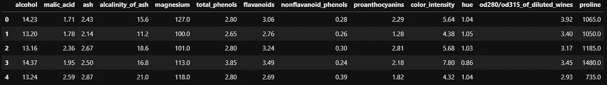

# 选择熊猫数据帧列的有趣方法

> 原文：<https://towardsdatascience.com/interesting-ways-to-select-pandas-dataframe-columns-b29b82bbfb33?source=collection_archive---------0----------------------->


克里斯汀娜·戈塔迪在 [Unsplash](https://unsplash.com?utm_source=medium&utm_medium=referral) 上的照片

在数据科学项目的探索性分析或预处理过程中，操作 pandas 数据框是一项常见任务。过滤和子设置数据也很常见。随着时间的推移，我发现自己需要根据不同的标准来选择列。希望读者找到这篇文章作为参考。

## 示例数据

如果您想使用我用来测试这些从 pandas 数据框中选择列的方法的数据，请使用下面的代码片段将 wine 数据集放入您的 IDE 或笔记本中。

```
from sklearn.datasets import load_wine
import pandas as pd
import numpy as np
import reX = load_wine()
df = pd.DataFrame(X.data, columns = X.feature_names)df.head()
```



Jupyter 笔记本中葡萄酒数据集的作者截图

现在，根据您想要做的事情，查看下面的每一个代码片段，并亲自尝试！

## 根据名称选择列

这是从数据帧中选择单个列的最基本方法，只需将列的字符串名称放在括号中。返回熊猫系列。

```
df['hue']
```

在括号中传递一个列表可以让您同时选择多个列。

```
df[['alcohol','hue']]
```

## 选择列表中找到的列的子集

与上一个示例类似，但这里您可以搜索数据帧中的所有列。

```
df[df.columns[df.columns.isin(['alcohol','hue','NON-EXISTANT COLUMN'])]]
```

## 基于列的差异选择列的子集

假设你知道你*不*想要数据框架中的哪些列。将它们作为一个列表传递给 *difference* 方法，你将得到除它们之外的所有内容。

```
df[df.columns.difference([‘alcohol’,’hue’])]
```

## 选择不在列表中的列子集

返回一个数据框，其中的列不在您要搜索的列表中。

```
df[df.columns[~df.columns.isin(['alcohol','hue'])]]
```

## 基于列的数据类型选择列

数据类型包括“float64”和“object ”,是从传递给 *dtypes* 方法的列中推断出来的。通过匹配相同数据类型的列，您将得到一系列真/假。使用 *values* 方法只获取真/假值，而不获取索引。

```
df.loc[:,(df.dtypes=='float64').values]
```

## 根据包含子字符串的列名选择列

如果数据框中有大量列，并且它们的列名都有您感兴趣的相似子串，则可以返回名称中包含子串的列。在这里，我们需要包含“al”子字符串的所有内容。

```
df.loc[:,['al' in i for i in df.columns]]
```

## 根据包含字符串通配符的列名选择列

您可能有数百列，因此查找与某个模式匹配的列可能是有意义的。可以使用 *re* 包中的“search”函数来搜索与通配符匹配的列名(有关使用正则表达式包的更多详细信息，请参见参考部分中的链接)。

```
df.loc[:,[True if re.search('flava+',column) else False for column in df.columns]]
```

## 根据列名的开头选择列

如果希望选择名称以某个字符串开头的列，可以使用 *startswith* 方法，并将其传递到数据框位置的 columns 位置。

```
df.loc[:,df.columns.str.startswith('al')]
```

## 根据列名的结尾选择列

与上一个示例相同，但是查找名称以某种方式结尾的列。

```
df.loc[:,df.columns.str.endswith('oids')]
```

## 如果所有行都满足条件，则选择列

如果行满足条件，您可以选择列。这里，如果一列中的所有值都大于 14，我们将从数据框中返回该列。

```
df.loc[:,[(df[col] > 14).all() for col in df.columns]]
```

## 如果列中的任何一行满足条件，则选择列

这里，如果一列中的任何值大于 14，我们将从数据框中返回该列。

```
df.loc[:,[(df[col] > 14).any() for col in df.columns]]
```

## 如果列中的平均行数满足条件，则选择列

这里，如果一列中所有值的平均值满足某个条件，则返回该列。

```
df.loc[:,[(df[col].mean() > 7) for col in df.columns]]
```

感谢您的检查，并随时参考它。

## 参考

[](https://github.com/caseywhorton/medium-blog-code) [## GitHub-Casey Horton/medium-blog-code

### 在 GitHub 上创建一个帐户，为 Casey Horton/medium-blog-code 开发做贡献。

github.com](https://github.com/caseywhorton/medium-blog-code)  [## 重新正则表达式操作- Python 3.9.4 文档

### 这个模块提供了类似于 Perl 中的正则表达式匹配操作。无论是图案还是字符串…

docs.python.org](https://docs.python.org/3/library/re.html) [](https://pandas.pydata.org/) [## 熊猫

### pandas 是一个快速、强大、灵活且易于使用的开源数据分析和操作工具，构建于…

pandas.pydata.org](https://pandas.pydata.org/)