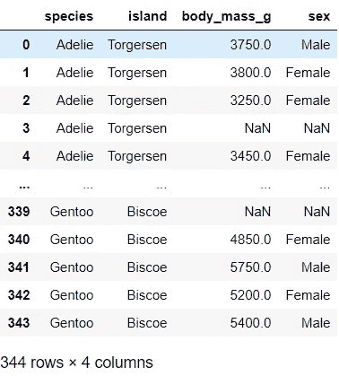
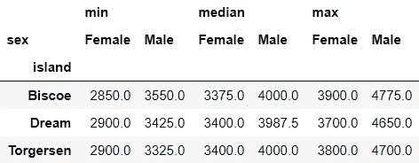
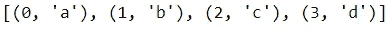
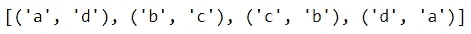
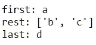

# Python 中使用标点符号的有趣方式

> 原文：<https://towardsdatascience.com/interesting-ways-to-use-punctuations-in-python-43205a0bd67d?source=collection_archive---------13----------------------->

## 学习实用的编码技巧

你喜欢学习用 Python 编码时可以使用的小技巧吗？在这篇文章中，我分享了 Python 中标点符号有趣而实用的用法。


[天一马](https://unsplash.com/@tma?utm_source=medium&utm_medium=referral)在 [Unsplash](https://unsplash.com?utm_source=medium&utm_medium=referral) 上拍照

## **📍括号: ()或 b** 反斜杠:\ **用于中断一长行代码**

你是否有时发现你的代码行太长了？如果你想知道是否有办法把它分成多行，反斜杠和括号可以帮助你。让我们看一个例子。

首先，我们将导入必要的库并加载一个样本数据集:

```
# Import libraries
import pandas as pd
from seaborn import load_dataset# Load sample dataset
columns = ['species', 'island', 'body_mass_g', 'sex']
df = load_dataset('penguins', usecols=columns)
df
```



假设我们有以下查询，我们发现它有点太长:

```
df.query("species=='Adelie'").groupby(['island', 'sex'])['body_mass_g'].agg(['min', 'median', 'max']).unstack()
```



我们可以用括号将代码括起来，这样我们就可以像这样将它写在多行上，使它更具可读性:

```
(df.query("species=='Adelie'")
   .groupby(['island', 'sex'])['body_mass_g']
   .agg(['min', 'median', 'max'])
   .unstack())
```

或者，我们也可以使用反斜杠:

```
df.query("species=='Adelie'")\
  .groupby(['island', 'sex'])['body_mass_g']\
  .agg(['min', 'median', 'max'])\
  .unstack()
```

顺便说一句，PEP 8 风格指南建议将你的行长度控制在 79 个字符以内。下一次，如果你有一个太长的代码，你想把它分散到多行，你知道该怎么做！

## 📍星号:* &下划线:_ 拆包时

您可能熟悉使用`list`解包由`enumerate`、`zip` 和`range` 等有用的内置函数返回的值:

```
example = ['a', 'b', 'c', 'd']
list(enumerate(example))
```



我们解包的第二行也可以用星号(*)表示:

```
[*enumerate(example)]
```

按照这种逻辑，以下是实现相同输出的两种方法:

```
list(zip(example, example[::-1]))
[*(zip(example, example[::-1]))]
```



下面是星号的另一个有用的应用:如果你想只给某个值赋值，而把中间所有的值赋给一个变量，我们可以使用一个[星号表达式](https://www.python.org/dev/peps/pep-3132/)来实现，其中一个变量以星号为前缀:

```
first, *rest, last = example 
print(f"first: {first}")
print(f"rest: {rest}")
print(f"last: {last}")
```



在这个例子中，`*rest`是一个带星号的表达式。这里`first` 被指定为`'a'`，last 被指定为`'d'`，而`rest` 被指定为剩余值`['b', 'c']`。通过在变量前面添加一个星号，比如`rest`，我们让这个变量捕捉中间的所有值。我们也可以像这样使用带星号的表达式:

```
first, *rest = example # example A
*rest, last = example # example B
```

你大概可以猜到，在例子 A 中，`first`取值为`'a'`，`rest` 取值为`['b', 'c', 'd']`，而在例子 b 中，`rest`取值为`['a', 'b', 'c']`，`last`取值为`'d'`

有时，在解包时，您可能不想将所有的值都赋给一个变量。在这些情况下，我们可以使用下划线来忽略我们不需要分配的不必要的元素。

```
first, _, _, last = example
print(f"first: {first}")
print(f"last: {last}")
```


这里`first`取`'a'`的值，`last`取`'d'`的值，而其余的值不赋值。

希望有机会时你会用到这些小技巧。

## 📍[赋值表达式](https://www.python.org/dev/peps/pep-0572/) : :=赋值时

这是 Python 3.8 中引入的新特性。这也称为命名表达式或 walrus 运算符。如果你把头向左倾斜，你会看到它像一个可爱的海象表情符号。为了理解它的作用，让我们看一个简单的例子:

```
x = 10
print(x) # or x depending on the IDE
```

首先，我们将值 10 赋给 x，然后打印 x 的值。使用赋值表达式，上面的代码现在可以写成:

```
print(x := 10) # or (x := 10)
```

所以这个操作符赋值并返回值。如果您熟悉 R，您可能会注意到这类似于下面的 R 语法:

```
print((x = 10)) # or (x = 10)
```

虽然我不确定这两种编程语言的内部是否完全相同，但从表面上看，它们非常相似。

如果想了解更多， [PEP 572](https://www.python.org/dev/peps/pep-0572/) 是它的官方文档。值得注意的是，关于 PEP572 的讨论引发了一些争议，并且[潜在地影响了 Guido Van Rossum 从 Python 仁慈的终身独裁者](https://www.mail-archive.com/python-committers@python.org/msg05628.html)的辞职。

Voila❕:今天到此为止。✨


照片由[安朵斯·瓦斯](https://unsplash.com/@wasdrew?utm_source=medium&utm_medium=referral)在 [Unsplash](https://unsplash.com?utm_source=medium&utm_medium=referral) 拍摄

*您想访问更多这样的内容吗？媒体会员可以无限制地访问媒体上的任何文章。如果您使用* [*我的推荐链接*](https://zluvsand.medium.com/membership)*成为会员，您的一部分会费将直接用于支持我。*

感谢您阅读这篇文章。如果你感兴趣， 以下是我的一些其他帖子的链接:
◼️ [从零开始学习 Python 的 5 个技巧](/5-tips-to-learn-python-from-zero-e4f6a9106558)
◼️ [有用的 IPython 魔法命令](/useful-ipython-magic-commands-245e6c024711)
◼️[Python 虚拟数据科学环境简介](/introduction-to-python-virtual-environment-for-data-science-3c216929f1a7)
◼️[git 数据科学简介](/introduction-to-git-for-data-science-ca5ffd1cebbe?source=your_stories_page-------------------------------------)
◼️ [用这些技巧组织你的 Jupyter 笔记本](/organise-your-jupyter-notebook-with-these-tips-d164d5dcd51f)
◼️ [你会发现有用的 python 中的简单数据可视化 为了更漂亮和定制的情节，◼️️给熊猫用户的 5 个建议◼️️用熊猫写高级 SQL 查询](/simple-data-visualisations-in-python-that-you-will-find-useful-5e42c92df51e)

再见🏃💨