# 互操作性数据-物联网:如何发送和接收数据并控制你的 Arduino，来自 R

> 原文：<https://towardsdatascience.com/interoperability-data-iot-how-to-send-and-receive-data-and-take-control-of-your-arduino-from-r-eb83005bff87?source=collection_archive---------15----------------------->

## 如何通过两者之间的数据流建立 R 和 Arduino(数据和物联网)之间的互操作性

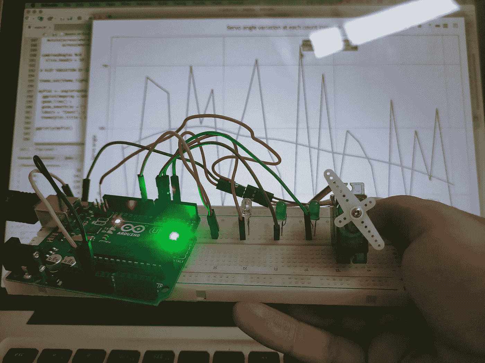

照片:在 RStudio 中接收来自 Arduino 的数据

当我们谈到 R 和 Arduino 时，除了它们都有一个字母 R 之外，我们还能谈论什么呢？让我们从头开始，以防你不熟悉， [**Arduino**](https://www.arduino.cc/en/Guide/Introduction) 是一个基于易于使用的硬件(Arduino 板)和软件(Arduino IDE)的开源电子平台。如果你有正确的数据类型和一组处理数据和执行后续操作的指令，你可以告诉这张流行的卡该做什么。Arduino 微控制器负责保存所有已编译的代码，并执行您指定的命令。另一方面，Arduino 软件是电路板的 IDE，用来编写控制电路板的指令集。如果这是你第一次使用 Arduino，我建议你回顾一下这个[入门](https://www.arduino.cc/en/Guide/ArduinoUno)，了解继续本文中的例子的最低要求。

# 开始前

现在，如果你知道 R，你会知道这是一种优雅的语言，非常适合数据分析和数据科学。尽管如此，数据和物联网之间可以实现融合。这个例子非常简单，本文的目的是探索 R 和 Arduino 之间的互操作性，根据接收到的数据在两者之间建立数据流，并在电路板的微控制器中发出指令。在这个上下文中，R 将处理数据和与之相关的一切，并将其发送到 Arduino。另一方面，Arduino 会根据收到的数据触发外设。这怎么可能呢？使用 Arduino 通过串行端口直接编程的能力。

在我们开始之前，这里有一个演示 R 和 Arduino 之间互操作性的概述:

*   首先，您将从 RStudio 向 Arduino 串行端口发送一系列定义 3 个 led 亮度的数据(范围为 0% — 100%)。
*   Arduino 脚本将等待串行数据可用，提取 3 个 led 的亮度值，将它们分配到模拟值(0–255)，指示板载微控制器将这些值写入 led，然后将映射值(0–255)发送到 Rstudio-Arduino 串行接口。
*   Rstudio 将读取从 Arduino 发送到串行端口的值。然后，您将使用这些值(范围从 0 到 255)创建一个数据集来转动伺服电机，并将这些值传递到串行接口。
*   一旦 Arduino 再次检测到有串行数据，它将读取串行接口上的每个值(0–255)，将其分配给一个角度旋转值(0 到 180)，旋转伺服，并将角度发送回串行接口。
*   最后，您将读取电机的角度，并使用 Rstudio 中的“ggplot”完成可视化。

当所有这些都完成后，这就是你使用 R 和 Arduino 一起工作想要达到的效果:

展示 Arduino 和 R 之间互操作性的视频

要继续，您将需要 Arduino IDE 和一个 Arduino(在此示例中，我使用 Arduino UNO)、一个红色 LED、一个绿色 LED、一个蓝色 LED、一个伺服电机(SG90)和跳线。硬件组件的连接方式如下所示:

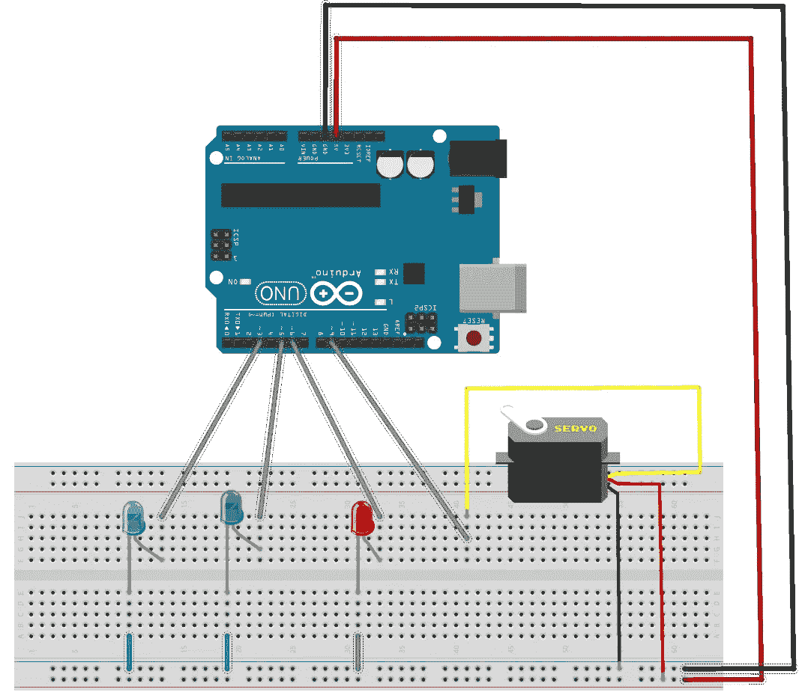

原理图互用性项目 Arduino & R

对于 RStudio 部分，我们将需要**【tidy verse】****【马格里特】****【Plotly】**和**【串行】**包。Tidyverse 是一个 R 包集合，设计用于数据科学任务，如数据可视化和处理。串行允许在 RS232 / RS422 / RS485 或计算机的任何其他虚拟串行接口中读写二进制和 ASCII 数据。Plotly 将允许您从**“gg plot 2”**图形创建交互式网络图形。您可以按如下方式安装它们:

```
# PACKAGE INSTALLinstall.packages(c("tidyverse", "serial", "plotly", "magrittr"))
```

# 使用串行接口

在 R 中启动一个新的脚本，您将加载前面提到的库。要获得计算机上可用串行接口的列表，只需使用 **listPorts()** 函数。

```
# REQUIRED LIBRARIESlibrary(tidyverse)
library(serial)
library(magrittr)
library(plotly)listPorts()
```

您将在控制台中得到如下所示的输出。最有可能的是，如果你在 Windows 上工作，你会发现列出了更多的端口。

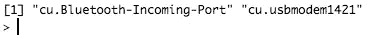

控制台上的输出，端口启用

# 配置串行接口

接下来，您将创建一个名为**“myArduino”**的端口对象，它代表一个串行客户端，用于与您的卡所连接的 USB 串行端口进行通信。但是你的 Arduino UNO 连接的是哪个端口呢？通过导航到工具/端口菜单查看适当的端口，运行 Arduino IDE 可以获得此信息。

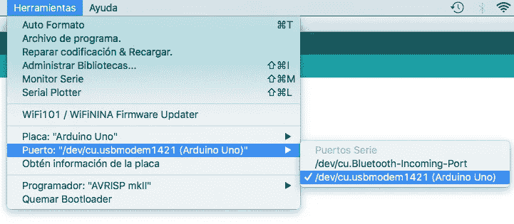

Arduino IDE，Arduino UNO 连接的端口

在我的例子中，它所连接的 USB 串口对应的是“cu.usbmodem1421”。有了这些信息，您现在可以创建一个连接到板的串行接口。这通过使用**串行连接()**函数设置接口参数来实现。

```
# SERIAL CONNECTIONmyArduino <-  serialConnection(
  port = "cu.usbmodem1421",
  mode = "9600,n,8,1" ,
  buffering = "none",
  newline = TRUE,
  eof = "",
  translation = "cr",
  handshake = "none",
  buffersize = 4096
)
```

既然已经建立了接口，下一步就是初始化它，并保持它的开放状态以备后用，比如从其中写入和读取数据。一旦接口初始化，Arduino 板就会闪烁。这是因为一旦串行端口被打开以允许引导装载程序接收新的草图，板就会重新启动。

```
# OPEN AND TESTING THE CONNECTIONopen(myArduino)
isOpen(myArduino)
```

# 将数据从 RStudio 写入串行接口

现在，您可以向串行接口写入一些数据了。您将发送到接口的值将在 0 到 100 的范围内，表示所需的 LED 亮度百分比。此外，您将添加 R、G 和 B 字符来帮助 Arduino 区分哪个值被写入哪个 LED。

您必须创建一个包含 r、g 和 b 三列的数据集，并为其亮度值添加一个字母。

```
# MAKING RGB DATAn <-  30arduinoInput <- tibble(
  r = (sample(1:100, size = n, replace = T) %>%
         paste('R', sep = '')),
  g = (sample(1:100, size = n, replace = T) %>%
         paste('G', sep = '')),
  b = (sample(1:100, size = n, replace = T) %>%
         paste('B', sep = ''))
)# A GLIMPSE OF ARDUINO INPUTglimpse(arduinoInput)
```

你可以在控制台上浏览一下。

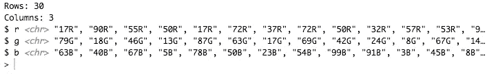

输出控制台，输入概述

您可以看到，将写入串行接口的 led 值是字符类型，这是串行通信所需的数据类型。

您将使用 **write.serialConnection()** 函数将 LED 值逐行写入串行端口。

```
# CLOSE THE OPEN CONNECTION AGAIN (BEST PRACTICE)close(myArduino)
open(myArduino)# GIVING TIME FOR THE BOARD TO RESET ONCE THE SERIAL INTERFACE IS INITIATEDSys.sleep(3)for (r in seq_len(n)){
  Sys.sleep(0.25)
  write.serialConnection(myArduino, paste(arduinoInput[r,], collapse = ''))
}
```

# 暂停！让我们去 Arduino IDE 看看会发生什么

你可能想知道，led 将如何点亮字符值？Arduino 上的脚本会处理这个问题。将以下草图从 Arduino IDE 上传到您的 Arduino。

```
// SETTING RGB LEDS 

int rLed = 0;
int gLed = 0;
int bLed = 0;
int serv = 0;int redLed = 6; // RED LED ON PIN 6
int greenLed = 5; // GREEN LED ON PIN 5
int blueLed = 3; // BLUE LED ON PIN 3void setup() {
  Serial.begin(9600);  

  // SETTING PINS AS OUTPUT

  pinMode(redLed, OUTPUT);
  pinMode(greenLed, OUTPUT);
  pinMode(blueLed, OUTPUT);void loop() {
  if (Serial.available()){

   // MAKING VARIABLE VISIBLE TO ONLY 1 FUNCTION
   // CALL AND PRESERVE THEIR VALUE

   static int t = 0;

   char myvalue = Serial.read();switch(myvalue){

    // MYVALUE IS A VARIABLE WHOSE VALUE TO COMPARE WITH VARIOUS CASES

    case '0'...'9':
      t = t * 10 + myvalue - '0';
      break;   

    case 'R':
    {
      rLed = map(t, 0, 100, 0, 255);
      analogWrite(redLed, rLed);
      Serial.println(rLed);  
    }
    t = 0;
    break;

    case 'G':
    {
      gLed = map(t, 0, 100, 0, 255);
      analogWrite(greenLed, gLed);
      Serial.println(gLed);
    }
    t = 0;
    break;case 'B':
    {
      bLed = map(t, 0, 100, 0, 255);
      analogWrite(blueLed, bLed);
      Serial.println(bLed);
    }
    t = 0;
    break;
   }
  }
}
```

Arduino 中的主循环等到串行数据可用，将数据作为字符向量 **(myvalue)** 存储在接口中，然后通过**开关**执行。特别是，开关将变量值与每个**情况**中指定的值进行比较。当发现一个事例的值与变量的值匹配时，就执行代码。

比如说，我们假设从 RStudio 发送的字符向量是 94R44G22B。第一个匹配的大小写是大小写“0”…“9”:通过减去零值字符将其转换为整数。

**t** ，代表 LED 在 0–100%范围内的亮度，首先初始化为 0。要读取的第一个值将是 9。因此，t 的值变成:

> t = 0 * 10 + ('9' — '0')
> t = 9

第二个值是 4，与第一种情况匹配。t 的新值变成:

> t = 9 * 10 + ('4' — '0')
> t = 94

读取的下一个值是与大小写“R”匹配的字母“R”。在这种情况下，t = 94 的值被重新分配为 0-255 范围内的模拟值，可用于 **analogWrite()** 功能。

如果您想知道为什么有必要重新分配传递给 analogWrite()函数的值，那是因为它是直接传递的。如果您只想闪烁并执行 LED 开启和关闭，您只需发送高电平(5v)或低电平(0v)。但是，如果您想产生不同于 0v 或 5v 的电压来改变 LED 的亮度，该怎么办呢？嗯，你不能，除非你用的是数模转换器(DAC)集成电路。

然而，使用一种叫做**“脉宽调制”(PWM)** 的技巧，你可以非常接近产生模拟输出值。每个 Arduino 上的选定引脚可以使用 **analogWrite()** 函数来生成 PWM 信号，当与某些外设一起使用时，该信号可以模拟纯模拟信号。这些针脚在卡片上标有**~。在 Arduino UNO 上，引脚 3、5、6、9、10 和 11 是 PWM 引脚。**

**PWM 输出的值为 8 位。换句话说，你可以写从 0 到⁸-1，或者从 0 到 255 的值。对于我们的 LED 电路，将输出映射到 255 将产生全亮度，0 将导致 LED 关闭。，亮度在这两个值之间变化。**

**回到开关，在“R”的情况下，一旦一个模拟值被写入 LED，一个指令随之而来: **Serial.println(rLed)** 。这是 Arduino 告诉您将该值写入串行端口的方式。在这之后，t 的值被设置回 0，并且在随后的情况下执行随后的输入字符。**

**所有这些都说了，也做了，现在您可以返回 RStudio，运行您到目前为止的脚本，并观察 led 的行为。哦，是的，魔法！**

# **读取 R 中的映射值**

**现在回到 R 问题，你可以通过 **read.serialConnection()** 读取 Arduino 发送给串口连接的映射值。**

```
# READ MAPPED DATA SENT FROM MY ARDUINOdataFromArduino <- tibble(
  capture.output(cat(read.serialConnection(myArduino,n=0)))
)# SELECT FIRST NINE ROWS, ASSIGN VALUES TO THEIR LEDS AND RENAME FIRST COLUMNdataFromArduino %>% 
  slice_head(n = 9)
```

**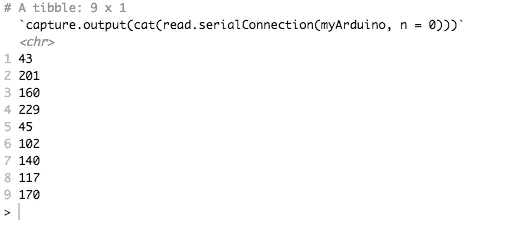**

**控制台输出，从 Arduino 发送的数据**

**现在您已经在 home️重新分配了数据！有趣的是**read . serial connection()**一次读取整个缓冲区。此外，数据具有长格式，因为读取是每行进行的。**

**现在您需要操作包含在 **dataFromArduino** 中的数据。**

```
# ASSIGN VALUES TO LEDS AND CHANGE COLUMN NAMEdataFromArduino %<>% 
  tibble(ledNames = rep_along(seq_len(nrow(dataFromArduino)), 
                         c('rMapped','gMapped','bMapped'))) %>%
  rename("ledVal" = 1) %>%
  group_by(ledNames) %>%

   # ADD IDENTIFIERS REQUIRED BY PIVOT_WIDER FUNCTION AND CREATE NEW COLUMNS WITH 'LEDVAL' VALUES

  mutate(row = row_number()) %>%
  pivot_wider(names_from = ledNames, values_from = ledVal) %>%

  # DROPPING 'ROW' COLUMN AND CONVERT ALL COLUMNS TO DATA TYPE INTEGER 

  select(-row) %>%
  mutate_all(as.integer)dataFromArduino %>% 
  slice_head(n = 10)
```

**您将能够在控制台上观察映射的数据。**

**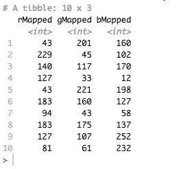**

**控制台中的输出，映射数据**

**显示从 RStudio 发送到 Arduino 串行端口的 led 的初始值以及发送回的映射值的数据集，可以更好地进行交流。**

```
# MERGE THE TWO DATA SETS,  DROP NON NUMERICAL CHARACTERS (R,G,B), AND REORDER COLUMNScombinedData <- as_tibble(cbind(arduinoInput, dataFromArduino)) %>%
  mutate(across(where(is.character), ~parse_number(.x)), across(where(is.double), as.integer)) %>% 
  select(c(1, 4, 2, 5, 3, 6))combinedData %>%
  slice_head(n = 10)
```

**现在，您将能够在控制台中看到一个包含组合数据的数据集。**

**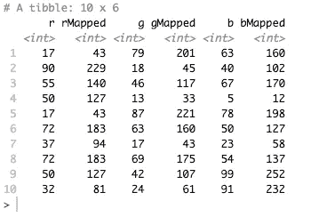**

**控制台输出，组合数据**

# **最后一步:伺服**

**到目前为止，您已经将数据从 RStudio 发送到 Arduino，重新映射它，打开一些 led，并将重新映射的数据发送到 RStudio。现在，您将从接收到的重新分配值(0–255)创建一个新的数据集，添加一个终止字符，并将这些值写入 Arduino 串行端口。**

```
# CREATING NEW DATA SET THAT SELECTS VALUES IN ORDER: MAXIMUM OF RECEIVED LED VALUES, THEN MINIMUM, AND SO IS REPEATEDrowMin <- tibble(inputMin = dataFromArduino %>% apply(1,min)) %>%

  # SELECT EVEN ROWS

  filter(row_number() %% 2 == 0)servoInput <- tibble(servoIn = dataFromArduino %>% 
                       apply(1,max))# REPLACE EVEN ROWS WITH A MINIMUM VALUE, AND APPENDING A TERMINATING CHARACTERservoInput[c(1:n)[c(F,T)],] <- rowMinservoInput %<>% 
  mutate(servoIn = servoIn %>% 
           paste('S', sep = ''))
```

**您将在串行接口中写入这些值。**

```
close(myArduino)
open(myArduino)Sys.sleep(1)for (r in seq_len(n)){
  Sys.sleep(1)
  write.serialConnection(myArduino, paste(servoInput[r,], collapse = ''))
}
```

# **再次暂停！让我们去 Arduino IDE 并完成伺服**

**是时候在 Arduino IDE 中完成你的草图了。Arduino 程序的主循环一直等到串行数据可用，提取整数值，将 0–255 范围内的值重新分配给伺服角度 0–179，并将该值写入伺服。然后映射的角度值打印在串行接口上。将粗体突出显示的部分添加到您的草图中，对应于伺服系统，并将更新的草图重新上传到您的 Arduino。**

```
**# include <Servo.h>**// SETTING SERVO AND RGB LEDS 

int rLed = 0;
int gLed = 0;
int bLed = 0;
**int serv = 0;**int redLed = 6; // RED LED ON PIN 6
int greenLed = 5; // GREEN LED ON PIN 5
int blueLed = 3; // BLUE LED ON PIN 3
**int theServo = 9; // SERVO ON PIN 9****Servo myServo;**void setup() {
  Serial.begin(9600);  

  // SETTING PINS AS OUTPUT

  pinMode(redLed, OUTPUT);
  pinMode(greenLed, OUTPUT);
  pinMode(blueLed, OUTPUT);**// ATTACHING SERVO OBJECT**

 **myServo.attach(theServo);** }void loop() {
  if (Serial.available()){

   // MAKING VARIABLE VISIBLE TO ONLY 1 FUNCTION
   // CALL AND PRESERVE THEIR VALUE

   static int t = 0;

   char myvalue = Serial.read();switch(myvalue){

    // MYVALUE IS A a VARIABLE WHOSE VALUE TO COMPARE WITH VARIOUS CASES

    case '0'...'9':
      t = t * 10 + myvalue - '0';
      break;   

    case 'R':
    {
      rLed = map(t, 0, 100, 0, 255);
      analogWrite(redLed, rLed);
      Serial.println(rLed);  
    }
    t = 0;
    break;

    case 'G':
    {
      gLed = map(t, 0, 100, 0, 255);
      analogWrite(greenLed, gLed);
      Serial.println(gLed);
    }
    t = 0;
    break;case 'B':
    {
      bLed = map(t, 0, 100, 0, 255);
      analogWrite(blueLed, bLed);
      Serial.println(bLed);
    }
    t = 0;
    break;**case 'S':
    {

      // MAPPING ANALOGUE LED VALUE TO ANGLE FROM 0 TO 180 DEGREES

      serv = map(t, 0, 255, 0, 179);
      Serial.println(serv);
      delay(5);
      myServo.write (serv);
      delay(150);
    }
    t = 0;
    break;**
   }
  }
}
```

**完成了这次更新，现在你可以回到 RStudio，运行脚本到目前为止，并观察伺服的行为。哦，对了，再来一次魔法！**

# **R 中的伺服数据**

**现在，回到 RStudio，你可以得到 Arduino 给你的东西，并在你这样做的时候进行数据辩论。**

```
# READ MAPPED ANGLES SENT FROM MY ARDUINO, RENAME FIRST COLUMNangleFromServo <- tibble(
  capture.output(cat(read.serialConnection(myArduino,n=0)))) %>%
  rename("servoAnglesMapped" = 1) %>% 
  mutate_all(as.integer)# SELECT FIRST TEN ROWSangleFromServo %>% 
  slice_head(n = 10)
```

**您将能够在控制台上观察映射的数据。**

**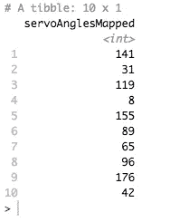**

**控制台输出，映射伺服数据**

**您现在还可以观察您发送的内容与您接收的内容，合并两个数据集。**

```
# WHAT WE SENT VS WHAT WE RECEIVED. MERGE THE TWO DATA SETS AND DROP NON NUMERIC CHARACTER 'S'combinedAngles <- as_tibble(
  cbind(servoInput, angleFromServo)) %>%
  mutate(across(where(is.character), ~parse_number(.x)),
         across(where(is.double), as.integer))combinedAngles %>%
  slice_head(n = 10)
```

**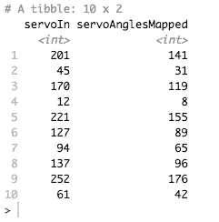**

**控制台中的输出，从伺服系统发送的数据与接收的数据**

****servoIn** 列显示我们发送给 Arduino 的数据，而 **servoAnglesMapped** 表示 Arduino 写入伺服并返回给我们的数据。**

# **数据可视化**

**如果这还不够，您现在可以用数据可视化来结束，例如显示伺服系统在写入角度数据的每个实例中产生的变化。**

```
# PLOT VARIATION OF SERVO ANGLEtheme_set(theme_light())myPlot <- angleFromServo %>%
  ggplot(mapping = aes(x = 1:nrow(angleFromServo), y = servoAnglesMapped)) +
  geom_line() +
  geom_smooth(se = F) +
  labs(x = "Count", y = "Servo angle",  title = "Servo angle variation at each count instance")+
  theme(plot.title = element_text(hjust = 0.5))ggplotly(myPlot)
```

**结果，您将在 RStudio 查看器中看到如下图。**

**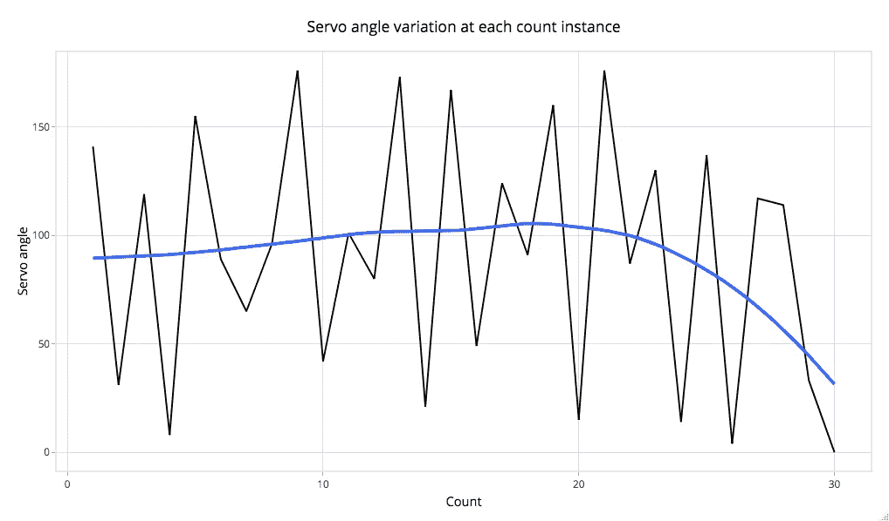**

**每次计数时的伺服角度变化图**

**在本文中，您演示了 RStudio 和 Arduino 之间的双向数据流。在每一个实例中，你发送到 Arduino 的数据被转换，触发一个外设，然后被重复。然后，您获得的数据经过一些修复，以正确的格式放置，以便 Arduino 在后续操作中执行。玩数据和物联网很有意思吧？**

**感谢您的阅读。我希望这已经让你熟悉了 Arduino 和 R，并激发了你探索这两个美人能做的惊人事情的真正兴趣。**

**我分享一下与【https://rpubs.com/cosmoduende/arduino-r】一起生成的剧情，更有美感一点:**

**在这里你可以找到完整的代码，包括用 R 编程的部分和 Arduino 草图:[https://github.com/cosmoduende/r-arduino](https://github.com/cosmoduende/r-arduino)**

**感谢你坚持到最后，祝你分析非常愉快，可以把一切都付诸实践，对结果感到惊讶，和我一样开心！**