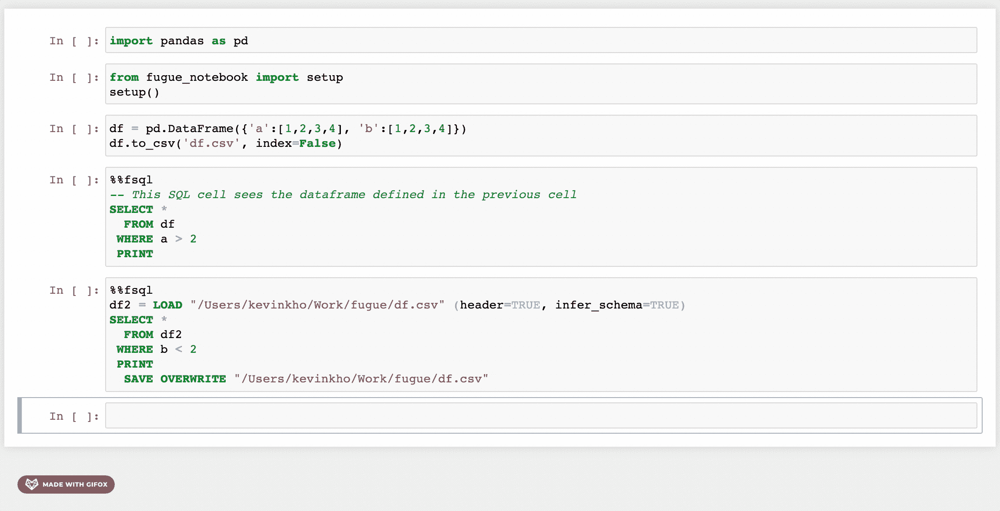
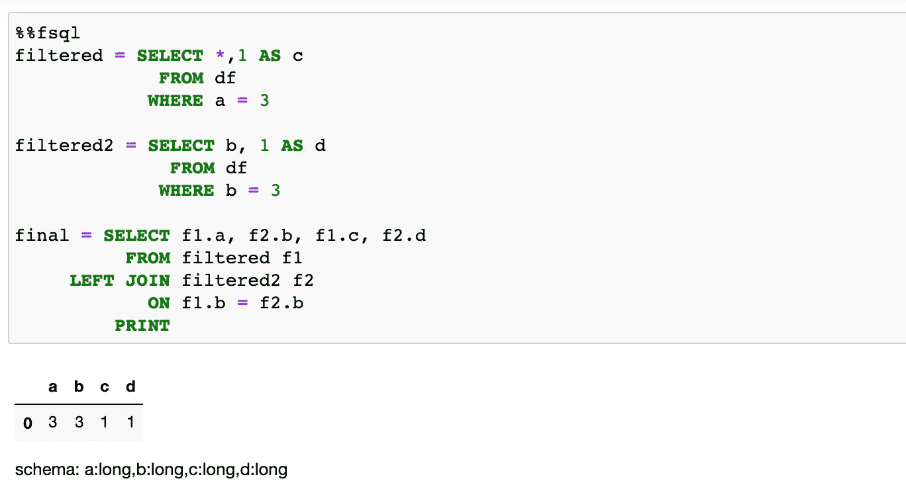
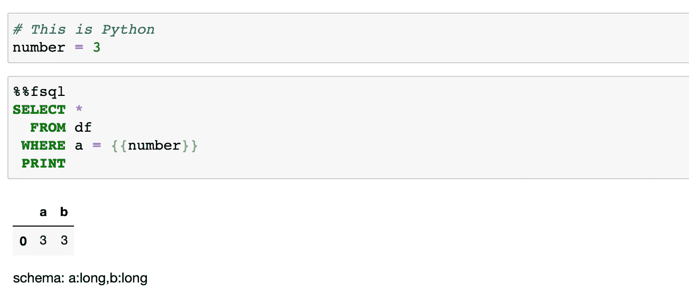
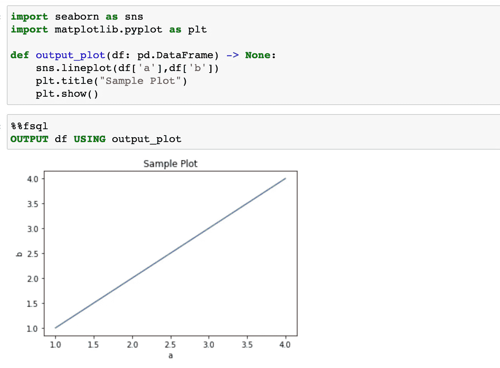
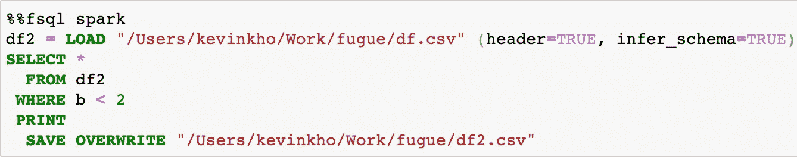
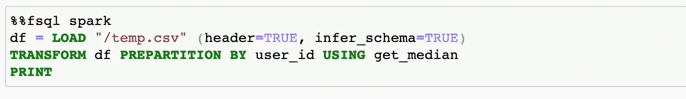

# Jupyter 笔记本中可互操作的 Python 和 SQL

> 原文：<https://towardsdatascience.com/interoperable-python-and-sql-in-jupyter-notebooks-86245e711352?source=collection_archive---------4----------------------->

## 在 Pandas、Spark 和 Dask 上使用 SQL



先看 Jupyter 的 FugueSQL

*注意:大部分代码片段都是图片，因为这是保持 SQL 语法突出显示的唯一方法。一个交互代码的例子，看看这个* [*Kaggle 笔记本*](https://www.kaggle.com/kvnkho/thinkful-workshop-data-analytics) *。*

# 动机

FugueSQL 的目标是为数据专业人员提供一个增强的 SQL 界面(和体验),以便用类似 SQL 的语言执行端到端的数据计算工作流。借助 FugueSQL，SQL 用户可以在 Python 代码和 Jupyter 笔记本内的数据帧上执行完整的提取、转换、加载(ETL)工作流。SQL 被解析并映射到相应的 Pandas、Spark 或 Dask 代码。

这使得大量 SQL 用户能够利用 Spark 和 Dask 的能力，同时使用他们选择的语言来表达逻辑。此外，还添加了分布式计算关键字，如`PREPARTITION`和`PERSIST`，以便扩展标准 SQL 之外的功能。

在本文中，我们将介绍基本的 FugueSQL 特性，以及如何通过指定执行引擎在 Spark 或 Dask 上使用它。

# 对 ANSI SQL 的增强


在上面的 GIF 中看到的第一个变化是`LOAD`和`SAVE`关键词。除此之外，还有其他一些增强功能，提供了更友好的语法。用户还可以在 FugueSQL 中使用 Python 函数，创建一个强大的组合。

通过使用`%%fsql`单元格魔术，FugueSQL 用户可以在笔记本上拥有 SQL 单元格(后面会有更多的例子)。这也在 Jupyter 笔记本中提供了语法高亮。虽然这里没有演示，但是这些 SQL 单元可以在 Python 代码中与`fsql()`函数一起使用。

**变量赋值**

数据帧可以分配给变量。这类似于 SQL 临时表或公用表表达式(CTE)。虽然本教程中没有显示，但是这些数据帧也可以从 SQL 单元中取出，并在 Python 单元中使用。下面的例子显示了来自修改`df`的两个新数据帧。`df`是通过在 Python 单元中使用 Pandas 创建的(这是与第一个图像相同的 df)。两个新的数据帧连接在一起，创建一个名为`final`的数据帧。



数据帧的变量赋值

**金贾模板**

FugueSQL 可以通过 Jinja 模板与 Python 变量进行交互。这允许 Python 逻辑改变类似于 SQL 中的参数的 SQL 查询。



**Python 函数**

FugueSQL 还支持在 SQL 代码块中使用 Python 函数。在下面的例子中，我们使用`seaborn`来绘制数据帧的两列。我们使用 SQL 中的关键字`OUTPUT`调用该函数。



# 与 ipython-sql 的比较


神游标志

FugueSQL 旨在对已经加载到内存中的数据进行操作(尽管有一些方法可以使用 FugueSQL 从存储器中引入数据)。有一个名为 [ipython-sql](https://github.com/catherinedevlin/ipython-sql) 的项目提供了`%%sql`单元格魔术命令。该命令旨在使用 SQL 将数据从数据库加载到 Python 环境中。

FugueSQL 的保证是，相同的 SQL 代码将在 Pandas、Spark 和 Dask 上工作，无需任何代码更改。FugueSQL 的重点是内存计算，而不是从数据库加载数据。

# 使用 Spark 和 Dask 的分布式计算

随着我们处理的数据量不断增加，Spark 和 Dask 等分布式计算引擎正被数据团队越来越广泛地采用。允许用户在相同的代码中使用这些更高性能的引擎。

在下面的代码片段中，我们将单元格魔术从`%%fsql`改为`%%fsql spark`，现在 SQL 代码将在 Spark 执行引擎上运行。类似地，`%%fsql dask`将在 Dask 执行引擎上运行 SQL 代码。



从迁移到分布式计算环境中获益的一个常见操作是获取每个组的中间值。在这个例子中，我们将展示`PREPARTITION`关键字以及如何对每个数据分区应用函数。

首先，我们定义一个 Python 函数，它接收一个数据帧并输出`user_id`和中位数`measurement`。该功能一次只能对一个`user_id`进行操作。即使在熊猫里定义了函数，在 Spark 和 Dask 上也能起作用。

熊猫的简单中值函数

然后，我们可以使用`PREPARTITION`关键字通过`user_id`对数据进行分区，并应用`get_median`函数。



预分割和火花以获得中间值

在这个例子中，我们得到了每个用户的中间值。随着数据变大，并行化将带来更多好处。在我们拥有的一个[笔记本](https://www.kaggle.com/kvnkho/thinkful-workshop-data-analytics)的例子中，Pandas 引擎的这个操作花费了大约 520 秒。对于 3.2 亿行的数据集，使用 Spark 引擎(在 4 个内核上并行化)需要大约 70 秒。

执行时间的差异是意料之中的。当数据变得太大而无法有效处理时，FugueSQL 允许 SQL 用户将工作流扩展到 Spark 和 Dask。

另一个常见的用例是 Dask 处理内存溢出和向磁盘写入数据。这意味着用户可以在遇到内存不足问题之前处理更多数据。

# 结论和更多示例

在本文中，我们探索了 FugueSQL 的基本特性，这些特性允许用户通过 Jupyter notebook 中的 SQL 单元格在 Pandas、Spark 和 Dask 数据帧上工作。

Fugue 将逻辑和执行解耦，使得用户可以在运行时轻松指定执行引擎。这使得大量 SQL 用户能够独立于计算框架来表达他们的逻辑。当情况需要时，他们可以轻松地将工作流迁移到 Spark 或 Dask。

有很多细节和功能无法在一篇博文中涵盖。有关端到端的示例，请访问我们为 Thinkful data analyst bootcamp 学生准备的 [Kaggle 笔记本](https://www.kaggle.com/kvnkho/thinkful-workshop-data-analytics)。

# 笔记本中的设置

Fugue(和 FugueSQL)可以通过 PyPI 获得。它们可以使用 pip 安装(Dask 和 Spark 的安装是分开的)。

```
pip install fugue
```

在笔记本内部，运行`setup`功能后可以使用 FugueSQL 细胞魔法`%%fsql`。这也为 SQL 命令提供了语法突出显示。

```
from fugue_notebook import setup
setup()
```

# 联系我们

如果你对使用 FugueSQL 感兴趣，想给我们反馈，或者有任何问题，我们很乐意在 Slack 上聊天！我们还为对在数据工作流中应用 FugueSQL(或 Fugue)感兴趣的数据团队举办研讨会。

[项目回购](https://github.com/fugue-project/fugue)

[松弛通道](https://join.slack.com/t/fugue-project/shared_invite/zt-jl0pcahu-KdlSOgi~fP50TZWmNxdWYQ)

FugueSQL 只是更广泛的河豚生态系统的一部分。Fugue 是一个抽象层，它允许用户用原生 Python 编写代码，然后在 Pandas、Spark 或 Dask 上执行代码，而无需在运行时更改代码。更多信息可以在上面的回购中找到。