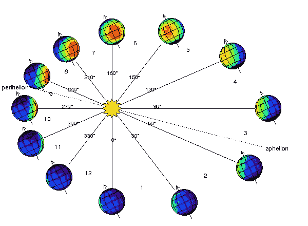
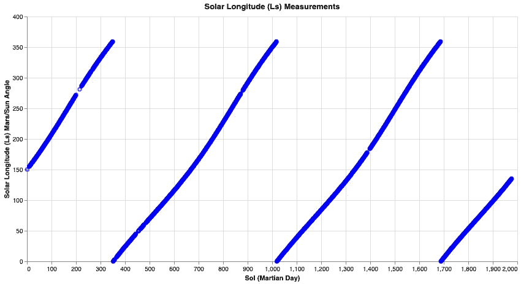
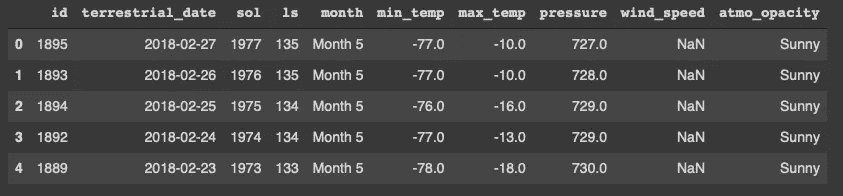
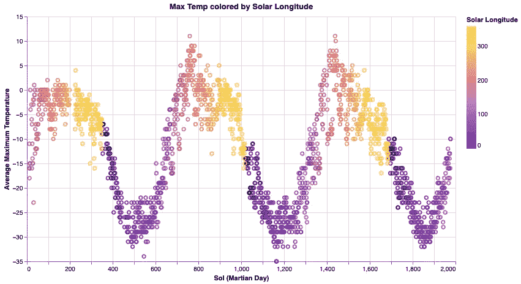
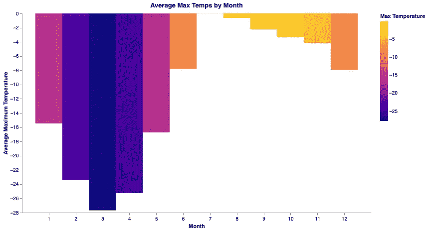
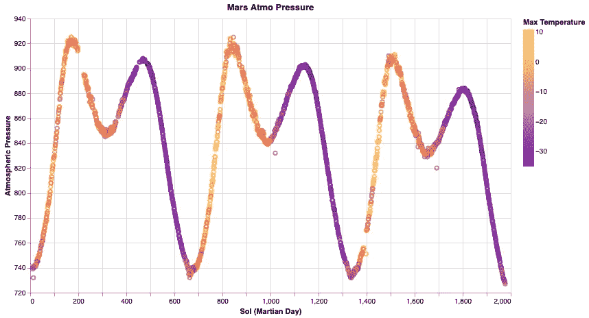
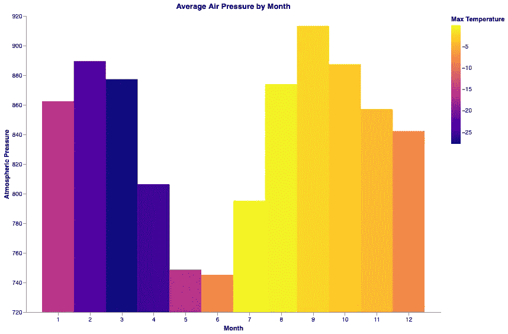

# 星际预报

> 原文：<https://towardsdatascience.com/interplanetary-forecasts-17b3fd05afc2?source=collection_archive---------33----------------------->

## 探测火星探测器好奇号的季节性天气模式

尼古拉斯·洛沃斯在 [Unsplash](https://unsplash.com?utm_source=medium&utm_medium=referral) 上的照片

自从人类仰望并记录移动的天空以来，这颗红色星球就充满了人类的想象力和神话故事。随着我们用来观察天空和太阳系中其他行星的眼睛变得越来越先进，一些起源可以追溯到我们看不到的更远的历史，而许多起源则更近。

在过去的几十年里，人类甚至让机器带着一系列相机和其他传感器降落在我们遥远的邻居身上，以收集信息并将其传回地球，以便我们能够更好地了解战神。我们最近送上火星的机器之一是“好奇号”。今天，我们要看看好奇号是否能告诉我们任何关于火星上天气模式的故事。

# 机器类的一大飞跃

好奇号是一辆汽车大小的漫游车，旨在探索盖尔陨石坑。好奇号于 2011 年 11 月从卡纳维拉尔角发射，9 个月后登陆火星，包含许多不同的科学仪器，重点是火星气候和地质。我们将着眼于 REMS 数据包的数据，探索当地天气的季节性变化。

火星车环境监测站，简称 REMS，包含的仪器旨在提供火星车周围气象条件的每日和季度报告。在 6 年的时间里，收集了最高和最低温度以及气压的数据。在这篇文章中，我们将看看通过分析这些数据，我们可以发现什么样的年度天气模式。

# 火星年

当我们从火星表面的漫游者上观察每年的天气模式时，它有助于对火星年有一个简要的概述。在地球上，我们的一年有 365 天多一点，分为 12 个月。火星也有 12 个月，但每个月都稍长一些，因为火星年大约是 687 个地球日(24 小时)。这 12 个月是通过测量太阳经度或火星-太阳角来计算的，火星-太阳角是从北半球测量的太阳到地球的角度。这种测量被称为 Ls。

理解 Ls 测量是很重要的，因为我们将把 Ls 作为一个指标来看，即数据是从年周期的哪里收集的，而不是地球日期/时间。Ls 变量给了我们一个很好的起始位置，`0`，并一直计数到`360`度，以指示我们的红色邻居在他们绕太阳旅行中的位置。作为下图中的一个例子，我们看到在 6 年的时间里，我们的 Ls 变量在 0 到 360 的范围内变化了 3 次，这是我们在大约 6 年的时间里，在不到两年的轨道上所预期的。

作者图片

上面我们可以看到，在将近 2000 sols 的过程中，或者说大约 6 年的时间里，我们看到我们的 ls 测量周期几乎是 360 度的 3 倍。这告诉我们，我们在数据中看到的任何年度天气模式，应该相当于围绕太阳的大约 3 个完整的轨道周期。

让我们看看一些数据，看看我们需要分析什么:

作者图片

你可能注意到的第一件事是，我们丢失了一些风速数据，更深入的分析表明，大气不透明度几乎全是晴天，或者不包含任何数据。这并不出人意料，因为虽然火星可能有季节性天气，但它并不以雷暴闻名。(然而，沙尘暴是另一回事)。这给我们留下了温度和压力数据。快速浏览一下我们记录的最高温度数据，会发现以下情况:

作者图片

我们也可以在上面的最高温度图中看到同样的 3 年模式。这个图表被我们的最小二乘测量着色，这样我们就可以看到火星在它的轨道上与温度读数相比的位置。你可能记得一个火星年大约是 687 天，这大致是我们在图表上看到的两个峰值之间的 sol 数，也是 ls 测量中两次转换之间的时间。

我们已经可以看到温度数据存在季节性波动，至少在好奇号读取数据的盖尔陨石坑是如此，但上面的图表可能很难预测任何给定年份特定月份的温度。下面我们将看看 12 个月中每个月的平均温度，让我们知道如果我们去拜访好奇号，不管我们到达的月份是哪个月，我们可能会遇到什么样的温度。

作者图片

正如我们所看到的，温度波动几乎是我们在地球上任何给定年份都会预料到的，至少在我们的北半球，最冷的月份是火星年的头几个月，或者在北分日之后，最热的月份是在南分日期间。在火星上很难用月份来测量时间，因为那里的月份长度变化比这里大得多。最短的一个月约 46 Sols，最长的一个月约 67 Sols。有人提到，好奇号降落在位于火星赤道上的盖尔陨石坑，因此我们可以预计这些温度比纬度更北或更南的地方要高得多。

# 压力低到你能感觉到

如果火星上的低温不足以阻止游客，那么极低的气压应该可以做到这一点。地球上的平均气压略高于 1000 毫巴，而火星上的平均气压约为 6-7 毫巴。这低于我们自身压力的 1%,这意味着任何有机游客都需要做好准备，因为暴露在这样的压力下会…不愉快。

好奇号上的 REMS 包一直在测量以帕斯卡为单位的气压，当我们观察好奇号停留期间绘制的气压时，一些有趣的事情凸显出来:

作者图片

真正有趣的是，我们可以看到我们的 3 火星年模式出现在我们的压力数据中。这是值得注意的，因为地球上的气压没有季节变化。火星上正在发生的事情是，随着天气变冷，天气冷到足以让二氧化碳从空气中冻结出来，导致地球周围的气压下降 30%之多！

你可能会注意到图表的双峰部分，在那里气压开始下降，只是再次上升，然后一直下降。虽然我无法证实这一点，但查看这些压力下降时的 Ls 测量结果，火星轨道的偏心率比地球轨道更接近椭圆形，这似乎导致了这种微小的季节性变化。

如果我们看一下每个月的平均压力，我们可以看到更详细的情况:

作者图片

如果我们将此与显示火星轨道的文章顶部的图像进行比较，我们可以看到，随着压力在一年的第二个月下降，火星正在向其轨道的远日点部分前进，或离太阳最远的位置，随着行星向其近日点位置移动，气压再次上升，然后继续重新开始这一过程。

# 不适宜居住的环境

简单浏览了一下好奇号火星车的天气数据后，我认为很明显火星上的天气有季节性变化。仅仅是好奇号所在的赤道上的温度波动，它们就从夏天的冰冻到冬天的致命。

除了寒冷的气温，令每个年轻的梦想家失望的是，由于气压极低，这不是一个对血肉生物友好的环境。气温的年最高值刚刚达到正数字，极低的气压意味着任何游客都必须穿上全套防护服，不管那天阳光多么明媚。

然而，任何运动中的系统都是可以修改的系统，也许有一天，随着足够的创造力和地形形成方面的进步，我们的人类后代将在火星的夜空下自由行走，仰望并梦想着来自太阳的第三块岩石。

*原载于*[*https://jeremyspradlin . github . io*](https://jeremyspradlin.github.io/2020-06-23-Mars_Weather/)*。*