# 内插纽约市自行车共享数据以发现再平衡运动

> 原文：<https://towardsdatascience.com/interpolating-nyc-bike-share-data-to-discover-rebalancing-movements-6cf8a80eb902?source=collection_archive---------15----------------------->

## 使用 Pandas concat 重构花旗自行车出行数据

为了确保在需要时有自行车(和码头)可用，像大多数自行车共享系统一样，*重新平衡*或将自行车从过多的地方转移到需要的地方。Citi Bike 没有披露自行车何时何地被移动的数据，但事实证明这些移动是可以被发现的。

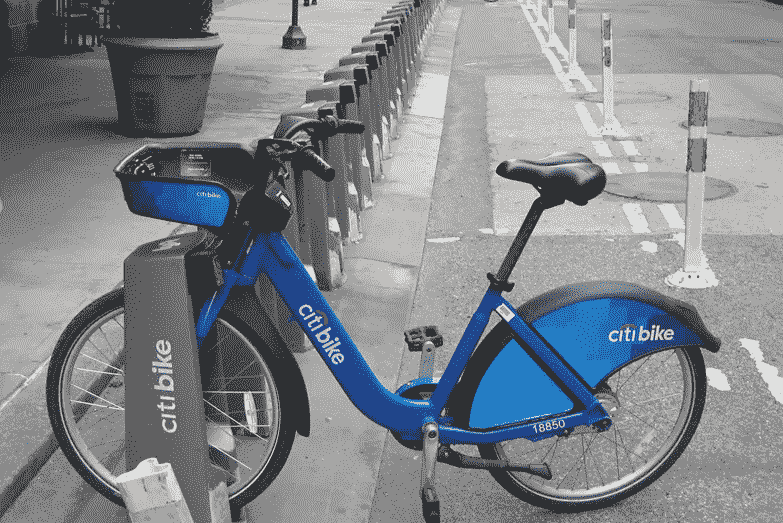

几乎空无一人的花旗自行车站——作者照片

本文是对花旗自行车提供的自行车份额数据的一系列探索的一部分。如果你觉得这篇文章很有趣，你可能也想看看:

[探索纽约市自行车共享数据](/exploring-bike-share-data-3e3b2f28760c) —介绍数据准备和分析以及如何开始使用所使用的工具:Jupyter、Python、Pandas 和 Seaborn。

[使用 NYC Bike Share 数据进行反向地理编码](/reverse-geocoding-with-nyc-bike-share-data-cdef427987f8) —这是一个关于如何增加 Citi Bike 提供的区、社区和邮政编码数据的教程。

[探索疫情对纽约市自行车共享使用的影响](/exploring-the-effects-of-the-pandemic-on-nyc-bike-share-usage-ab79f67ac2df) —查看两年的数据以及在此期间骑行人数的变化。

# 下载花旗自行车旅行数据

Citi Bike 提供 tripdata 文件，这样任何人都可以分析该系统是如何使用的。[花旗自行车系统数据](https://www.citibikenyc.com/system-data)页面描述了所提供的信息。每个文件包含一个月的数据；每条记录代表一次旅行。

对于这篇文章，我使用的是 2020 年 9 月的 tripdata 文件。在疫情最初几个月的下降之后，使用率已经恢复，这是迄今为止最繁忙的一个月。

在 Windows 上，使用上面的链接找到并下载纽约 9 月份的 tripdata 文件，然后将其放到一个`bikeshare`目录中。

在 Linux 上，从命令提示符下创建一个`bikeshare`目录，下载 tripdata 文件，将其解压缩，然后删除 zip 文件。

```
mkdir bikeshare && cd bikeshare 
wget [https://s3.amazonaws.com/tripdata/202009-citibike-tripdata.csv.zip](https://s3.amazonaws.com/tripdata/202003-citibike-tripdata.csv.zip)
unzip 202009-citibike-tripdata.csv.zip
rm 2020009-citibike-tripdata.csv.zip
```

# 导入库和数据

启动 Jupyter，从浏览器窗口在你的`bikeshare`目录下创建一个新的笔记本。本文中使用的带有 Python 代码的 Jupyter 笔记本在 GitHub 上的名称是 [rebalancing.ipynb](https://github.com/ckran/bikeshare/blob/main/rebalancing.ipynb) 。

导入常用库:用于分析的 **Pandas** 和用于图表的 **Seaborn** 。

```
import pandas as pd
from pandas import to_datetime
import seaborn as sns
import matplotlib.pyplot as plt
```

将花旗自行车旅行数据文件读入熊猫数据帧。对于这种分析，我们只需要开始和结束站 ID 和时间。

```
df = pd.read_csv('~/bikeshare/202009-citibike-tripdata.csv',\
     usecols=['starttime','start station id',\
              'stoptime','end station id','bikeid'],\
     parse_dates=['starttime','stoptime'])
df.info()
```

我看到 9 月份有将近 200 万人次。

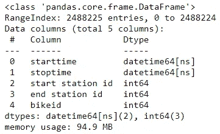

所选列的 Tripdata 信息

# 幽灵骑士

Citi Bike 是一个传统系统，用户从一个站点取车，然后在另一个站点下车。

当分析行程数据文件时，如果我创建一个新的数据帧并按`bikeid`和`starttime`排序，我可以跟踪每辆自行车在系统中从一个站点到另一个站点的运动。

```
dfbike=df.sort_values(by=['bikeid','starttime'])
dfbike.head(10)
```

现在，我可以在一个月内跟踪自行车的行程。一次乘坐的`end station id`(几乎)总是下一次乘坐的`start station id`。

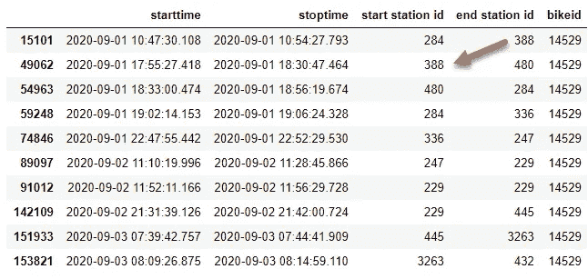

按 bikeid 和开始时间排序的行程-按作者排序的图片

如果不一样，那么这辆自行车(不知何故)在两次骑行之间从一个站移动到了另一个站。

虽然我可以通过循环遍历数据帧并比较每次旅行和下一次旅行来找到这些“幽灵之旅”，但有近 200 万次旅行需要一段时间。

更好的方法是利用 Panda 的矢量运算，创建一个包含成对游乐设施的数据框架。

为此，我将创建一个带有单个虚拟记录的`offset`数据帧:

```
offset = pd.DataFrame({'starttime': pd.to_datetime('2010-09-01'),\
  'start station id':0,'stoptime': pd.to_datetime('2010-09-01'),\
  'end station id':0,'bikeid':0},index=[0])
```

然后创建两个新的数据帧，一个先使用偏移量，一个最后使用偏移量:

```
dfbike1 = pd.concat([offset,dfbike]).reset_index(drop=True)
dfbike2 = pd.concat([dfbike,offset]).reset_index(drop=True)
```

使用`axis=1`并排组合这两个数据帧

```
dfbike=pd.concat ([dfbike1[['bikeid','stoptime','end station id']]\
            ,dfbike2[['bikeid','starttime','start station id']] ],\
             axis=1 )
dfbike.head()
```

这里每条记录代表一辆自行车停靠的时间段。我可以看到一趟车在 388 站结束，下一趟车从同一个站开始。然后它停靠在 480 号站，依此类推。

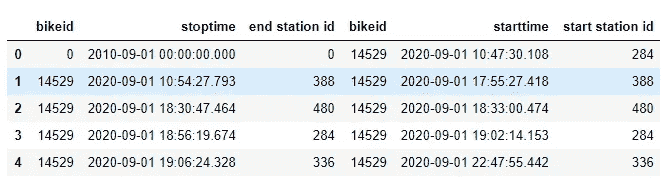

作者图片

但是当我追踪这辆自行车的行程时，我发现有一天这辆自行车被移动了！它前一天停靠在 3906 站，第二天在 4123 站被取走。

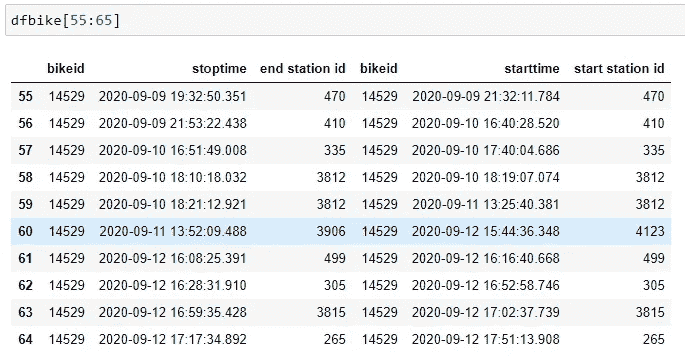

作者图片

为了检测这些运动，我想创建一个这些“幽灵游乐设施”的数据框架，就好像它们是真实的游乐设施一样。这需要交换起止名称。然后我选择那些`bikeid`相同但`station id`值不同的记录。

```
dfbike.columns=['bikeid1','starttime','start station id',\
                'bikeid2','stoptime','end station id']
dfrebal = dfbike[['starttime','start station id',\
                  'stoptime','end station id']].\
           loc[(dfbike.bikeid1==dfbike.bikeid2) & \
          (dfbike['start station id'] != dfbike['end station id']) ]
dfrebal.reset_index(drop=True, inplace=True)
dfrebal
```

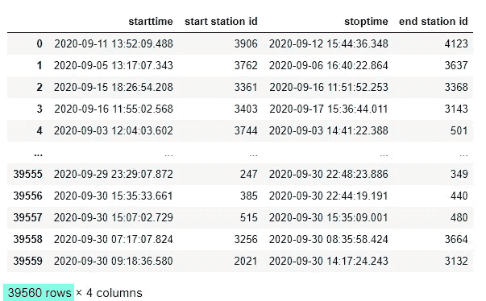

2020 年 9 月的再平衡运动—作者图片

这个数据帧的每一行都代表一辆自行车，出于重新平衡、维修或其他目的，这辆自行车不知何故从一个站点移动到了另一个站点。

现在我有了这个数据框架，我将把它保存为一个拼花文件，这样我就可以在我的下一篇文章[中使用它，根据纽约市自行车共享数据](/estimating-bike-availability-from-nyc-bike-share-data-7cfc4655d5f6)估计自行车共享可用性。

> 这需要 pyarrow(安装者:`conda install -c conda-forge pyarrow`)

```
dfrebal.to_parquet('202009-citibike-reblance.parquet')
```

请注意，上面的报告显示，9 月份有近 4 万辆自行车被重新平衡。这个数字合理吗？

[花旗自行车每月运营报告](https://www.citibikenyc.com/system-data/operating-reports)页面有每月运营报告的链接。对于 2020 年 9 月，它说:

> 九月份，花旗自行车员工重新平衡了总共 51，179 辆自行车…利用箱式卡车、货车、合同三轮车、铰接三轮车(“自行车列车”)、服务员和会员奖励(“自行车天使”)在全系统范围内重新分配自行车。

因此，尽管官方统计的超过 51179 人比我发现的要高，但这也包括“自行车天使”的骑行，他们是为了重新平衡而被激励骑自行车的成员。这些游乐设施将在 tripdata 文件中显示为“常规”游乐设施。我会说我的衍生计数*足够接近政府工作*。

# 哪些站得到重新平衡？

现在我知道有多少自行车被重新平衡，我想知道哪些站有最多的重新平衡。

站名比数字站名更有意义，所以我将返回到 tripdata 文件并创建一个站名和站名的表。

```
dfstations = \
  pd.read_csv('~/bikeshare/202009-citibike-tripdata.csv',\
  usecols=['start station id','start station name']).\
  drop_duplicates()                
dfstations.columns=['station id','station name']
dfstations.set_index('station id',drop=True, inplace=True)
```

我将使用熊猫`merge`来获取起点和终点站名。

```
dfrebal = pd.merge(dfrebal, dfstations[['station name']],\
     how = 'left', left_on='start station id', right_on='stationid')
dfrebal = pd.merge(dfrebal, dfstations[['station name']],\
     how = 'left', left_on='end station id', right_on='stationid')
```

并根据生成的默认值重命名列名。

```
dfrebal.rename(columns = 
        {'station name_x':'start station name',\
         'station name_y':'end station name'},\
          inplace = True)
```

创建两个系列，前 20 个站点都有自行车进出。

```
rebalin = dfrebal['end station name'].value_counts()[:20]
rebalout = dfrebal['start station name'].value_counts()[:20]
```

使用`barplot`显示前 20 个站点中从*移出*的自行车总数，同样也显示移入*的自行车总数。*

```
plt.figure(figsize=(10,8))
plt.title('Citi Bike Rebalancing - September 2020\
 - Top 20 Stations bikes moved OUT'  ) 
plt.xlabel('Count of bikes moved') 
sns.barplot( x=rebalout.values, y=rebalout.index,  orient="h" ) ;
```

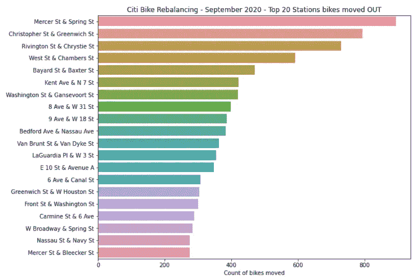

搬出的自行车数量-图片由作者提供

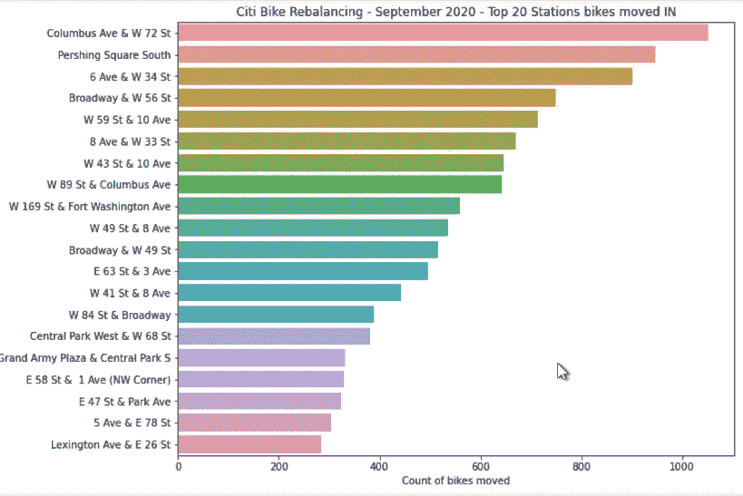

移入的自行车数量-图片由作者提供

在查看了按站点移动的自行车数量后，我意识到按*街区*查看数量会更有趣。Citi Bike 不按街区识别站点，但正如我在之前的文章[中描述的，使用 NYC Bike Share 数据进行反向地理编码](/reverse-geocoding-with-nyc-bike-share-data-cdef427987f8?source=your_stories_page-------------------------------------)可以使用所提供的纬度和经度来实现。有关创建这些图表的步骤，请参见 Jupyter 笔记本 [rebalancing.ipynb](https://github.com/ckran/bikeshare/blob/main/rebalancing.ipynb) 。

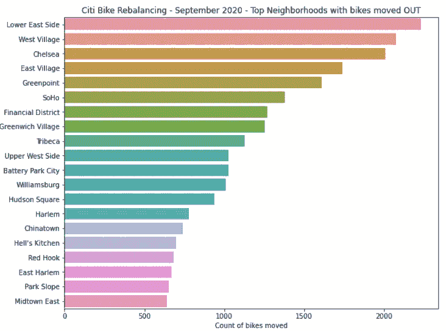

邻域计数-按作者分类的图像

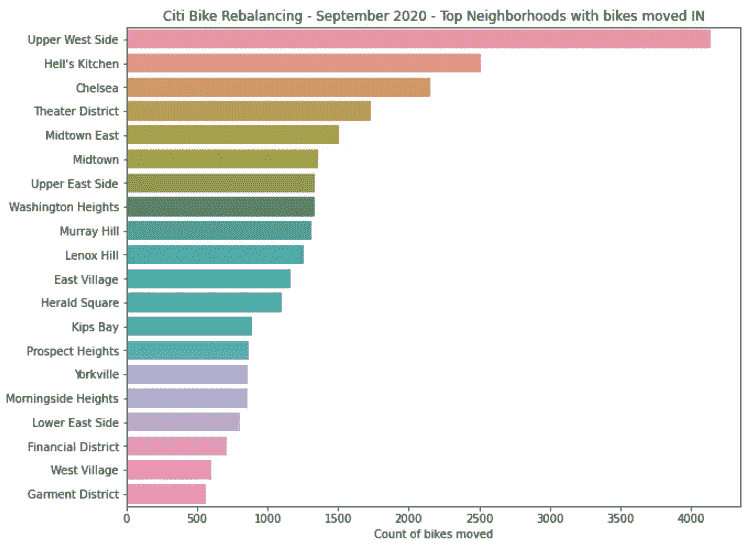

邻域计数-按作者分类的图像

图表显示，自行车更经常从市中心的车站移出，主要是商业区；而自行车被转移到住宅区和市中心区的车站。

# 按一天中的时间重新平衡

再平衡何时发生？花旗自行车无法提供这些信息，也无法从 tripdata 文件中确定。我知道在自行车被移动之前*自行车被丢弃的时间，以及在*自行车被移动之后*第一次被取走的时间，但是实际的移动可能发生在两者之间的任何时间，甚至相隔几天。因为这是我所有的数据，所以我将使用它。*

首先添加与记录时间相对应的*小时*栏。

```
dfrebal['starthour'],dfrebal['endhour'] = \
    dfrebal.starttime.dt.hour, dfrebal.stoptime.dt.hour
```

要创建一个显示每小时进出的自行车数量的条形图，我可以使用`countplot`但是没有每小时重新平衡，所以图表缺少了条形。相反，我可以先进行计数，当没有运动时，计数为零。

这让我可以看到一个宽格式的计数，每个站一行，一天中每个小时一列。

```
pd.set_option('display.max_columns', 24)
dfrebal.value_counts(subset=['start station id', 'starthour'])\
        .unstack().astype('Int64').fillna(0).head(10)
```

这里有很多东西需要解释，所以我将把它们分解开来:

*   `.value_counts(subset=['start station id', 'starthour'])`通过`start station id`和`starthour`统计行程次数。
*   `.unstack()`将`starthour`从行转到列。当一个小时没有乘坐时，填写`NaN`(不是一个数字)。
*   `.astype('Int64')`每当有`NaN`值时，Pandas 会将数据转换为`float64`，这不适用于*计数*。这将数据转换回整数格式`Int64`，缺失值表示为`<NA>`。
*   `.fillna(0)`用零替换缺失值或`<NA>`值。
*   `.head(10)`显示前十行。

该语句生成一个类似于这样的内容广泛的报告，由`start station id`和`starthour`组成。

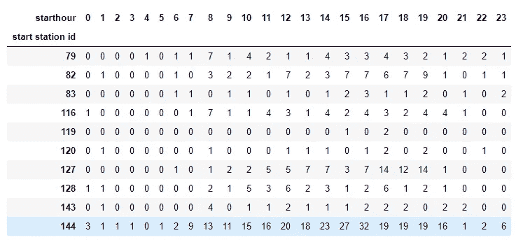

一小时内按站点显示的重新平衡计数的详细报告-按作者显示的图片

最后一步是使用`stack()`将数据转换回长格式，我将为进出车站的自行车做这件事。

将数据从一个系列转换为一个数据帧，并添加一个新列`Movement`来指示移动的方向(向内或向外),并将两个数据帧连接成一个数据帧，以便在一个图表中轻松显示两种类型的移动。

```
startcounts = \
    dfrebal.value_counts(subset=['start station id','starthour'])\
   .unstack().astype('Int64').fillna(0).stack()
startcounts=pd.DataFrame(startcounts).assign(Movement='Out')endcounts = \
    dfrebal.value)counts(subset=['end station id', 'endhour'])\
   .size().astype('Int64').unstack().fillna(0).stack()
endcounts=pd.DataFrame(endcounts).assign(Movement='In')rebalcounts=pd.concat([startcounts, endcounts])
rebalcounts.columns=['Bike Count','Movement']
```

为了创建多个站点的图表，我将生成图表的代码放入一个函数中。它需要两个数据帧`stationrebal`和`dfstations`，并以一个站名作为参数。

```
def stationrebal (stationname):
    plt.figure(figsize=(12,5))
    if stationname not in list(dfstations['station name']):
        raise RuntimeError("Station name not found.")
    plt.suptitle('Citi Bike Rebalanancing - ' +  stationname   )         
    ax=sns.barplot(data=rebalcounts.loc[station], \
                x=list(rebalcounts.loc[station].index),\
                y="Bike Count", hue="Movement" ,\
                palette=["darkred", "darkgreen"], edgecolor = 'w')  
    ax.set(xlabel="Hour of Day", ylabel = "Count of bikes moved") ;
```

这是为重新平衡而拆除自行车最多的车站的图表:

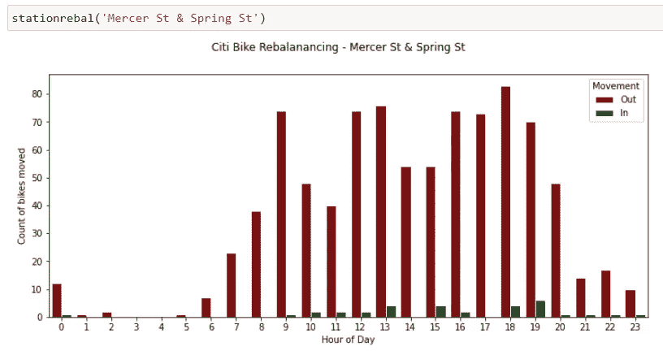

搬出去的自行车顶站——作者图片

这个车站位于苏荷区的中间，这里既是住宅区又是零售区。图表显示，自行车大多是从*这个车站*移出的，上午有一些，下午有很多。

这是增加自行车最多的车站:

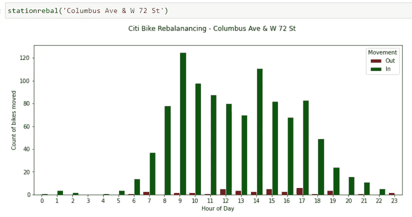

搬进来的自行车顶站—作者图片

在这个主要的居民区，图表显示自行车在早上被移入车站，下午较少。

# 结论

尽管 Citi Bike 不提供出于重新平衡和其他目的手动移动自行车的信息，但可以通过查看单辆自行车的移动以及它们在没有骑行的情况下位置发生变化的情况，从 tripdata 中获得这些信息。

这些信息总体上(按邻域)比单个站点更有意义。

通过查看自行车何时被带走，我们可以大致了解自行车何时在车站被重新平衡。