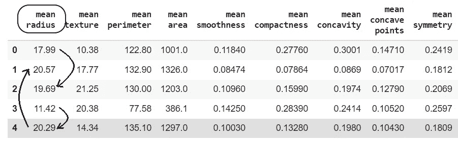
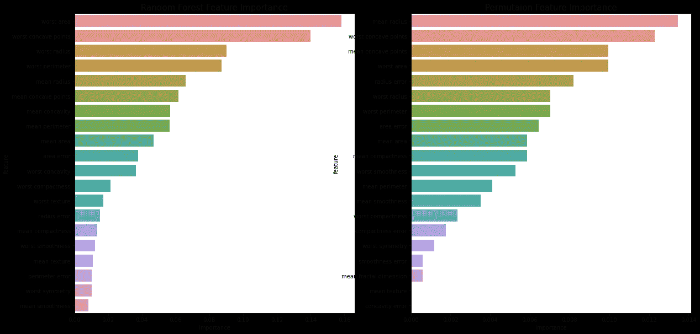

# 用排列特征重要性解释你的黑盒 ML 模型

> 原文：<https://towardsdatascience.com/interpret-your-black-box-ml-model-with-permutation-feature-importance-fc2b2a14ca7c?source=collection_archive---------11----------------------->

## 为训练过估计器计算全局特征重要性

图片由来自 [Pixabay](https://pixabay.com/?utm_source=link-attribution&amp;utm_medium=referral&amp;utm_campaign=image&amp;utm_content=3037639) 的 [Tayeb MEZAHDIA](https://pixabay.com/users/tayebmezahdia-4194100/?utm_source=link-attribution&amp;utm_medium=referral&amp;utm_campaign=image&amp;utm_content=3037639) 提供

建模是数据科学模型开发管道的重要组成部分。它使用机器学习算法来拟合训练处理过的数据，以便对看不见的点进行预测。一些模型(如 Logistics Regression 和 k-NN)很容易表示，但大多数数据科学模型都是臭名昭著的黑盒模型，因为很难理解和解释任何预测的见解和原因。

机器学习模型的解释是指解释做出任何预测的原因。模型解释使得风险承担者和业务领导更容易理解有助于做出任何预测的因素。一些机器学习模型更容易解释，但对于其他算法，有各种技术和开源包来解释。一些软件包包括:

*   [ELI5](https://eli5.readthedocs.io/en/latest/)
*   [石灰](https://github.com/marcotcr/lime)
*   [MLXTEND](http://rasbt.github.io/mlxtend/)
*   [SHAP](https://shap.readthedocs.io/en/latest/index.html)

所有这些软件包都涉及到各种算法来解释算法。一种流行的模型解释算法是基于排列的特征重要性。在本文中，我们将讨论如何使用排列特征重要性来解释该模型，以及它如何优于标准的 scikit-learn 特征重要性函数。

# 什么是排列特征重要性？

排列特征重要性是一种模型检查/解释技术，可用于解释任何拟合的黑盒机器学习模型。它为训练有素的估计器计算数据集的全局要素重要性，并帮助数据科学家了解高重要性要素和低重要性要素。

置换特征重要性算法通过任何特定特征的变化来测量模型性能的变化。有两种使用置换技术计算特征重要性的算法:

## 方法 1:特征移除和再训练:

1.  在训练数据集上拟合估计量并计算性能。
2.  从训练数据中移除一个特征并重新计算性能。
3.  测量步骤 1 和步骤 2 中模型性能的退化。
4.  添加步骤 2 中删除的特征。
5.  对所有特征重复步骤 2、3 和 4。

删除某个功能后出现的性能下降决定了该功能的重要性。这种技术是昂贵的，因为需要为具有 n 个特征的数据集训练 n 个估计量。

我们有另一种置换特征重要性可解释性技术，它对测试数据的特征值进行置换，并且只训练估计器。

## 方法 2:特征值重组:

1.  在训练数据集上拟合估计量并计算性能。
2.  使用步骤 1 中的拟合估计值来计算测试数据的性能。
3.  从测试数据集中随机抽取特定特征的特征值。
4.  使用步骤 1 中的拟合估计量来计算步骤 2 中的混洗测试数据集的性能。
5.  根据步骤 2 和步骤 4 的结果计算性能下降。
6.  恢复步骤 3 中执行的随机更改。
7.  对数据集中的要素重复步骤 2、3、4 和 5。

(图片由作者提供)，特征重排示例:平均半径

使用方法 2，通过测量测试数据的性能恶化来计算特征重要性。这种技术的成本相对较低，因为它只适合估计器一次，并对测试数据和混洗测试数据进行 n+1 次预测。我们看到性能大幅下降的特性可以被视为重要特性，而性能几乎没有变化的特性可以被视为不太重要的特性。

# 实施:

Scikit-learn 和 ELI5 库在一行 Python 代码中提供了置换特征重要性算法的实现。

> **数据集:**sci kit-learn 库开源的[乳腺癌数据集](https://scikit-learn.org/stable/modules/generated/sklearn.datasets.load_breast_cancer.html#sklearn.datasets.load_breast_cancer)将用于执行排列特征重要性的演示。

scikit-learn 包中的 [permutation_importance](https://scikit-learn.org/stable/modules/generated/sklearn.inspection.permutation_importance.html#sklearn.inspection.permutation_importance) 可用于实现该算法。

(作者代码)

置换特征重要性算法在第 8 行实现。`**n_repeats**`参数代表置换特征的次数。

# 结果:

现在让我们比较随机森林分类器的排列特征重要性和基于杂质的特征重要性。scikit-learn 中随机森林分类器的实现带有基于杂质的特征重要性，该特征重要性是根据从训练数据集导出的统计数据计算的。

(图片由作者提供)，基于杂质的技术和基于排列的技术之间的特征重要性图的比较

# 结论:

置换特征重要性是一种全局特征解释技术，可用于解释表格数据集中的任何拟合估计量。这项技术通过打乱测试数据的特征值来衡量性能的下降。这是一个非常方便的技术来解释任何黑盒估计器，并解释这个特性对于一个特定的模型是多么重要。

对于多共线数据集，排列特征重要性可能无法解释相关特征。阅读 [scikit-learn 文档](https://scikit-learn.org/stable/auto_examples/inspection/plot_permutation_importance_multicollinear.html)以了解在使用排列特征重要性解释模型时如何处理多重共线性的情况。

# 参考资料:

[1] Scikit-learn 文档:[https://sci kit-learn . org/stable/modules/permutation _ importance . html # outline-of-the-permutation-importance-algorithm](https://scikit-learn.org/stable/modules/permutation_importance.html#outline-of-the-permutation-importance-algorithm)

*喜欢这篇文章吗？成为* [*中等会员*](https://satyam-kumar.medium.com/membership) *继续无限制学习。如果你使用下面的链接，我会收到你的一小部分会员费，不需要你额外付费。*

<https://satyam-kumar.medium.com/membership>  

> 感谢您的阅读