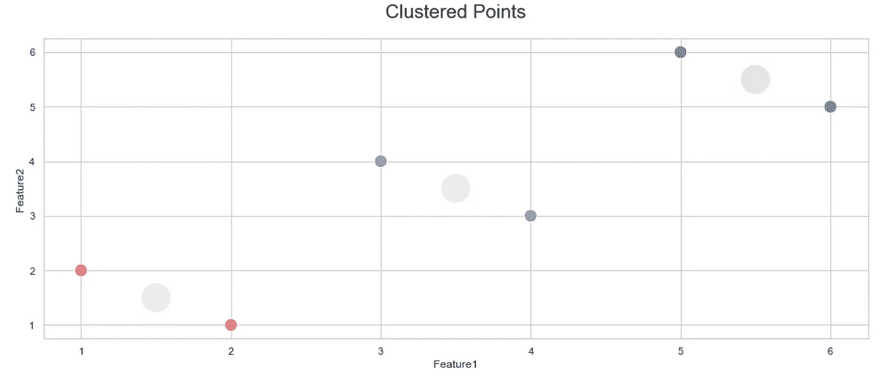

# 可解释的 K-Means:聚类特征重要性

> 原文：<https://towardsdatascience.com/interpretable-k-means-clusters-feature-importances-7e516eeb8d3c?source=collection_archive---------0----------------------->

## [模型可解释性](https://towardsdatascience.com/tagged/model-interpretability)

## 通过提取每个聚类最重要的特征来理解 K 均值聚类。


[图片由作者制作]聚类的特征重要性方法

M 机器学习模型要经过许多阶段才能被认为是生产就绪的。一个关键阶段是关键时刻，在这一时刻，模型获得了科学的许可；模型评估。许多评估指标被指定用于不同的目的和问题规范，但是没有一个是完美的。因此，当选择使用哪个评估指标最适合手头的问题并作为机器学习项目的功能决策诱导值时，数据科学家有一个巨大的负担。

然而，一些评估度量值可能看起来不直观，并且不能用外行的术语来解释，尤其是在评估使用内部索引的无监督聚类算法时(不存在诸如真实标签之类的外部信息)。虽然这些测量对比较基准有很大的好处，但是将它们与解释结合起来对于独立、直观的验证和与利益相关者更容易的结果交流是至关重要的。

# 直觉与内部验证指标

当涉及到内部验证指标时，数据科学家往往会在评估过程中失去一个焦点，这就是对模型性能及其解释的直观“人类”理解。举个反例来说明，监督分类评价指标如[准确率](https://en.wikipedia.org/wiki/Accuracy_and_precision)、[精度](https://en.wikipedia.org/wiki/Precision_and_recall)或[召回](https://en.wikipedia.org/wiki/Precision_and_recall)对外行和专家都有非常直观的解释。例如:

*   **准确性** : *“我们已经正确地对所有样本中的这个百分比的样本进行了分类。”*
*   **精度** : *“我们已经正确分类了所有预测阳性中的阳性百分比。”*
*   **回想一下** : *“我们已经正确分类了所有实际阳性中的阳性百分比。”*

另一方面，内部验证指标，如广泛使用的[轮廓系数](https://scikit-learn.org/stable/modules/clustering.html#silhouette-coefficient)、[卡林斯基-哈拉巴斯指数](https://scikit-learn.org/stable/modules/clustering.html#calinski-harabasz-index)、[戴维斯-波尔丁指数](https://scikit-learn.org/stable/modules/clustering.html#davies-bouldin-index)和许多其他指标，通常是比较使用，而不是固有的和独立的性能评估。这些测量值可以分解为每个聚类的紧密程度(聚类数据点彼此之间的相似程度)、聚类的分离程度(每个聚类的数据点与其他聚类的数据点之间的差异程度)，或者两者都有。但是，这些度量并不容易解释，也不容易与您正在解决的集群问题联系起来。

尽管这些方法非常有价值，但是当作为一名数据科学家试图了解您的模型有多好，或者试图将您的结果深入地传达给利益相关者(其中大多数内部验证指标都没有通过 ELI5(解释为 I 'm 5)测试)时，获得模型的解释以及内部评估指标是至关重要的。本文将关注最流行的无监督聚类算法之一；的 K-手段，并提出了两种可能的技术来提取最重要的特征，为每个集群。文章的提纲如下:

1.  [**K-表示商业价值**](#1db8)
2.  [**K-Means 如何工作**](#cae9)
3.  [**解读技巧**](#7e14)
4.  [**实战应用**](#bf5c)

如果您已经知道 K-Means 是如何工作的，请跳到 [**解释技术**](#7e14) 部分，或者想访问本文的知识库并直接使用代码，请访问[K Means-feature-importance](https://github.com/YousefGh/kmeans-feature-importance)。

# k-表示商业价值

假设你正在经营一家拥有成千上万客户的企业，你想更多地了解你的客户，尽管你有多少客户。举例来说，你不可能研究每一位顾客，并专门为他们制定营销活动。然而，您知道每个客户可能具有不同的人口统计(例如，年龄)、地理(例如，地区)、心理(例如，消费习惯)和行为(例如，参与度)属性。将他们分成多个相似的组将简化从每个组最普遍的属性来理解他们是谁。解决这个问题最流行的算法，我相信你也猜到了！是 K-Means；“K”将指可能的客户细分/群体/集群的数量，“手段”可以被认为是 K 个群体中每个群体的中心(与其群体成员最相似)的虚构人物。

# K-Means 如何工作

K-Means 是一种无监督聚类算法，它将相似的数据样本与不相似的数据样本分组到一个组中。准确地说，它的目标是最小化类内平方和(WCSS)，从而最大化类间平方和(BCSS)。K-Means 算法有不同的实现和概念变体，但是出于本文的考虑，我们将重点关注最常见的方法，即 Lloyd's 算法(Naive K-Means)，它遵循一种迭代方法来寻找次优解。在开始之前，我们将准备一个简单的数据集进行解释，并看看它是什么样子的。


“df”数据框架视图

我们需要使用 K-Means 将上述数据点聚类成 K 个组的步骤是:

## 步骤 1 **—选择组/簇的初始数量(K)**

质心代表每个聚类；分配给该聚类所有数据点的平均值。选择初始组数等同于选择初始质心数 k。我们可以决定`K = 3`并从数据集中随机选择 3 个不同的数据点作为初始质心(有更好的方法来选择每个质心的初始坐标)。


[图片由作者制作]第一簇的质心初始化

## 步骤 2-将数据点分配给聚类质心

我们必须将数据集中的每个数据点分配到最近的质心。我们将通过以下步骤使用最常见的距离度量作为“接近”的定义:

1.对于每个第`j`个聚类质心`C_j`，以及一个具有`d`维度的数据集的一个点`p`，使用下面的公式计算每个质心和所有数据点之间的欧几里德距离。*(我对* `*C_j = u_c_j (u = average) = Cluster Centroid*` *的使用只是一种简化，因为我将列出的方程都在单个聚类级别中)。*


2.为了最小化 WCSS，我们将每个数据点分配到其最近的质心(最相似/最小距离)。这将是 WCSS 最小化步骤的原因来自于一个聚类的 WCSS 的等式，其中`p_m` 个点被分配给聚类质心`C_j`，其中分配给聚类质心的点的距离越短，其 WCSS 越低。


[图片由作者制作]数据点分配给聚类的质心

## 步骤 3-更新聚类质心的位置

最后一步是更新聚类质心的位置，因为不同的数据点被分配给每个聚类。我们必须通过以下方式将每个质心移动到分配给它的所有数据点的平均值:

1.  计算每个聚类数据点的平均值
2.  将新的聚类质心设置为每个聚类的新平均值
3.  重复 [**步骤 2**](#6df7) 和 [**步骤 3**](#0c6e) 直到聚类质心(新的均值)不变

利用`sklearn.cluster.KMean`；我们将得出以下结论，例如，您可以采用`Sample 0`和`Sample 1`特征，计算它们的平均值，然后检查它是否等于`Cluster Centroid D1`和`Cluster Centroid D2`:


下图显示了 K-Means 如何对数据集进行聚类，其中每个质心位于分配给它的点的平均值处:



[图片由作者制作] K-Means 聚类应用于' df '数据框特征 1 和 2

# 解释技术

## 方法 1: WCSS 最小化

*免责声明:作者开发了这个方法。请不要犹豫引用任何参考文献，如果发现或批评的方法。*

这种方法是对每个质心的次优位置的直接分析。因为 K-Means 的目标是最小化组内平方和，并且假设所使用的距离度量是欧几里德距离:我们可以通过找到最大绝对质心维度移动来找到负责每个组的最高 WCSS 量(每个数据点到其组质心的距离的平方和)最小化的维度。

使用上面相同的解释示例，我们可以从`sklearn.cluster.KMean`拟合模型访问`cluster_centers_`；最终的簇形心位置。然后显示特征名称(尺寸`d`):

绘制群集及其位置将产生以下结果:


[图片由作者制作]K-表示'测向'数据帧聚类以及质心位置

现在，让我们取每个质心，并按维度轴对其进行排序，如果有负值的要素，请记住取绝对值。

之后，我们可以使用排序的权重(质心在特征平面上移动的距离)获得第一个质心的维度，并将其映射到特征名称，这将为我们提供以下假设的特征重要性:

因为质心在两个维度上移动了相等的距离，所以这些特征将具有同等的重要性。让我们在第一个维度上轻推最后两个样本(属于`cluster 0`)并重复相同的过程，然后绘制新的质心


[图片由作者制作] K-Means 聚类在第一维度(特征 1)上微移后用于聚类 0

我们现在将再次应用相同的方法并提取特征重要性。请注意，聚类 0 在要素 1 上的移动比要素 2 多得多，因此对 WCSS 最小化有更大的影响。

## 方法 2:从无监督到有监督

这种方法是模型不可知的；不排斥 K-Means，在 K-Means 中，我们使用易于解释的分类器(如基于树的模型)将无监督聚类问题转换为一对一监督分类问题。完成此操作的步骤如下:

1.  将每个群集标签更改为一对一对所有二进制标签
2.  训练分类器以区分每个分类和所有其他分类
3.  从模型中提取特征重要性(我们将使用`sklearn.ensemble.RandomForestClassifier`


[图片由作者制作]无监督聚类问题转化为一对所有监督分类问题的转换

在步骤 1 之后，让我们将`cluster 0`标签设置为`1`，并将所有其他集群标签设置为`0`:

我们已经把这个问题转化为一个二元分类问题。剩下的就是训练一个分类器，并使用其在`scikit-learn`中实现的`feature_importances_`方法来获得在所有聚类和目标聚类之间具有最大区分能力的特征。我们还需要将它们映射到按权重排序的特性名称。

一个重要的注意事项是，这种方法发现了两个集群之间的区别，并且根本不是目标集群所固有的。此外，还有许多其他复杂的方法可以从基于树的模型和模型不可知的方法中提取最重要的特征，您可以尝试一下。

# 现实生活应用

我选择将解释技术应用于 NLP 问题，因为我们可以很容易地将特征重要性(英语单词)联系起来，这可以被认为是一种基于组的关键字提取技术，其中我们的目标是使用 K-Means 将相似的文档聚集在一起，然后应用上述技术。我将使用的数据集可以在这里找到 [Kaggle BBC-News](https://www.kaggle.com/c/learn-ai-bbc/data?select=BBC+News+Train.csv) ，这提出了一个分类问题。我们将首先排除 category 列(体育、商业、政治、娱乐和技术新闻文章),稍后将其用作概念验证。

新闻类别在数据集中的分布如下:


[图片由作者制作] BBC News train.csv 数据集类别分布

由于本文不是特定于 NLP(自然语言处理)的，所以我不会深入讨论任何与 NLP 相关的任务。因此，快速转向预处理文本以准备特征。下面的代码对单词和过滤标记(单词和数字)进行规范化，这些单词和标记不具有区分能力，因此是多余的。然后计算整个数据集中提到最高的单词并绘制它们(*你可以跳过代码*):


[图片由作者制作 BBC 新闻数据集中提及率最高的词

使用 TF-IDF(文本表示技术)，我们可以将分类变量(单词)转换成数字表示。我们不需要在这里缩放特征，因为 TF-IDF 在它的等式内归一化特征，并且它的输出应该以它的原始形式使用。如果对具有不同单位或范围的要素的数据集应用 K 均值，并且这种差异与问题无关，请记住缩放要素。

最后，现在是我们最在意的一步；我将上面的方法包装在一个继承自`sklearn.cluster.KMean`的类中，除了添加了`feature_importances_` 属性之外，可以以同样的方式使用。在初始化时，您必须为修改后的类的`ordered_feature_names`参数提供与`fit`方法中的`X`参数排序相同的特性。

您可以在这里找到代码[k means-feature-importance](https://github.com/YousefGh/kmeans-feature-importance)并简单地在您最喜欢的 CLI 中克隆它，或者简单地通过访问存储库中的 Colab 示例来完成:

```
git clone [https://github.com/YousefGh/kmeans-feature-importance.git](https://github.com/YousefGh/kmeans-feature-importance.git)
```

然后使用`k` =新闻数据集类别的数量来运行修改后的 KMeans 类，以便我们稍后可以将结果与实际类别进行比较。

让我们检查 K-Means 是否产生了类似于新闻数据集中的类别分布的聚类分布。


[图片由作者制作]类别和 K 均值聚类分布

这是一个足够接近的类别分布相似性，让我们继续下去。不要忘记通过使用不同的内部验证索引来确保 K-Means 已经产生了准确的结果(我不会仔细检查它们，因为这超出了范围)，并且您可能没有真正的标签，所以如果 K 在问题领域知识中是未知的，您将需要选择 K-Means 中的最佳 K。

继续解释，我们可以像这样访问第二个集群`cluster 1`的`feature_importances_`(这个例子是针对 WCSS 最小化者的):

## 方法比较

我们将使用`KMeanInterp`类中的`feature_importance_method`参数比较 WCSS 最小化方法和无监督到有监督问题转换方法。流程如下所示:

*   用于与独特颜色进行比较的绘图类别分布
*   将`feature_importance_method`参数设置为`wcss_min`，并绘制特征重要度
*   将`feature_importance_method`参数设置为`unsup2sup`并绘制特征重要性
*   使用最重要的特征推断每个聚类的类别


[图片由作者制作] BBC News train.csv 数据集类别分布。下面将使用颜色进行比较

**WCSS 最小化器**


[图片由作者制作]对每个聚类使用 **WCSS 极小值法**的最重要特征，并直观地将每个聚类映射到实际数据集中可能的类别(每个图的右上角)


[图片由作者制作]最重要的特征使用 **WCSS 最小化器**方法对每个聚类进行分析，并直观地将每个聚类映射到实际数据集中可能的类别(右上角)

**无监督到有监督**


[图片由作者制作]对每个聚类使用**非监督到监督**方法的最重要特征，并直观地将每个聚类映射到实际数据集中可能的类别(每个图的右上角)


[图片由作者制作]对每个聚类使用**非监督到监督**方法的最重要特征，并直观地将每个聚类映射到实际数据集中可能的类别(右上角)

# 结论

当事实标签在开发阶段不可用时，聚类的可解释性变得至关重要。由于内部验证指标的性质，它不仅阻止了数据科学家对聚类有效性的直接评估，还妨碍了向利益相关者简单直观地解释聚类性能。我们提出了两种可能的方法，旨在通过提取基于聚类的特征重要性来解决这一问题，这使我们能够知道为什么 K-Means 算法选择了每个聚类。该方法将其自身扩展到利益相关者通信、简单直观的评估、NLP 中基于聚类的关键词提取以及通用特征选择技术。

*本文笔记本，* `*KMeansInterp*` *类，连同 Colab 上的直接用法示例，可在这里找到*[](https://github.com/YousefGh/kmeans-feature-importance)****。*** *快乐演绎！**

***参考文献:***

1.  *Y.刘，李，熊，高，吴，“内部聚类验证方法的理解”，2010 年 IEEE 数据挖掘国际会议，2010 年，第 911-916 页，doi: 10.1109/ICDM.2010.35。*
2.  *惠普克里格尔。运行时评估的(黑色)艺术:我们是在比较算法还是实现？。已知信息系统 52，341–378(2017 年)。[https://doi.org/10.1007/s10115-016-1004-2](https://doi.org/10.1007/s10115-016-1004-2)*
3.  *Ng，a .，，皮赫，C. (2021)。CS221。检索于 2021 年 7 月 18 日，来自 https://stanford.edu/~cpiech/cs221/handouts/kmeans.html*
4.  *伊斯梅利，乌迈马&勒梅尔，文森特&科尼埃·霍斯，安托万。(2014).测量变量对聚类贡献的监督方法。159–166.10.1007/978–3–319–12637–1_20.*
5.  *[2.3。聚类-sci kit-learn 0 . 24 . 2 文档](https://scikit-learn.org/stable/modules/clustering.html)，2021*