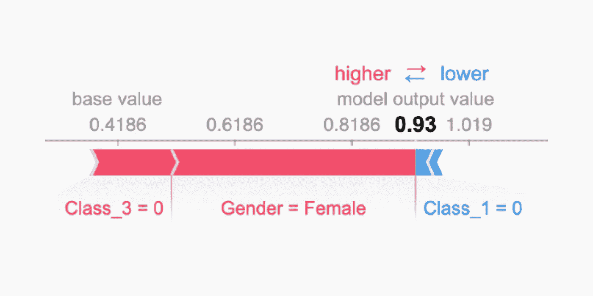
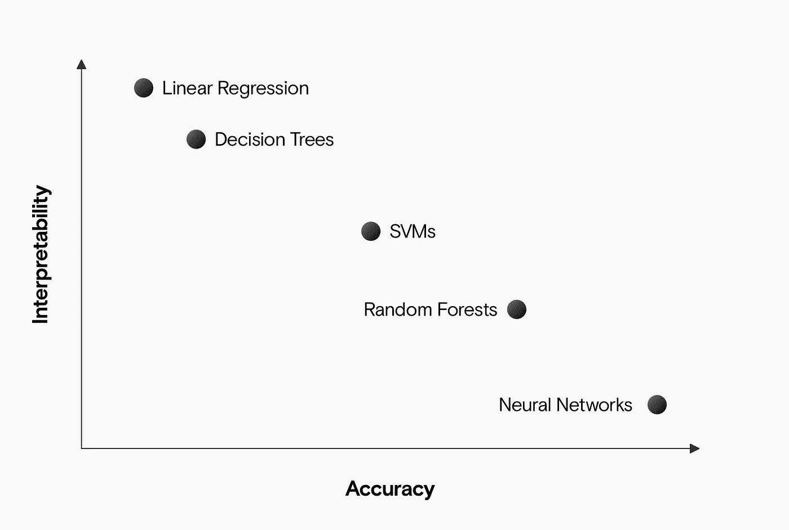
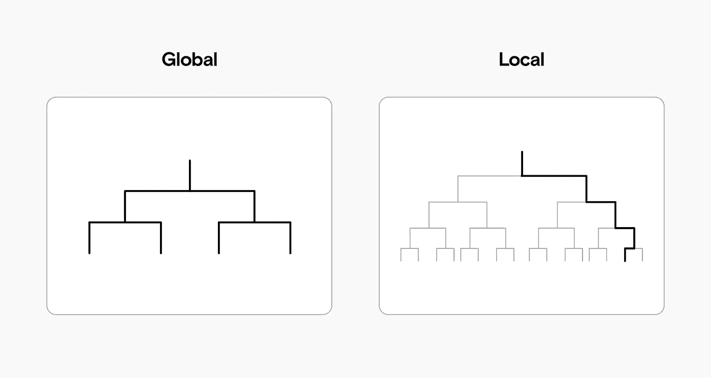
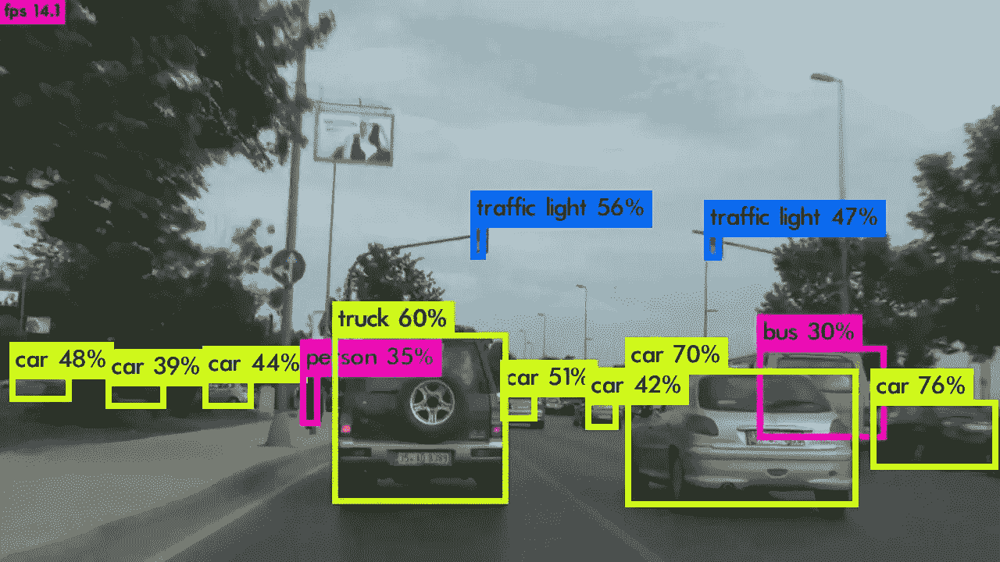
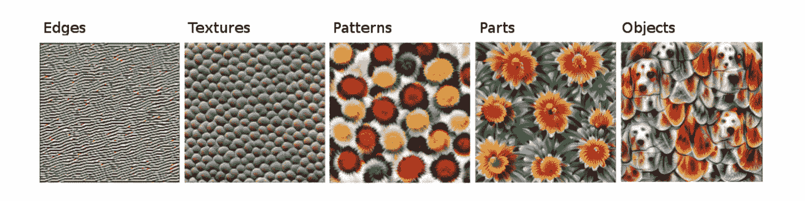

# 可解释的机器学习

> 原文：<https://towardsdatascience.com/interpretable-machine-learning-45b467dbe1af?source=collection_archive---------22----------------------->

## 为什么以及如何让你的机器学习模型具有可解释性

来源:作者

机器学习的批评者表示，它创造了“黑箱”模型:可以产生有价值的输出，但人类可能无法理解的系统。

那是一种误解。机器学习可以被解释，这意味着我们可以建立人类理解和信任的模型。精心构建的机器学习模型是可以验证和理解的。这就是为什么我们可以在医药和金融等高度监管的领域使用它们。

# 什么是可解释的模型？

当人类很容易理解机器学习模型做出的决策时，我们就有了“可解释的模型”。简而言之，我们想知道是什么**导致了**一个特定的决定。如果我们能知道一个模型是如何做出决定的，那么这个模型就是可解释的。

例如，我们可以训练一个随机森林机器学习模型来预测特定乘客是否在 1912 年泰坦尼克号沉没时幸存。该模型使用乘客的所有属性——如机票等级、性别和年龄——来预测他们是否幸存。

现在让我们假设我们的随机森林模型预测某个特定乘客有 93%的生存机会。是怎么得出这个结论的？

随机森林模型可以很容易地由成百上千的“树”组成。这使得几乎不可能理解他们的推理。

但是，我们可以借用博弈论的方法，让每个个体决策**都是可解释的**。

**SHAP** 图显示了模型如何使用每个乘客属性并达到 93%(或 0.93)的预测。在下图中，我们可以看到模型考虑的最重要的属性。

*   乘客不在三等舱:生存机会大大增加；
*   乘客是女性:生存机会**增加**更多；
*   乘客不在头等舱:生还几率略有下降。

性别和阶级是预测泰坦尼克号乘客生存几率的模型中最重要的特征。来源:作者

通过将这种解释与我们从历史中了解到的情况结合起来，我们可以看到该模型的表现符合预期:持有一等舱或二等舱船票的乘客优先登上救生艇，妇女和儿童先于男子弃船。

相比之下，许多其他机器学习模型目前还无法解释**。**随着机器学习越来越多地用于医学和法律，理解**为什么**一个模型会做出一个特定的决定是很重要的。

# 我们从可解释的机器学习中获得了什么？

可解释的模型帮助我们达到机器学习项目的许多共同目标:

*   **公平**:如果我们确保我们的预测是公正的，我们就防止了对代表不足的群体的歧视。
*   稳健性:我们需要确信模型在每种环境下都能工作，并且输入的小变化不会导致输出的大变化或意想不到的变化。
*   **隐私**:如果我们了解一个模特使用的信息，我们就可以阻止她访问敏感信息。
*   **因果关系**:我们需要知道模型只考虑因果关系，不挑选虚假的相关性；
*   信任:如果人们理解我们的模型是如何做出决定的，他们会更容易信任它。

# 有些算法比其他算法更容易理解吗？

像回归和决策树这样的简单算法通常比像神经网络这样的复杂模型更容易理解。话虽如此，许多因素会影响模型的可解释性，因此很难一概而论。

对于非常大的数据集，更复杂的算法往往证明更准确，所以在可解释性和准确性之间可能会有一个权衡。

更精确的模型通常更难解释。来源:作者

# 可解释性范围

通过查看**范围**，我们有了另一种方法来比较模型的可解释性。我们可以问一个模型是全局可解释的还是局部可解释的:

*   **全局可解释性**是理解完整的模型如何工作；
*   **本地可解释性**是理解一个决策是如何达成的。

如果一个模型足够小，足够简单，人类可以完全理解，那么它就是全局可解释的。如果一个人能够追溯一个单一的决策，并理解模型是如何得出那个决策的，那么这个模型就是局部可解释的。来源:作者

如果我们理解一个模型中的每一条规则，那么这个模型就是全局可解释的。例如，帮助银行决定住房贷款审批的简单模型可以考虑:

*   申请人的月薪，
*   存款的大小，以及
*   申请人的信用等级。

人类可以很容易地评估相同的数据并得出相同的结论，但是一个完全透明和全球可解释的模型可以节省时间。

相比之下，一个复杂得多的模型可以考虑成千上万的因素，比如申请人住在哪里，在哪里长大，他们家庭的债务历史，以及他们的日常购物习惯。如果模型做出了一个有问题的决定，也许可以找出为什么一个家庭贷款被拒绝。但是由于模型的复杂性，我们一般不会完全理解它是如何做出决定的。这是一个本地可解释的模型。

# 机器学习模型的可解释性与可解释性

全球 ML 社区交替使用“可解释性”和“可解释性”，并且对于如何定义这两个术语没有达成共识。

也就是说，我们可以认为可解释性比可解释性更容易理解。

如果我们能够从根本上理解一个机器学习模型是如何在特定决策中到达**的，那么它就是**可解释的**。**

如果我们能够理解复杂模型中的特定节点如何在技术上影响输出，那么模型就是**可解释的**。

如果一个模型的每个组成部分都是可以解释的，并且我们可以同时跟踪每个解释，那么这个模型就是可解释的。

想象一下自动驾驶汽车系统。我们也许能够解释一些构成其决策的因素。下图显示了物体检测系统如何识别具有不同置信区间的物体。

自动驾驶汽车识别不同的对象:查看这些有助于我们解释具体的决定。来源:作者

这个模型至少是部分可解释的，因为我们了解它的一些内部工作。但是可能仍然无法解释 **:** 只有这个解释，我们无法理解为什么汽车决定加速或停止。

# 模型不可知的解释

因此，我们知道一些机器学习算法比其他算法更容易解释。但是也有一些技术可以帮助我们解释一个系统，而不管它使用的是什么算法。

例如，前面我们看了一个 SHAP 图。这种技术适用于许多模型，通过考虑每个特征对决策的贡献大小来解释决策(局部解释)。

我们可以用类似的方式使用其他方法，例如:

*   部分相关图(PDP)，
*   累积局部效应(ALE)，以及
*   当地替代品(石灰)。

这些算法都有助于我们解释现有的机器学习模型，但学习使用它们需要一些时间。

# 更好的可解释性的“构建模块”

像**卷积神经网络**这样的模型是由不同的层组成的。当用于图像识别时，每一层通常学习特定的特征，较高层学习更复杂的特征。

我们可以将网络学习到的概念与人类概念进行比较:例如，较高层可能会根据较低层学习到的较简单的特征(如“线”)来学习更复杂的特征(如“鼻子”)。

我们可以将这些特征中的每一个可视化，以了解网络“看到”的是什么，尽管仍然很难将网络如何“理解”图像与人类的理解进行比较。

图像识别 CNN 建立了概念上的“构建模块”,因此我们可以更好地解释模型作为一个整体是如何工作的。来源:[奥拉赫等人](https://distill.pub/2018/building-blocks)

# 特征的层次结构

CNN 的不同层识别更简单或更复杂的特征，从简单的边缘检测到完整的对象。来源: [**Molnar:可解释机器学习**](https://christophm.github.io/interpretable-ml-book/)

我们可以画出一个由简单到复杂的大致层次。为了解释完整的对象，CNN 首先需要学习如何识别:

*   **棱角，**
*   **纹理，**
*   **图案，和**
*   **零件。**

每一层都使用其下一层的累积学习。所以(全连接)顶层使用所有学习到的概念进行最终分类。

我们可以看看网络如何以类似于人类的方式将组块构建成层级，但永远不会有完全的同类比较。寻找机器学习模型的构建模块来提高模型的可解释性仍然是一个开放的研究领域。

# 基于示例的解释

在上面的 SHAP 图中，我们通过查看其**特征**来检查我们的模型。通过比较特征重要性，我们看到该模型使用年龄和性别来对特定预测进行分类。

解释模型的另一种方式是查看数据集中的**特定实例**。这里的区别可以通过在我们的数据集中的特定的**行**(基于实例的解释)与特定的**列**(基于特征的解释)来简化。

我们应该查看具体的实例，因为查看特征并不能解释不可预测的行为或失败，尽管特征可以帮助我们理解模型关心的是什么。

# 反事实的解释

我们可以通过给模型**修改过的**或**反事实**输入来洞察模型是如何工作的。知道了模型对特定实例的预测，我们可以做一些小的改变，看看是什么影响了模型来改变它的预测。

在我们的泰坦尼克号的例子中，我们可以取模型预测会幸存的乘客的年龄，并慢慢地修改它，直到模型的预测改变。

通过“控制”模型的预测并理解如何改变输入以获得不同的输出，我们可以更好地解释模型作为一个整体是如何工作的，并更好地理解它的缺陷。

# 调试和审计可解释的模型

机器学习模型只有能够被解释，才能被调试和审计。如果一个模型预测错误，我们需要弄清楚这是如何发生的，为什么会发生，这样我们就可以修复这个系统。

想象一下，我们有一个模型，它看着动物的图片，并将它们归类为“狗”或“狼”看起来效果不错，但是后来把几只哈士奇误归类为狼。

如果我们可以解释这个模型，我们可能会知道这是由于**雪**造成的:这个模型已经知道狼的图片通常有雪作为背景。这在训练中很有效，但在现实世界中失败了，因为爱斯基摩犬也会出现在雪地环境中。

# 你的公司需要可解释的机器学习吗？

我们喜欢构建可以解释和验证的机器学习解决方案。[如果你想谈论可解释的机器学习，请联系我们](https://datarevenue.com/en-contact)。