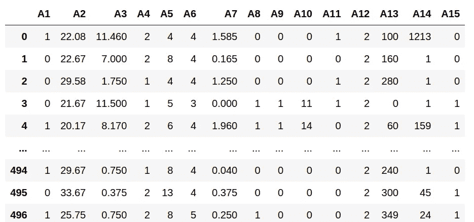

# 可解释的机器学习:优势和劣势

> 原文：<https://towardsdatascience.com/interpretable-machine-learning-advantages-and-disadvantages-901769f48c43?source=collection_archive---------14----------------------->

## 可解释的机器学习模型总是实用的吗？

来源:图片由 [geralt](https://pixabay.com/users/geralt-9301/) 从 [Pixabay](https://pixabay.com/illustrations/hand-magnifying-glass-earth-globe-1248053/) 拍摄

在数据世界中，人们越来越重视**可解释的机器学习**。

随着神经网络的使用变得越来越主流，以及今天正在分析的数据的庞大规模，模型变得越来越复杂。

在许多情况下，这种复杂的模型本身可能不适合人类解释。因此，一直在推动使模型可解释，从而使结果和实现这些结果的过程都被人类理解。

# 数据本身并不总是可以解释的

在我看来，可解释机器学习的一个缺点是，它在一定程度上假设输入模型的数据总是适合人类解释。不一定是这样的。

例如，假设一家公司正试图实现可解释的机器学习来设计一个信用评分模型，根据众多特征将潜在的信用卡申请分类为批准或拒绝。

出于隐私原因，这种数据通常是保密的。这方面的一个例子是在 [UCI 机器学习知识库](https://archive.ics.uci.edu/ml/datasets/statlog+(australian+credit+approval))中可用的澳大利亚信贷审批数据集。

查看该数据集时，我们只知道存在 6 个数字特征和 8 个分类特征，以及一个类属性(大概类似于信用卡申请是否成功)。

来源:Jupyter 笔记本输出

从机器学习的角度来看，几乎不可避免的是，该模型将以某种黑盒的方式运行，由此匿名特征将用于生成分类分数。

然而，特征是匿名的这一事实意味着，从人类解释的角度来看，使用可解释的模型来理解每个特征对分类的相对贡献是没有意义的。

在这种情况下，最终用户所关心的是确保分类精度尽可能高。如果由于缺乏信息而无法促进理解，那么模型如何得出这一结果就无关紧要了。

# 可解释性是一切吗？

Cassie Kozyrkov 关于可解释人工智能的文章使用了一个非常有用的类比来打破可解释性与性能之间的权衡:人脑。

当我们在日常生活中做决定时，我们不知道导致我们做出这些决定的大脑中发生的确切过程。相反，我们只是简单地相信我们的大脑在正常工作，继续我们的工作！

让我们再次以信用评分为例。虽然我们可能无法解释**为什么**一个特定的模型以某种方式运行——在看不见的数据中重复测试并获得高分类性能意味着我们可以相信模型正在按照它应该的方式运行。

然而，正如可解释性不是全部，准确性也不是全部。

如果我们想要直接**影响**结果变量呢？在这种情况下，可解释性变得更加重要——因为如果不首先理解结果的驱动因素，就不可能影响结果。

去年，我在微软的 InterpretML 库上发布了一篇[文章](/dice-diverse-counterfactual-explanations-for-hotel-cancellations-762c311b2c64)——特别是在生成各种反事实解释中骰子的使用。

DiCE 演示了如何分析[酒店取消数据](https://www.sciencedirect.com/science/article/pii/S2352340918315191)，以确定哪类客户更有可能取消酒店预订。这个模型的优点是可以详细分析反事实的解释。例如，假设某个特定细分市场和分销渠道的客户没有取消预订，如果结果变量是取消(即反事实)，这些属性会如何变化？

在这种情况下，酒店经理可以更详细地分析反事实的例子，越来越多地瞄准不太可能取消预订的客户类型。

在这种情况下，特征和结果一样重要。对于信用评分的例子，不一定是这种情况。

# 结论

最终，我对可解释机器学习的解释(请原谅双关语)是，在实现这些模型时，需要考虑总体目标。

如果目标只是最大限度地提高模型的准确性，那么可解释性就受限于如何使用它来实现这一目标。一个显示出高精度(当然不是过度拟合)的模型可能在人类没有完全理解为什么会这样的情况下产生这样的精度。

然而，从商业的角度来看，在某些情况下，理解特性如何影响结果变量是非常重要的。在这种情况下，可解释性无疑是一个有价值的工具。

非常感谢您的阅读，您可以在[michael-grogan.com](https://www.michael-grogan.com/)找到更多我的数据科学内容。

*免责声明:本文是在“原样”的基础上编写的，没有担保。它旨在提供数据科学概念的概述，不应被解释为专业建议。*