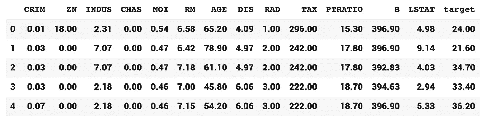
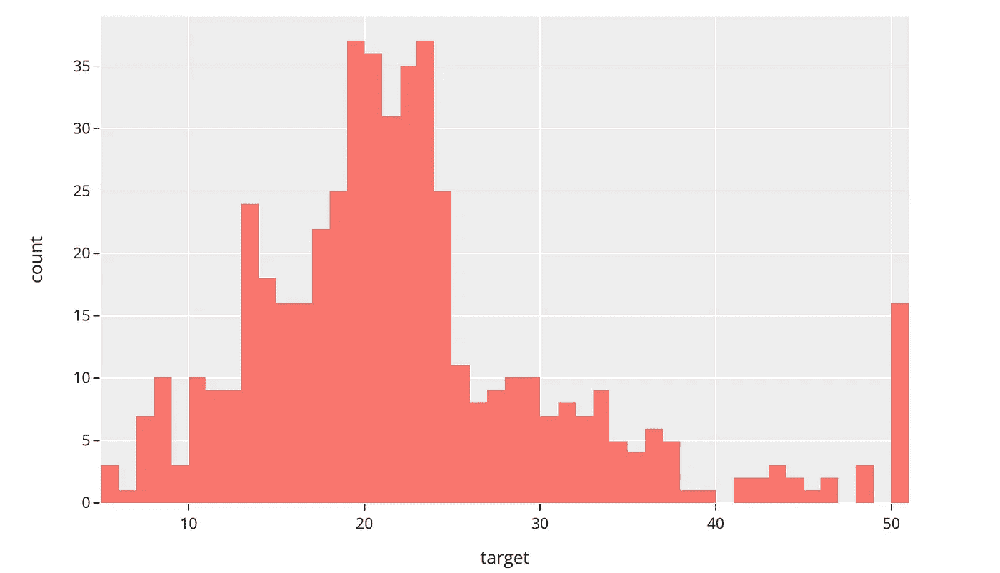
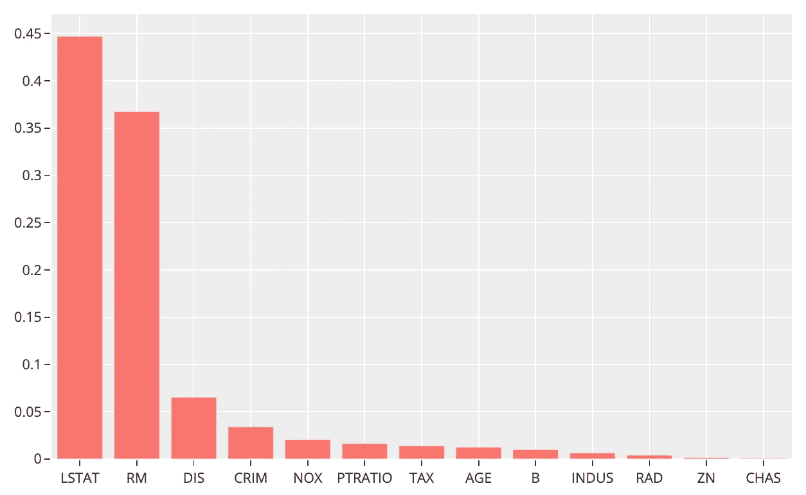
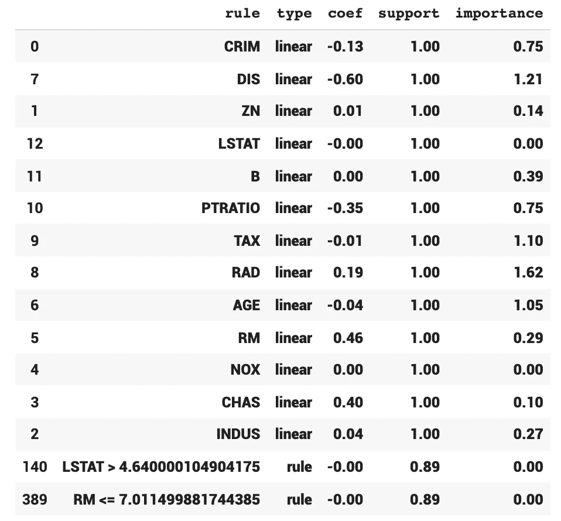
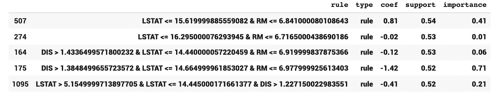

# 使用 RuleFit 和 Scikit Learn 在 10 分钟内完成可解释的机器学习

> 原文：<https://towardsdatascience.com/interpretable-machine-learning-in-10-minutes-with-rulefit-and-scikit-learn-da9ebb925795?source=collection_archive---------17----------------------->

## 第一部 | [第二部](/symbolic-vs-subsymbolic-ai-paradigms-for-ai-explainability-6e3982c6948a) | [第三部](/black-box-and-white-box-models-towards-explainable-ai-172d45bfc512) |可解释的人工智能——第四部

## 使用 RuleFit|可解释的人工智能从经过训练的机器学习模型中提取有意义的规则组合


图一。照片由[国家癌症研究所](https://unsplash.com/@nci?utm_source=medium&utm_medium=referral)在 [Unsplash](https://unsplash.com?utm_source=medium&utm_medium=referral) 上拍摄

当然，你一直在训练机器学习模型，并旨在通过数据预处理、相关性分析和特征提取工作来最大限度地提高你的准确性，至少如果你没有专门使用神经网络的话。但是，模型性能不仅仅是准确性或低 RMSE 分数。

随着人工智能的广泛采用，特别是在敏感领域，人工智能系统的一个期望属性是可解释性。虽然一些机器学习模型本质上是透明的，但其中一些是需要额外步骤来解释的黑盒。

虽然神经网络或集成方法通常被视为黑盒模型，但更传统的算法，如线性回归、决策树或贝叶斯分类器，通常被视为透明端。

> 让我们快速比较一下透明模型和黑盒模型:

# 透明模型和黑盒模型的快速比较

## 越简单通常意味着性能越差

透明最大似然算法通常产生更简单的模型，它们往往表现更差，而神经网络通常优于所有其他最大似然算法。

## 不太稳定的透明模型

一些透明模型相对不太稳定。例如，决策树被认为是不稳定的，因为用稍有不同的子样本训练树会导致树的结构发生剧烈变化。这导致了集合方法的发展。

## 简单通常意味着潜在的假设

一些机器学习算法依赖于强大的假设，这些假设可能与现实生活中的事实不符。例如，线性回归总是假设响应变量和解释变量之间的基本关系是线性的。一旦我们对多项式基础关系使用线性回归，该模型将无法收敛于真实关系。

## 简单通常意味着没有交互作用

因为传统的 ML 算法更简单；它们需要先进的特征提取，研究人员需要采用方法来揭示相互作用的影响。例如，线性回归不能自动提取特征或检测交互影响，这可能导致模型性能差和显著性值不正确。

有一个模型可以解决上面提到的大部分问题:RuleFit。

> 让我们看看什么是 RuleFit 算法:

# 规则匹配算法

[由 Friedman 和 Popescu 在 2008 年开发的 RuleFit 算法学习稀疏线性模型，该模型以决策规则的形式包含自动检测的交互影响](https://christophm.github.io/interpretable-ml-book/rulefit.html)。RuleFit 模型以决策规则的形式创建新功能，并使用这些功能构建透明模型。

> 示例:如果房间数> 2，房屋年龄< 15 THEN 1 ELSE 0 (lower than medium)

Here is how the RuleFit algorithm works:

**第一步:**算法训练一个基于树的模型来预测目标，并使用它来创建这些决策规则(结果:许多规则，并非都是信息性的)；

**第二步:**然后它训练一个稀疏线性模型，比如套索，从原始和新创建的特征中选择最好的。

> 让我们来看看运行中的 RuleFit 算法:

# 波士顿房价数据集

波士顿房价数据集是一个相对较小的数据集，有 506 个样本和 13 个解释变量。响应变量自然是房屋的价格，目标是开发一个具有重要变量的模型，该模型可以使用给定的解释变量预测房屋。数据库中的每条记录都描述了波士顿的一个郊区或城镇。这些数据是在 70 年代从波斯顿标准大都市统计区(SMSA)创建的。[属性定义如下](https://www.kaggle.com/vikrishnan/boston-house-prices):

*   各城镇的人均犯罪率
*   **ZN** :面积超过 25，000 平方英尺的住宅用地比例。制成
*   **INDUS** :各镇非零售营业亩数比例
*   **CHAS** :查尔斯河虚拟变量(= 1，如果区域边界为河流；否则为 0)
*   **NOX** :氮氧化物浓度(百万分之一)
*   **RM** :每个住宅的平均房间数
*   **年龄**:1940 年前建造的自住单位比例
*   **DIS** :到五个波士顿就业中心的加权距离
*   **RAD** :放射状公路可达性指标
*   **税**:每万美元的全价值财产税
*   比例:各城镇的师生比例
*   **B**:1000(Bk 0.63)2 其中 Bk 是城镇中黑人的比例
*   LSTAT : %较低的人口地位
*   MEDV:以千美元计的自有住房中值

> 让我们加载数据集:

## 加载数据集

我们可以使用 scikit-learn 轻松加载波士顿房价数据集。以下代码下载数据集并创建一个 pandas DataFrame 对象:

要点 1。加载数据集

这是数据帧的头部()。



还有，我们用 Plotly Express 看看房价:

要点 2。绘制目标分布图

这是房价分布的直方图:



图二。波士顿房价值的直方图

> 现在我们已经准备好了数据，我们可以构建和训练一个模型:

## 训练随机森林回归器

在应用 RuleFit 模型之前，我们需要训练一个基于树的模型，如决策树、随机森林或梯度推进树模型。对于本教程，我将使用 RandomForestRegressor:

要点三。训练随机森林回归器

下面是我们简单随机森林模型的总结:

```
RandomForestRegressor(bootstrap=True, ccp_alpha=0.0,   criterion='mse', max_depth=None, max_features='auto', max_leaf_nodes=None, max_samples=None, min_impurity_decrease=0.0,                       min_impurity_split=None, min_samples_leaf=1,                       min_samples_split=2, min_weight_fraction_leaf=0.0,                       n_estimators=50, n_jobs=-1, oob_score=False,                       random_state=42, verbose=0, warm_start=False)
```

## 评估随机森林

训练模型将持续几秒钟，以下是我们的 RMSE 计算线:

要点 4。评估经过训练的随机森林回归器

输出是:

```
1.2328287822419268
```

请注意，我们从未将数据集分为训练和测试。这样选择的原因是为了简化教程，因为我们现在不担心过度拟合。

## 特征重要性

既然我们已经有了一个训练好的模型，我们就可以通过使用随机森林模型的`feature_importances_()`函数对解释变量(即特征)进行排序和可视化，并绘图表示:

要点 5。列出并画出重要特征

下面是输出图:



图 3。基于重要程度列出特性的条形图

正如您可以轻松识别的，LSTAT 和 RM 是目前为止影响目标(即房价)的最重要的特征。现在我们已经有了一个训练好的模型，让我们创建我们的自定义规则来获得更多的可解释性和可解释性。

## 创建和培训规则匹配模型

我们需要先安装`rulefit`库。然后，我们需要将 RandomForestRegressor 输入到 RuleFit 模型中。不管上面的代码是什么，你都可以选择梯度推进或者决策树。以下代码安装并导入`rulefit`，使用 RandomForestRegressor 创建一个 RuleFit 模型，并使用数据集训练该模型:

要点 6。安装、导入、创建和训练规则拟合模型

以下是该模型的总结:

```
**RuleFit(Cs=None, cv=3, exp_rand_tree_size=True, lin_standardise=True, lin_trim_quantile=0.025, max_rules=2000, memory_par=0.01, model_type='rl', random_state=None, rfmode='regress', sample_fract='default', tree_generator=***RandomForestRegressor(bootstrap=True, ccp_alpha=0.0, criterion='mse', max_depth=None, max_features='auto', max_leaf_nodes=6, max_samples=None, min_impurity_decrease=0.0, min_impurity_split=None, min_samples_leaf=1, min_samples_split=2, min_weight_fraction_leaf=0.0, n_estimators=563, n_jobs=None, oob_score=False, random_state=562, verbose=0, warm_start=False)***, tree_size=4)**
```

请注意，由于 RuleFit 模型正在生成数百个规则组合并对其进行测试，因此本培训将花费稍长的时间(仍不到一分钟)。

现在，我们可以用下面的代码评估我们的模型:

要点 7。评估已训练的规则拟合模型

输出:

```
1.6828402423155089
```

到目前为止，我们的 RandomForestRegressor 和 RuleFit 模型使用非常相似的代码工作。但是，在后台，我们的 RuleFit 模型生成了数百个潜在的规则组合。

> 让我们来看看这些规则:

## RuleFit 规则

为了得到规则，我们可以使用。规则适配模型的 get_rules()函数。然后，我们可以使用下面的代码根据它们的支持值对它们进行排序:

要点 8。获取 RuleFit 模型创建的规则

以下是输出:



图 4。未过滤规则和功能数据框架的前 15 行

让我们看看我们的列名并描述它们:

*   **规则**:特征名称或规则公式
*   **类型**:现有特征线性，组合规则
*   **coef** :规则和特征的系数
*   **支持**:规则/特性应用数据集的多大比例
*   **重要性**:帮助识别对预测重要的线性项和规则。特征重要性是根据回归模型的权重计算的。

为了有更好的输出，我们应该

*   消除现有特征；
*   删除系数为 0.00 的规则，因为它们不重要；
*   根据它们的支持值对它们进行排序；和
*   消除最简单的规则以查看更复杂的规则(可选)。

以下是完成所有这些任务的代码行:

要点 9。过滤掉不太重要的规则和所有特征

下面是显示一些规则的输出:



图 5。过滤规则数据框架的前 5 行

正如我们所确定的，LSTAT 和 RM 是最重要的特征。因此，毫不奇怪，最重要的规则组合也大多包含这些特性。上面的第一个规则是一个虚拟变量。`IF LSTAT ≤ 15.62 and RM ≤ 6.84, THEN 1 ELSE 0`。如你所见，第二条规则与第一条非常相似。因此，合并/删除一些相似的规则以得到一组更易解释的规则可能是有意义的。因此，在理想情况下，我们需要应用一些 NLP 方法来对相似的规则进行分组，并创建一个更精简的模型，该模型将覆盖所有的交互作用，这将最终帮助我们理解我们训练的模型的工作机制。

# 最终注释

RuleFit 算法是理解特征之间关系的一个很好的解决方案。RuleFit 算法基于树模型和 LASSO 回归器的组合，它可以生成数百个候选规则，这些规则可以帮助我们更好地解释我们的预测。然而，它需要额外的过滤和组合来获得有意义的结果。

# 订阅邮件列表获取更多内容

除了我的最新内容，我还与我的订户分享我的 Google Colab 笔记本，其中包含我发表的每篇文章的完整代码。如果你想获得我在 Google Colab 上的其他教程文章的代码，并尽早获得我的最新内容，可以考虑订阅:✉️的邮件列表

> [*现在就订阅*](https://medium.us4.list-manage.com/subscribe?u=bf0e9524ea3d765ba10131675&id=52221072de)

如果你对深度学习感兴趣，也可以看看我的人工智能内容指南:

<https://blog.orhangaziyalcin.com/a-guide-to-my-content-on-artificial-intelligence-c70c9b4a3b17>  

如果你正在阅读这篇文章，我确信我们有着相似的兴趣，并且正在/将要从事相似的行业。那么我们就通过[*Linkedin*](https://linkedin.com/in/orhangaziyalcin/)*来连线吧！请不要犹豫发送联系请求！*[*Orhan g . Yal n—Linkedin*](https://linkedin.com/in/orhangaziyalcin/)