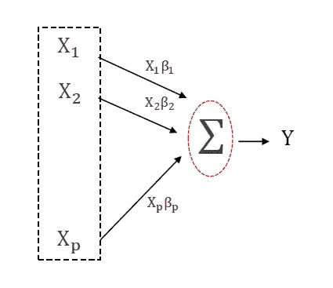
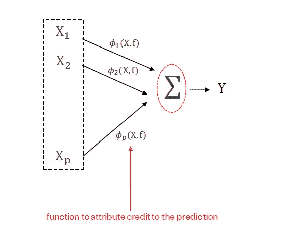
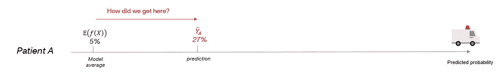
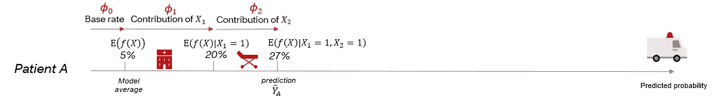
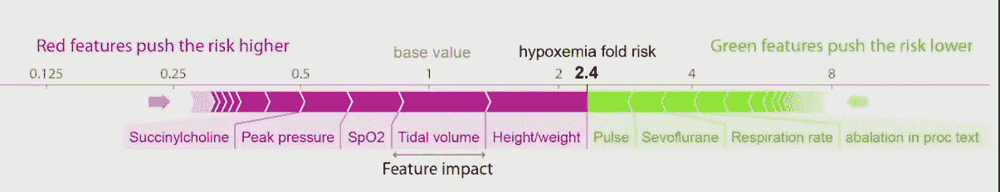
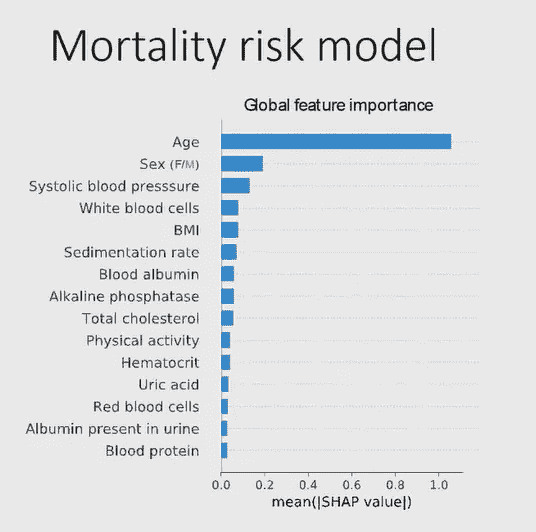
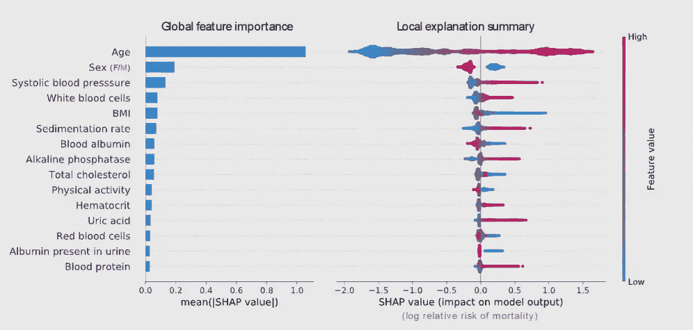
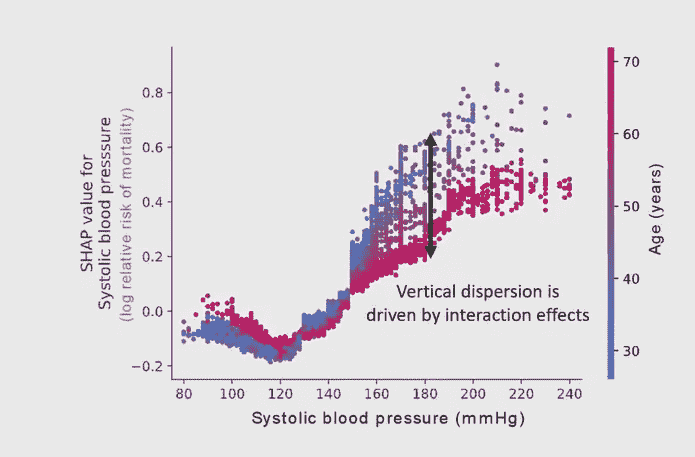

# 使用 SHAP 的可解释机器学习——理论和应用

> 原文：<https://towardsdatascience.com/interpretable-machine-learning-using-shap-theory-and-applications-26c12f7a7f1a?source=collection_archive---------7----------------------->

## SHAP 是一种越来越流行的用于可解释机器学习的方法。本文对 Shapley 附加值理论进行了分解，并用几个实例进行了说明。

Johannes Plenio 在 [Unsplash](https://unsplash.com?utm_source=medium&utm_medium=referral) 上拍摄的照片

# 介绍

XGBoost 等复杂的机器学习算法在预测问题上变得越来越流行。传统上，在解释和准确性之间有一个平衡，简单的模型，如线性回归，有时出于透明性和可解释性的原因是首选的。

但是 SHAP(或 Shapley Additive Values)是改变这一趋势的许多方法之一，我们正在逐步走向复杂、准确和可解释的**模型。**

这篇文章主要基于 Scott Lundberg 的演讲，我在下面的参考资料中提到了他的演讲。我将把重点放在 SHAP 的理论上，然后转移到一些应用上。因为代码和教程非常丰富，所以我将在源代码一节中链接一些。

# **(一)导致 SHAP 的理论**

> SHAP 的方法是**解释机器学习模型的小部分复杂性。所以我们从解释单个预测开始，一次一个。**

记住这一点很重要:我们正在解释每个特征**对单个预测值**的贡献。在线性回归中，我们通过构造(X*Beta)知道每个特征 X 的贡献，这些贡献的总和解释了结果 Y，导致对模型的直观解释(见图 1)。

图 1:线性模型中的贡献，其中 X 变量预测结果 Y，图片作者

SHAP 的想法是找到一个函数 Phi 来将功劳归于预测，就像线性模型中一样:

图 2:机器学习模型中的贡献，其中 X 变量预测结果 Y，作者图片

那么，我们如何获得钓鱼网站呢？(注意图 2 中 Phi 与数据 X 和机器学习模型 f 的相关性)

为了便于说明，让我们假设我们正在使用 XGBoost 算法，根据两个变量 X1 和 X2 来预测 Y，即未来住院的概率:

**X1** :患者去年住院
**X2** :患者去年去过急诊室

从这个算法中，我们得到的平均预测概率(未来住院)为 5%。

对于 SHAP，我们试图解释一个单独的预测。所以让我们以病人 A 为例，试着解释他们住院的概率。让我们想象一下，根据我们的机器学习模型，这个概率是 27%。我们可以问自己:**我们是如何偏离平均模型预测(5%)而得到患者 A 的预测(27%)的？**

图 3:患者 A 入院的预测概率，作者提供的图片

获得患者 A 的 Phi(对预测概率的贡献)的一种方法是根据观察到的特征值查看 f(X)的期望值。我们知道病人 A 在过去的一年里既住院又急诊，所以 X1 和 X2 都等于 1。

我们首先计算:

然后:

图 4:根据特征贡献分解的患者 A**入院的预测概率，作者提供的图像**

在这个例子中，我们从图 4 中看到，Phi1(变量 X1 的贡献)是:
20% -5% =15%

而φ2(变量 X2 的贡献)为:
27% -20% =7%

但是我们不能就此止步。事实证明，获得 Phi 并不那么简单，因为**排序关系到**计算它们(我们从哪个变量开始？).这是因为在存在相互作用的情况下，相互作用对最终预测的贡献会到达顺序中的最后一个变量。

例如，如果我们的变量 X1 和 X2 之间存在相互作用，使得如果它们都等于 1，则最终预测概率更高，当我们计算第二项时，相互作用的贡献将被第二有序变量 X2 吸收(或者简单地说，添加到第二有序变量的贡献中):

让我们通过颠倒条件作用的顺序来想象这一点。所以这一次，我们开始以 X2 而不是 X1 为条件。

图 5:患者 A 住院的预测概率，**按特征贡献**，作者提供的图像

现在我们从图 5 中看到 Phi1(变量 X1 的贡献)是:
27% -10% =17%(之前我们发现这是 15%)

而 Phi2(变量 X2 的贡献)是:
10% -5% =5%(前面我们发现这是 7%)

因此，通过顺序处理这个问题，我们看到，由于潜在的相互作用，我们会得到不稳定的 Phi 值，这取决于我们开始处理的变量。因此，问题变成了:**有没有一种好的方法在一组输入中分配贡献，而不必考虑顺序？**

> **解决方案来自博弈论，特别是沙普利勋爵在 20 世纪 50 年代提出的沙普利价值观。**

在这种背景下，玩家(特征)一起玩一个游戏(一个观察)来赢得一个奖励(一个预测)。一些玩家在赢得游戏中比其他人贡献更多，但是玩家彼此互动(交互)来赢得游戏。那么，我们如何公平地分配奖金呢？

Shapley 建立了一些假设，定义了公平的属性，导致了奖金分配的唯一解决方案:“Shapley 值”。理论上，Shapley 值很容易计算，因为它们是所有可能的排序 N！(当 N 是特征的数量时)。但是在实践中**这种方法计算量很大**，因此作者找到了更快的方法来计算一类函数的 Shapley 值(例如树)。

在我们继续看一些插图之前，让我们注意一个主要的警告:

> 如果特征不是独立的，Phi 就不会完全准确

**模型的一个主要假设是独立性，**这有助于条件预期的计算。让我们看看怎么做。
我们以ε(f(X)| X1 = 1)为例，其计算公式如下:

(a)将感兴趣的特征固定到其值(在我们的示例中，X1=1)
(b)从其他特征随机采样值(在我们的示例中，从变量 X2 随机采样值)
(c)将从(a)和(b)生成的合成观测值(X1，X2)馈送到模型 f(X)中以获得预测
(d)取预测的平均值

这些步骤在理论上将近似ε(f(X)| X1 = 1，但是如果特征之间存在高度相关性，则显然步骤(b)会中断:通过在(a)中固定 X1，并且在(b)中随机采样 X2，我们中断了 X1 和 X2 之间的相关性。

现在我们已经讨论了一些理论，让我们看看我们能在实践中用 SHAP 做些什么！

# **(二)SHAP 实践中的几个例证**

## **(a) SHAP 为每个单独的观察给出特征贡献**

我们讨论了 SHAP 是如何主要关注于估计个人贡献的。一个 ***力 plo* t** 总结了每个特征如何对一个单独的预测做出贡献。

在下面的例子中，研究人员正在使用一个黑盒模型来预测手术室中低氧血症(低氧血症)的风险。红色要素显示对预测赔率有正面(增加)影响，而绿色要素显示对预测赔率有负面(减少)影响。

图 6:力图示例，来源:Scott Lundberg 的演示，如下所示

图 6 显示了特定患者的力图(记住，我们一次解释一个观察结果！).我们可以看到，他们的低潮气量(进出肺部的空气量)导致了低氧血症风险的增加(约 0.5)。

> 这些关系不一定是因果关系。特征影响可能是由于相关性。

## (b) SHAP 给出了全局解释和特征重要性

(a)中描述的局部解释可以放在一起得到一个 ***全局解释*** 。由于 SHAP 的公理化假设，全球 SHAP 解释可能比基尼指数等其他指标更可靠。

> SHAP 可以提供更好的特征选择能力

在下面的例子中，研究人员基于一组基线变量预测死亡率风险。图 7 显示了全局特征的重要性。一个简单的例子是，年龄是死亡最具预测性的变量。

图 7:特性重要性的例子，来源:下面列出的 Scott Lundberg 的演示

具有全球特征重要性的问题是**流行与量级**混合。这意味着:

> **罕见的高幅值效应不会出现在特征重要性图**中。

让我们用斯科特·伦德伯格的例子来说明。图 7 中的“血液蛋白”是全球最不重要的特征。但是，当我们查看本地解释摘要(下图 8，右图)时，我们发现高血液蛋白水平对某些人来说是非常具有预测性的。

因此，尽管这一变量在预测平均死亡风险方面似乎不如年龄重要，但对少数人来说，它与死亡风险高度相关:因此 **SHAP 值揭示了人口的异质性**。

图 8:本地解释摘要示例，来源:下面列出的 Scott Lundberg 的演示

## (c) SHAP 揭示了异质性和相互作用

我们可以用 SHAP 值来进一步理解异质性的来源。一种方法是使用 SHAP ***部分依赖图*** (图 9)。部分相关图显示特定特征的 SHAP 值，并根据另一个特征对观察值进行着色。在本例中，SHAP 值是相对于收缩压绘制的，观察值根据其年龄进行着色。

让我们再来看一下局部解释摘要图(图 8，右图)。我们可以看到，较高的收缩压与较高的死亡风险相关。从下面图 9 中的部分相关性图，我们可以进一步说:高收缩压与更高的死亡风险相关，**特别是如果它在年轻时开始。**

图 9:SHAP 部分相关图的例子，来源:下面列出的 Scott Lundberg 的演示

总结这篇文章，注意除了前面提到的， **SHAP 值有更多的应用**。值得一提的是它们在部署后监控机器学习模型的有用性。例如，SHAP 值可以揭示由于源数据中的异常，一些变量突然导致机器学习模型中的更多损失。为了获得更多的见解，我鼓励任何人观看 Scott Lundberg 的演讲，链接如下。

# 未来的研究

根据作者的说法，未来的研究领域包括相关特征存在时的可解释性，以及将因果假设纳入 Shapley 解释。

【来源:】
(1)[https://youtu.be/B-c8tIgchu0](https://youtu.be/B-c8tIgchu0)
(2)[https://shap.readthedocs.io/en/latest/index.html](https://shap.readthedocs.io/en/latest/index.html)
(3)[https://christophm . github . io/interpretable-ml-book/shap . html](https://christophm.github.io/interpretable-ml-book/shap.html)
(4)[https://towardsdatascience . com/interpretable-machine-learning-with-xgboost-9ec 80d 148 d27](/interpretable-machine-learning-with-xgboost-9ec80d148d27)