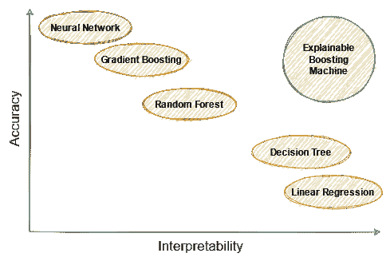
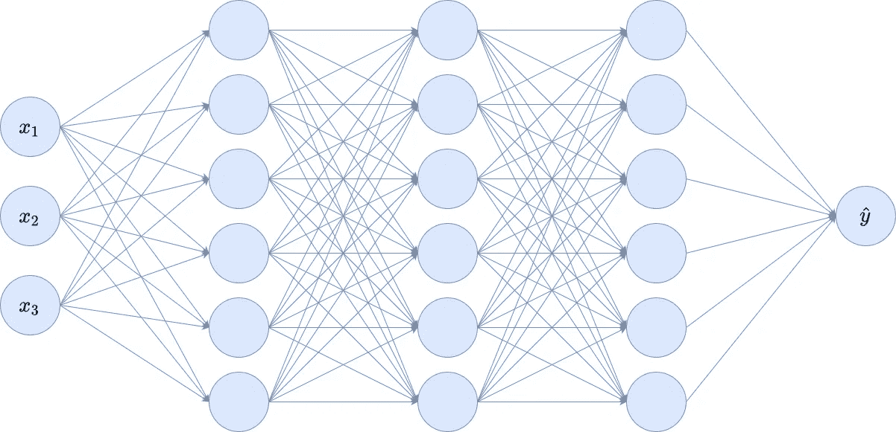
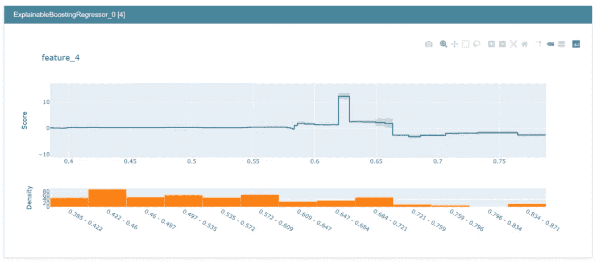
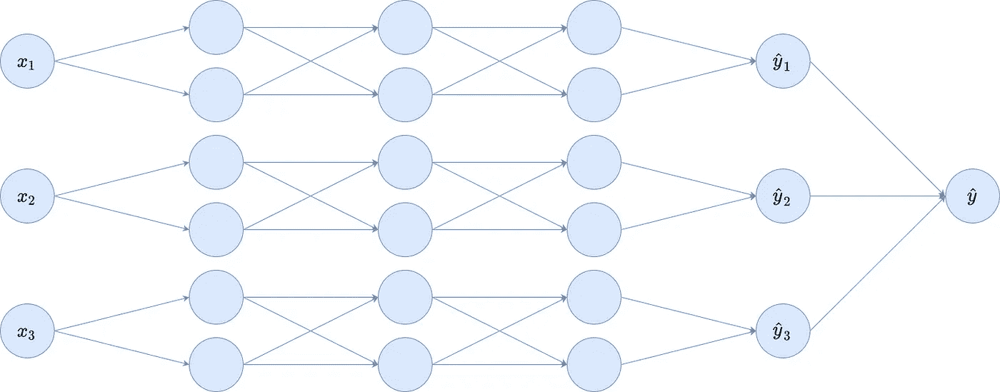
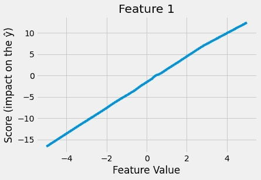
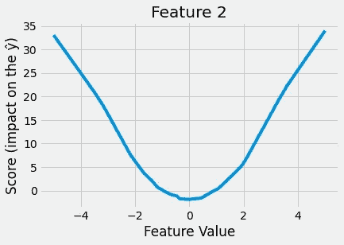
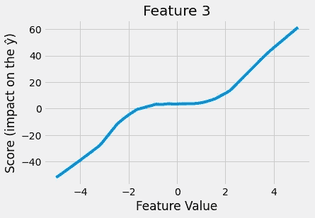
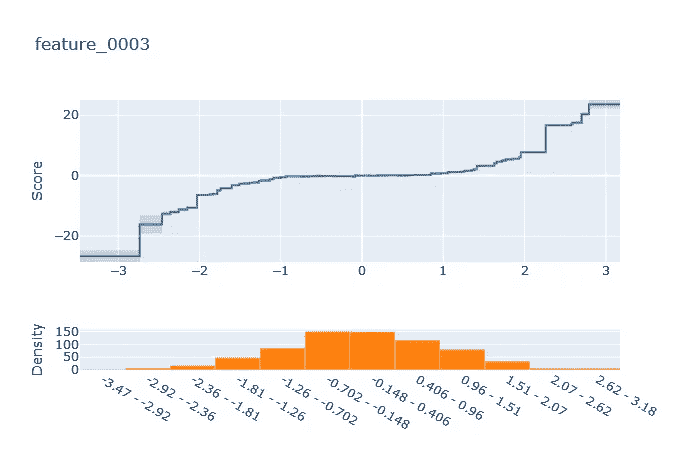
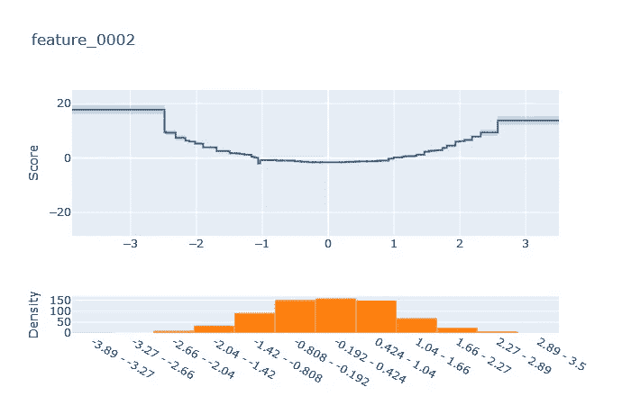

# PyTorch 可解释神经网络

> 原文：<https://towardsdatascience.com/interpretable-neural-networks-with-pytorch-76f1c31260fe?source=collection_archive---------6----------------------->

## [可解释的人工智能](https://medium.com/tag/explainable-ai)

## 了解如何使用 PyTorch 构建可通过设计解释的前馈神经网络


由 [Jan Schulz 拍摄#网页设计师 Stuttgart](https://unsplash.com/@wombat?utm_source=medium&utm_medium=referral) 在 [Unsplash](https://unsplash.com?utm_source=medium&utm_medium=referral)

有几种方法来评估机器学习模型，其中两种是**准确性**和**可解释性**。一个高精度的模型就是我们通常所说的*好的*模型，它很好地学习了输入 *X* 和输出 *y* 之间的关系。

如果一个模型具有高度的可解释性或可解释性，我们就能理解该模型如何做出预测，以及我们如何通过改变输入特征来影响该预测。虽然很难说当我们增加或减少输入的某个特征时，深度神经网络的输出会如何表现，但对于线性模型来说，这是非常容易的:如果你增加一个特征，输出会增加该特征的系数。简单。

现在，你可能经常听到这样的话:

> “有可解释的模型，也有表现良好的模型。”—一个更不了解它的人

但是，如果你看过我关于[可解释的助推机](https://github.com/interpretml/interpret) (EBM)的文章，那么你已经知道这不是真的。EBM 是一个模型的例子，它具有很好的性能，同时又是可解释的。

[](/the-explainable-boosting-machine-f24152509ebb) [## 可解释的助推器

### 像梯度推进一样精确，像线性回归一样可解释。

towardsdatascience.com](/the-explainable-boosting-machine-f24152509ebb) 

对于我以前的文章，我创建了下图，展示了我们如何在*可解释性-准确性空间*中放置一些模型。



图片由作者提供。

特别是，我将深层神经网络(省略了深层神经网络)更多地放置在非常准确但难以解释的区域。当然，您可以通过使用像 [shap](https://github.com/slundberg/shap) 或 [lime](https://github.com/marcotcr/lime) 这样的库在一定程度上缓解可解释性问题，但是这些方法都有自己的一套假设和问题。因此，让我们走另一条路，创建一个可以通过本文中的设计来解释的神经网络架构。

> ***免责声明:*** *我即将呈现的架构刚刚浮现在脑海中。我不知道是否已经有关于它的文献，至少我找不到任何东西。不过，* [Krist Papas](https://medium.com/@kristpapas?source=post_info_responses---------4-----------------------) *指出，这个想法可以在论文* [中找到:用神经网络进行可解释的机器学习](https://arxiv.org/abs/2004.13912)*【1】**作者* *Rishabh Agarwal 等人感谢！*

# 可解释的建筑理念

请注意，我希望你知道前馈神经网络是如何工作的。我不会在这里给出一个完整的介绍，因为已经有很多关于它的资源了。

考虑以下玩具神经网络，具有三个输入节点 *x* ₁、 *x* ₂、 *x* ₃、单个输出节点 *ŷ* ，以及三个各有六个节点的隐藏层。我在这里省略了偏差项。



图片由作者提供。

这种体系结构在可解释性方面的问题是，由于完全连接的层，输入完全混合在一起。每个单个输入节点都会影响所有隐藏层节点，随着我们深入网络，这种影响会变得更加复杂。

## 受树木的启发

基于树的模型通常也是如此，因为如果我们不加以限制，决策树可能会使用每个特征来创建分割。例如，标准的梯度增强及其派生，如 [XGBoost](https://xgboost.readthedocs.io/en/stable/) 、 [LightGBM](https://lightgbm.readthedocs.io/en/latest/) 和 [CatBoost](https://catboost.ai/) 本身并不能真正解释。

然而，你可以通过使用**只依赖于单个特征的决策树**来使梯度增强变得可解释，就像 EBM 所做的那样(阅读我的相关文章！😎).

在许多情况下，像这样限制树不会对性能造成太大影响，但使我们能够像这样直观地看到功能影响:



**的输出解释了**的显示功能。图片由作者提供。

看一下有蓝线的图形的顶部。它显示了在某些回归问题中 feature_4 对输出的影响。在 *x* 轴上，可以看到 feature_4 的范围。 *y* 轴显示**分数**，它是输出改变多少的值。下面的直方图显示了 feature_4 的分布。

从图中我们可以看到以下内容:

*   如果 feature_4 约为 0.62，则与 feature_4 为 0.6 或 0.65 相比，输出增加约 10 倍。
*   如果 feature_4 大于 0.66，对输出的影响是负面的。
*   将 feature_4 在 0.4 至 0.56 范围内改变一位确实会使输出发生很大变化。

然后，模型的最终预测只是不同特征分数的总和。此行为类似于 Shapley 值，但不需要计算它们。很好，对吧？现在，让我向你展示我们如何对神经网络做同样的事情。

## 移除边缘

因此，如果问题是神经网络的输入因为太多的边而分散在隐藏层周围，让我们只移除一些。特别是，我们必须删除允许信息从一个特征流向另一个特征的边。仅删除这些*溢出边*，上面的玩具神经网络变成:



图片由作者提供。

我们为三个输入变量创建了三个独立的**模块**，每个模块都是一个完全连接的网络，有一个单独的部分输出 *ŷᵢ.*最后一步，将这些 *ŷᵢ* 相加，加上一个偏置(图中省略)产生最终输出 *ŷ* 。

我们引入了部分输出，以便能够创建与 EBM 允许的相同类型的图。上图中的一个方块代表一个情节: *xᵢ* 进去*，ŷᵢ* 出来。我们将在后面看到如何做到这一点。

这里我们已经有了完整的架构！我认为理论上理解它是相当容易的，但是让我们也实施它。这样，你很高兴，因为你可以使用神经网络，企业也很高兴，因为神经网络是可解释的。

# PyTorch 中的实现

我不指望你完全熟悉 [PyTorch](https://pytorch.org/) ，所以我会解释一些基础知识，帮助你理解我们的定制实现。如果你知道 PyTorch 的基础知识，你可以跳过**完全连接层**部分。如果您还没有安装 PyTorch，[在这里选择您的版本](https://pytorch.org/)。

## 完全连接的层

这些层在 PyTorch 中也被称为**线性**或**密集**在 [Keras](https://keras.io/) 中。它们使用具有乘法权重的 *nm* 边沿将 *n* 输入节点连接到 *m* 输出节点。这基本上是一个矩阵乘法加上一个偏差项，如下面两个代码片段所示:

```
import torch

torch.manual_seed(0) # keep things reproducible

x = torch.tensor([1., 2.]) # create an input array
linear_layer = torch.nn.Linear(2, 3) # define a linear layer

print(linear_layer(x)) # putting the input array into the layer

# Output:
# tensor([ 0.7393, -1.0621,  0.0441], grad_fn=<AddBackward0>)
```

这就是如何创建完全连接的层，并将其应用于 PyTorch 张量。您可以通过`linear_layer.weight`获得用于乘法的矩阵，通过`linear_layer.bias`获得用于偏置的矩阵。那你可以做

```
print(linear_layer.weight @ x + linear_layer.bias) # @ = matrix mult

# Output:
# tensor([ 0.7393, -1.0621,  0.0441], grad_fn=<AddBackward0>)
```

不错，是一样的！现在，PyTorch、Keras 和公司的伟大之处在于，你可以将许多层堆叠在一起，创建一个神经网络。在 PyTorch 中，你可以通过`torch.nn.Sequential`实现这种堆叠。要从上面重建密集网络，您可以做一个简单的

```
model = torch.nn.Sequential(
    torch.nn.Linear(3, 6),
    torch.nn.ReLU(),
    torch.nn.Linear(6, 6),
    torch.nn.ReLU(),
    torch.nn.Linear(6, 6),
    torch.nn.ReLU(),
    torch.nn.Linear(6, 1),
)

print(model(torch.randn(4, 3))) # feed it 4 random 3-dim. vectors
```

> ***注:*** *我到目前为止还没有给你演示过如何训练这个网络，只是架构的定义，包括参数的初始化。但是你可以向网络提供三维输入，接收一维输出。*

既然我们想创建自己的层，让我们先从简单的东西开始练习:重新创建 PyTorch 的`Linear`层。你可以这样做:

```
import torch
import math

class MyLinearLayer(torch.nn.Module):
    def __init__(self, in_features, out_features):
        super().__init__()
        self.in_features = in_features
        self.out_features = out_features

        # multiplicative weights
        weights = torch.Tensor(out_features, in_features)
        self.weights = torch.nn.Parameter(weights)
        torch.nn.init.kaiming_uniform_(self.weights) 

        # bias
        bias = torch.Tensor(out_features)
        self.bias = torch.nn.Parameter(bias)
        bound = 1 / math.sqrt(in_features)
        torch.nn.init.uniform_(self.bias, -bound, bound)

    def forward(self, x):
        return x @ self.weights.t() + self.bias
```

这段代码值得解释一下。我们通过以下方式引入线性层的权重

1.  创建 PyTorch 张量(包含所有零，但这无关紧要)
2.  将它注册为层的可学习参数，这意味着梯度下降可以在训练期间更新它，然后
3.  初始化参数。

初始化神经网络的参数本身就是一个完整的主题，因此我们不会进入兔子洞。如果它太困扰你，你也可以用不同的方式初始化它，例如通过使用一个标准的正态分布`torch.randn(out_features, in_features)`，但是那时训练可能会慢一些。无论如何，我们对偏差做同样的处理。

然后，该层需要知道它应该在`forward`方法中执行的数学运算。这只是线性运算，即矩阵乘法和偏差加法。

好了，现在我们已经准备好实现我们的可解释神经网络层了！

## 块线性图层

我们现在设计一个`BlockLinear`层，我们将以如下方式使用:首先，我们从 *n* 特征开始。然后`BlockLinear`层应该创建由 *h* 个隐藏神经元组成的 *n* 个块。为了简化，h 在每个块中是相同的，但是你当然可以推广这个。总的来说，第一个隐藏层将由 *nh* 神经元组成，但也只有 *nh* 边连接到它们(而不是 *n* *h* 用于完全连接的层)*。*为了更好的理解，再看一遍上面的图片。这里， *n* = 3， *h* = 2。


图片由作者提供。

然后——在使用了 ReLU 这样的非线性之后——我们将在这个层之后放置另一个`BlockLinear`层，因为不同的块不应该再次合并。我们重复这个过程很多次，直到我们在最后用一个`Linear`层把所有的东西绑起来。

## 块线性层的实现

让我们来看看代码。它与我们定制的线性层非常相似，所以代码不应该太吓人。

```
class BlockLinear(torch.nn.Module):
    def __init__(self, n_blocks, in_features, out_features):
        super().__init__()
        self.n_blocks = n_blocks
        self.in_features = in_features
        self.out_features = out_features
        self.block_weights = []
        self.block_biases = []
        for i in range(n_blocks):
            block_weight = torch.Tensor(out_features, in_features)
            block_weight = torch.nn.Parameter(block_weight)
            torch.nn.init.kaiming_uniform_(block_weight)
            self.register_parameter(
                f'block_weight_{i}',
                block_weight
            )
            self.block_weights.append(block_weight)
            block_bias = torch.Tensor(out_features)
            block_bias = torch.nn.Parameter(block_bias)
            bound = 1 / math.sqrt(in_features)
            torch.nn.init.uniform_(block_bias, -bound, bound)
            self.register_parameter(
                f'block_bias_{i}',
                block_bias
            )
            self.block_biases.append(block_bias)

    def forward(self, x):
        block_size = x.size(1) // self.n_blocks
        x_blocks = torch.split(
            x,
            split_size_or_sections=block_size,
            dim=1
        )
        block_outputs = []
        for block_id in range(self.n_blocks):
            block_outputs.append(
                x_blocks[block_id] @ self.block_weights[block_id].t() + self.block_biases[block_id]
            )
        return torch.cat(block_outputs, dim=1)
```

第一行类似于我们在自制的线性图层中看到的，只是重复了`n_blocks`次。这为每个块创建了一个独立的线性层。

在正向方法中，我们得到一个作为单个张量的`x`，我们必须首先使用`torch.split`将它再次分割成块。举例来说，块大小为 2 会执行以下操作:`[1, 2, 3, 4, 5, 6] -> [1, 2], [3, 4], [5, 6]`。然后，我们将独立的线性变换应用于不同的块，并用`torch.cat`将结果粘合在一起。搞定了。

## 训练可解释的神经网络

现在，我们有了定义我们的可解释神经网络的所有要素。我们只需要首先创建一个数据集:

```
X = torch.randn(1000, 3)
y = 3*X[:, 0] + 2*X[:, 1]**2 + X[:, 2]**3 + torch.randn(1000)
y = y.reshape(-1, 1)
```

我们可以看到，我们处理的是一个由一千个样本组成的三维数据集。如果将要素 1 和要素 2 平方，真实的关系是线性的-这就是我们想要用模型恢复的！因此，让我们定义一个能够捕捉这种关系的小模型。

```
class Model(torch.nn.Module):
    def __init__(self):
        super().__init__()

        self.features = torch.nn.Sequential(
            BlockLinear(3, 1, 20),
            torch.nn.ReLU(),
            BlockLinear(3, 20, 20),
            torch.nn.ReLU(),
            BlockLinear(3, 20, 20),
            torch.nn.ReLU(),
            BlockLinear(3, 20, 1),
        )

        self.lr = torch.nn.Linear(3, 1)

    def forward(self, x):
        x_pre = self.features(x)
        return self.lr(x_pre)

model = Model()
```

我将模型分为两步:

1.  用`self.features`计算部分输出 *ŷᵢ* ，然后
2.  将最终预测 *ŷ* 计算为 *ŷᵢ* 与`self.lr`的加权和。

这使得提取特征解释更加容易。在`self.features`的定义中，您可以看到我们创建了一个具有三个模块的神经网络，因为我们在数据集中有三个特征。对于每个块，我们创建许多隐藏层，每个块有 20 个神经元。

现在，我们可以创建一个简单的训练循环:

```
optimizer = torch.optim.Adam(model.parameters())
criterion = torch.nn.MSELoss()

for i in range(2000):
    optimizer.zero_grad()
    y_pred = model(X)
    loss = criterion(y, y_pred)
    loss.backward()
    optimizer.step()
    if i % 100 == 0:
        print(loss)
```

基本上，我们选择 Adam 作为优化器，MSE 作为损失，然后进行标准梯度下降，即使用`optimzer.zero_grad()`删除旧梯度，计算预测，计算损失，通过`loss.backward()`区分损失，并通过`optimizer.step()`更新模型参数。你可以看到培训损失随着时间的推移而下降。这里我们不关心验证或测试集。**训练** *r* 结束时应大于 0.95。

我们现在可以通过以下方式打印模型说明

```
import matplotlib.pyplot as plt

x = torch.linspace(-5, 5, 100).reshape(-1, 1)
x = torch.hstack(3*[x])

for i in range(3):
    plt.plot(
        x[:, 0].detach().numpy(),
        model.get_submodule('lr').weight[0][i].item() * model.get_submodule('features')(x)[:, i].detach().numpy())
    plt.title(f'Feature {i+1}')
    plt.show()
```

然后得到



作者图片。

这看起来很整洁！该模型计算出特征 1 的影响是线性的，特征 2 的影响是二次的，特征 3 的影响是三次的。不仅如此，**模型能够向我们展示**，这是整个建筑的伟大之处！

> **你甚至可以抛开网络，仅凭这些图表就做出预测！**

举个例子，让我们估算一下 *x* = (2，-2，0)的网络输出。

*   基于第一个数字，x ₁ = 2 转化为预测的 **+5** 。
*   *x* ₂ = -2 转化为预测的 **+9** ，基于第二个数字。
*   根据第三个数字， *x* ₃ = 0 转换为预测的 **+0** 。
*   仍然有一个**偏差**来自你可以通过`model.get_submodule('lr').bias`访问的最后一个线性层，这个也必须加上，但是应该很小。

总的来说，你的预测应该在*ŷ*t23】≈5+9+0+偏差 **≈** 14 左右，还算准确。

您还可以看到如何最小化输出:为功能 1 选择较小的值，为功能 2 选择接近零的值，为功能 3 选择较小的值。这是你通常不能仅仅通过看神经网络看到的，但是通过分数函数，我们可以。这是可解释性的一个巨大好处。

注意，从上面学习的得分函数只能对我们**实际上有训练数据**的区域有把握。在我们的数据集中，我们实际上只观察到每个特征的值在-3 和 3 之间。因此，我们可以看到，我们并没有得到边上完美的 *x* 和 *x* 多项式。但是我认为图表的方向是正确的，这仍然令人印象深刻。为了充分理解这一点，将其与循证医学的结果进行比较:



作者图片。

**曲线是块状的，向两边外推只是一条直线，这是基于树的方法的主要缺点之一。**

# 结论

在本文中，我们讨论了模型的可解释性，以及神经网络和梯度推进如何无法实现这一点。虽然*解释*包的作者创建了 EBM，一种可解释的梯度推进算法，但我向您展示了一种创建可解释的神经网络的方法。

然后我们用 PyTorch 实现了它，代码有点多，但并不太疯狂。至于 EBM，我们可以提取每个特征的学习得分函数，我们甚至可以用它来进行预测。

实际训练的模型甚至不再需要，这使得在弱硬件上部署和使用它成为可能。这是因为我们只需为每个特征存储一个查找表，占用的内存很少。每个查找表使用 *g* 的网格大小导致**只存储*O*(*n*_ features **g*)元素**，而不是潜在地存储数百万甚至数十亿的模型参数。做预测也很便宜:只需从查找表中添加一些数字。由于这具有仅***O*(*n*_ features)**查找和加法的**时间复杂度，所以它比通过网络的正向传递快得多。**

# 参考

[1] R. Agarwal，L. Melnick，N. Frosst，X. Zhang，B. Lengerich，R. Caruana 和 G. Hinton，[神经加法模型:用神经网络进行可解释的机器学习](https://arxiv.org/abs/2004.13912) (2020)

我希望你今天学到了新的、有趣的、有用的东西。感谢阅读！

**作为最后一点，如果你**

1.  **想支持我多写点机器学习和**
2.  **无论如何，计划获得一个中等订阅量，**

**为什么不做** [**通过这个环节**](https://dr-robert-kuebler.medium.com/membership) **？这将对我帮助很大！😊**

透明地说，给你的价格不变，但大约一半的订阅费直接归我。

非常感谢，如果你考虑支持我的话！

> 如果有任何问题，请在 [LinkedIn](https://www.linkedin.com/in/dr-robert-k%C3%BCbler-983859150/) 上给我写信！