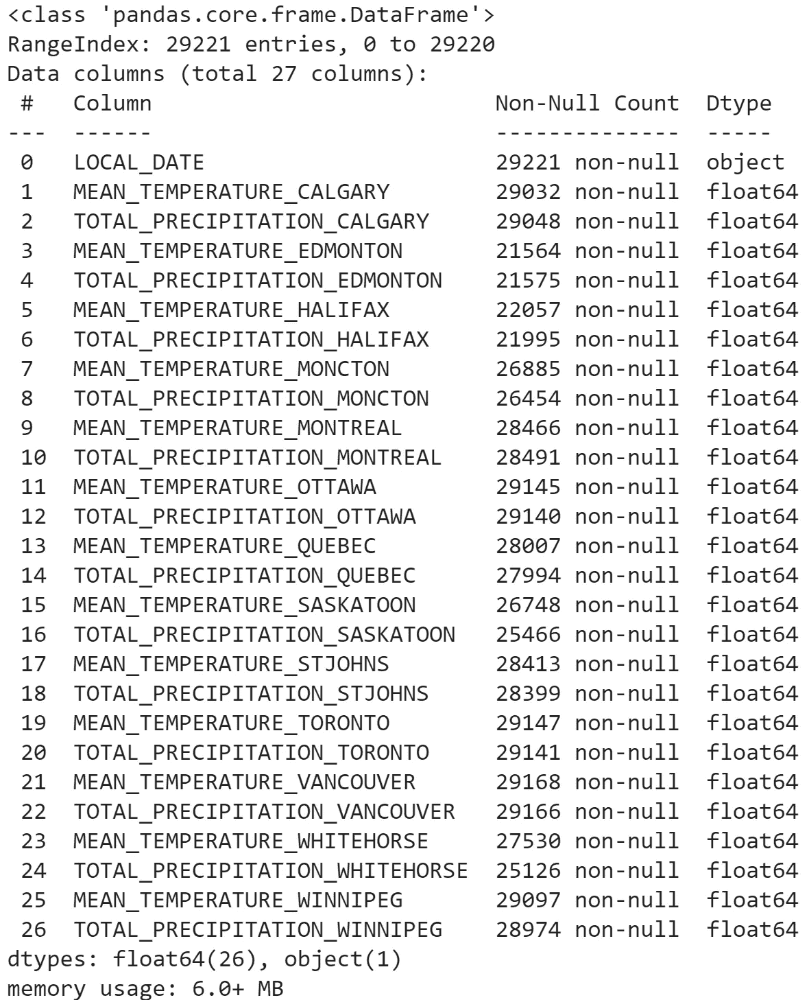
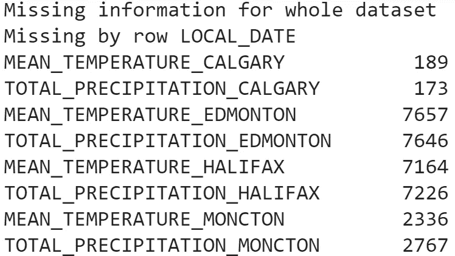
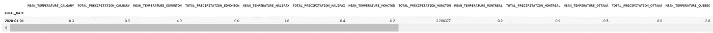
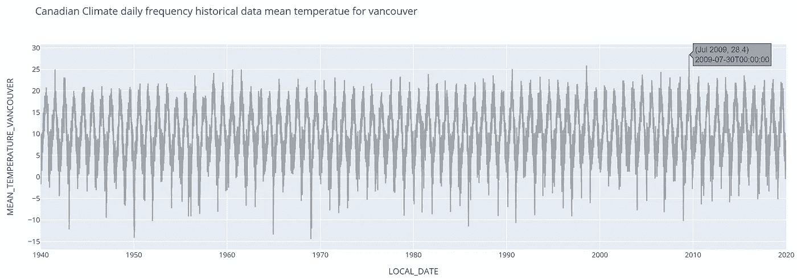
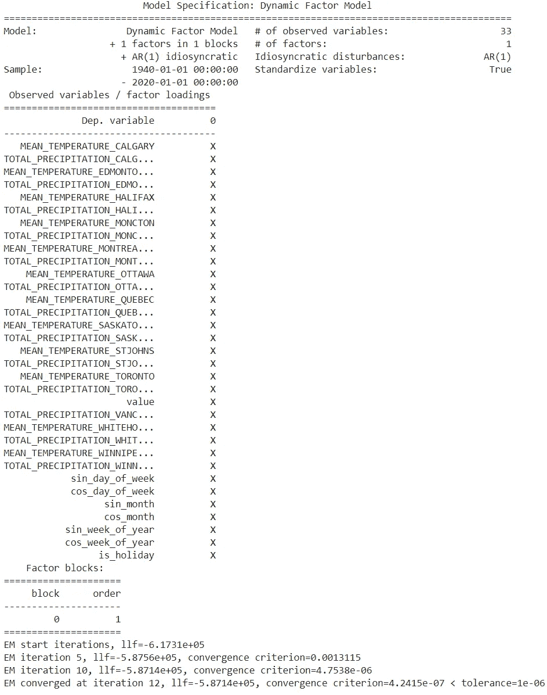
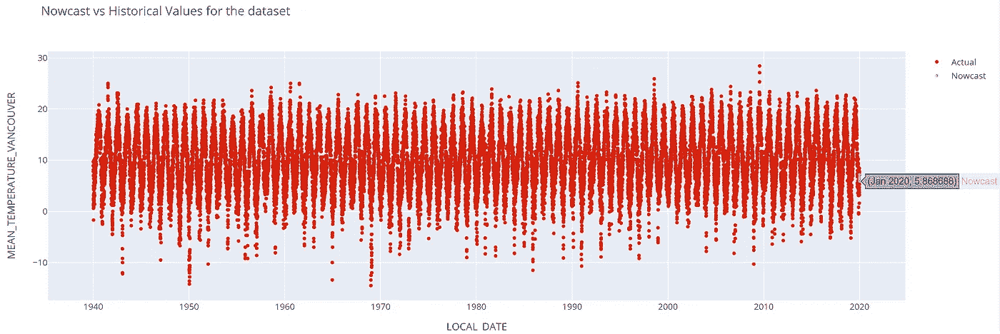
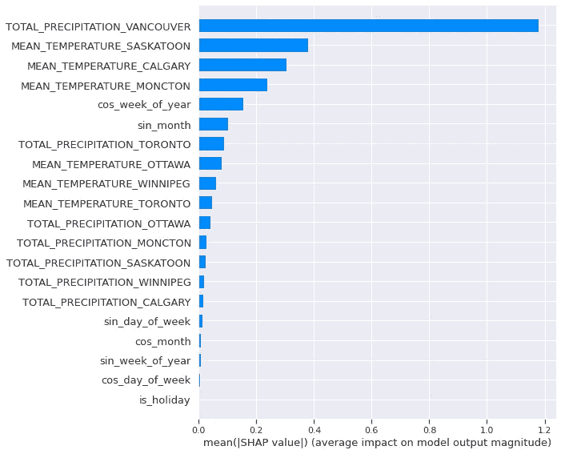

# 使用 DeepXF 以最少的编码实现可解释的临近预报

> 原文：<https://towardsdatascience.com/interpretable-nowcasting-with-deepxf-using-minimal-code-6b16a76ca52f?source=collection_archive---------17----------------------->

## 非常短期的战略业务目标能否得到精确的未来洞察力的支持，从而快速做出决策？

在这篇博客中，我们将讨论一个非常重要的话题，这个话题与我们的现实世界息息相关。通过这篇文章，我们将重温适用于几乎所有商业场景的关键短期战略问题。我们将看到“[**-Deep-XF**](https://github.com/ajayarunachalam/Deep_XF)”一个 python 库如何被直观地用于轻松的临近预报任务，以及一个演示用例。此外，我们还将看到如何解释临近预报模型结果，以获得更好的见解。关于这个包的快速介绍请浏览这个博客 [**这里**](https://ajay-arunachalam08.medium.com/introduction-to-deepxf-e90ce7c2858c) 。另外，从 [**这里**](https://ajay-arunachalam08.medium.com/building-explainable-forecasting-models-with-state-of-the-art-deep-neural-networks-using-a-ad3fa5844fef) 看一下**预测**的相关主题和动手演示教程。

# 概述:预报与临近预报

为直观详细解释时序检查 [**此处**](https://ajay-arunachalam08.medium.com/multidimensional-multi-sensor-time-series-data-analysis-framework-5c497d8d106b)；并且，对于时间序列数据的无监督特征选择检查 [**这里**](https://ajay-arunachalam08.medium.com/multi-dimensional-time-series-data-analysis-unsupervised-feature-selection-with-msda-package-430900a3829a) **。**

我们先简单通俗地了解一下*预报*和*临近预报*的核心区别。

F 因此，简单的预测是对未来的预测或有根据的猜测。

另一方面，预测是在非常短的时间间隔内实时客观地确定趋势或趋势反转的科学。临近预报是基于事实的，关注已知和可知的事物，因此它避免预测。简而言之，临近预报是稳健决策过程的基础。

# 基于“**期望最大化”**算法的临近预报

一般来说，许多机器学习问题可以通过迭代的方式来解决。**期望最大化** (EM)算法的一般原理也在于迭代，以及在估计具有未观察变量的统计模型的参数时看到观察数据的可能性的优化。你只需从最初的随机猜测开始，然后使用这些猜测来估计期望公式化，然后迭代地最大化，直到解决方案收敛。EM 算法被广泛使用的实时应用包括填充样本空间中的缺失数据、图像重建、预测马尔可夫模型参数、测量函数的高斯密度等等。

# 可解释的 ML 和可解释的 AI (XAI)

构建可解释模型背后的核心思想是，不再有机器学习模型，它们的推理对我们来说仍然是一个完整的“**黑箱解决方案**。通俗地说，模型的结果应该被我们以简单的人类可理解或可读的形式来理解、解释和信任。这就是可解释的 ML/可解释的 AI 科学进入画面的地方，它帮助你理解和解释机器学习模型生成的结果。

# 用例—天气临近预报问题

让我们通过一个针对经典气象学应用的多变量数据集进行动手演示。这里，我们将使用来自 [**这里**](https://www.kaggle.com/aturner374/eighty-years-of-canadian-climate-data) 的加拿大气候数据集。这个数据集是从几个[公共](https://climate.weather.gc.ca/)来源编译而来的。该数据集由加拿大 13 个中心的每日温度和降雨量组成。降水不是雨就是雪(冬天可能会下雪)。1940 年，13 个中心中有 7 个有每日数据，但到了 1960 年，所有 13 个中心都有每日数据，偶尔会有缺失值。我们有大约 80 年的记录(每日数据频率)，我们想预测非常短期的未来。下面的分步插图将引导您完成演示用例。

一旦安装了库，我们导入库，然后导入数据，检查形状和属性数据类型，等等。接下来，我们使用库中的 **missing ()** 函数来查找数据集的缺失值，然后输入/替换 NAN 值(如果数据集中有)。为了输入缺失值，我们使用 **impute ()** 函数，该函数提供了几个输入值的选项，如填充零、平均值、中值、回填等。

接下来，一旦数据被预处理，我们用选择'**期望最大化【T3]'算法的 **set_model_config ()** 函数、输入定标器(例如:MinMaxScaler、StandardScaler、MaxAbsScaler、RobustScaler)和临近预报周期窗口来设置定制的临近预报模型参数。接下来， **set_variables ()** 和 **get_variables ()** 函数用于设置和解析时间戳索引，指定感兴趣的结果变量，对数据进行排序，删除重复项等。**

此外，我们随后使用直观的 **plot_dataset ()** 函数，通过交互式图表显示结果列 wrt 时间的趋势。然后，我们使用 **nowcast ()** 函数训练 nowcast 模型，随后使用**explable _ nowcast()**函数获得 now cast 模型对未来数据点的推断结果的解释。人们还可以通过交互式绘图来可视化历史和当前预测值。此外，可解释性模块以 desc 重要性顺序显示了重要的贡献属性，用图表描绘。

对于库安装遵循以下步骤 [**此处**](https://github.com/ajayarunachalam/Deep_XF#installation) &对于手动先决条件安装勾选 [**此处**](https://github.com/ajayarunachalam/Deep_XF#requirements) 。

**第一步:**导入库

**第二步:**导入数据；检查数据集形状&属性信息

(29221, 27)

按作者分类的图像:获取属性信息

**步骤 3:** 检查整个数据集的缺失值

按作者分类的图像:打印数据集中缺失的值信息

**步骤 4:** 估算缺失值

**步骤 5:** 为临近预报模型设置自定义用户输入

**步骤 6:** 设置并解析时间戳、结果变量等

按作者分类的图像:查看显示单行的数据集

**第 7 步:**交互式绘图的数据可视化

作者图片:可视化交互式 plotly plot 与时间戳和预测栏

**第八步:**特征工程

**步骤 9:** 训练临近预报模型，并利用端点可视化绘制交互式临近预报未来预测

作者图片:训练临近预报模型直到收敛

作者提供的图像:具有历史和当前预测值的可视化交互式 plotly 地块

**第十步:**获取临近预报模型的预测解释

作者图片:可解释性模块图，按照 desc 重要性顺序显示重要属性

上面匀称的曲线是未来预测数据点的结果。可以看出，对结果列“平均温度温哥华”的相应模型推断有重大贡献的特征主要是由于属性，如“总降水量温哥华”，萨斯卡通、卡尔加里、蒙克顿气象站的平均温度，以及派生的日期、循环特征，特别是暗示日、周、月时间线重要性的特征。

# 结论

在这篇文章中，我们快速浏览了预测和临近预报的概述。我们讨论了 **EM** 算法，并且也看到了建立全局可解释模型的需要。我们在气象领域看到了一个经典临近预报用例问题。我们使用了 [**deep-xf**](https://pypi.org/project/deep-xf/) 包来构建基于**动态因子模型**的临近预报器。利用这种'**简单的**'、**易用的**'和'**低代码的**'解决方案，人们还可以轻松地自动构建可解释的基于深度学习的预测模型。此外，还可以使用单行代码轻松地将模型结果作为平面 csv 文件以及交互式可视化绘图输出到磁盘。

这篇博文附带的完整笔记本可以在 [**这里**](https://colab.research.google.com/drive/1iX3n8vfE7RL3IB4M43XU2AJKezvVxvbf?usp=sharing) 找到。

# 接触

你可以在 ajay.arunachalam08@gmail.com 找到我；与我联系— [Linkedin](https://www.linkedin.com/in/ajay-arunachalam-4744581a/)

感谢阅读。干杯，继续学习:)

**传记**

我是 AWS 认证的机器学习专家和云解决方案架构师。我真的相信，在我们完全接受人工智能的力量之前，人工智能系统的不透明是当前的需要。考虑到这一点，我一直努力使人工智能民主化，并且更倾向于建立可解释的模型。我的兴趣是应用人工智能、机器学习、深度学习、深度强化学习和自然语言处理，特别是学习良好的表示。根据我处理现实世界问题的经验，我完全承认，找到良好的表示是设计系统的关键，该系统可以解决有趣的挑战性现实世界问题，超越人类水平的智能，并最终为我们解释我们不理解的复杂数据。为了实现这一点，我设想学习算法可以从未标记和标记的数据中学习特征表示，在有和/或没有人类交互的情况下被引导，并且在不同的抽象级别上，以便弥合低级数据和高级抽象概念之间的差距。

## 参考

<https://en.wikipedia.org/wiki/Nowcasting_%28meteorology%29>  <https://en.wikipedia.org/wiki/Time_series>    <https://en.wikipedia.org/wiki/Shapley_value>  <https://enterprisersproject.com/article/2019/5/what-explainable-ai>  <http://aqua.upc.es/anywhere-catalogue-v2/?product=ravake-heavy-rainfall-nowcasting>  <http://anywhere-h2020.eu/>  <https://github.com/slundberg/shap>  <https://pytorch.org/>  <https://www.tensorflow.org/>    <https://hackerbits.com/data/expectation-maximization-em-data-mining-algorithm/>  <https://jonathan-hui.medium.com/machine-learning-expectation-maximization-algorithm-em-2e954cb76959> 