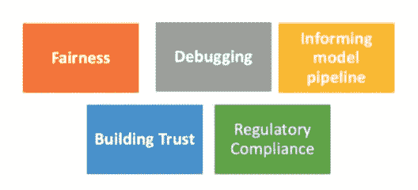
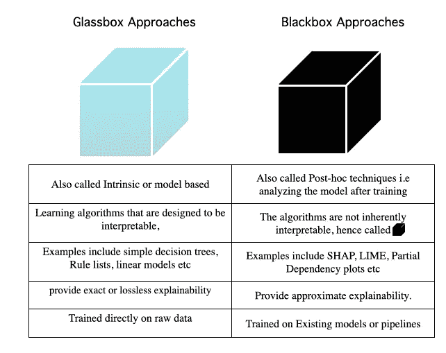
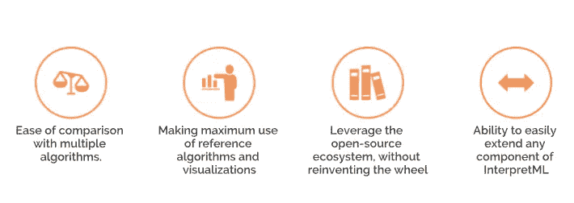
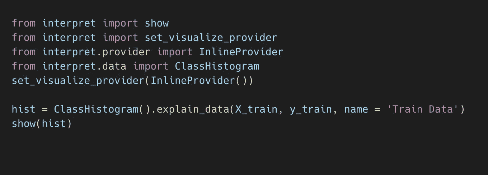
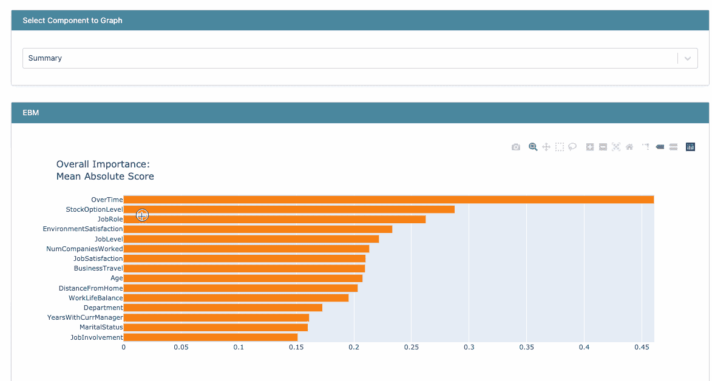
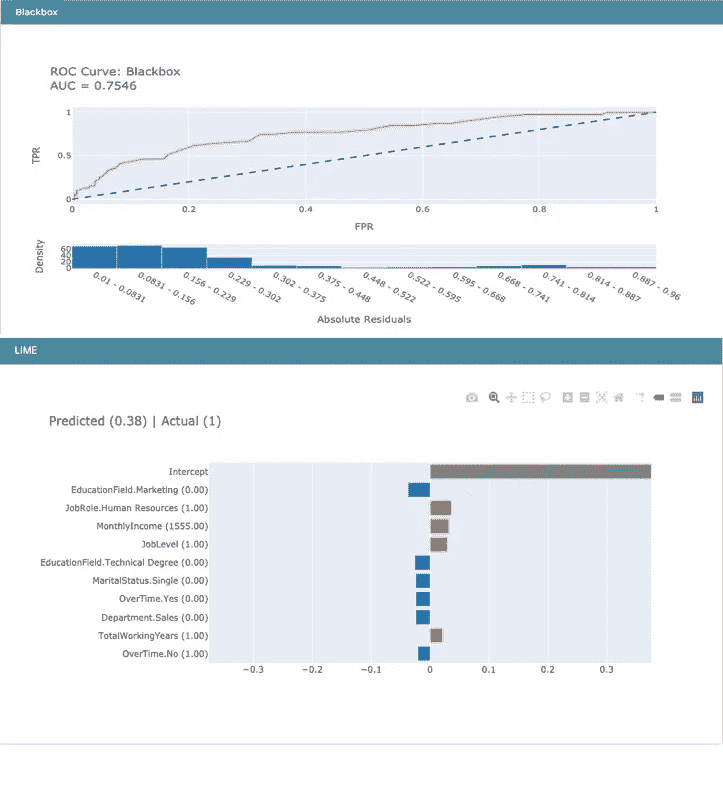

# 可解释的还是准确的？为什么不两者都要？

> 原文：<https://towardsdatascience.com/interpretable-or-accurate-why-not-both-4d9c73512192?source=collection_archive---------18----------------------->

## 用 IntepretML 构建可解释的 Boosting 模型

图片由 [Kingrise](https://pixabay.com/users/kingrise-4297632/?utm_source=link-attribution&utm_medium=referral&utm_campaign=image&utm_content=3183317) 来自 [Pixabay](https://pixabay.com/?utm_source=link-attribution&utm_medium=referral&utm_campaign=image&utm_content=3183317)

正如[米勒](https://arxiv.org/abs/1706.07269)所总结的，可解释性指的是人类能够理解决策原因的程度。机器学习社区中的一个常见概念是准确性和可解释性之间存在权衡。这意味着越精确的学习方法提供的可解释性越少，反之亦然。然而，最近，有很多的重点放在创造内在可解释的模型，并远离他们的黑盒对应。事实上，辛西娅·鲁丁认为[可解释的黑盒应该完全避免用于对人类生活产生深远影响的高风险预测应用](https://www.nature.com/articles/s42256-019-0048-x)。所以，问题是一个模型是否可以在不牺牲可解释性的前提下具有更高的准确性？

EBMs 正是试图填补这一空白。EBM 代表[可解释的 Boosting Machine](https://www.youtube.com/watch?v=MREiHgHgl0k) ，是一种模型，其精确度可与随机森林和 Boosted Trees 等最先进的机器学习方法相媲美，同时具有高度的可理解性和可解释性。

本文将着眼于 EBM 背后的思想，并通过 [InterpretML](https://arxiv.org/pdf/1909.09223.pdf) (机器学习可解释性的统一框架)将它们实现为一个人力资源案例研究。

# 机器学习的可解释性—初级读本

机器学习是一种强大的工具，正在越来越多地以多方面的方式应用于多个行业。人工智能模型越来越多地用于做出影响人们生活的决策。因此，预测必须是公平的，没有偏见或歧视。

在 pipeline | Image 中拥有机器学习可解释性的优势

在这种情况下，机器学习的可解释性起着至关重要的作用。可解释性不仅能让你发现模型的错误预测，还能分析和修复潜在的原因。可解释性可以帮助您调试您的模型，检测过度拟合和数据泄漏，最重要的是，通过给出解释来激发模型和人类之间的信任。

## 可解释性方法

根据机器学习模型的类型，用来解释模型预测的方法可以分为两大类。

## 1.玻璃盒模型与黑盒解释

被设计成可解释的算法被称为玻璃盒子模型。这些算法包括简单决策树、规则列表、线性模型等。玻璃箱方法通常提供精确或无损的可解释性。这意味着可以追踪和推理任何预测是如何做出的。GlassBox 模型的解释是**特定于模型的**,因为每种方法都基于一些特定的模型内部。例如，线性模型中的权重解释计入[特定模型的解释](https://christophm.github.io/interpretable-ml-book/taxonomy-of-interpretability-methods.html)。

相反，黑盒解释者是**模型不可知论者**。它们可以应用于任何模型，并且本质上是事后的，因为它们是在模型被训练之后应用的。黑盒解释器通过将模型视为黑盒来工作，并假设他们只能访问模型的输入和输出。它们对于复杂的算法特别有用，比如提升树和深度神经网络。黑盒解释器通过反复扰动输入和分析模型输出的结果变化来工作。例子包括 [SHAP](https://arxiv.org/abs/1705.07874) 、[石灰](https://arxiv.org/abs/1602.04938v3)、[部分依赖图](https://christophm.github.io/interpretable-ml-book/pdp.html) s 等。，不一而足。

玻璃盒子与黑盒可解释方法|作者图片

## 2.本地与全球解释

另一类可能取决于解释的范围。局部解释旨在解释单个预测，而全局解释则解释整个模型行为。

既然我们对机器学习模型所采用的可解释性机制有了足够的直觉，让我们换个角度，更详细地理解 EBM。

# 可解释增压机

[EBM](https://dl.acm.org/doi/10.1145/2339530.2339556)是玻璃箱模型，其设计精度可与最先进的机器学习方法相媲美，而不会影响精度和可解释性*。*

EBM 是一种[广义加性模式](https://projecteuclid.org/journals/statistical-science/volume-1/issue-3/Generalized-Additive-Models/10.1214/ss/1177013604.full) l 或简称 GAM。线性模型假设反应和预测之间存在线性关系。因此，他们无法捕捉数据中的非线性。

`Linear Model: y = β0 + β1x1 + β2x2 + … + βn xn`

为了克服这个缺点，在 80 年代后期，统计学家 [Hastie & Tibshirani 开发了广义加法模型](https://projecteuclid.org/journals/statistical-science/volume-1/issue-3/Generalized-Additive-Models/10.1214/ss/1177013604.full) (GAMs)，它保持了加法结构，因此保持了线性模型的可解释性。因此，响应和预测变量之间的线性关系[被几个非线性平滑函数](https://datascienceplus.com/generalized-additive-models/) (f1，f2 等)所代替。)来模拟和捕捉数据中的非线性。gam 比简单的线性模型更精确，因为它们不包含特征之间的任何交互，用户也可以很容易地解释它们。

`Additive Model: y = **f1**(x1) + **f2**(x2) + … + **fn** (xn)`

EBM 是利用梯度推进和装袋等技术对 gam 的改进。EBM 包括成对的相互作用项，这进一步提高了它们的准确性。

`EBMs: y = Ʃi **fi** (xi) + Ʃij **fij(xi , xj)** + Ʃijk **fijk (xi , xj , xk )**`

EBM 的创始人理查德·卡鲁阿纳(Richard Caruana)的以下演讲深入探讨了算法背后的直觉。

解释背后的科学:可解释的助推机器

这里要注意的重要一点是，即使在所有这些改进之后，EBM 仍然保留了线性模型的可解释性，但通常与强大的黑盒模型的准确性相当，如下所示:

跨数据集(行、列)的模型分类性能|官方论文: [InterpretML:机器学习可解释性的统一框架](https://arxiv.org/pdf/1909.09223.pdf)

# 案例研究:使用机器学习预测员工流失

> 这是代码笔记本的 [nbviewer 链接](https://nbviewer.jupyter.org/github/parulnith/Data-Science-Articles/blob/main/Interpretable%20or%20Accurate%3F%20Why%20not%C2%A0both/Interpretable%20or%20Accurate%3F%20Why%20not%C2%A0both.ipynb),以防你想跟进。

[来自皮沙贝的安德鲁·马丁](https://pixabay.com/photos/get-me-out-escape-danger-security-1605906/)

是时候把手弄脏了。在本节中，我们将训练一个 EBM 模型来预测员工流失。我们还将比较 EBMs 与其他算法的性能。最后，我们将尝试解释我们的模型在一个叫做 InterpretML 的工具的帮助下做出的预测。什么是 interpretML？让我们找出答案。

## IntepretML:机器学习可解释性的统一框架

EBM 被打包在一个名为 [InterpretML](http://Unified Framework for Machine Learning Interpretability) 的机器学习可解释性工具包中。t 是一个用于训练可解释模型以及解释黑盒系统的开源包。在 InterpretML 中，可解释性算法被组织成两个主要部分，即**玻璃盒模型**和**黑盒解释**。这意味着该工具不仅可以解释固有的可解释模型的决策，还可以为黑盒模型提供可能的推理。以下来自官方论文[的代码架构很好地总结了这一点。](https://arxiv.org/pdf/1909.09223.pdf)

来自官方论文的代码架构|来源: [InterpretML:机器学习可解释性的统一框架](https://arxiv.org/pdf/1909.09223.pdf)

按照作者的说法，InterpretML 遵循四个基本设计原则:

InterpretML 还提供了一个交互式可视化仪表板。仪表板提供了关于数据集性质、模型性能和模型解释的有价值的见解。

## 资料组

我们将使用公开发布的 [IBM HR Analytics 员工流失&绩效](https://www.kaggle.com/pavansubhasht/ibm-hr-analytics-attrition-dataset)数据集。该数据集包含关于雇员的年龄、部门、性别、教育水平等数据。，以及关于雇员是否离开公司的信息，由可变损耗表示。“否”表示没有离开公司的员工，“是”表示离开公司的员工。我们将使用该数据集构建一个分类模型来预测员工的流失概率。

这是数据集要素的快照。

数据集的特征|按作者分类的图像

如上所述，InterpretML 支持训练可解释模型(**玻璃盒子**)，以及解释现有的 ML 管道(**黑盒**)，并且跨 Windows、Mac 和 Linux 得到支持。目前，该软件包支持以下算法:

作者的解释图像支持的算法

**探索数据集**

第一项任务总是探索数据集并理解各列的分布。InterpretML 为分类问题提供了直方图可视化。

直方图可视化|作者提供的图像

**训练模型**

使用 InterpretML 训练 EBM 相对容易。在预处理我们的数据集并将其分成训练集和测试集之后，下面几行代码就完成了这项工作。InterpretML 符合大家熟悉的 scikit learn API。

一旦模型被训练，我们就可以从全局和局部的角度可视化和理解模型的行为。

**全局解释**

全局解释有助于更好地理解模型的整体行为和总体中的一般模型行为。

我们看到的第一张图表是汇总图，它表明`Overtime`变量是决定某人是否会离开公司的最关键因素。

查看全球解释|按作者分类的图片

我们还可以通过向下钻取更深入地查看每个特征图。

年龄对磨损的影响|作者图片

这里的分数指的是逻辑，因为这个问题是一个分类问题。你在 y 轴上的位置越高，你离开公司的几率就越高。然而，在 35 岁左右，这种行为改变了，你有更多的机会留在后面。

**本地解释**

局部解释有助于我们理解个别预测背后的原因，以及为什么会做出特定的预测。

查看本地解释|作者图片

**与其他型号的性能比较**

比较不同算法的性能并以仪表板格式显示结果也很容易。

比较仪表板|按作者分类的图像

**训练黑盒模型**

如果需要，InterpretML 还可以训练黑盒模型，并为预测提供解释。以下是在同一数据集上训练的随机森林分类器模型的示例，以及 LIME 随后提供的解释。从下图可以看出，EBM 的性能比随机森林好得多。

分析黑盒模型|作者图片

# 结论

本文展示了 EBM 如何成为创建可解释的和精确的模型的最佳选择。就个人而言，当机器学习模型用于高风险决策时，可解释性应该比损失几个点的准确性得到更高的优先考虑。不仅重要的是看一个模型是否有效，我们作为机器学习从业者也应该关心它是如何工作的，以及它是否没有任何故意的偏见。

# 参考

本文引用了大量的资源和论文，并在文章中进行了链接。然而，第一手资料来源是 InterpretML 的[官方文件及其](https://arxiv.org/pdf/1909.09223.pdf)[文档](https://interpret.ml/docs/ebm.html)。

*👉有兴趣看我写的其他文章。这个* [*回购*](https://github.com/parulnith/Data-Science-Articles/blob/main/README.md) *包含了我分类写的所有文章。*