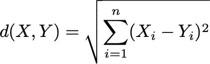
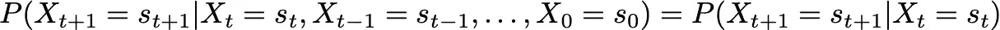
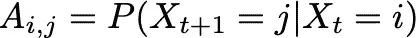
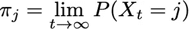
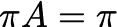
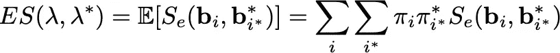
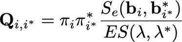
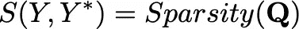
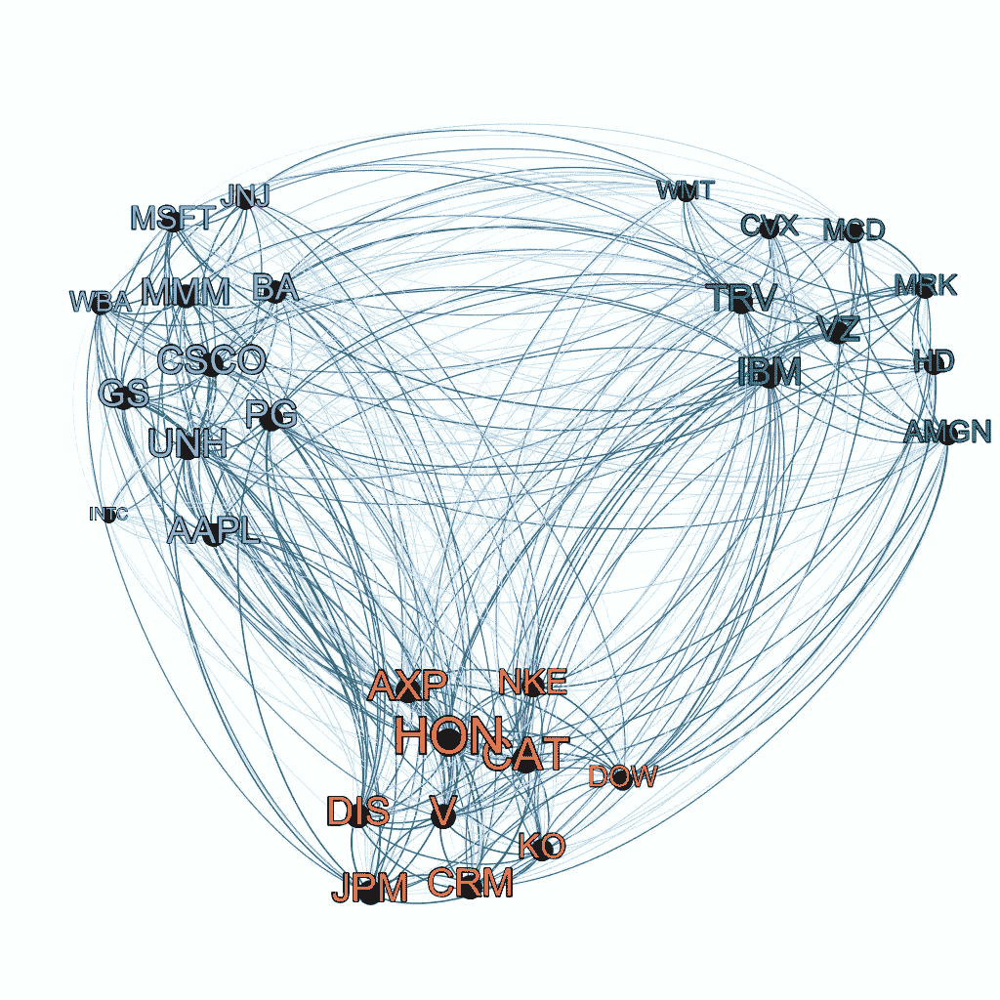
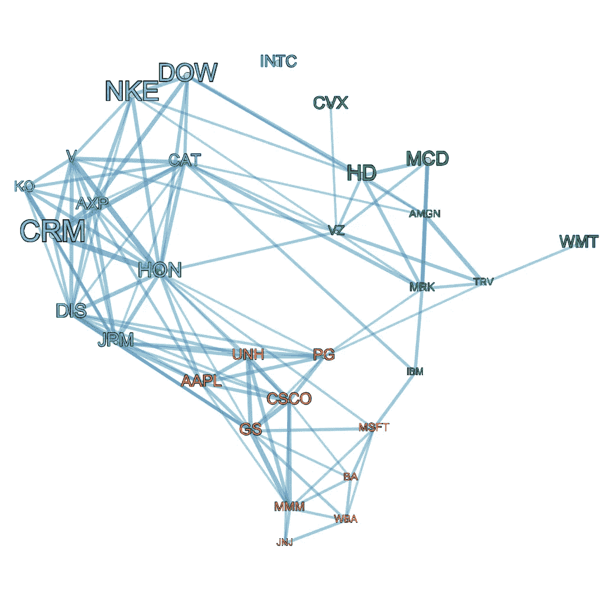

# 基于隐马尔可夫模型的可解释时间序列相似性

> 原文：<https://towardsdatascience.com/interpretable-time-series-similarity-with-hidden-markov-models-88fdf7ee4962?source=collection_archive---------18----------------------->

## 如何直观准确地找到相似之处，并增加了一个使用道琼斯 30 种股票的例子(包括代码)

马库斯·斯皮斯克在 [Unsplash](https://unsplash.com/s/photos/growth?utm_source=unsplash&utm_medium=referral&utm_content=creditCopyText) 上的照片

对于在数据科学和机器学习领域工作的许多专业人员来说，需要测量两个时间序列之间的距离是很常见的。从金融业到生态学，时间相关数据的收集无处不在，由于获得另一个数据点的唯一约束通常是时间，因此这种数据可能富含我们可以利用来获得新见解的信息。

在这一过程中经常遇到的垫脚石是衡量一个时间序列与另一个时间序列相似程度的能力。毕竟，如果我们能够确定两只股票或动物种群在时间上的行为相似，将会获得大量的洞察力，这里的关键因素是**时间**。大多数众所周知的相似性/距离度量，例如欧几里德距离、闵可夫斯基距离、汉明距离和 Jaccard 距离，只与单个数据点有关。然而，我们感兴趣的是找到一个*数据点集合之间的距离度量，这些数据点都以一种非常有趣的方式(即时间)相互关联*。毫不奇怪，有无数种方法可以做到这一点，每种方法都适用于特定的问题子集，但我在这里向您推荐的方法是使用**隐马尔可夫模型** (HMMs)。这种方法侧重于从全局和贝叶斯的角度比较两个时间序列的时间动态。

# 时间序列距离逼近的 TLDR

## 基于形状的测量

这种类型的相似性度量通常寻求直接比较时间序列，因此具有相似形状的时间序列被分配较低的距离。基于形状的度量的典型例子是欧几里德距离。对于两个时间序列 *X=* ( *X_1，X_2，…，X_n* )和 *Y=* ( *Y_1，Y_2，…，Y_n* )，欧几里德距离由下式给出

请注意，时间序列必须具有相等的长度和相同的时间索引。如果 *X* 和 *Y* 具有相似的值，并且通过扩展具有相似的形状，那么距离将会很小。这些方法对于短时间序列来说很棒，并且很容易解释，但是它们通常必须解决**噪声鲁棒性问题**。例如，假设对于任意时间点 *t_i* 和 *Y* = 0，由 *X* = *b * t_i* 给出 *X* 。我们可以制作一个新的仅由高斯噪声组成的时间序列 *Z* = *N* (0，σ)，使得 *d(X，Y) = d(Y，Z)* 。这个问题的严重程度当然取决于你手头的问题。

## 基于特征的度量

这种类型的距离度量试图用简单的距离度量(或度量)找到从时间序列空间到特征空间的映射。).一个很好的例子是安东尼亚迪斯等人的方法。阿尔[2]。其中他们使用离散小波变换将时间序列分解成时间-频率谱，并使用频率能量作为特征。

对于各种时间序列问题，这是一种很好的方法，特别是如果存在数据的直观或经过充分测试的特征表示，例如使用小波编码音频信号或使用傅立叶级数分解周期性产品需求。然而，它们仍然存在噪声敏感性问题，通常需要仔细选择超参数。

## 基于结构的度量

这种类型的测量试图识别时间序列的潜在结构和动态的差异，这就是我们的 HMM 方法所在。在我们的特殊情况下，我们的目标是找到准确描述时间序列的随机模型，然后**将时间序列距离定义为模型之间的距离**。我第一次接触到这个关于 HMMs 的想法是在 Ghassempour 等人的一篇论文中。艾尔。[2]，但我不能确定它的起源。

# 隐马尔可夫模型上的一个非常短的 TLDR

最基本形式的隐马尔可夫模型简单地寻求使用由马尔可夫链有条件地给出的概率分布的集合来对数据建模。

作为一个例子，考虑对连续实值的单变量离散时间序列 *Y* 建模的任务，并且假设我们想要使用 HMM 来做这件事。该模型将由主要组件、**隐藏状态**和**排放分布**组成。隐藏状态是一个有 *N* 个状态的马尔可夫链，这里我们要选择 *N* 。这意味着在每个时间 *t* ，模型可以处于属于状态集 *S* = { *s* _1， *s* _2，…， *s* _N}的单一状态 *X_t* ，并且*X【T25 _ {*t*+1 }处于任何状态的概率简单地说，我们将这种独立性描述为**马尔可夫属性***

这允许我们定义一个**转移概率矩阵**、 *A、*其中

这里，我们将只考虑**静态隐藏状态**，这意味着转移概率在时间上是恒定的，这在大多数具有适当预处理的应用中是足够的。

为了获得对 *Y_t* 的估计，HMM 简单地从单变量高斯*N*(*μ*_*t*， *σ* _ *t* )中采样，参数取决于状态 *X_t* 。这种结构允许 hmm 将时间序列 *Y* 的潜在行为分解成一系列 *N* 个可能状态，其中每个状态都遵循不同的高斯分布。

例如，如果 *Y* 是一个动物种群的增长率，我们可以设置 *N* =2 来尝试捕捉交配季节的影响，这样 *X_t* = *s* _1 对应于交配季节，其中*Y _ t*~*N*(*μ*_ 1， 而 *X_t* = *s* _2 对应的是一年的剩余时间*Y _ t*~*N*(*μ*_ 2、 *σ* _2)、 *μ* _2 非常小。

我们使用单变量高斯作为例子，但是 hmm 可以处理任何类型的分布以及这种分布的任何混合。因此，如果你有一个包含正态、分类和对数正态变量的多维时间序列，HMM 仍然可以很好地工作。参数估计过程相当冗长，所以我选择省略它，因为它可以被任何 HMM 包有效地处理。需要注意的一点是，我们可以很容易地定义这些模型的 AIC 和 BIC，这消除了在选择隐藏状态数的超参数时的一些偏差。

# 隐马尔可夫模型的距离度量

## 了解无限远处的行为

*“好吧，这个 HMM 的东西很有趣，但是它和时间序列的相似性有什么关系呢？”*

HMMs 的惊人之处在于，我们得到了一个随机过程，该过程对过去、现在和未来所有时间的数据的时间动态进行建模。因此，如果我们可以将 hmm 拟合到任何两个时间序列，我们可以将时间序列相似性等同于*如果我们在未来对它们进行无限次采样，这两个 hmm 的输出看起来会有多相似*。

隐藏状态的马尔可夫特性让我们可以做到这一点。实际上，几乎所有的马尔可夫链在其状态上都有一个**平稳分布** π，它给出了过程在任何时间处于任何状态的极限概率。我们可以这样表达

马氏链的一个非常方便的特性是，作为一个行向量，π是本征问题的解

其中 *A* 是我们的转移概率矩阵。**因此，我们可以知道从我们的时间序列导出的过程在无穷远处如何表现，而不必去无穷远处本身！当然，我正在掩饰推导的细节，但是对于这些，我推荐你去看看一本关于随机过程的书。**

## 距离度量

稳定分布是 Sahraeian 和 Yoon[3]创建的 HMM 距离度量的核心，在看到其定义后会更好理解。

设λ和λ*是来自两个时间序列的两个 hmm*Y*和 *Y* *，分别具有转移概率矩阵 ***A*** 和 ***A**** 和发射分布***B****=*{**B**_*I*}和 **其中 **b** _i 和 **b*** _ *i* *分别是λ的状态 *i* 和λ*的状态 *i** 的分布。 我们将 *ES* (λ，λ*)定义为所有可能状态对的预期概率分布，给出如下**

其中 *S_e* 是你选择的概率分布距离测度为 **b** _ *i* 和 **b*** _ *i* *的正单调递减函数，如 KLD、JS 距离等。接下来，我们将对应矩阵 **Q** 定义为

该矩阵量化了任何 HMM 状态对的分布有多相似，并通过两个 HMM 达到这种状态对的可能性来对它们进行加权。因此，如果两个 hmm 很可能处于产生比通常更相似的排放输出的状态，那么对应矩阵 **Q** 将在几个条目上饱和，并且变得**稀疏**。否则，如果具有相似分布的状态对不太可能或者如果发射分布不相似，则相反地 **Q** 将不会在任何地方饱和，因此变得**密集**。有许多矩阵稀疏度的措施，但基尼指数是一个受欢迎的，几乎普遍通用的选择。因此，我们的时间序列相似性度量由下式给出

**简而言之，直觉是，如果两个时间序列可以用很可能处于相似分布状态的隐马尔可夫模型建模，则该时间序列的相似度得分会更高。否则，如果 hmm 具有不同的动态或分布，分数将会更低**。

## 你可能要考虑的一些有用的属性/事物

1.  对应矩阵不必是正方形，所以即使它们具有不同数量的隐藏状态，即不同的复杂性，我们仍然可以计算 HMM 相似性！
2.  我们也可以比较在不同时间采样的时间序列，只要它们具有相同的采样频率。底层过程的随机结构毕竟是时间不变的。
3.  如果您选择使用归一化基尼指数作为稀疏性度量，则该度量也介于 0 和 1 之间。相似度为 0 意味着时间序列毫无相似之处(比噪声更相似)，而相似度为 1 意味着它们的确相似。
4.  它对噪声很鲁棒。
5.  HMM 参数是用贝叶斯方法拟合的，所以非常短的时间序列会产生类似噪声的模型，这反映了我们无法肯定地将它们与噪声区分开来。这种做法的可取性很大程度上取决于你手头的问题。

# 使用道琼斯 30 指数的实际例子

为了举例说明这种 HMM 时间序列的相似性如何为我们提供有价值的见解，我们将使用它来构建一个道琼斯 30 种股票的网络，并使用它来识别 2020 年期间具有类似每日对数回报趋势的股票。所有数据都是使用`tidyquant` R 包从 Yahoo Finance 获取的。使用对数收益的目的与 ARIMA 的差分法相同，我们必须**去除时间序列**的趋势，并将其放在**公共尺度**上，以便我们可以适当地建模并与 hmm 进行比较。创建网络的过程可以总结如下。

1.  对于道琼斯 30 指数成份股中的每一个对数收益率序列，我们用越来越多的隐藏状态来拟合单变量高斯 hmm，直到 AIC 开始增加，在这一点上我们停止。
2.  我们计算所有模型之间的相似性度量，并将结果存储在邻接矩阵中。对于高斯排放分布相似性 *S_e* ，我们使用添加了ε的倒数 Fisher-Rao 距离以避免除以 0，对于稀疏性测量，我们使用 Sahraeian 和 Yoon 在其原始论文中定义的归一化基尼指数。
3.  随着邻接矩阵的建立，我们将它导入 Gephi 来执行模块聚类并输出网络可视化。

结果是如下所示的网络。

每个节点标签根据其模块性聚类(即，最大化它们之间的总权重并且最小化相对于其他组的总权重的节点组)来着色，标签大小由其加权度来确定，并且对于更强的相似性权重，边被着色得更深更粗。这个网络已经很有用了，特别是如果你想用它作为空间模型的基础，但它很杂乱，我们对真正表现相似的股票更感兴趣，而不是有些相似。

因此，我们通过保留权重的前 75%来过滤网络边，并重新进行聚类。我们得到的是下面这个更容易解释的网络。

从这里你可以深入到数百种不同的分析中，但是如果我们没有使用 HMM 相似性这个神奇的工具，这一切都是不可能的。它利用 hmm 强大的理论基础，并通过比较时间序列的随机模型，将其与比较时间序列的直观思想相结合，从而产生一个易于解释的相似性度量。我希望这里的信息对你有用，也许你会在未来的项目中使用这个方法。这不是一个放之四海而皆准的解决方案，但是专业人员总是知道适合正确工作的正确工具。

# 参考

[1]a .安东尼亚迪斯、x .布罗萨特、j .库利亚里和 J. M .波吉(2013 年)。基于小波的函数数据聚类。*《国际小波、多分辨率和信息处理杂志》*， *11* (01)，1350003。

[2] Ghassempour，s .，Girosi，f .，和 Maeder，A. (2014 年)。基于隐马尔可夫模型的多元时间序列聚类。*《国际环境研究与公共卫生杂志》*， *11* (3)，2741–2763。

[3] Sahraeian，S. M. E .，& Yoon，B. J. (2010 年)。一种新的低复杂度 HMM 相似性度量。 *IEEE 信号处理字母*， *18* (2)，87–90。

## r 代码用于获取数据、查找相似性和构建网络矩阵