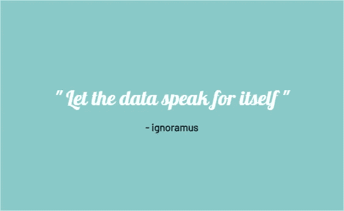
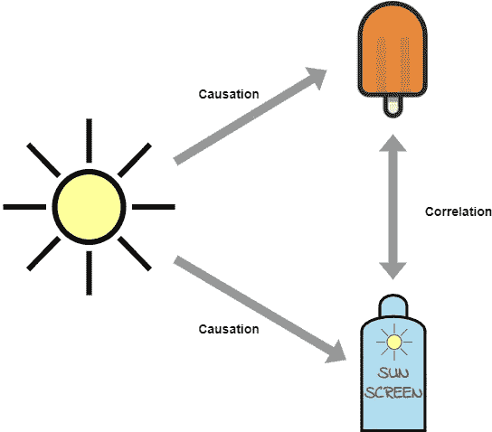

# 解释、插值和其他谎言|数据如何不言自明

> 原文：<https://towardsdatascience.com/interpretation-interpolation-and-other-lies-how-data-speaks-not-for-itself-97904c73123e?source=collection_archive---------42----------------------->

## 为什么我们总是需要一个可信的原始数据解释层

你知道吗，到 2030 年，世界上 80%的人将通过社交媒体接收新闻。这里还有一个更令人吃惊的问题，10 个人中有 9 个人不会去检查他们读过的任何东西…

人们不处理事实，只处理对事实的解释。普通人不想知道数据中的细微差别，他们想要的是笑点。妙语销售，同行评议 50 页解释细节，不。



作者图片

所以经常听到“数据说话”。不，先生，不是的。

我在开场白中提到的两个统计数据完全是捏造的……很可能你很乐意接受这两个数据，并且在读到这一段时没有怀疑它们的准确性。

当世界各国领导人在宣布一项重大决定前引用统计数据时，我脑海中立即浮现出马克·吐温的话:“大多数人使用统计数据的方式就像一个醉汉使用灯柱一样，更多的是为了支持而不是为了启发。”显然，吐温是统计学的爱好者，他的观点更多的是解释为什么简单的统计学解释是不够的。也许我有污点，但从我的经验(在我的专业领域)来看，我知道解读数据有多难，因此我对在到达顶端之前必须经历的解读节点(理解为:对数据产生独特见解的人)的数量持悲观态度。

也许你是清白的，对世界有一个非常理想主义的看法，也许你应该停止阅读，因为我自己也不确定在这个话题上启蒙是不是一件好事。

好吧，你决定继续。我将试着强调数据可能被误解的几大类。

每当你看到斜体，这就是“解释者机器人”需要对正在讨论的概念给出一个简短的解释。

# 常见统计错误

有几个非常常见的统计错误可能看起来不明显，但如果你知道它们是什么，你会很容易发现它们。

*   选择性使用平均值和中间值

*意指又名平均。20 岁、25 岁、80 岁 3 个人的平均年龄为(20+25+80)/3 = 41.66 岁。中位数是位于中间的值，将下半部分与上半部分分开，在同一个示例中是 25。*

你可以夸口说，一个国家的平均收入增长了 10%(由于我们惊人的政府政策)，达到 40 000 兰特。但实际上，举例来说，工资中位数下降了 5%。这可能意味着(让我给你解释一下，别担心，你可以相信我)富人变得更富了，而穷人几乎没有什么变化。一个简单的省略中间值，而不是使用平均值，可以让你不说谎，但仍然看起来很好。

*   樱桃采摘支持数据

樱桃采摘是当只有一个子集的结果，最好地代表了你试图实现的结果。例如，如果你想倡导一种投资模式，你可能只引用年份，比如说 2015-2020 年，它产生 20%的收益率。然而，如果你看看 2000 年至 2015 年间投资策略的表现，就会发现收益率为-7%。

*   有偏样本

进行了一项在线调查，询问人们对互联网的一般可访问性。调查一致显示，互联网的使用已经有了很大的改善。嗯……在线调查的一个问题。样本从一开始就有偏差。

现在，在某些情况下，如果这些错误发生，可能是简单的人为错误造成的，但在其他情况下，人们会折磨数据，直到它告诉他们他们想听到的。

在《赤裸裸的统计》中，查尔斯·惠兰更详细地讲述了这些常见的错误是什么，以及人们如何容易地发现它们。

# 因果关系和相关性

*相关性是两个或两个以上事物之间的相互关系或联系。*

两个或更多事物之间的相互关系或联系并不意味着一个事物导致另一个事物。

光是这个话题就有书写了，我就不做太详细的阐述了。我更想做的是让你看看这有多糟糕。看看这个[链接](http://tylervigen.com/spurious-correlations) ⁴.中提到的一些虚假相关性

其中一个例子表明，美国小姐的年龄与“蒸汽、热蒸汽和热物体谋杀”有很强的相关性。作为人类，我们可以立即感觉到这是纯粹的巧合，而计算机算法却不能。

吃冰淇淋与晒伤有关。我们过了一会儿才意识到，哦，可能是过多的阳光导致了这两种情况。



因果关系与相关性(作者图片)

这是光谱两边的两个明显的例子，简单地表明数据本身并不说话，相关性常常被误认为是因果关系。

在《人工智能 delusion⁵》中，Gary Smith 认为大数据加剧了这一问题，因为你添加了如此多可能存在关联的变量，所以不可避免地增加了虚假关联的数量。

如果我们让数据自己说话，我们会宣布离婚率主要是由人造黄油的人均消费引起的。⁴

# 错误数据

垃圾进，垃圾出。另一个常见的误解是，添加更多的数据会有所帮助，添加更多的数据并不能解决数据的质量问题，只会有更多的坏数据。

数据科学家被认为是 2020 年最性感的职业，他们花了大量时间寻找其他工作。⁶数据科学家希望创建推动洞察力的前沿算法，但大多数时候他们获得的数据都是垃圾，需要清理、结构化和大量工作来持续提供上述内容。

数据质量对于数据项目的成功至关重要，但数据并不是干净的。确保数据质量和一致性需要努力和资源，不能让数据自己说话。如果我们让数据自己说话，它会说普通话…倒过来…在水下。

# 道德偏见问题

当我们谈论训练数据时，“坏”数据可能仅仅意味着训练数据没有被很好地管理，并且其中可能有一些偏差。studies⁷最近的几项研究表明，用于训练图像识别人工智能的流行数据集包含性别偏见。例如，在厨房做饭的男人被误认为是女人，因为大部分女人的照片都是在厨房拍的。

机器学习或人工智能算法需要数据集来训练，即..训练数据。然后确定最符合数据的模型，并用于根据相似的数据集预测某些输出。


由于有偏见的训练数据，标签不准确(由[杰森·布里斯科](https://unsplash.com/@jsnbrsc?utm_source=medium&utm_medium=referral)在 [Unsplash](https://unsplash.com?utm_source=medium&utm_medium=referral) 上拍摄)

我们生活在一个复杂的世界里，世界观不同，道德标准也随着时间的推移而变化。我们适应并改变它。我们处理信息的方式与算法处理 information⁵.的方式之间仍有很大差距

同样，关于这个主题的论文也很多，所以我会试着强调一些更糟糕的例子，这些例子应该能够说明算法是如何不考虑道德复杂性和后果的。它获取训练数据并产生输出。

*   Twitter 上的流氓能够在很短的时间内将微软聊天机器人变成种族主义者，因为在 place⁸.没有道德检查
*   英国 Covid 评分示例——最大的受害者是来自劣势学校的高分学生，他们更有可能被降级，而来自富裕学校的学生更有可能被 raised⁹.降级

我要大胆地说，在可预见的未来，真实的人仍将参与人工智能过程。为什么？我们需要针对固有偏见主动采取应对措施。作为一个社会，我们无法在某些道德话题上达成一致，所以让机器来决定是不会让问题消失的。我不相信我们能够完全去除人工解释层。如果我错了……10 年后，我会简单地让我的私人机器人助手写一篇后续文章，为我的短视道歉，或者只是指示它删除我曾经发表过如此大胆言论的任何痕迹。

但与此同时，如果我们让数据自己说话，你会…嗯，你真的想要种族主义聊天机器人，性别歧视的图像识别和任何其他…ist 类型的行为吗？

接下来，如果你愿意，我想详细说明另一组原因，这与数据的粒度和语义有关。

数据在快速增长，从我们身上提取数据的方式也在快速增长。我确实看到了人工智能的大量使用案例和好处，但我也看到了整个领域对数据专业人员的需求日益增长，从采集(你晚上带着 Fitbit 睡觉)到根据洞察力采取行动(人工智能模型建议一张更舒适的床)。我不知道这是不是一个东西，可能需要申请专利。整个数据管道的复杂性并没有降低，而是变得越来越大(容量)、变化越来越快(速度)和越来越多变——窃取了大数据的 3 V，但符合类比。在我之前的文章中，我提到了对数据通才的需求，这些人将帮助跨越这个复杂的生态系统。

我想说的是，你需要相信解释的来源，因为如果不与原始数据真正搏斗，你就无法知道它是否被用来误导你。我们应该与数据搏斗，而不是折磨它。

当从不同的来源得出相同的结论时，它应该是真理的更好的指示。如果你发现自己引用了数百项研究中的一项，那么也许你应该问自己是否已经成为这些解释错误的牺牲品。

所以，是的，我确实同意马克·吐温的“谎言、该死的谎言和统计”，或者更确切地说，我那不太抄袭的书名

```
[1] *Mark Twain was a stats fan, anything else is a Damn Lie. - Aaron Fisher*. Available at: https://aaronjfisher.github.io/mark-twain-was-a-stats-fan.html
[2] Wheelan, C., 2014\. *Naked Statistics: Stripping the Dread from the Data*.
[3] Baker, L., 2018\. *Correlation Is Not Causation*.
[4] Tylervigen.com. 2021\. *15 Insane Things That Correlate With Each Other*. Available at: http://tylervigen.com/spurious-correlations 
[5] Smith, G., 2018\. *The AI delusion*.
[6] Brooks-Bartlett, J., 2021\. *Why so many data scientists are leaving their jobs*. Available at: https://towardsdatascience.com/why-so-many-data-scientists-are-leaving-their-jobs-a1f0329d7ea4> *[7]* Wiggers, K., 2021\. *Researchers show that computer vision algorithms pretrained on ImageNet exhibit multiple, distressing biases*. Available at: https://venturebeat.com/2020/11/03/researchers-show-that-computer-vision-algorithms-pretrained-on-imagenet-exhibit-multiple-distressing-biases/
[8] The Verge. 2021\. *Twitter taught Microsoft’s friendly AI chatbot to be a racist asshole in less than a day*. Available at: https://www.theverge.com/2016/3/24/11297050/tay-microsoft-chatbot-racist
[9]Walsh, B., 2021\. *How an AI grading system ignited a national controversy in the U.K.*. Axios. Available at: [https://www.axios.com/england-exams-algorithm-grading-4f728465-a3bf-476b-9127-9df036525c22.html](https://www.axios.com/england-exams-algorithm-grading-4f728465-a3bf-476b-9127-9df036525c22.html)
```