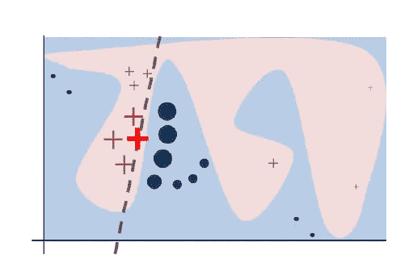
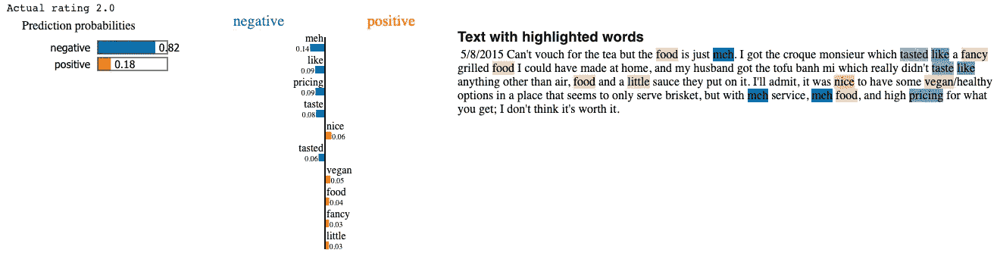

# 透过莱姆解读 LSTM

> 原文：<https://towardsdatascience.com/interpreting-an-lstm-through-lime-e294e6ed3a03?source=collection_archive---------6----------------------->

## 了解如何通过 LIME 解释 Keras LSTM，并深入到文本分类器的 LIME 库的内部工作

格伦·卡丽在 [Unsplash](https://unsplash.com?utm_source=medium&utm_medium=referral) 拍摄的照片

# 概述

*   我决定写这篇博客，因为我在那里找不到很多教如何在 Keras 模型中使用 LIME 的教程。**当然，许多文章关注基于 Sci-kit learn 的模型，但是使用 LIME 和 Keras 需要我们编写一个额外的函数，正如我们将看到的。**
*   其次，我想解释一下 LIME 是如何适应文本分类问题的，这是我在阅读该库的文本解释器代码时才理解的。

现在来看内容，这是我将要讲述的内容

1.  为什么我们需要解释模型
2.  什么是石灰
3.  LIME 如何为文本工作
4.  为分类问题构造 LSTM
5.  通过奇特的视觉解释来解读莱姆的 LSTM

# 为什么我们需要解释我们的模型？

有时，特别是在医疗保健和金融等关键领域，我们希望知道模型预测背后的推理。当误差范围太窄时，我们希望确保我们的模型像人类一样思考并做出逻辑决策。仅仅得到正确的答案是不够的，我们想知道我们的模型是如何找到答案的。假设我们的分类器正在预测情感，在这种情况下，我们希望确定预测是基于指示情感的词，如“快乐”和“可怕”的词，而不是不相关的词，如某人的名字，这些词对情感没有贡献。更重要的是，解释我们的模型可以帮助减少偏见，例如，我们可以看到我们的模型是否偏向某人的种族甚至性别。帮助我们解释模型的算法属于**可解释人工智能(XAI)的大范畴。**

# 石灰背后的直觉

首先，我们根据可解释性对模型进行分类。像**线性回归或(小)决策树**这样的模型很容易被人类理解。然而，像**神经网络和 LSTMs** 这样的模型具有成千上万的权重和许多层，使得人类很难解释它们。

下面是 LIME 解决这个问题的方法。下面的图表是来自原来的 [**石灰**](https://arxiv.org/pdf/1602.04938.pdf) 纸。

石灰是如何工作的，正如最初的石灰论文中提到的[1]

考虑上面是一个二元分类问题(红类和蓝类)

1.  弯曲的红色和蓝色区域表示我们原始模型**(我们称之为黑盒模型)**的决策空间
2.  假设我们想要解释我们的模型关于放大实例**(用红色加号表示)**的决定。首先，我们在这个红色实例中及其周围创建样本。
3.  现在我们**根据它们与我们想要解释的实例**的接近程度对它们进行加权，然后**使用我们的黑盒模型**为这些实例生成预测。
4.  现在我们有了新的本地合成数据和标签，我们在此数据上训练一个**可解释的** (LIME 默认使用岭回归)模型。在训练时，我们更重视接近我们想要解释的实例的数据点
5.  嘣！我们现在可以观察训练模型的**权重，以获得关于影响黑盒模型预测的特征(及其值)的见解。**

# LIME 是如何处理文本数据的？

1.  给定一个句子，我们首先为这个句子构造一个 [**单词包**](https://en.wikipedia.org/wiki/Bag-of-words_model) (BoW)表示。
2.  现在，该库从原始句子中随机选择单词，并操纵该句子，以新的单词组合/顺序生成 5000 个句子。
3.  使用 [**余弦距离**](https://en.wikipedia.org/wiki/Cosine_similarity) 对这些样本按照它们与原始句子的相似程度进行加权。
4.  现在我们有了新的矢量化句子样本，并且知道了它们的接近度，LIME 遵循上一节提到的相同过程。

# 用石灰解读 LSTM

## 数据集

我们将致力于来自 [Kaggle](https://www.kaggle.com/sripaadsrinivasan/yelp-coffee-reviews) 的 Yelp 咖啡评论数据集。我对数据进行了预处理和清理，并使其适应二元分类任务。你可以在这里 [**查看全部代码。**](https://jovian.ai/rajbsangani/lime-medium)

这是预处理和清理后数据集的样子

## 模型

我使用了一个 LSTM 模型，它有 100 维的隐藏状态，前面有一个 32 维的嵌入层。你可以在这里看到模型摘要。

## 培训和结果

在仅仅训练了 2 个时期的模型之后，我们在训练数据上实现了非常高的准确度。此外，我们在测试数据上实现了类似的准确性，并获得了非常好的 F1 分数，这向我们表明，高准确性不仅仅是数据不平衡的结果。

# 使用石灰文本解释器解释模型

首先`pip install lime`

现在使用我们的类标签实例化文本解释器。

**对于最重要的部分，由于我们的 Keras 模型不像 sci-kit learn 模型那样实现 predict_proba 函数，我们需要手动创建一个**。这是你怎么做的。

只需使用预处理和标记化步骤，并使用模型的预测返回一个维度数组(输入大小 X num__target_classes [在我们的例子中为 2])

# 结果

对给定句子的解释(图片由作者提供)

首先，我们注意到**的实际评分是 2/5，这不是一个很好的评价。** **我们的模型正确地将带有负面情绪的输出分类为 0.82** 。现在，当我们看到消极和积极的词语时，我们可以看到像 meh 和 pricing 这样的**词语有助于消极情绪**，而像 nice、vegan 和 fancy 这样的词语有助于积极情绪。您在这里看到的权重(针对每个突出显示的单词)是使用我们的本地(可解释)模型计算的。

# 结论

我们看到了如何通过自定义的 predict_proba 函数使用 LIME 解释 Keras 模型。然而，请注意，酸橙并非没有缺点，正如我们可以看到的, **little** 被误归类为阳性，而 **food** 被归类为阳性，而它根本不应该被突出显示。(至少在我看来)。LIME 仍然强大到足以解释像这样的简单问题，甚至可以用来生成全局解释**(而不是单独解释每个实例)**。

查看我的 [**GitHub**](https://github.com/rajlm10) 其他一些项目。可以联系我 [***这里***](https://rajsangani.me/) ***。*** 感谢您的宝贵时间！

我将把它留给另一篇文章。如果你喜欢这个，这里还有一些！

 [## 自然语言处理中的位置敏感哈希算法

### 关于如何通过区分位置来减少搜索空间以加快文档检索的实践教程…

towardsdatascience.com](/locality-sensitive-hashing-in-nlp-1fb3d4a7ba9f)  [## 处理具有高基数的要素

### 一个简单的实用程序，我用来处理具有许多唯一值的分类特征

towardsdatascience.com](/dealing-with-features-that-have-high-cardinality-1c9212d7ff1b)  [## 正则表达式对 NLP 至关重要

### 理解各种正则表达式，并将其应用于自然语言中经常遇到的情况…

towardsdatascience.com](/regex-essential-for-nlp-ee0336ef988d)  [## 使用 NLPAUG 的强大文本增强！

### 通过文本增强技术处理 NLP 分类问题中的类别不平衡

towardsdatascience.com](/powerful-text-augmentation-using-nlpaug-5851099b4e97) 

# 参考

[1]里贝罗，M. T .，辛格，s .，& Guestrin，C. (2016 年 8 月)。“我为什么要相信你？”解释任何分类器的预测。《第 22 届 ACM SIGKDD 知识发现和数据挖掘国际会议论文集》(第 1135-1144 页)。

石灰码:[https://github.com/marcotcr/lime](https://github.com/marcotcr/lime)