# 在假设检验中解释 AUROC

> 原文：<https://towardsdatascience.com/interpreting-auroc-in-hypothesis-testing-a45f6f757a62?source=collection_archive---------27----------------------->

## [实践教程](https://towardsdatascience.com/tagged/hands-on-tutorials)

## 你可能听说过统计能力，但你听说过统计能力下的面积吗？

二元决策出现在各个领域，从机器学习到假设检验。在二元分类的情况下，ROC(接收器工作特性)曲线展示了我们可能产生的两种错误之间的权衡。要将这条曲线转换成一个单一的指标，就要使用它下面的面积。这就是所谓的“ROC 曲线下面积”。它介于 *0* 和 *1* 之间，在特定概率方面有很好的解释。在假设检验中，ROC 曲线也被研究，但被称为“统计功效曲线”。然而，这条曲线下的面积并不常用作度量。

在本文中，我们将这条曲线下的面积解释为机器学习中使用的面积，并看看它如何转化为统计假设检验。我还将描述与 ROC 曲线属于同一家族的其他 7 条这样的曲线，以及它们下面的区域有什么解释。如果你使用二元分类模型，或者使用统计假设检验，或者是一个医疗从业者使用测试来诊断病人，或者只是在你的生活中做出二元决策，这篇文章将让你深入了解如何判断这些决策的质量。

# **I)二元决策**

二元决策可能是最简单的决策。所以，有能力做决定的实体最终会一直做这些决定。[战或逃](https://en.wikipedia.org/wiki/Fight-or-flight_response)大概是最古老的。

在现代世界中，二元决策并没有消失，而是出现在多个场景和领域中。例如(所有是非问题):

**医学:**

1.  告诉你是否有疾病的医学检查(例如:诊断癌症的活组织检查)。

**军事:**

1.  来自雷达的数据告诉你是否有飞机在你的领空。

**机器学习(二元分类):**

1.  将像素块分类为包含或不包含汽车。
2.  将电子邮件分类为垃圾邮件。(提示:[支持向量机](/svm-an-optimization-problem-242cbb8d96a8))

**统计(**</hypothesis-testing-visualized-6f30b18fc78f>****)****

1.  **雄性企鹅的身高平均比雌性企鹅高吗？(提示:两个样本 t 检验)**
2.  **接种疫苗的人访问 ICU 的比率是否低于未接种疫苗的人？(提示:[二项式检验](/turning-a-two-sample-event-rate-test-into-a-one-sample-binomial-test-23fbfb9d1df6))**
3.  **从一些真实世界过程中生成的数据是否符合特定的分布？(提示:卡方检验、Kolmogorov Smirnov 检验)**

**在本文中，我们将主要关注衡量做出这些二元决策的策略的质量。一旦我们对任何给定策略的表现有了一个客观的衡量标准，我们就可以将多个候选策略相互比较，并挑选出满足我们需求的“最佳”策略。从表面上看，这似乎是一个简单的问题，但在它背后有着令人惊讶的丰富的理论，在各自的领域中不断发展。我们将回顾其中的一些，试图将它们联系起来，并调查异花授粉的范围。**

# **II)行业工具**

## ****II-A)混淆矩阵****

**当你做决定的时候，你可能是对的，也可能是错的。当你做二元决策时，你可能在两方面都是对的，也可能在两方面都是错的(取决于你做出的决定)。二元决策通常可以被框定为是/否问题。你的决策机制可能会做出“是”或“否”的决定。不管是哪种情况，做这个决定可能是对的，也可能是错的。对于任何二元决策的例子，假设正确的选择是“是”。我们将用 *p* 来表示这种可能性(表示肯定)。如果正确的选择是“否”，我们将用 *n* 来表示(表示否定)。当决策机制做出“是”决策时，我们用⍴(希腊语版的 *p* )来表示，当它做出“否”决策时，我们用 *η* (希腊语版的 *n* )来表示。如果做出的正确决定是“是”( *p* )，而我们的机制也说“是”(⍴)，那就是真正的积极(TP)。另一方面，如果我们的机制说“不”( *η* )，那就是假阴性(FN)。另外两种可能性是假阳性(FP)和真阴性(TN)。我们的模型所说的和它应该说的四种组合的四种可能性(新⨉协议 2)。**

**这四种可能性最好用一个矩阵(一个“混淆矩阵”)来表示。列表示我们的机制做了什么，行表示它应该做什么。**

**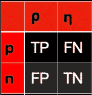**

**图 1:计数的混淆矩阵。由作者创建。**

**我们从这个矩阵中的条目开始计数。但是我们也可以通过对各行进行标准化，将它们转化为概率(或“比率”)。然后计数成为比率(真阳性率或 TPR，假阳性率或 FPR，假阴性率或 FNR 和真阴性率或 TNR)。真正的否定率也叫做“召回率”。**

**请注意，这将使真阳性率和假阳性率*不是*之和为 *1* (如果我们跨列进行标准化，就会发生这种情况)。参见 [1](https://stats.stackexchange.com/questions/144861/why-the-sum-of-true-positive-and-false-positive-does-not-have-to-be-equal-to-one) 。跨列标准化为我们提供了四个额外的比率。[ [3](https://en.wikipedia.org/wiki/Receiver_operating_characteristic) 中所示的表格涵盖了所有这八种速率及其各种名称。**

## ****II-B)分数****

**与其做出“是”或“否”的艰难决定，不如我们的机制返回一个中间“分数”。这个分数越大(或者在某些情况下，越小)，它应该越有信心表明正确的选择是“是”。**

**让我们通过一个简单的例子来说明。取下图中的绿点和红点。假设红色点表示“是”，绿色点表示“否”(举个经典的例子，这些点是雷达读数，红色标签表示敌机的存在)。**

**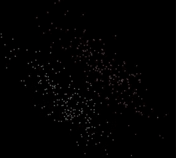**

**图 2:带有二进制标签(红色和绿色)的平面上的随机点。使用 [pyray](https://github.com/ryu577/pyray) 创建。**

**对于区分这些点的简单机制，我们在中间画一条线(许多简单的机器学习模型，如支持向量机和逻辑回归，确实是这样的)。为了对一个新点进行二元决策，我们说，如果它在线的右上角，我们会说“是”，如果它在线的左下角，我们会说“否”。**

**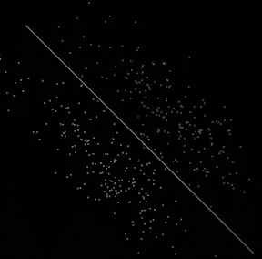**

**图 3:根据颜色划分点的分隔线。我们的决策机制可以变成将线的一边标记为红色，另一边标记为绿色。请注意，这种机制确实会在某些方面出错。使用 [pyray](https://github.com/ryu577/pyray) 创建。**

**在这个模型中，是什么让一个点“更绿”或“更红”？显著特征是任意点到直线的垂直距离( *d* )。**

**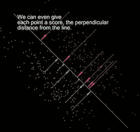**

**图 4:我们可以用点到直线的垂直距离作为分数来表示二进制标签。使用 [pyray](https://github.com/ryu577/pyray) 创建。**

**注意，距离是矢量。大多数绿色点的矢量指向右上角，而红色点的矢量指向左下角。因为这些向量是到直线的垂直距离，它们只能有这两个可能的方向。我们可以将左下方的方向定义为正，右上方的方向定义为负。然后，我们可以对每个点的距离进行分类，并绘制成直方图，如下所示(中心线右侧为正，左侧为负)。**

**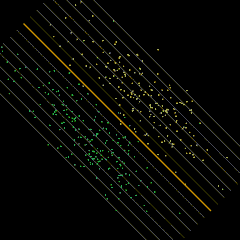**

**图 5:绘制直方图中的垂直距离。请注意，配色方案与前面的图略有不同，红色替换为黄色。希望这不会过多地分散对所演示要点的注意力。使用 [pyray](https://github.com/ryu577/pyray) 创建。**

**上面的两个直方图是从有限数量的数据中构建的。它们只是两个连续分布的近似值。以正确答案为“否”为条件的分数分布和以正确答案为“是”为条件的分数分布。**

**让我们把正确答案为“否”的分数分布称为 *A* 并画成绿色，而正确答案为“是”的分数分布称为 *B* 并画成红色。**

**下面的图 6 显示了这一点，也显示了第 II-A 节中的混淆矩阵，这次的比率是通过对各行的条目进行标准化获得的。**

**在左下角绘制了两种错误率，假阴性率( *FNR* )和假阳性率( *FPR* )，而在右下角我们绘制了真阳性率( *TPR=1-FNR* ) 和 *FPR。***

**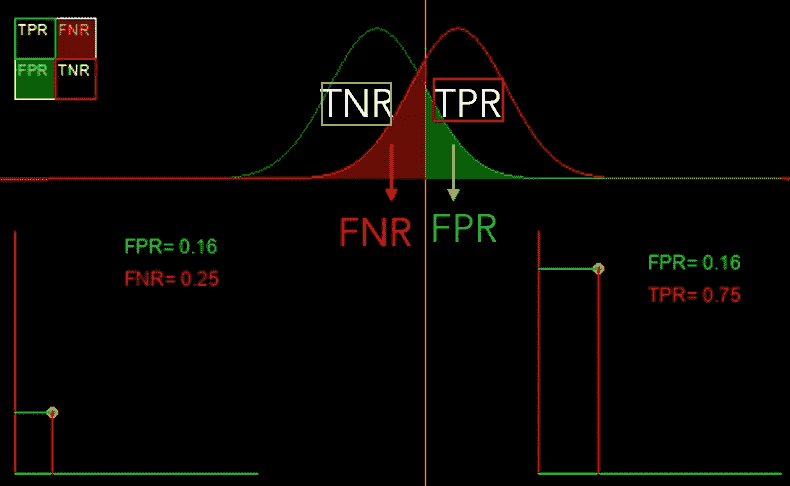**

**图 6:显示了我们分数的两种分布，给出的正确答案是红色的“是”(A)和绿色的“否”(B)。使用 [pyray](https://github.com/ryu577/pyray) 创建。**

**上面的图 6 是我们得到的决策规则，当我们从前面画的垂直线的距离为正时( *d > 0* )说“是”，当 *d < 0* 说“否”。在这里画出的假设案例中，这恰好给了我们 16%的假阳性率*和 25%的假阴性率*。第二个数字意味着在我们天空中敌机的总数中，75%的时间我们会得到警报，而 25%的时间会从我们身边溜走。说我们在和平时期没意见。但是战争爆发了，25%的假阴性率变得不可接受。我们没有资源投资新的雷达。我们该怎么办？我们可以简单地修改决策规则，并说我们将在 *d > -3* 时警告敌机的存在(有效地将我们警告的阈值向左移动)。这将为我们提供更好的假阴性率。但是既然我们还在用同一个雷达，这其中一定有蹊跷。现在假阳性率更差了。这意味着我们现在会更频繁地被假警报(没有敌人，但雷达仍然发出嘟嘟声)所困扰。****

***事实上，我们可以将分数 *d* (姑且称之为 *𝛕* )的阈值移动到我们喜欢的任何值，这将为我们提供一系列决策规则。这些可以在下面的动画中看到，图 6 中的黄色点描绘出两条白色曲线。***

***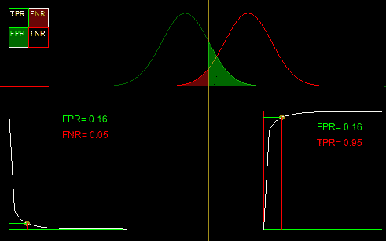***

***图 7:改变分数的阈值会改变混淆矩阵中的四个比率。然后我们可以将其中任意两个绘制成曲线。在左下方，假阳性率与假阴性率一起绘制。这表明我们可以获得较低的假阳性率，但代价是较高的假阴性率。在右下角，我们用假阳性率绘制了真阳性率。这就是著名的 ROC 曲线。使用[皮雷](https://github.com/ryu577/pyray)创建。***

***左边的曲线是假阳性到假阴性的权衡曲线。它向我们展示了，使用任何“雷达”或决策规则，我们都可以获得一系列错误率，这取决于我们希望在检测中有多积极。曲线的两个极端是点 *(0，1)* ，当我们无论如何都不说“是”时发生(因此没有假阳性，但假阴性率是 *100%* )和 *(1，0)* ，当我们无论如何都说“是”时发生。这两个极端显然是琐碎的，没有用的。这两个极端之间的曲线决定了我们决策机制的质量。曲线越靠近 x 轴，我们的“雷达”(或决策机制)质量就越好，因为这意味着错误率非常低。如果我们想用一个数字来表示我们的决策机制有多好，我们可以用这条曲线下的面积。曲线越靠近 x 轴，这个区域就越小，我们决策机制的质量就越好。最好的可能区域是 *0* 。在这篇文章的后面，我们将看到这个区域的解释是什么。***

# ***III) AUROC***

***假阳性对假阴性曲线下的面积越小，我们的决策机制就变得越好。当我们的决策机制变得更好时，如果我们想要一个更高的数字呢？我们可以绘制一条与假阳性到假阴性曲线类似的曲线，而不是在 y 轴上绘制真阳性率(即 *1-FNR* )。这给出了图 7 右下方的曲线，这就是著名的“接收机工作特性”或 ROC 曲线(这里的“接收机”是用来探测飞机的雷达)。就像我们考虑假阳性对假阴性曲线下的面积一样，我们也可以使用这条曲线下的面积作为我们决策机制质量的指标。这个区域被称为“接收机工作特性曲线下的区域”或 AUROC。很明显，最好的雷达是正负分数分布分离得非常好的雷达，AUROC 变成了一个单位正方形的面积，如下图所示 *1* 。***

***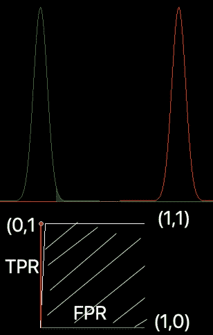***

***图 8:当分布被很好地分开时，AUROC 是 1。使用 [pyray](https://github.com/ryu577/pyray) 创建。***

***另一方面，当正样本和负样本的分布变得相同时，可能出现最坏的值。这意味着我们的分数根本没有区分能力(无论天空中是否有飞机，雷达都产生相同的分数分布；换句话说，它不是很有用)。在这种情况下，我们可以看到绿色区域将代表 *FPR* 和 *TPR* ，这意味着两者将变得相等，ROC 曲线将变成如下所示的 *y=x* 线。很明显这条线下面的面积现在是 *0.5* (覆盖了正方形的一半面积)。这一定是我们的 AUROC 指标所能得到的最差的结果。***

***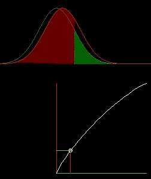***

***图 9:分布相同时的 ROC 曲线变为直线，其下方的面积变为 0.5。使用 [pyray](https://github.com/ryu577/pyray) 创建。***

***红色区域是 *FNR* ，它将变成 *1-FPR* 。下面显示的是 ROC 曲线在两个分布之间分离时的行为。AUROC 的范围从其最佳值 *1* 到其最差值 *0.5* 。***

***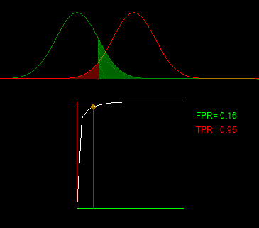***

***图 10:当白色曲线变得接近直线时，AUROC 为 *0.5。*使用[皮雷](https://github.com/ryu577/pyray)创建。***

***如果红色分布(阳性样本分布)位于绿色分布(阴性样本分布)的左侧，则 AUROC *将*降至 *< 0.5* 。然而，这将表明我们应该简单地改变我们说“是”的标准。当𝛕说“是”时，我们不说“是”。这个微小的变化将使我们的决策机制的性能更好，并使 AUROC 回到高于 *0.5* 的水平。***

***这个指标有许多优雅的解释。***

## ***III-A)解释***

***AUROC 有[几种等价的解释](https://web.archive.org/web/20160407221300/http://metaoptimize.com:80/qa/questions/988/simple-explanation-of-area-under-the-roc-curve):***

1.  ***期望一个随机的正数比一个随机的负数有更高的分数。***
2.  ***排在随机否定之前的肯定的预期比例。***
3.  ***如果排名在随机负数之前被拆分，则预期的真实正数比率。***
4.  ***排在随机肯定之后的否定的期望比例。***
5.  ***如果排名在随机阳性之后被拆分，则预期的假阳性率。***

***见[ [2](https://stats.stackexchange.com/questions/132777/what-does-auc-stand-for-and-what-is-it/349646#349646) ]很多关于它是什么的精彩回答。***

## ***III-B)解释证据-1***

***如前所述，当正确答案为“是”时，我们会说 *A* 是分数分布( *d* )，而 *B* 是否定情况的分数分布， *τ* 是决定二元决策的阈值。ROC 曲线下的面积由下式给出:***

***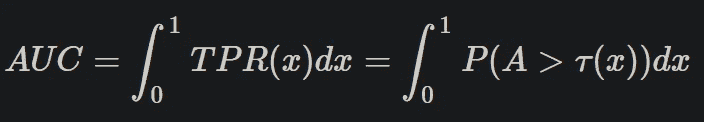***

***等式 1:作为积分的 AUROC。***

***这里， *x* 是假阳性率。***

***为了求解这个积分，如果我们从 *B* 本身的分布中抽取 *τ* ，这将使我们的工作变得容易。这也很好地配合了解释#3。但如果我们这样做， *x* 就变成均匀分布在 *(0，1)*(标准均匀)之间。原因是 *x* 由下式给出:***

***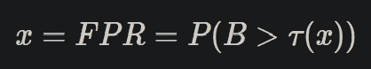***

***即在 *τ* 处计算的分布 *B* 的生存函数。但是我们刚才说我们从 *B* 的分布中采样 *τ* 。由于采样一个随机变量并将其代入自己的生存函数会产生[标准均匀分布](https://en.wikipedia.org/wiki/Continuous_uniform_distribution)，我们得到结论 *x* 是均匀的。我们证明了在 CDF ( *F_X(x))的情况下，将随机变量插入到它自己的生存函数中；*累积密度函数；随机值小于函数输入的概率)；很容易对其进行修改，使其适用于生存函数，因为 CDF 和生存函数的总和为 *1* :***

***首先，我们注意到 *F_X(X)* 的 CDF 与变量本身相同。***

***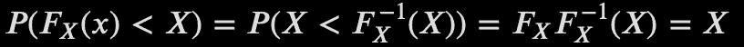***

***等式(2):证明将随机变量插入其自身的 CDF 或生存函数中会产生均匀分布的随机变量。***

***然后我们可以注意到，这只适用于标准的均匀随机变量。***

***将其插回到上面的 *AUC* 等式中，我们得到(将等式(1)中的*1*dx 解释为对均匀密度的积分):***

***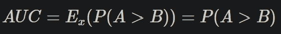***

***这就完成了证明。***

## ***III-C)目测 AUROC ≥ 0.5***

***我们之前提到过，AUROC 的最差可能值是 *0.5* ，这种情况可能发生，例如，当分布 *A* 和 *B* 完全相同时(我们将在本节描述发生这种情况时更一般的情况)。对于 *A* 和 *B* 的任何其他分布，如果不是这种情况，我们将有一个 AUROC *≥ 0.5* 或，切换我们的决定(当我们之前说“是”时说“否”，当我们之前说“否”时说“是”；以下称为“翻转策略”)将导致 AUROC *> 0.5* 。***

***这是因为“常规策略”(当 *d > 𝛕* 时说“是”，否则说“否”)和“翻转策略”(当 *d < 𝛕时说“是”，否则说“否”)的 AUROC 总和为 *1* 。因此，当然，如果常规策略产生的 AUROC 为 *0.4* ，的话，我们可以简单地切换到“翻转策略”，获得的 AUROC 为 *0.6* 。****

***然后我们要做的就是证明常规策略的 AUROC 和翻转策略的 AUROC 之和为 *1* 。***

***当 *A* 和 *B* 可以是太阳下的任何分布时(我们在图中绘制的分布已经是很好的钟形曲线，但是想想有多个模式的难看的分布，向一侧倾斜，等等),这必须被显示出来。).我们将直观地展示这一点。***

1.  *****翻转策略用 CDF 交换生存函数*****

***注意 ROC 曲线的 y 轴是: *P(A > τ)* ，x 轴是 *P(B > τ)* ，曲线被描绘为 *τ* 在 *A* 和 *B* 的域上变化。这些被称为在 *τ* 处计算的 *A* 和 *B* 的生存函数( *S_A(τ)* 和 *S_B(τ)* )。对于翻转策略，这些会发生什么？让我们首先考虑假阳性率(FPR)。下图显示，当我们从常规策略切换到翻转策略时，误报率从 *P(A > 𝛕)* ，或𝛕*a*的生存函数到𝛕*p(a<𝛕)*或*a**cdf_a(𝛕】**。****

***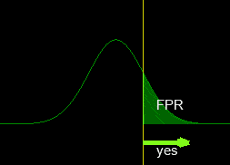***

***图 11:翻转策略的假阳性率是使用 [pyray](https://github.com/ryu577/pyray) 创建的分布 a 的 CDF。***

***类似地，真实正率从作为 *B* 的生存函数切换到作为 *B* 的 CDF。***

***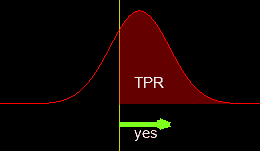***

***图 12:翻转策略的真实正利率是使用 [pyray](https://github.com/ryu577/pyray) 创建的分布 b 的 CDF。***

***现在我们知道了翻转策略的假阳性率和真阳性率，我们可以推断它是 AUROC。***

*****2。翻转策略的 AUROC*****

***首先，请注意下面图 13 中的红色和蓝色区域。红色区域就是 AUROC，它是 *P(A > B)* ，就像我们在上一节展示的那样。此外，蓝色和红色区域一起形成一个单位正方形。所以它们的组合面积是 *1* 。这意味着顶部切片的面积是 *1-P(A > B) = P(A < B)。****

***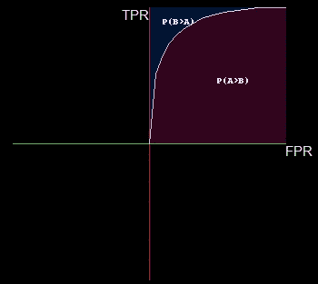***

***图 AUROC 显示为红色，在它上面，蓝色区域填充了单位正方形的其余部分。使用 [pyray](https://github.com/ryu577/pyray) 创建。***

***现在我们要绘制 *CDF_A* vs *CDF_B* 分别是 *1-S_A* 和 *1-S_B* 。首先，我们得到了 *-S_A* 和 *-S_B.* 的图。为此，我们否定了两个生存函数。当我们描绘出白色的 ROC 曲线 *S_A* vs *S_B* 时，我们也描绘出橙色的 *-S_A* vs *-S_B* 曲线。***

***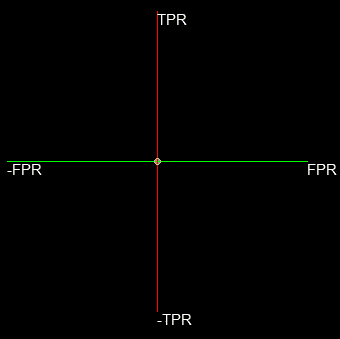***

***图 14:从 x 轴上的 S_A 和 y 轴上的 S_B 移动到-S_A vs -S_B 曲线(橙色)。使用 [pyray](https://github.com/ryu577/pyray) 创建。***

***现在我们有了 *-S_A* 和 *-S_B* 的剧情。但是我们想用 *1-S_B* 来绘制 *1-S_A* 。如果我们一般有一个 *y* vs *x* 的图，想画 *(y+b)* vs *(x+a)* 的图，做法是把原点连同轴和坐标系一起移动到 *(-a，-b)。*这确保原点映射到新坐标系中的 *(-a，-b)* ，所有其他点线性映射。对于我们的 *-S_A* vs *-S_B* 曲线，我们将原点移动到 *(-1，-1)* ，如下图所示。***

***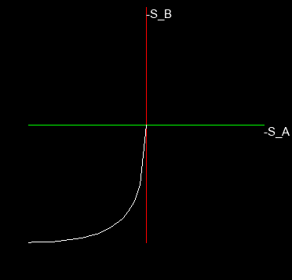***

***图 15:一旦我们有了-S_B vs -S_A 曲线，我们想要 1-S_B vs a-S_A 曲线，我们只需将原点连同整个坐标系一起移动到(-1，-1)。使用 [pyray](https://github.com/ryu577/pyray) 创建。***

***这为我们提供了 *CDF_A = 1-S_A* 与 *CDF_B=1-S_B* 的曲线图。现在，注意下面图 16 中蓝色阴影曲线下的区域。回头参考图 13，很容易看到它与蓝色区域相同，即 *P(B > A)。*这结束了翻转策略的 AUROC 是 *P(B > A)* 的事实的直观证明，这是常规策略的 1-AUROC。***

***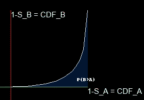***

***图 16:以蓝色显示的 CDF_A 和 CDF_B 形成的曲线下的区域与图 13 中的蓝色区域相同。使用 [pyray](https://github.com/ryu577/pyray) 创建。***

***注意:如果分布 *A* 和 *B* 共享同一个中位数，并且都关于该中位数对称，那么 AUROC 必然是 *0.5* 。换句话说，来自 *A* 的样本大于来自 *B* 的样本的概率是 *0.5* 。一般来说，无论何时 *P(A > B)* 为 0.5(无论分布的形状有多复杂)，AUROC 都是 0.5，这表明我们没有一个非常好的模型。***

***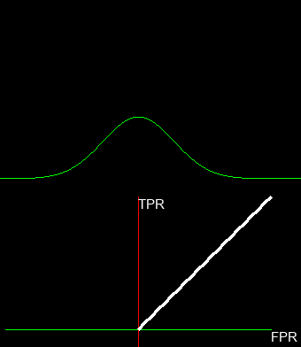***

***图 17:分布 A 和 B 的一些情况，其中 ROC 曲线改变，但其下的面积保持为 0.5。在所有这些情景中，P(A>B)=0.5。使用 [pyray](https://github.com/ryu577/pyray) 创建。***

## ***III-D)其他曲线***

***虽然 AUROC 的解释在许多地方都有涉及，但它是 8 条此类曲线家族的一部分(我们可以在 x 轴上绘制 CDF 或生存函数，在 y 轴上绘制 CDF 或生存函数，然后在 x 轴或 y 轴上选择 *A* 得到 *2⨉2⨉2=8* 曲线)，每条曲线下的区域都有类似的解释。其实所有这些区域要么是 *P(A > B)* 要么是 *P(A < B)* 。***

***我们看到 ROC 曲线只是 x 轴上分布 *B* 和 y 轴上分布 *A* 的生存函数。对我来说，假阳性对假阴性率曲线有更清晰直观的解释(在错误率权衡方面)。人们会在 x 轴上画出 *B* 的生存函数，在 y 轴上画出 *A* 的 CDF。这条曲线下的面积是*P(B>A)= 1-P(A>B)*。下面显示的是所有这些曲线。***

***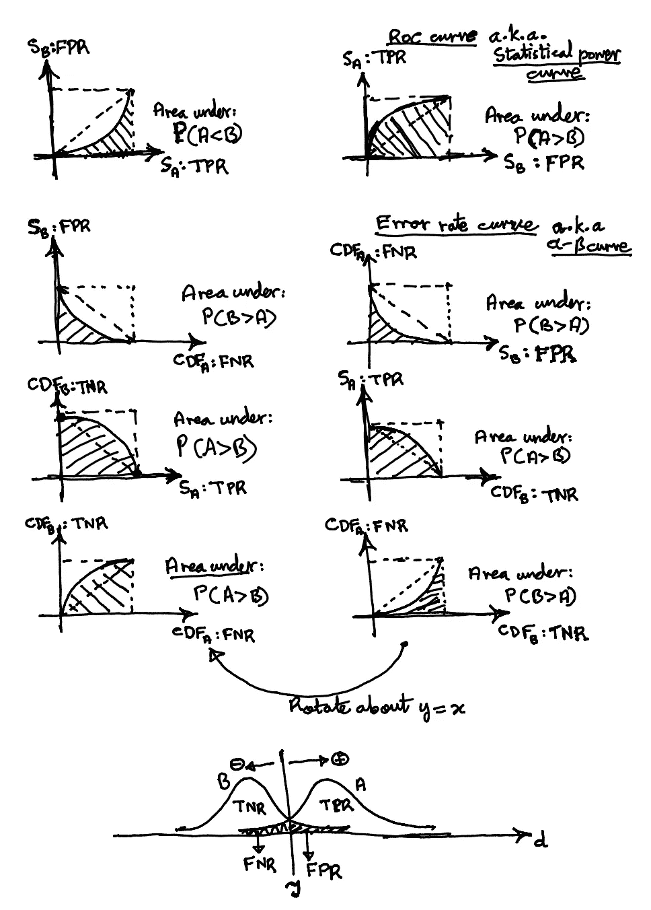***

***图 18:通过绘制比率混淆矩阵的不同条目，我们得到了 8 种不同的曲线。图片作者。***

# ***IV)在假设检验中***

***统计学与其他领域的区别在于强调产生数据的分布(例如:高斯分布、泊松过程等。)并试图理解顶层使用的模型的行为(用于做出二元决策或其他事情，如预测等。).***

***这是一把双刃剑。一方面，它带来了更多的可解释性、易处理性、直觉和对正在发生的事情的几乎端到端的把握，否则这是不可能的。另一方面，人们应该记住现实世界的数据很少遵循这些好的分布。人们有时会忘乎所以，忘记这一点。在某些情况下，这种与统计模型的偏差可能会严重影响模型的性能，但这并不总是一个问题。有些情况根本没什么大不了的，做二元决策就是其中之一。***

## ***IV-A)概率得分***

***对于一般的二元决策，我们只知道如何计算我们的分数， *d* (在假设检验的上下文中称为“检验统计量”)，并将其与某个阈值， *𝛕* 。当正确答案为“是”和“否”时，我们不一定需要知道分数的分布 *A* 和 *B* 。***

***我们确实需要想出一个策略来选择一个适合我们用例的阈值。一种方法是简单地查看我们知道标签的过去的数据，并设置它以使我们得到的尽可能多的答案是正确的。***

***由于统计领域强调使用基础分布，我们在这里假设我们确实知道这两种分布。当不应该有来自模型的任何警报时，分布 *B、*是在所谓的“零假设”下的分数分布，当应该有警报时，分布 *A* 是在所谓的“替代假设”下的分数分布。这两种分布可以是世界上的任何分布，但在大多数研究的场景中，它们往往来自同一个家族(都是 t 分布，都是二项式分布，等等。).***

***使用分布允许我们将分数或“测试统计”转换成一个概率(“p 值”)，该概率有一个很好的解释(在零假设下将观察到与测试统计相同或更极端的概率)。***

***使用 p 值的优势在于，我们可以对其设置阈值，而不是对原始分数设置阈值(称为“显著性阈值”)。这给了我们一个通用的、上下文无关的方法来定义这个阈值(一个非常流行的选择是 *5%* )。另一件好事是，如果 *B* 的真实世界分布确实接近我们用来将分数转换为 p 值的分布，那么我们得到的实际假阳性率将与显著性阈值相同。唯一的“危险”是，如果实际分布不同于我们假设用来计算 p 值的分布，那么实际的假阳性率就会偏离我们的显著性阈值。但这没什么大不了的，因为我们总是可以像以前一样依靠观察来校准阈值。***

***在这篇文章中，我们考虑的分数在 *-∞* 和 *∞之间。*可以通过引入一个单调函数将其转换为概率，该函数将分数作为输入，并将其映射到一个介于 *0* 和 *1* 之间的数字。我们从 *B* 在 *-∞* 到∞上的分布开始，并将分数传递到累积分布函数(CDF 该分布小于分数的概率)。将分数( *d)* 转换为概率(p 值)的函数为:***

****q = P(B < d)****

***这对应于某种假设检验，在这种检验中，我们希望只有当检验统计量下降得很低时才得到警告(“单边”检验)。还有其他种类，这里就不赘述了。***

***对分布的不同选择， *B* 会给我们从分数到概率的不同映射。在下面的图 19 中，我们看到当我们假设 *B* 遵循正态分布和柯西分布时，分数或检验统计量是如何映射到 p 值的。***

***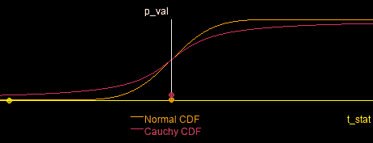***

***图 19:为了将分数或检验统计映射到 p 值(另一个从 0 到 1 变化的分数)，我们可以使用不同分布的 CDF 或生存函数。但是，由于检验统计量在其范围内变化，所以无论选择何种分布，都将研究 0 到 1 之间所有可能的 p 值。使用[皮雷](https://github.com/ryu577/pyray)创建。***

***由于分数或检验统计量在其范围(*-*∞*-∞)内变化，p 值从 *0* 变化到 *1* 。因此，ROC 曲线的形状(或上一节中的其他 8 条曲线中的任何一条)以及关于它们的其他一切都将保持不变，不管我们选择什么分布来映射 p 值。这将在[ [4](/hypothesis-testing-the-distribution-doesnt-matter-79882ba62f54) 中进一步探讨。****

****在假设检验的背景下，ROC 曲线被称为“统计功效”曲线。两者完全相同，x 轴为 FPR，y 轴为 TPR。****

****然而，在统计学的背景下，谈论“统计功效曲线下的面积”并将其用作衡量假设检验性能的方法并不常见。这样做是完全没问题的，但是，对这样一个区域的解释是，在零假设下进行的实验的检验统计量低于当备选项为真时进行的实验的检验统计量的概率。****

****作为一个例子，考虑一个测试，我们开始确定雄性企鹅是否比雌性企鹅平均高。我们集合了几十名男性和几十名女性，找出两组人的平均身高，并根据 [t-test](https://www.jmp.com/en_us/statistics-knowledge-portal/t-test/two-sample-t-test.html) 转换成测试统计数据。功效曲线下的面积将是我们计算的检验统计(或“得分”)的概率(关于如何从两个样本中精确计算的详细信息，请参见维基百科关于 t 检验的文章[这里](https://en.wikipedia.org/wiki/Student%27s_t-test))当没有差异时，将低于我们计算的(如果有差异的话)。****

# ****五)结论****

****总之，来自机器学习的 ROC 曲线映射到来自假设检验的统计功效曲线。机器学习中这条曲线下的面积是随机正样本比随机负样本获得更高分数的概率。在假设检验的情况下，统计功效曲线下的面积表示在替代假设下进行的实验比在零假设下进行的相同实验具有更高的检验统计量(或等价地，更低的 p 值)的概率。****

****_______________________________________________________****

****如果你喜欢这个故事，成为推荐会员:)****

****【https://medium.com/@rohitpandey576/membership ****

# ****参考****

****[1]为什么是 FPR+TPR！= 1[https://stats . stack exchange . com/questions/144861/why-the-sum of-true-positive and-false-positive-not-have-to-be-equal-one](https://stats.stackexchange.com/questions/144861/why-the-sum-of-true-positive-and-false-positive-does-not-have-to-be-equal-to-one)****

****AUROC 代表什么，stats . stack exchange[https://stats . stack exchange . com/questions/132777/What-does-AUC-stand-and-What-is-it/349646 # 349646](https://stats.stackexchange.com/questions/132777/what-does-auc-stand-for-and-what-is-it/349646#349646)****

****[3]接收器操作特性维基百科文章[https://en . Wikipedia . org/wiki/Receiver _ operating _ character istic](https://en.wikipedia.org/wiki/Receiver_operating_characteristic)****

****[4]假设检验:空值的分布无关紧要[https://towards data science . com/Hypothesis-testing-the-distribution-无关紧要-79882ba62f54](/hypothesis-testing-the-distribution-doesnt-matter-79882ba62f54)****