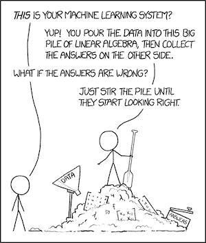
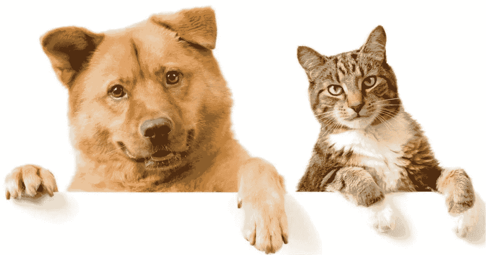
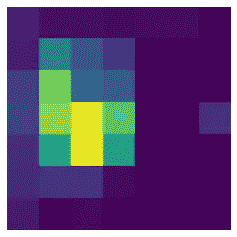
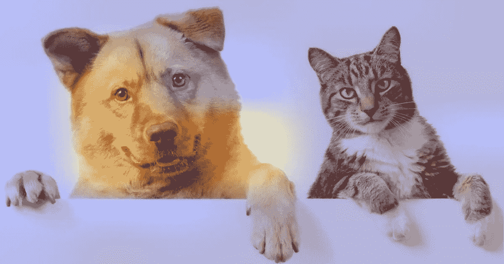
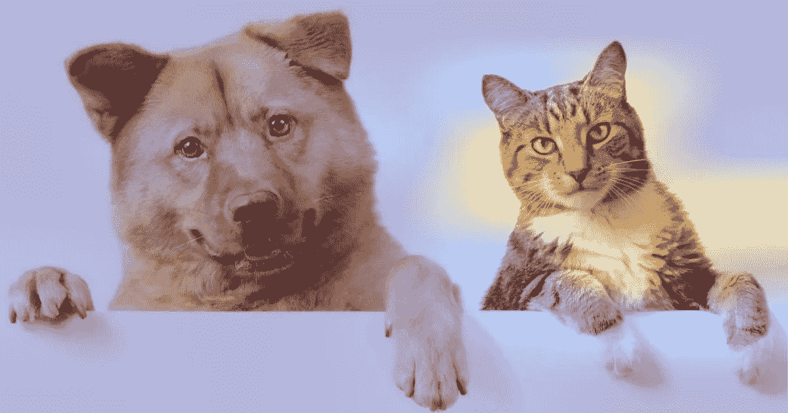
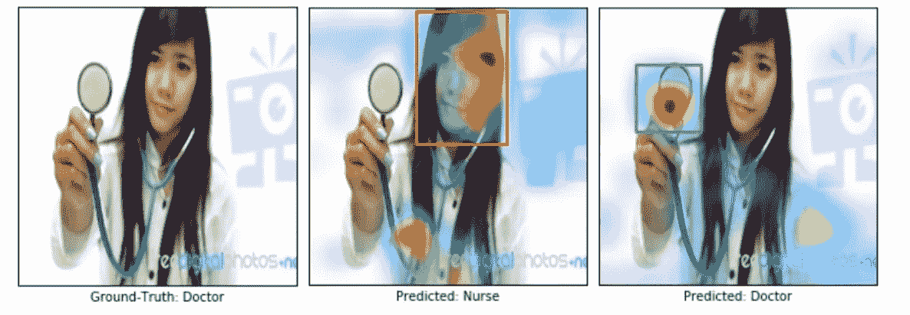
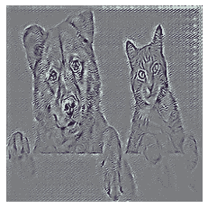
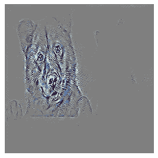

# 解读 CNN 模型

> 原文：<https://towardsdatascience.com/interpreting-cnn-models-a11b1f720097?source=collection_archive---------28----------------------->

## 如何对我们的预测进行直观的解释

# TL；DR —跳转到代码

Grad-CAM 为您的 CNN 模型的预测提供了一个区分类别的可视化解释。制导 Grad-CAM 也使可视化具有高分辨率。您可以在这里找到生成可视化效果[的代码。](https://colab.research.google.com/drive/1L4Oy-_dkP4Qb1SpuqbyrIPDu7DYQCMAN?usp=sharing)

# 问题是

如今，机器学习模型被广泛用于自动化和决策制定。模型的可解释性对于调试这些模型以及在系统中建立信任都是至关重要的。当我们使用传统的机器学习解决方案，如基于树的模型时，有大量的工具可用于模型的可解释性。我们可以可视化单个的树，绘制[部分相关](https://scikit-learn.org/stable/modules/partial_dependence.html)图来理解不同特征对目标变量的影响，使用像[形状值](https://github.com/slundberg/shap)这样的技术来计算特征重要性或解释单个预测背后的因素，等等。

然而，深度学习模型通常被视为黑盒。我们投入大量数据，训练一个模型，希望它能起作用。在本文中，我们将一窥计算机视觉模型的黑箱内部——特别是，模型在进行预测时关注的是什么？是学习人类相似的直觉，看着正确的事物做出正确的预测吗？

通过 [xkcd](https://xkcd.com/1838/) 进行机器学习

# 什么是好的直观解释？

对于图像分类，用于证明任何目标类别的来自模型的“好的”视觉解释应该满足两个特性:

1.  **类别区分** -它应该能够定位输入图像中的不同区域，这些区域对不同的输出类别有贡献。
2.  **高分辨率**:应该能够捕捉到精细的细节。

# Grad-CAM

梯度加权类激活映射(Grad-CAM)使用流入最终卷积层的任何目标概念(比如分类网络中的“狗”)的梯度来生成粗略定位图，突出显示图像中的
重要区域，用于预测概念。让我们来分解一下:

## 为什么要用最后的卷积层？

CNN 中更深的层捕捉更高层次的视觉结构。此外，卷积层自然保留了全连接层中丢失的空间信息(通常出现在 CNN 架构中的最后一个卷积层之后)，因此我们可以预期最后一个卷积层在高级语义和详细空间信息之间具有最佳折衷。这些层中的神经元在图像中寻找特定于语义类别的信息(比如对象部分)。

## 生成类激活图

要生成类激活图，我们需要获取在最后一个卷积层中检测到的特征，并查看在预测输出概率时哪些特征最活跃。换句话说，我们可以将最后一个卷积层的特征图阵列中的每个通道乘以关于输出类的“该通道有多重要”,然后对所有通道求和，以获得图像中相关区域的热图。

## CAM vs Grad-CAM

传统的 CAM 使用全局平均池权重来衡量最后一个卷积层的激活。CAM 的一个缺点是，它需要特征映射直接位于 softmax 层之前，因此它仅适用于在
预测之前对卷积映射执行全局平均池化的特定种类的 CNN 架构(即，conv 特征映射→全局平均池化
→ softmax 预测层)。

Grad-CAM 使用流入 CNN 最后一个卷积层的梯度信息来分配重要性值。Grad-CAM 适用于
种类繁多的 CNN 型号系列

## 观看 Grad-CAM 的运行

让我们拍摄一张包含一只猫和一只狗的输入图像，看看 Grad-CAM 的表现如何。

包含一只猫和一只狗的图像。(图片来自 Keras [示例](https://keras.io/examples/vision/grad_cam/)在 Apache 许可下)

应用 Grad-CAM 会生成与卷积特征图大小相同的粗略热图

Grad-CAM 热图显示了最终卷积层神经元在预测中的重要性。(图片由作者提供)

然后可以调整该热图的大小，并将其叠加在原始图像上。我们可以看到，它能够非常准确地识别狗的区域和猫的区域。

对应于狗类的 Grad-CAM 热图。(图片来自 Keras [示例](https://keras.io/examples/vision/grad_cam/)由作者编辑)

对应于 cat 类别的 Grad-CAM 热图。(图片来自 Keras [示例](https://keras.io/examples/vision/grad_cam/)由作者编辑)

# 应用:使用 Grad-CAM 减少偏差

让我们离开猫和狗，看看一个更实际的用例。在有偏见的数据集上训练的模型可能无法推广到真实世界的场景，或者更糟的是，可能会延续偏见和刻板印象(性别、种族、年龄等。).以一个在图像搜索结果上训练以识别护士和医生的模型为例。

一个医生的形象。有偏模型预测这个是护士，无偏模型预测医生。我们使用 Grad-CAM 来可视化两个模型的预测。(图片来自 [Grad-CAM 论文](https://arxiv.org/abs/1610.02391))

事实证明，搜索结果存在性别偏见——78%的医生图片是男性，93%的护士图片是女性。有偏见的模型通过看脸和发型做出了错误的预测(将医生误归类为护士)。我们使用 Grad-CAM 来可视化模型关注的区域。

使用从 Grad-CAM 可视化中获得的直觉，我们通过添加男护士和女医生的图像来减少训练集中的偏差，同时保持每个班级的图像数量与以前相同。看着白大褂和听诊器，无偏模型做出了正确的预测。这不仅对更好的推广很重要，而且对公平和道德的结果也很重要，因为在
社会中有更多的算法决策

# 更进一步:高分辨率

Grad-CAM 能够产生区分类别的可视化效果。但是，它会生成最终卷积层大小的热图，然后将最终卷积层的大小调整为输入图像的大小。因此，该热图是一个粗糙的低分辨率热图。

## 导向反向传播

如果我们对输入图像进行进一步的梯度处理，而不是停留在最终的卷积层，会怎么样？它可以生成细粒度的输入像素级热图。

这种反向传播可视化，通常称为显著图，可以通过获得损失相对于图像像素的梯度来生成。强烈影响损失的某些像素的变化将被明亮地显示。然而，这通常会产生噪声图像，并且已经表明在反向传播期间将梯度削波小于零(直观上只允许正面影响)会产生更清晰的图像。这类似于向前传播中的重新激活。这项技术被称为引导反向传播。

导向反向传播生成与输入图像大小相同的梯度热图。由于我们不需要将小特征地图的尺寸调整到输入图像的尺寸，这是构造高分辨率。然而，这里的缺点是可视化没有阶级区分。你可以看到图像中狗和猫的部分都亮了，这与狗的丢失相对应。

狗的引导反传可视化。(图片由作者提供)

但是请注意，这种可视化仍然非常有用。这只是图像大小的梯度，但它清楚地识别了猫区域、狗区域和背景区域。这可能表明，如果狗或猫的区域发生变化(比如猫显示得更突出或狗显示得不那么突出)，它可以改变预测。

## 制导摄像机

我们可以通过合并 Grad-CAM 热图作为特征重要性来解决引导式反向传播可视化不具有类别区分性的事实。这给出了一个类区分和高分辨率的图像。

狗的引导 Grad-CAM 可视化。(图片由作者提供)

# 摘要

我们不要再把深度学习模型当成黑盒了。我们需要开发更多的工具和技术来窥视模型内部并理解它们。这对于验证模型不仅做出正确的预测，而且使用正确的信号做出预测是至关重要的。Grad-CAM 和引导 Grad-CAM 为理解 CNN 模型的预测提供了一种极好的方式。

这是一个包含代码的 [colab](https://colab.research.google.com/drive/1L4Oy-_dkP4Qb1SpuqbyrIPDu7DYQCMAN?usp=sharing) 笔记本，用于生成 Grad-CAM、引导后向传播和引导 Grad-CAM 可视化。

# 参考

1.  Grad-CAM:通过基于梯度的定位来自深度网络的视觉解释， [arXiv:1610.02391](https://arxiv.org/abs/1610.02391)
2.  【https://keras.io/examples/vision/grad_cam/ 
3.  [https://github . com/ismailuddin/grad cam-tensor flow-2/blob/master/notebooks/grad cam . ipynb](https://github.com/ismailuddin/gradcam-tensorflow-2/blob/master/notebooks/GradCam.ipynb)