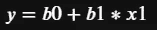
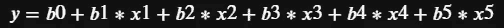
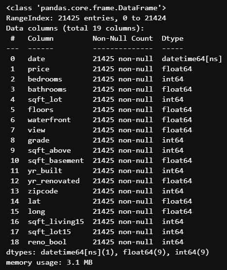
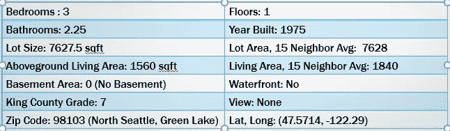

# 解释令人困惑的多元线性回归结果

> 原文：<https://towardsdatascience.com/interpreting-confusing-multiple-linear-regression-results-bd986254a939?source=collection_archive---------11----------------------->

## 你需要永远理解 MLR 系数的唯一技巧。

艾萨克·史密斯在 [Unsplash](https://unsplash.com/s/photos/graph?utm_source=unsplash&utm_medium=referral&utm_content=creditCopyText) 上拍摄的照片

多元线性回归(MLR)是数据科学家常用的工具。像 MLR 这样的推断统计工具用于推断仅从源数据无法得出的模式。在 MLR 的情况下，我们试图通过确定所有独立变量的组合与来自人口的*样本*的因变量之间的线性关系，来预测*人口*中与预测因子或独立变量变化相关的结果或因变量。要用文字说的话太多了，所以让我们快速看一些方程来保证我们的理解。首先，我们将从一个因变量的线性回归开始，其中拟合样本数据的直线具有以下方程

其中 *y* 是我们的结果， *x1* 是我们的预测值*，b1* 是我们的第一个系数，使得 *x1* 的值变化 1 导致 *y* 变化 *b1，*和 *b0* 是我们的 y 轴截距，或者当 *x1* 为零时直线与 y 轴相交的位置。在这种情况下，我们将使用该模型根据新的独立值 *x1* 来预测新的结果 *y* 。通过添加更多的*系数*独立变量*项，我们可以很容易地将它从单一线性回归扩展到多元线性回归，如下所示

除了五个独立变量和它们各自的系数，我们还有轴截距。从技术上来说，我们可以用与单一回归相同的方式轻松解释我们的系数 *b1* 到 *b5* ，但是，这需要一些假设，而这些假设对于现实世界中的数据并不总是完全正确的。多重和单一线性回归的主要假设是:

1.  线性:结果和预测变量之间存在线性关系。
2.  正态性:通过从实际值中减去预测值计算出的残差或误差遵循正态分布。
3.  同方差:因变量的可变性对于自变量的所有值都是相等的。

除此之外，我们还经常为不完全符合这些标准的数据构建线性模型，因为在 MLR 中有许多独立变量，我们会遇到其他问题，如多重共线性，其中假设独立的变量彼此不同，以及分类变量的存在，如海洋温度被分类为冷、暖或热，而不是以度数量化。有多种方法可以处理多重共线性，例如从分析中删除两个共线预测值中的一个，但有时对于弱相关的要素，这会导致信息丢失，这对预测的影响大于帮助。您还可以将交互项添加到线性表达式中，通过将两个原始列相乘来创建新的预测值，但是解释交互项系数非常复杂。同样，分类列系数也很复杂，因为它们被解释为偏离您丢弃的类别值的变化(小心虚拟变量陷阱！).这些改进了你的 MLR 预测，但最终，使你的模型更加复杂，当你希望向你的团队成员传达你的模型已经阐明的关键要点和模式时，你不能简单地看上面方程中的系数。那么，有什么诀窍呢？当变量和分类变量之间存在交互作用时，我们如何解释单个变量对结果的影响？答案很简单:

尤达传达的信息更多的是相信你自己，你可以做任何你认为你能做的事情，但是我们要采取一个更懒惰的选择:不做。说真的，不要尝试！有一种更好的方法来观察一个预测变量的变化导致的结果变量的变化，而不是试图解释复杂模型中的系数，而*就是诀窍。*

让我们来看看 Kaggle 上的一个流行数据集的多元线性回归结果，[King Count](https://www.kaggle.com/harlfoxem/housesalesprediction)y USA 的房屋销售，这是一个关于 2014 年 5 月至 2015 年间在华盛顿州西雅图及其周围出售的房屋的信息集合，作为解释 MLR 预测的演示。回归希望预测销售价格，并有许多预测因素，包括卧室和浴室的数量，居住面积的平方英尺，楼层数，以及 15 个左右的其他因素。在良好的回归实践中，我们可以在清理数据集后消除其中一些，并使用 Pandas 数据框架构建基线普通最小二乘模型，如下所示:

虽然在观察它们与销售价格的关系时，这些列中的许多列不能满足上述假设，但是具有一些额外构造特征的最终 MLR 模型仍然产生了不错的结果。使用最终模型来预测下面虚拟房屋的价格，其中大多数预测值的列中值位于该县人口最多的邮政编码区，有三间卧室，最常见的质量等级为 7，我们估计为 559，299 美元。

其他三个在同一个邮政编码同一个县等级(N = 124)的卧室，均价 588888 美元。我们的预测相当不错！此外，误差计算表明，我们的 MLR 模型将在 95 %的时间内正确预测 75，000 美元范围内的房价。然而，这种准确性是通过添加两个相互作用项并将一些列更改为分类列来实现的，这是一种改进上面提到的 MLR 模型的技术，如果您不熟悉，我鼓励您进行研究。我不会告诉你最终数据框架的细节，但是与上面数据框架信息中显示的十几个预测器相比，最终模型使用了 117 个预测器！那么，我们如何运用我们的“不做”策略来观察，比如说，如果增加一间浴室，房子的价格会有什么变化呢？无论您是使用 sci-kit learn、statsmodels 还是任何其他库来生成 MLR 模型，您的模型类无疑都有一个 predict callable。因此，我们可以只改变一个预测参数，在这种情况下是一个家庭特征，然后看看新的预测结果是什么！例如，如果上面的房子有一个额外的浴室，新的价格预测将是 570，099 美元。多一间卧室，554796 美元。国王郡的成绩从 7 级提高到 8 级，607，850 美元。

如果我们想象一个商业案例，我们可以看到这是一种解释结果变化的有用方法，它与我们的独立变量的变化有关。假设你经营一家卖房子的公司；你想通过家居装修改变家居特征，影响卧室、卫生间、面积、等级评级等，找到能赚最多钱的家。使用这个模型，你可以预测你的房子的价格。然后，对输入预测值进行更改，看看价格预测如何变化！一个好的策略可能是在相对于静态独立变量合理的范围内改变单个变量，并根据预测结果绘制变化的变量。不需要根据 MLR 系数进行解释。当然，作为一名数据科学家，这仍然需要您做出一些解释。从上面看，我们看到，提高住宅的档次会大幅提高价格；更好的房子，更好的售价。我们还看到，增加一间卧室*会降低*价格。为什么会这样？嗯，其他一切都保持不变..尤其是房子的面积。这意味着你必须从其他房间拿走生活空间来创造这个新卧室。通过观察单个变量变化的结果变化，我们看到了多重共线性的影响(卧室数量通常随平方英尺而变化)和解释单个系数的挑战。在这种情况下，你会想通过增加或利用闲置空间*以及*增加一间卧室来增加面积，价格优势将在新的预测中反映出来。这样，我们可以使用 MLR 模型来告知我们如何在改造业务中最有效地从转手房屋中获利。

照片由[米利沃伊·库哈尔](https://unsplash.com/@mimithecook?utm_source=unsplash&utm_medium=referral&utm_content=creditCopyText)在 [Unsplash](https://unsplash.com/s/photos/remodel?utm_source=unsplash&utm_medium=referral&utm_content=creditCopyText) 上拍摄

因此，总的来说，当你的 MLR 模型变得复杂，你采取措施提高它们的有效性时，不要试图用系数来解释结果的变化，而不是单个预测因子的变化。在改变单一预测因子的同时创建预测，观察预测如何变化，并利用这些变化的性质来形成你的结论。