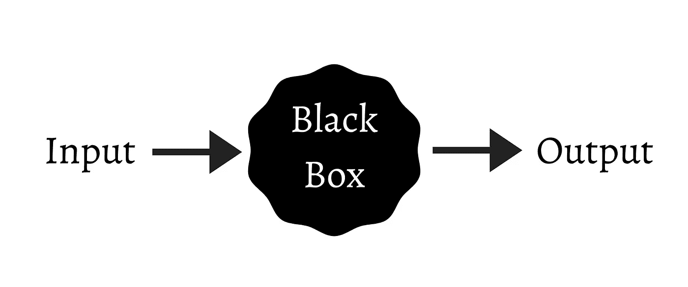
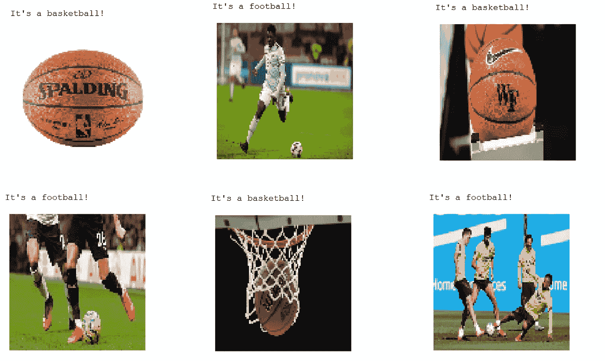
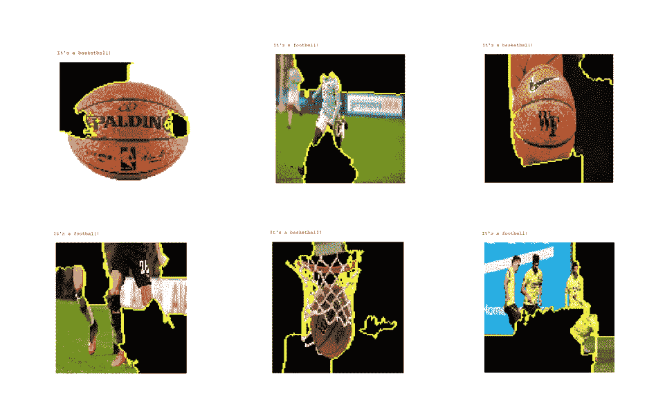
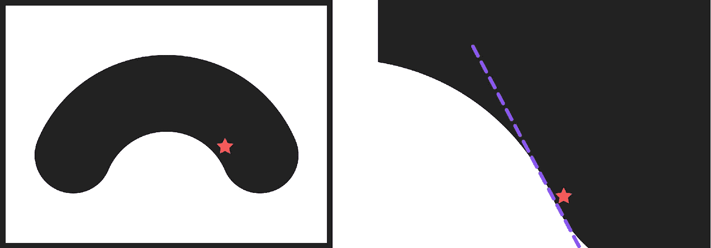
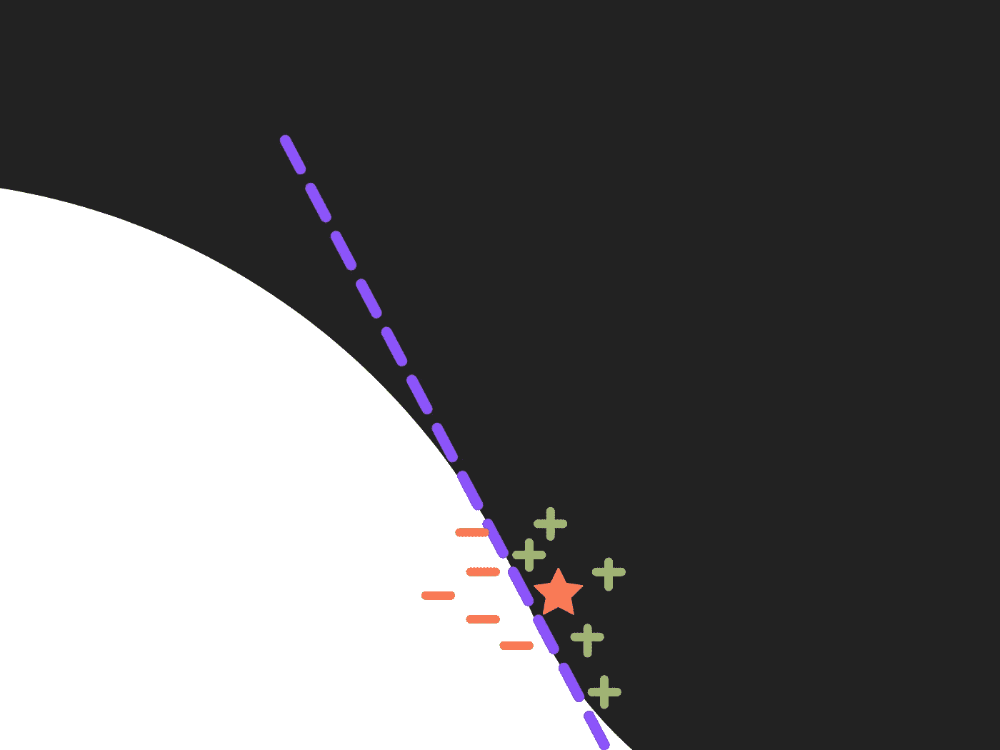
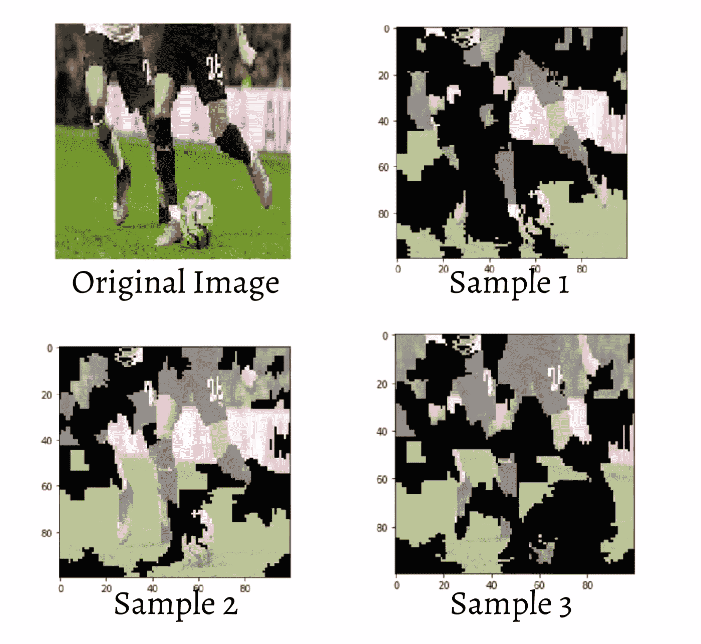
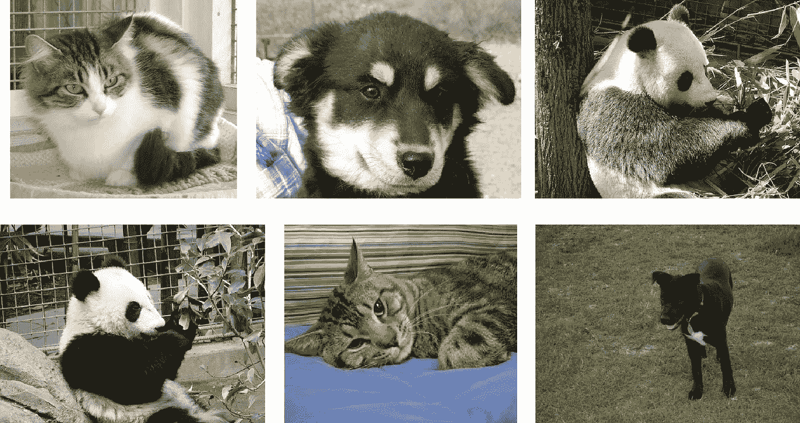
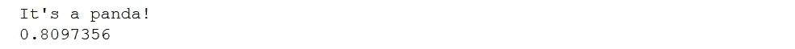
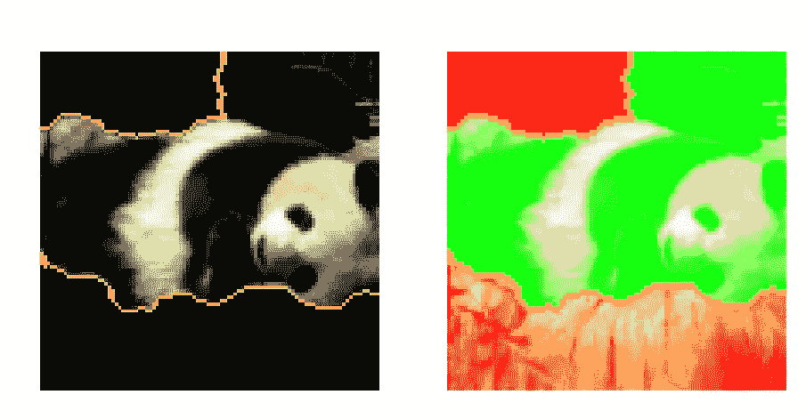
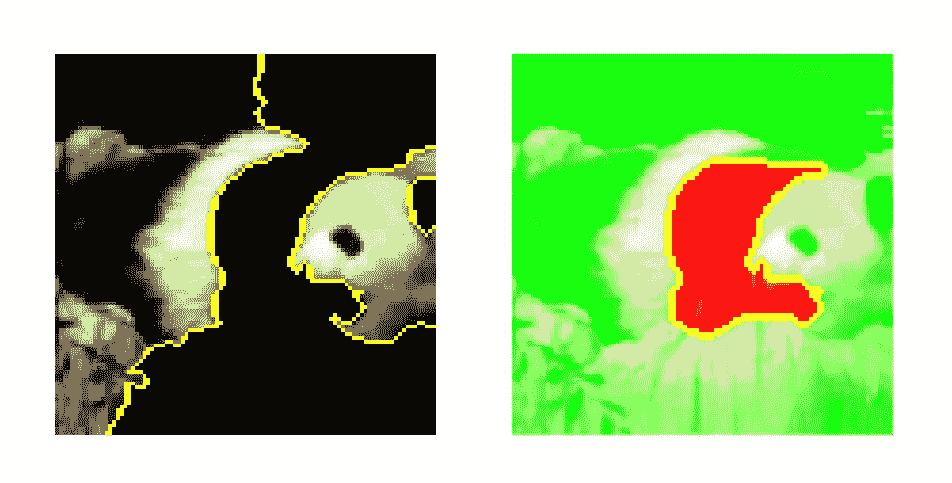

# 用石灰解释图像分类模型

> 原文：<https://towardsdatascience.com/interpreting-image-classification-model-with-lime-1e7064a2f2e5?source=collection_archive---------6----------------------->

## 我们应该相信我们的图像分类器模型吗？


布雷特·乔丹在 [Unsplash](https://unsplash.com/s/photos/trust?utm_source=unsplash&utm_medium=referral&utm_content=creditCopyText) 上的照片

机器学习领域的发展速度和增长是疯狂的。如今，我们可以选择各种各样的机器学习模型来解决我们的问题。假设我们要解决一个分类任务，现在我们不仅有逻辑回归可供选择。我们也有决策树，随机森林，SVM，梯度推进，神经网络，等等，都可以做到这一点。

然而，在所有可用的机器学习模型中，我们可以同意大多数都是黑盒。这意味着大多数机器学习模型正在做一些非常复杂的事情，以至于我们再也不知道它们为什么会这样。换句话说，我们不知道我们的模型在预测某事时的思维过程。



作者图片

理解我们的机器学习模型的行为变得非常重要。仅仅根据模型的准确性来判断模型的性能是不够的，因为你的模型可能会欺骗你。让我们来看看下面的球分类器，它有一个主要的工作:将球分类为足球或篮球。



在上图中，我们的球分类器表现非常好。它正确地预测了所有六幅图像的类别。接下来，我们对此感到满意，并继续将此模型用于生产。然而，我们不知道我们的分类器已经成功地欺骗了我们。这是为什么呢？我们来看看下面的模型解释。



结果是，我们的分类器正确地预测了一个球是足球，因为人体部位，而不是因为球本身。所以我们的分类器不是试图在足球和篮球之间进行分类，而是在人体部位和篮球之间进行分类。显然，这不是我们想要的，因此，我们不应该仅仅基于它的准确性来信任我们的模型。

不幸的是，解释我们的黑盒模型的行为，就像深度神经网络一样，是一件非常困难的事情。

这就是我们需要石灰的地方。

# 什么是石灰，它是如何工作的

石灰代表 **L** 局部的 **I** 不可解释的 **M** 模型不可知的 **E** 解释。它是一个 Python 库，基于 Ribeiro 等人的论文[来帮助你理解你的黑盒分类器模型的行为。目前，您可以将 LIME 用于对表格数据、图像或文本进行分类的分类器模型。](https://arxiv.org/abs/1602.04938)

LIME 这个缩写本身应该会让你对其背后的核心思想有一个直觉。石灰是:

*   **模型不可知**，这意味着 LIME 是模型独立的。换句话说，LIME 能够解释你能想到的任何黑盒分类器。
*   **可解释的**，这意味着 LIME 为您提供了一个解决方案来理解为什么您的模型会有这样的行为。
*   **局部**，这意味着 LIME 试图通过近似你的模型的局部线性行为来找到你的黑盒模型的解释。

让我们看看下面的图片，以了解更多关于石灰是当地的。



作者图片

假设你有一个非线性边界的特征空间，如左图所示。位于黑色曲线内的数据点将被归类为 ***A*** ，否则将被归类为 ***B*** 。现在我们想预测上图中用红星表示的数据点的类别。LIME 将进入红星点的邻近区域，而不是查看全局行为(左图)，这样它就变得非常局部，线性分类器可以解释您的模型的预测(右图)。

接下来，我们来看看 LIME 是如何一步步解释模型的行为的。

## 石灰是如何工作的

在内部，LIME 试图通过以下四个步骤来解释黑盒模型:

**1。输入数据排列**

正如您在上面的图像中所看到的，假设我们想要 LIME 来解释为什么由红星表示的数据点被分类到一个类中而不是另一个类中。LIME 要做的第一步是创建几个人造数据点，这些数据点与红星表示的数据接近。



作者图片

如果我们的输入数据是一个图像，LIME 将通过打开和关闭图像的一些超像素来生成几个与我们的输入图像相似的样本。



**2。预测每个人工数据点的类别**

接下来，LIME 将预测使用我们的训练模型生成的每个人工数据点的类别。如果你的输入数据是一个图像，那么每个扰动图像的预测将在这个阶段生成。

**3。计算每个人工数据点的权重**

第三步，计算每个人工数据的权重，衡量其重要性。为此，首先通常应用余弦距离度量来计算每个人工数据点相对于原始输入数据的距离。接下来，将使用核函数将距离映射为 0 到 1 之间的值。距离越近，映射值越接近 1，因此权重越大。权重越大，某个人工数据点的重要性就越大。

如果输入数据是图像，那么将计算每个扰动图像和原始图像之间的余弦距离。扰动图像与原始图像之间的相似性越大，其权重和重要性就越大。

**4。拟合一个线性分类器来解释最重要的特征**

最后一步是使用加权的人工数据点拟合线性回归模型。在这一步之后，我们应该得到每个特征的拟合系数，就像通常的线性回归分析一样。现在，如果我们对系数进行排序，具有较大系数的特征是在确定我们的黑盒机器学习模型的预测中起重要作用的特征。

# 用石灰解释图像分类器

现在我们知道了 LIME 是如何工作的，让我们用它来解释我们的机器学习模型的行为。在本文中，我们将创建两个图像分类模型:一个使用自定义模型，另一个使用预训练的 InceptionV3 模型。

让我们先加载数据。

## 正在加载数据集

我们将要使用的数据集是[你可以在 Kaggle](https://www.kaggle.com/ashishsaxena2209/animal-image-datasetdog-cat-and-panda) 上免费下载的狗-猫-熊猫数据集。它总共包含了 3000 张狗、猫和熊猫的图片。



如果您刚刚下载了它，那么您需要解压缩文件。接下来，确保您的文件夹中有以下结构。

```
dog-cat-panda/

    dog/
      img_1.jpg
      img_2.jpg
      ..... cat/
      img_1.jpg
      img_2.jpg
      ......... panda/
      img_1.jpg
      img_2.jpg
      ...........
```

现在，我们可以使用 TensorFlow 的图像生成器来生成我们的训练和测试数据。在下面的代码中，我们希望将数据分成 80%的训练数据和 20%的测试数据。

就这样，我们成功地生成了数据！

## 创建自定义模型和预训练的 InceptionV3 模型

现在是我们创建自定义图像分类器模型的时候了。在展平之前，该模型由三个卷积层组成，一个全连接层作为模型的最后一层。

接下来，我们来编译和训练模型。对于本文，我们将使用 Adam 优化器、准确性指标，当然还有分类交叉熵损失函数。

太好了！在这个步骤之后，现在模型准备好对输入图像进行预测。但在此之前，我们先创建一个基于 InceptionV3 的预训练模型。我们可以用一行代码加载预训练的模型，如下所示。

```
from tensorflow.keras.applications import inception_v3 as inc_net
```

现在，让我们使用模型来预测我们的输入图像，看看 LIME 如何帮助我们理解模型的行为。

## 用石灰解释自定义模型的预测

假设我们希望我们的自定义模型对下面的熊猫图像进行预测:


第一步是将输入图像预处理成定制模型可以读取的格式。在读取和转换输入图像之后，我们可以使用我们的自定义模型来预测我们的输入图像。



而且我们的自定义模型正确预测了图像中的动物是熊猫！如你所见，我们的模型以合理的确定性预测，即 81%的概率。

但是正如前面提到的，我们并不确定为什么我们的模型将图像中的动物归类为熊猫。是什么让我们的模型认为我们形象中的动物是熊猫而不是狗或猫？这是我们使用石灰的地方。

在我们开始之前，如果您还没有安装 LIME，您可以通过键入下面的 pip 命令来安装。

```
pip install lime
```

接下来，我们需要导入所有必要的库。由于我们的输入数据是一个图像，我们将使用来自`lime_image`的`LimeImageExplainer()`方法。如果你的输入数据是表格数据，你需要使用`lime_tabular`中的`LimeTabularExplainer()`方法来代替。

现在是我们开始解释我们的定制模型的预测的时候了。我们需要做的就是从我们之前创建的`explainer`对象中调用`explain_instance`方法。

正如您在上面看到的，我们在那里传递了几个参数:

*   `images` —我们希望 LIME 解释的图像。
*   `classifier_fn` —您的图像分类器预测功能。
*   `top_labels` —您希望石灰显示的标签数量。如果是 3，那么它将只显示概率最高的前 3 个标签，而忽略其余的。
*   `num_samples` —确定 LIME 将生成的与我们的输入类似的人工数据点的数量。

接下来，我们可以将 LIME 提供的解释形象化。



现在我们知道为什么我们的模型把我们的图像归类为熊猫了！在左图中，我们可以看到只有熊猫可见的超像素被显示出来。这意味着我们的模型将我们的图像归类为熊猫，因为这些部分是超像素。

在右边的图像中，绿色的超像素区域增加了我们的图像属于熊猫类的概率，而红色的超像素区域降低了概率。

## 用石灰解释预训练模型的预测

现在我们想做和上面一样的步骤，但是使用预先训练好的 InceptionV3 模型。首先，我们来看看预训练的 InceptionV3 模型使用相同的输入图像的预测。下面是这样做的代码。


如你所见，预先训练好的 InceptionV3 模型也预测我们的形象是一只熊猫。准确地说是一只大熊猫。现在，让我们用与之前自定义模型相同的步骤来解释预训练模型的行为。



现在我们也知道为什么我们预先训练的模型将我们的图像分类为熊猫，而不是狗或猫。事实证明，由于熊猫的特定特征，自定义模型和预训练的 InceptionV3 模型都能够将我们的图像分类为熊猫，这是我们想要的。

暂时就这样了。希望现在你知道了 LIME 的基本方面，以及如何用它来解释我们的黑盒机器学习模型。

你可以在 这里找到本文 [**中涉及的完整 Jupyter 笔记本。**](https://github.com/marcellusruben/All_things_medium/tree/main/Lime)