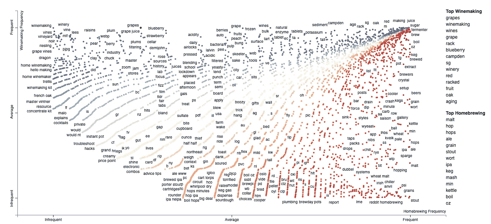
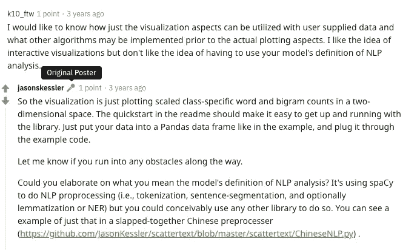
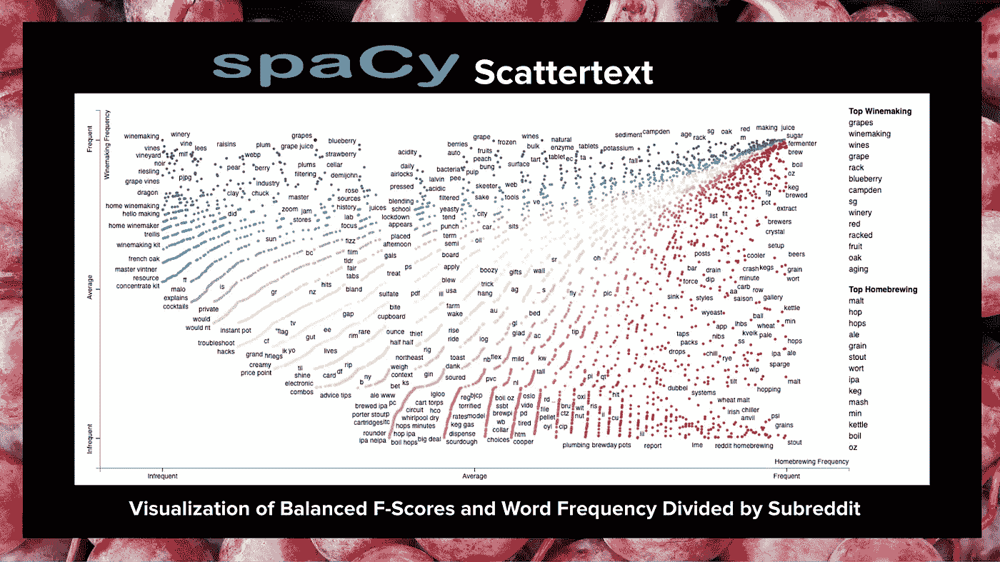
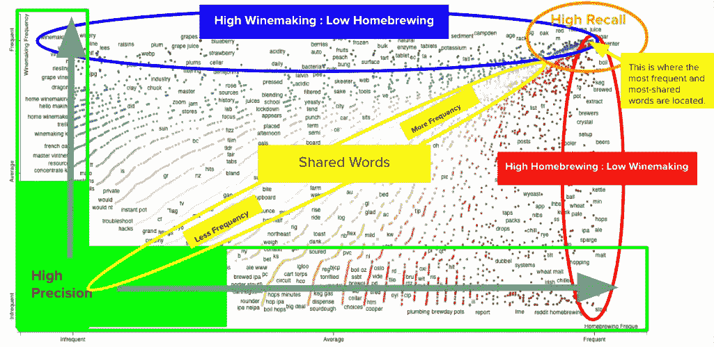
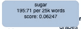
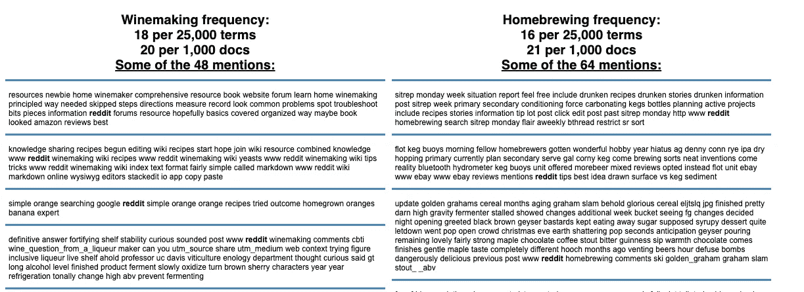

# 解读散文本:绘制文本的诱人工具

> 原文：<https://towardsdatascience.com/interpreting-scattertext-a-seductive-tool-for-plotting-text-2e94e5824858?source=collection_archive---------31----------------------->

> 向下滚动查看如何解释一个伟大的工具创建的比较两个类及其语料库的情节。

下面我会告诉你如何解读这一点。-作者图片

有一些可视化文本数据的好方法，但也有很多可视化其他形式数据的好方法。文本数据是杂乱的，在被分析和可视化之前需要大量的清理工作。这并不全是坏事；在预处理阶段有大量的决策机会。有各种各样的工具和技术可以让您适应正在处理的数据。这种多样性可以让原本平淡无奇的过程变得非常有趣。然而，一旦你开始准备你的语料库数据的可视化，选项减少得相当快。在这个阶段，您通常只剩下很少的直观可视化来分析和呈现您的数据。如果你向非技术观众演示，这个问题会变得更加复杂。

幸运的是，作为数据科学领域相对较新的学生，我偶然发现了一个非常有用的工具，用于可视化和分析语料库中的文本。该工具专门用于分析两类数据。 [**散点图**](https://arxiv.org/pdf/1703.00565.pdf) 是在散点图的基础上开发的工具，散点图是古老的笛卡尔坐标绘图工具，被许多人用来可视化两个变量之间的关系。分散文本是由[T5 的杰森·凯斯勒 T7 创造的，他在开发这种资源的工作中获得了相当多的恶名。他通过许多商业展览和视频演示向对数据感兴趣的观众充分展示了分散文本的能力。他还就该主题编写了一份详细且易于阅读的白皮书](https://github.com/JasonKessler/scattertext),我发现这份白皮书非常有助于理解该工具，以及数据专业人员的工具包中包含该工具有多么强大。

补充说明:我发现这个资源是如此的新，这很不寻常。这是 Jason Kessler 三年前在 reddit 上发的帖子。他优雅地回应了一条评论，没有得到任何支持票。当时似乎没有足够多的人关注他的创作。在这里找到帖子[。](https://www.reddit.com/r/LanguageTechnology/comments/5olmab/scattertext_a_tool_to_make_sexy_visualizations_of/)

# 散点图(如下例)

下面是我创建的一个散点图，让你快速了解这个资源有多美。该图详细描述了来自两个独立子主题的文本: [r/Homebrewing](https://www.reddit.com/r/Homebrewing/) 和 [r/Winemaking](https://www.reddit.com/r/winemaking/) 。数据被清理以移除空值、垃圾广告、重复的帖子和其中“[deleted]”或“[removed]”是帖子中的值的条目。数据也经过预处理，去除了符号、数字、空格和停用词。根据我对散文本的了解，这些步骤中有许多可能是不必要的，但我想确保我有好的数据输入，并在需要良好预处理的建模过程中使用这些数据。

图 1:散点图详细描述了[r/家酿](https://www.reddit.com/r/winemaking/)和[r/酿酒](https://www.reddit.com/r/Homebrewing/)子页面中的帖子。注意，由杰森·凯斯勒设计，这个情节通常是互动的。在这种情况下，我只是提供了一个截图。我将在未来的某个时候部署一个交互式版本。你可以在 Jason Kessler 的 Github 页面上查看交互式散点图。在那里你会发现 [Jupyter 笔记本](https://github.com/JasonKessler/scattertext)和 [Google Colab](https://github.com/JasonKessler/scattertext) 笔记本，它们包含了部署分散文本的代码。-作者图片

# 如何解释散点图

它首先有助于理解情节。读到这里的大多数人已经知道，这个图使用了二维笛卡尔坐标系，其中每个点由两个坐标表示，一个来自 x 轴，一个来自 y 轴。这些点中的每一个点的坐标都是从每一类中的频率项中导出的。**词频是词和短语的频率。如果你愿意的话，双字 n 元语法可以包含在分散文本中。**y 轴代表酿酒类的术语频率，而 x 轴代表家酿类的术语频率。**例如，图 1 右上角的单词“糖”在酿酒类中的词频为 195，在家酿类中的词频为 71。这些频率是它的绘图坐标(71，195)，其中 71 是 x 坐标，195 是 y 坐标。**在图的最右上方，您可以看到单词“sugar”所在的位置，这是两个类别的词频最高的区域。****

这里有更多的信息需要确定，所以我将展示更多的例子。看看图 1 右下角的单词“stout”。它一直在 y 轴的底部，但在 x 轴的最右边。坐标为(65，0)的这个单词在 beer 类中很常见，而在 wine 类中根本不存在。相反，单词“winemaking”的坐标是(0，95)。这个词在 Homebrewing 类中根本不存在。

## 精确

Kessler 在他的白皮书中指出:

> 精确度是一个词的辨别能力，不管它的频率如何。在分类语料库中出现一次的术语将具有完美的精确度。这(以及随后的度量)以平衡的类别分布为前提。**分散文本中靠近 x 轴和 y 轴的词精度高。”**

**这些术语示例(‘黑啤酒’和‘葡萄酒酿造’)具有很高的精确度**，并且很好地说明了凯斯勒允许我们在班级中展示区别特征的方式。

图 2:一个由我创建的图形，详细描述了具有高召回率、高精确度、高频率和高共享词比率的绘图区域。-作者图片

## **解读中间**

代表酿酒的蓝色和代表家酿的红色提供了一个易于辨别的视觉，使观众能够快速识别文本中存在的差异。图上的黄色和橙色是识别这两个类中最常用的术语的简单方法。**在这种情况下，当你走向图表的右上角时，你会发现最常用的术语，左下角是最不常用的术语。**

## 回忆

毫不奇怪，凯斯勒在他的白皮书中也强调了召回。几乎就像他们和谐地结合在一起一样，如果不回忆起当时的情景，精确性往往无法得到强调。凯斯勒将回忆描述为“一个词在特定类别中出现的频率，或 *P(词|类)”。他描述了精度的方差和回忆之间的关系，指出当我们看到回忆增加时，方差通常会减少。另一个让我顿悟的有趣发现是，他透露“回忆度极高的单词往往是停用词。对于那些需要看到停用词表有效性的人来说，这可能会产生奇迹。**然而，对于该图的解释来说，最重要的是高回忆词倾向于图表的右上角(见图)。***

仅仅通过这几个例子，你就可以看出散点图的绘制方式很像散点图。Kessler 使用的一项技术让它在视觉上如此吸引人，这项技术在散点图中用一种基于字母算法打破平局的方法取代了“抖动”功能。该方法更有效、更准确地使用图中的空白来显示两个类之间的关系。

正如你在这个图中看到的，你不仅可以解释词频和词频的物理相似性，还可以解释精确度和召回率等指标。当你把上面解释的所有特征结合起来，就会创造出一个易于阅读的可爱的视觉效果。

# 互动功能

当你完全实现散射文本时，它将具有交互功能。**当你在飞机上滚动圆点时，你会看到一个带有统计数据的弹出窗口。**统计数据包括两个类别每 25，000 个单词的词频。它还具有**标度 F 分数* *。词频指标真的很容易辨别。这个度量就是散射文本用作每个点的坐标。您可以看到下面用*195:71/25k 单词表示的度量。*

图 3:在点上滚动时弹出-作者图片

这里的另一个指标是*得分:0.06247。*这被称为“分级 F 值”这个分数的确定涉及到一点数学，但是 Kessler 在这个 [Github Repo](https://github.com/JasonKessler/scattertext#understanding-scaled-f-score) 和这个 [*Jupyter 笔记本(也可以在 Repo 中找到)*](https://nbviewer.jupyter.org/github/JasonKessler/GlobalAI2018/blob/master/notebook/Scaled-F-Score-Explanation.ipynb) 中描述了数学，甚至强调了他在分数背后的推理。关于这个分数与你所绘制的图的关系的解释，最重要的是:

**分数在-1 到 1 之间。接近零的分数在两个类别中都有相似的词频(这些是黄色和橙色的点)。接近 1 的分数的词频由阳性类别(蓝色)主导。接近-1 的分数的词频将由负类(红色)主导。红色或蓝色越深，表示分数越接近-1 或 1。**

# 更多互动

滚动功能并不是唯一的交互性。在使用分散文本时，还有另一个非常令人满意的功能来补充您的分析。有一个**“搜索图表”功能**，可以以两种不同的方式使用。**一种方法是使用图表左下方或右上方的查询框，这取决于浏览器的方向。另一种方法是简单地点击彩色坐标点。**没有比绘图工具更直观的了。这是一个奇妙的功能。

输出才是这个特性真正有用的地方。**当您使用查询框或点击单词点时，您会得到按每个单词频率细分的频率指标(如弹出窗口中所示)，您还可以看到每 1000 个文档的频率(本例中的文档是 reddit 帖子)**。但是等等，还有更多。此外，您还会看到一个格式良好的文档/帖子列表，其中提到了这个词。这是一个出色的工具，我想数据专业人员甚至可以为新手或非数据科学专业人员部署，用于他们自己的研究或好奇的探索。

这是使用“搜索图表”功能时实际提供的内容的简化视图。请记住，我删除了停用词，并对数据做了一些预处理，所以我的帖子不是很清晰。然而，这确实让您了解了这个特性有多有用。-作者图片

# 分散文本的其他亮点

正如你已经清楚看到的，散点图非常容易理解，是一种优雅的视觉效果，可以包含在各种与数据相关的演示中。关于分散文本有更深入的讨论，其中许多有趣的内容可以在 Jason Kessler 的 [Github](https://github.com/JasonKessler/scattertext) 和[白皮书](https://arxiv.org/pdf/1703.00565.pdf)中找到。在那里你还可以找到关于使用和实现分散文本的编码笔记本和演示。我也可能会在 Medium 上发布更多关于这个话题的帖子，所以请关注我 [@jamesopacich](https://jamesopacich.medium.com/) 或直接给我发消息了解更多信息。