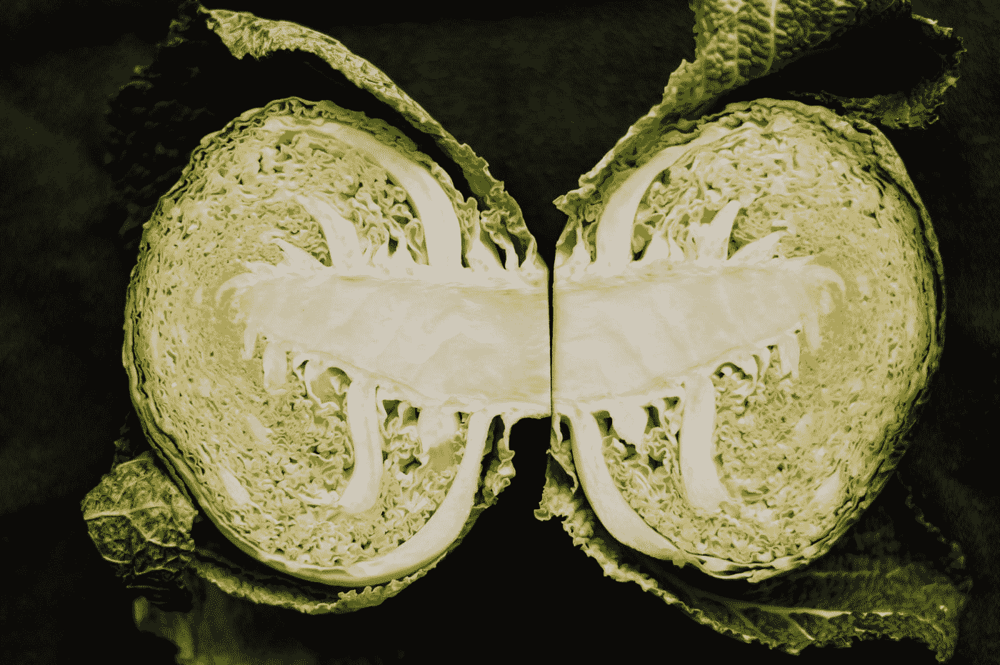
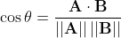
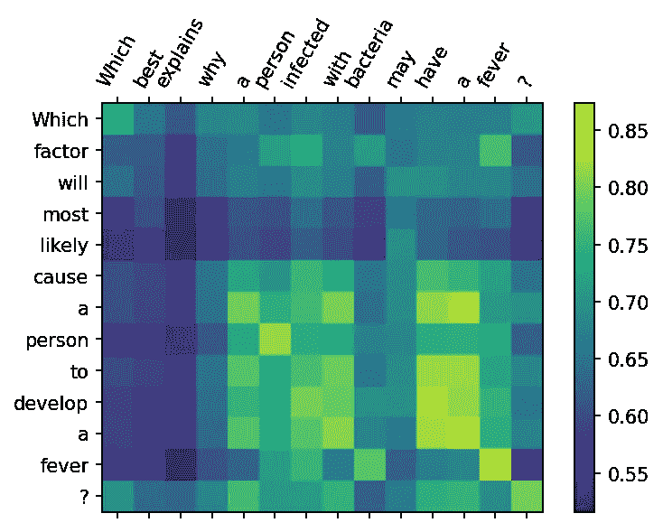

# 从变压器模型解释语义文本相似性

> 原文：<https://towardsdatascience.com/interpreting-semantic-text-similarity-from-transformer-models-ba1b08e6566c?source=collection_archive---------16----------------------->

## [实践教程](https://towardsdatascience.com/tagged/hands-on-tutorials)

## 我们能想象搜索所使用的上下文吗？

照片由[亨利·珀克斯](https://unsplash.com/@hjkp?utm_source=medium&utm_medium=referral)在 [Unsplash](https://unsplash.com?utm_source=medium&utm_medium=referral) 拍摄

使用基于 transformer 的模型搜索文本文档非常棒；如今，使用 [huggingface](https://huggingface.co/) 库很容易实现，而且结果往往令人印象深刻。最近，我想了解*为什么*返回一个给定的结果——我最初的想法是各种论文和博客帖子，这些论文和博客帖子都与挖掘变形金刚内部的注意力机制有关，这似乎有点复杂。在这篇文章中，我测试了一个非常简单的方法，当使用一些简单的向量数学进行上下文搜索时，可以一瞥这些模型获得的上下文相似性。让我们试一试。

为了这篇文章的目的，我将使用来自`[sentence-transformers](https://github.com/UKPLab/sentence-transformers)`库的一个模型，它已经被专门优化用于进行语义文本相似性搜索。该模型实质上为传递给它的每个句子创建了 1024 维嵌入，然后可以通过相应的两个向量之间的余弦相似性来计算两个这样的句子之间的相似性。假设我们有两个问题 *A* 和 *B* ，分别嵌入到 1024 维向量 ***A*** 和 ***B*** 中，那么句子之间的余弦相似度计算如下:

也就是说，余弦相似度为 1 意味着问题是相同的(角度为 0)，余弦相似度为-1 意味着问题非常不同。出于演示的目的，我嵌入了来自 [ARC 问题分类数据集](https://allenai.org/data/arc-classification)的 1700 个问题。完整的笔记本可以在 google colab [这里](https://colab.research.google.com/drive/1XVR1BRbrpLQkMOo7fKHPz778OFMASWWl?usp=sharing)找到。在下面的代码片段中可以看到进行句子嵌入的基本部分:

作者代码片段

这样，我们可以很容易地在我们的问题数据库中进行搜索；假设我们有一个包含 1700 个问题的数据库，我们使用上面的代码片段将其嵌入到一个 1700×1024 的矩阵中。第一步是 L2 归一化每一行——这实质上意味着我们归一化每个问题向量，使其长度为 1，这简化了我们之前的等式，使得 ***A*** 和 ***B*** 之间的余弦相似度只是两个向量的点积。根据前面代码片段中创建的嵌入，我们可以假设数据集中的第一个问题是我们的查询，并尝试从其余问题中找到最匹配的条目:

作者代码片段

在我的样本数据集中，第一个问题(查询)是“*哪个因素最有可能导致一个人发烧？*”而确定的最相似的问题是“*哪个最能解释为什么一个被细菌感染的人可能会发烧？*”。这是很好的搭配🙌—两个句子都与一个发烧的人有关。然而，我们如何知道算法选择特定匹配的原因不仅仅是因为它们都以单词“Which”开头？

需要记住的是，通过设计，transformer 模型实际上为我们的句子中的每个*标记*输出了一个 1024 维向量——这些标记嵌入被平均汇集以生成我们的*句子*嵌入。因此，为了获得关于用于在我们的搜索查询中找到匹配的上下文的更多信息，我们可以计算我们的查询中的每个标记和我们的搜索匹配之间的余弦距离，并绘制结果 2D 矩阵:

作者代码片段

这导致了下面的图:

作者创作的情节

现在我们可以看到查询中的每个标记和最佳搜索结果中的每个标记之间的余弦相似性。很明显，实际上“发烧”关键词被挑选出来，并且是导致搜索结果的“语义语境”的主要部分，然而，同样明显的是，有附加的成分进入语义语境，例如“开发 a”和“具有 a”与高余弦相似性分数相结合，并且关键词“人”也被挑选出来，而在两个句子中都存在的首词“which”不太重要。

这种计算所有标记嵌入之间的余弦相似性的简单技术提供了对每个标记对最终相似性得分的贡献的洞察，因此是解释模型在返回给定搜索结果时正在做什么的快速方式。必须注意的是，在进行实际搜索时，我们在计算不同句子嵌入之间的余弦相似度之前，取所有标记嵌入的平均值，这与我们在这里所做的不同——即使如此，查看查询中的每个标记嵌入如何与最佳匹配中的标记嵌入对齐，可以深入了解是什么组成了用于语义搜索的那些句子嵌入。