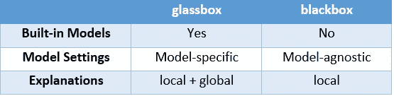
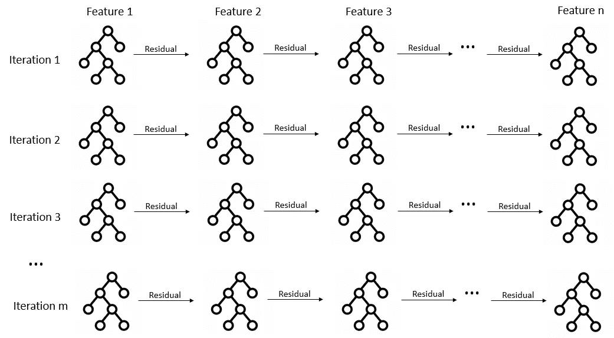
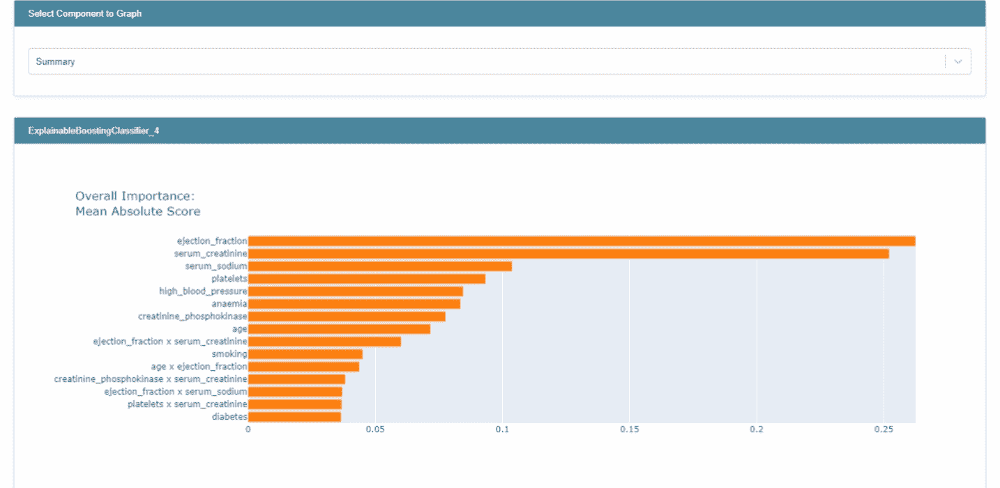
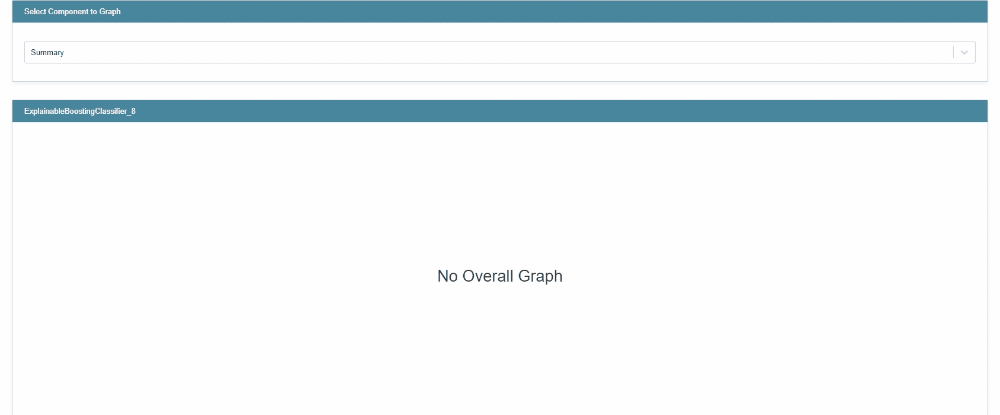
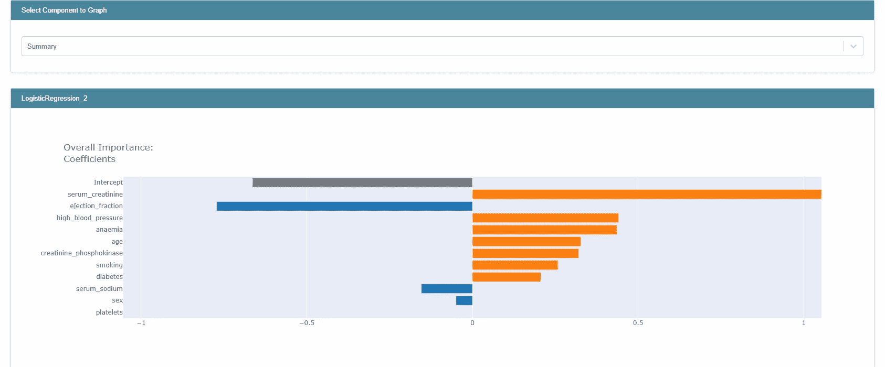
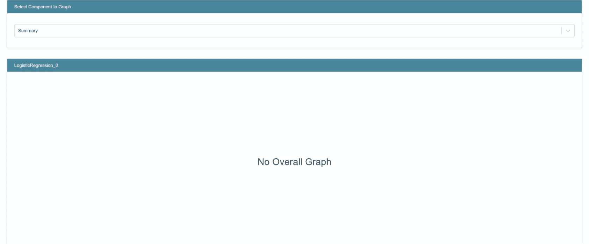
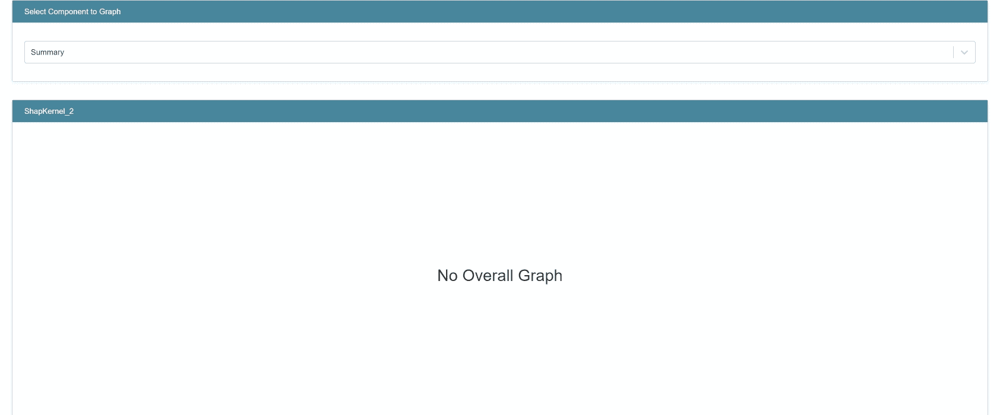
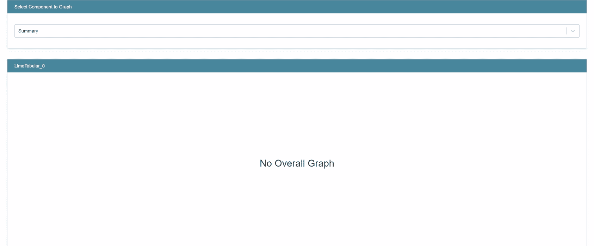
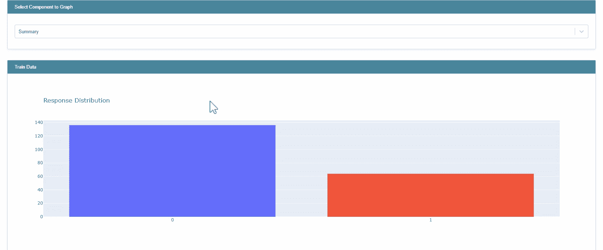
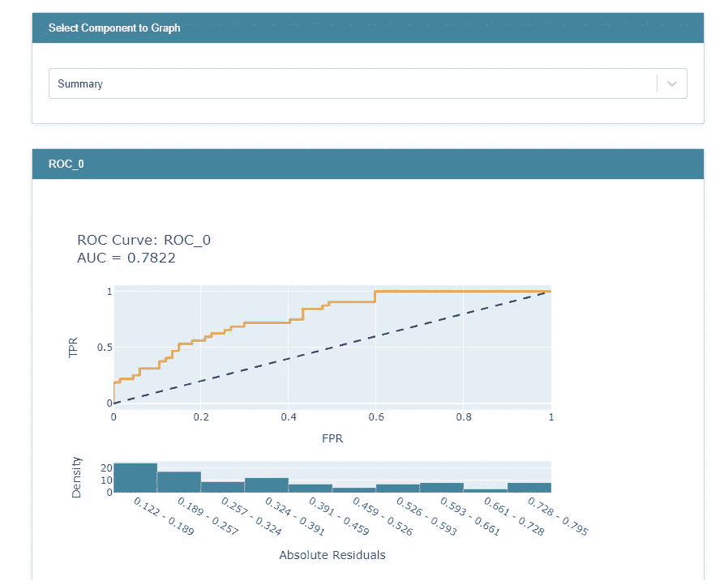

# 解释你的模型的另一种方式

> 原文：<https://towardsdatascience.com/interpretml-another-way-to-explain-your-model-b7faf0a384f8?source=collection_archive---------6----------------------->

## [模型可解释性](https://towardsdatascience.com/tagged/model-interpretability)

## InterpretML 包的概述，它在现有工具的基础上提供了新的可解释工具。


[沃洛德梅尔·赫里先科](https://unsplash.com/@lunarts?utm_source=medium&utm_medium=referral)在 [Unsplash](https://unsplash.com?utm_source=medium&utm_medium=referral) 上的照片

在实现 ML 模型时，可解释性是至关重要的。通过解释模型，客户可以获得对模型的信任并促进模型的采用。它还可能有助于调试您的模型，在某些情况下，您将需要为模型生成的预测提供解释。在我之前的博客文章中，我讨论了两种方法:石灰和 SHAP，我在戴尔的一个项目中使用过。

在这篇博客文章中，我将提供一个 InterpretML 包的概述，它包含一个新开发的可解释模型(可解释的助推机器)，可以在全球和本地上下文中解释你的模型，以及现有的方法，如莱姆，SHAP，以及更多可以将你的模型的解释带到下一个级别的伟大的可视化。

本博客将涵盖以下内容:

1.  解释性概述
2.  可解释增压机(EBM)
3.  例子
4.  摘要
5.  进一步阅读

# 1.解释性概述

InterpretML 是一个开源 Python 包，包含不同的可解释性算法，可供从业者和研究人员使用。这个包提供了两种类型的可解释性方法:**玻璃盒子**和**黑盒**。glassbox 方法既包括可解释的模型，如线性回归、逻辑回归、可以作为软件包一部分训练的决策树，也包括相应的可解释工具。虽然黑盒模型只包括模型不可知的可解释性工具，如 LIME 和内核 SHAP，它们与包外训练的模型兼容，但 glassbox 模型提供了全局和局部解释，而黑盒模型只支持局部解释。此外，InterpretML 有一个内置的可视化平台，允许用户轻松地比较不同的方法。此外，由于 InterpretML 与 scikit-learn 兼容，glassbox 模型的超参数可以像其他 scikit-learn 模型一样进行调整。为了强调区别，在您的项目中使用 glassbox 模型将允许您使用 InterpretML 训练和可视化解释，而使用不同的模型将只允许您在用另一个包训练模型之后可视化由黑盒模型生成的解释。



玻璃盒子 vs 黑盒| *作者图片*

最后，这个包还包括一个新的可解释模型——可解释的助推机器(EBM ),它是由微软研究人员开发的，将在下一节讨论。

# 2.可解释增压机(EBM)

EBM 是一个玻璃箱模型，具有与随机森林和增强树等机器学习模型相当的准确性以及可解释性能力。EBM 是一种广义加性模型(GAM ),与线性模型非常相似。在线性模型中，观测值 Y 和因变量 Xi 之间的关系用公式表示为:

Y = β0 + β1X1 + β2X2 + β3X3 + … + βnXn

而在广义加法模型中，该关系被形式化为:

Y = β0 + f(X1) + f(X2) + f(X3) + … + f(Xn)

因此，现在对预测器的每个贡献都是一些函数 f。EBM 对传统 gam 进行了一些改进:使用现代机器学习技术(如 bagging 和 boosting)来学习每个特征函数。训练在许多次迭代中进行，其中每次迭代包括为每个特征分别构建提升过程。因为这是在低学习速率下完成的，所以特征的顺序并不重要。大量的迭代旨在减轻共线的影响，以便最好地了解每个特征对模型预测的贡献。此外，EBM 可以自动检测和包含成对的交互项，这在保持其可解释性的同时增加了模型的准确性。由于 EBM 是一个附加模型，每个特征的贡献可以被捕获和可视化，因此增强了可解释性。



算法草图| *作者图片*

作为进一步的解释，对于模型的每次迭代，顺序地构建小的树，并且每个树只能使用单个特征，以增强的方式更新残差，并且使用不同的特征构建新的树。这是在每次迭代中为每个特性所做的。训练完成后，我们可以查看由某个特征构建的所有树，并根据它们的预测构建一个图表，显示每个特征对预测的贡献。

# 3.例子

作为一个例子，我们将使用来自 Kaggle 的[心力衰竭预测](https://www.kaggle.com/andrewmvd/heart-failure-clinical-data)数据集。数据集包含 12 个可用于预测心力衰竭死亡率(死亡事件- 0/1)的特征。一些特征包括:年龄、性别、患者是否有贫血/糖尿病/高血压等。
我们将考察由 InterpretML 生成的以下模型和相应的解释:

1.  玻璃箱

2.逻辑回归(玻璃箱)

3.使用石灰和 SHAP 的 LightGBM(黑盒)

代码的笔记本，包括交互式可视化可以在[这里](https://nbviewer.org/github/NogaGershonB/InterpretML-code/blob/main/InterpretML_blog.ipynb)找到。

在进入示例之前，重要的是要注意，与莱姆和 SHAP 的实现不同，对于使用 EBM /逻辑回归的分类问题，特征的贡献被表示为对数优势而不是概率。事实上，正如在逻辑回归中所做的那样，为了得到概率，对数概率是通过一个 logit 链接函数传递的。分数显示在一个附加的对数优势空间中，因为它允许对每个特征的贡献进行公平的比较。这是由于对数比值和概率的非线性。更多信息请看这个 [GitHub 问题](https://github.com/interpretml/interpret/issues/157)。

接下来，我将分享一些例子，说明除了可解释性之外，还可以用 InterpretML 做些什么。

# 循证医学

先看全局解释。

```
ebm_global = trained_ebm.explain_global()
show(ebm_global)
```

您可以查看功能的整体重要性，也可以单独查看每个功能/交互。



*作者图片*

每个特征的总体重要性是训练集中每个特征的绝对预测值的平均值。本质上，训练数据中的每个数据点一次使用一个特征来评分。对得分的绝对值进行平均，这将在摘要图中创建每个条形。


作者对特征 i | *图像的重要性计算*

如前所述，您可以单独研究每个特性，看看特性的值如何影响得分。你还会注意到灰色标记，这些是误差线。这些是模型在特征的特定区域内的不确定性的估计。条形越宽，训练数据的微小变化的影响就越大。基于此，对这些数据点的解释应该谨慎。您可以使用以下代码访问误差线大小:

```
trained_ebm.term_standard_deviations_[4]
```

这将给出数据中第四个特征的标准偏差。

现在，让我们看看当地的解释。您可以使用以下代码一起检查几个观察结果:

```
ebm_local = trained_ebm.explain_local(X_test[10:15], y_test[10:15])
show(ebm_local)
```



*作者图片*

为了生成局部预测，模型使用为每个要素创建的图表作为查找表，并使用学习到的截距。

# 逻辑回归

让我们先来看看全局的解释:

```
lr_global = trained_lr.explain_global()
show(lr_global)
```



*作者图片*

这里，与循证医学相反，整体解释不仅提供了数量，还提供了符号。和以前一样，您也可以分别检查每个特性。

现在，让我们检查一下当地的解释:



*作者图片*

现在，您可以将 EBM 模型提供的本地解释与逻辑回归模型提供的本地解释进行比较。根据你的知识或在领域专家的帮助下，你可以决定哪一个更适合。

# 用石灰和 SHAP 照明

根据数据的不同，您可能希望使用 EBM 或逻辑回归之外的模型。这种原因的一个例子可能是数据中存在缺失值——虽然 LightGBM 能够处理缺失值的存在，但其他模型可能需要在训练之前填充缺失值。

与前面介绍的方法相反，使用 InterpretML 包，您不能为非 glassbox 模型生成全局解释。然而，直接使用 SHAP 将允许你这样做。另一个需要注意的要点是，通过 InterpretML 使用 SHAP，只提供了与模型无关的 KernalSHAP。直接使用 SHAP 提供了额外的解释器，如:TreeSHAP 和 DeepSHAP。

我们先来看看 SHAP:

```
from interpret.blackbox import ShapKernelshap = ShapKernel(predict_fn=trained_LGBM.predict_proba, data=X_train)
shap_local = shap.explain_local(X_test[10:15], y_test[10:15])show(shap_local)
```



*作者图片*

现在，让我们看看石灰:

```
lime = LimeTabular(predict_fn=trained_LGBM.predict_proba, data=X_train)
lime_local = lime.explain_local(X_test[10:15], y_test[10:15])show(lime_local)
```



*作者图片*

如您所见，glassbox 和 blackbox 模型的本地解释具有相同的格式。

请注意，如果数据中有一次性编码的分类要素，结果可能不完全可靠。这是因为 LIME 通过置换数据来创建解释。如果要素是热编码的，LIME 无法知道哪些列是同一原始要素的一部分，因此会创建与原始数据不一致的数据点。

要了解更多关于 SHAP、莱姆以及如何处理分类数据的信息，请查看我之前的[博文](/gain-trust-in-your-model-and-generate-explanations-with-lime-and-shap-94288694c154)。

**无法解释的解释**

InterpretML 可用于对数据执行 EDA，该软件包使用 plotly 提供了一些基本的 EDA 功能。

```
from interpret import show
from interpret.provider import InlineProvider
from interpret import set_visualize_provider
set_visualize_provider(InlineProvider())
from interpret.data import ClassHistogramhist = ClassHistogram().explain_data(X_train, y_train, name="Train Data")
show(hist)
```



InterpretML EDA 功能|作者图片

您还可以对包中的模型进行 hypermeter 调谐。这里作为一个例子，我使用了 RandomizedSearchCV 和三重交叉验证。

```
from interpret.glassbox import ExplainableBoostingClassifier
from sklearn.model_selection import RandomizedSearchCVparam_test = {'learning_rate': [0.001,0.005,0.01,0.03],
              'interactions': [5,10,15],
              'max_interaction_bins': [10,15,20],
              'max_rounds': [5000,10000,15000,20000],
              'min_samples_leaf': [2,3,5],
              'max_leaves': [3,5,10]}n_HP_points_to_test=10
LGBM_clf = LGBMClassifier(random_state=314, n_jobs=-1)
LGBM_gs = RandomizedSearchCV(
    estimator=LGBM_clf,
    param_distributions=param_test,
    n_iter=n_HP_points_to_test,
    scoring="roc_auc",
    cv=3,
    refit=True,
    random_state=314,
    verbose=False,
)LGBM_gs.fit(X_train, y_train)
```

您可以使用以下代码通过绘制每个模型的 ROC 曲线来进一步比较结果:

```
from interpret import perfroc = perf.ROC(gs.best_estimator_.predict_proba, feature_names=X_train.columns)
roc_explanation = roc.explain_perf(X_test, y_test)show(roc_explanation)
```



*作者图片*

或者，通过在 show 中以列表的形式显示您希望查看的对象，您可以获得跨不同模型的结果或解释的统一视图。

```
show([hist, ebm_global, lr_global], share_tables=True)
```

您应该知道，如果您使用云环境，这是不受支持的。

# 4.摘要

InterpretML 提供了不同的解释方法。它还提供了 EDA 工具和强大的可视化功能，以支持对结果的更好理解，以及不同方法的比较。它绝对应该被认为是你的模型的一个可能的解释工具。软件包的 [GitHub 页面](https://github.com/interpretml/interpret)(特别是 issues 选项卡)非常有用，帮助我在研究和撰写这篇博文时对软件包有了更深入的了解。

# 5.进一步阅读

以下是一些额外的阅读和观看建议:

1- [InterpretML 文档](https://interpret.ml/docs/intro.html)

2- [GitHub 页面](https://github.com/interpretml/interpret)

3- You Tube 视频- [解释背后的科学:可解释的助推机器](https://www.youtube.com/watch?v=MREiHgHgl0k&t=0s)

4- Paper- [InterpretML:机器学习可解释性的统一框架](https://arxiv.org/abs/1909.09223)

特别感谢 Or Herman-Saffar 和 Rachel Shalom 对这篇博文的评论和宝贵反馈。