# 区间估计:概述和实践者指南

> 原文：<https://towardsdatascience.com/interval-estimation-an-overview-and-a-how-to-guide-for-practitioners-e2a0c4bcf108?source=collection_archive---------21----------------------->


米德兰海滩(来源:[纽约公共图书馆数字馆藏——无限制免费使用](https://digitalcollections.nypl.org/items/510d47d9-c04b-a3d9-e040-e00a18064a99)

## 以及 Python 中关于如何估计总体均值区间的教程

假设你知道一个样本的平均值，你想用这个样本的平均值来估计总体平均值所在的*区间*。区间估计技术可用于在某个特定的置信水平下得出这一估计值。这种方法可以很容易地扩展到估计其他总体水平统计量(如方差)的区间。

举例来说，假设你在马萨诸塞州的波士顿随机调查了 100 户家庭，你发现他们的平均年收入为 65，713 美元。你能使用这个单一的数字，用一些可量化的信心衡量标准，比如 90%，来估计一下*波士顿所有*30 万个家庭的平均年收入范围吗？原来，你可以做到这一点！

下图说明了这种情况:

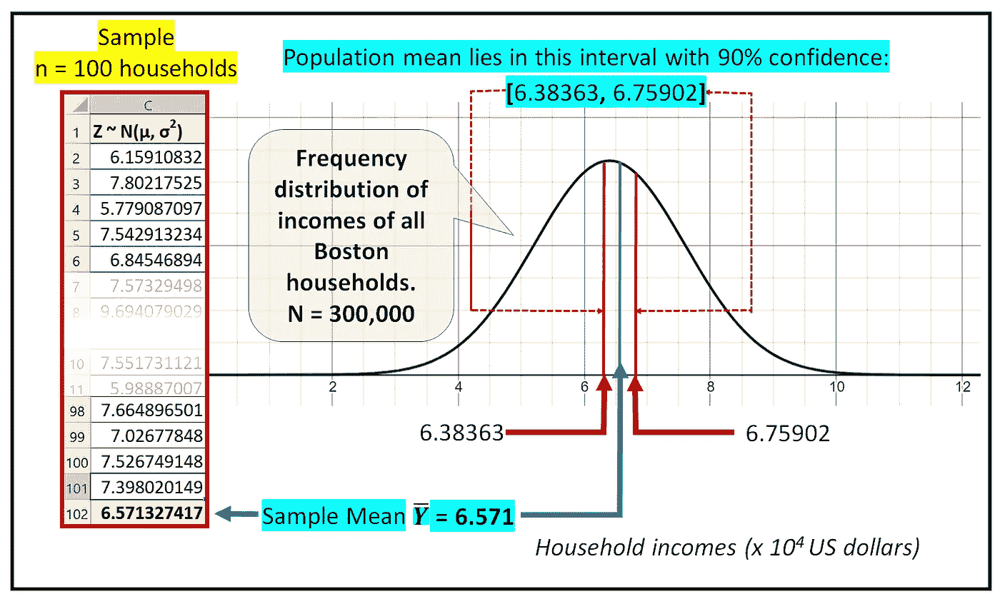

波士顿地区平均家庭收入(2021 年美元)的 90%置信区间[63863，675902](图片由作者提供)

在上图中，你可能会注意到，我们对波士顿所有 30 万家庭的年收入假设了某种概率分布(正态分布)。虽然对这种分布有所了解会有所帮助，但这并不是一个严格的要求。即使你完全不知道总体服从什么分布，你也可以得到未知总体均值的合理区间估计！

在现实生活决策中，区间估计比依赖点估计更有用。例如，下一次你听到一个新闻故事，说某种药物在治疗一些威胁文明的疾病时显示出 70%的疗效，你可能想检查一下药物制造商报告的 95%的置信区间。如果这个区间很宽，比如说 25%-90%，那么疗效的 70%点估计可能不能很好地反映药物的真实疗效。

# 估计总体均值的区间

让我们用一个真实的数据集来说明区间估计的过程。

我们将使用以下 23.7K 水样的数据集，这些水样取自 2005 年至 2021 年纽约市都会区的各个海滩。但是我们不使用整个数据集，我们将只使用纽约斯塔滕岛米德兰海滩的水样数据。

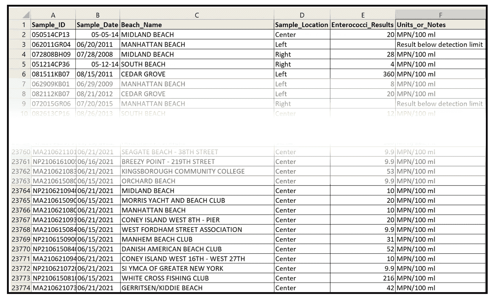

2005 年至 2021 年间从纽约市海滩采集的水质数据样本(来源: [NYC OpenData](https://data.cityofnewyork.us/Health/DOHMH-Beach-Water-Quality-Data/2xir-kwzz) 根据[使用条款](https://www1.nyc.gov/home/terms-of-use.page))(图片由作者提供)

你可以直接从 [**NYC OpenData 网站**](https://data.cityofnewyork.us/Health/DOHMH-Beach-Water-Quality-Data/2xir-kwzz) 下载数据，或者(最好)从 [**这里**](https://gist.github.com/sachinsdate/42a4c2c4b125de55b6385db1c08d814b) 下载数据集的策划版本。

我们将使用 Pandas 库将数据集加载到内存中。我们将从导入我们需要的所有 Python 包开始:

```
**import** math **import** pandas **as** pd
**import** numpy **as** np
**from** matplotlib **import** pyplot **as** plt
**from** scipy.stats **import** norm**#Load the data file**
df = pd.**read_csv**(**'DOHMH_Beach_Water_Quality_Data.csv'**, **header**=0, **infer_datetime_format**=True, **parse_dates**=[**'**Sample_Date**'**])
```

我们将重点关注为米德兰海滩收集的水质数据:

```
df_midland = df[df['Beach_Name']=='MIDLAND BEACH']**#print the data frame
print**(df_midland)
```

我们看到以下输出:

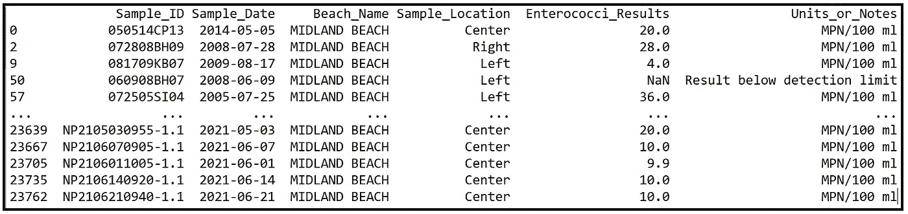

斯塔滕岛米德兰海滩的水质数据(图片由作者提供)

这是我们的样品。在我们继续下一步之前，请注意，数据框中包含微生物值的行中的 nan 太小，测量仪器无法检测。我们将用 0 替换所有这些 nan。

```
df_midland.**fillna**(***value=***0,**inplace**=True)
```

让我们打印出样本的汇总统计数据:

```
df_midland['Enterococci_Results'].**describe**()
```

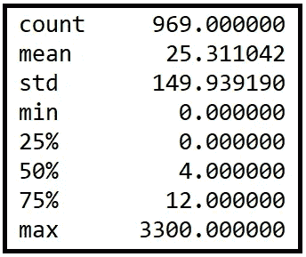

米德兰海滩样本的统计摘要(图片由作者提供)

我们将打印出另一个统计数据，这是最常出现的值，也称为模式:

```
**print**(df_midland['Enterococci_Results'].**mode**())
```

我们得到该模式的值为 0，这意味着从米德兰海滩采集的大多数样品不含(或检测不到)肠球菌。

下图显示了样本值的频率分布:

```
plt.**hist**(df_midland['Enterococci_Results'], **bins**=100)
plt.**xlabel**('Number of Enterococci detected in the sample')
plt.**ylabel**('Number of samples')
plt.**show**()
```

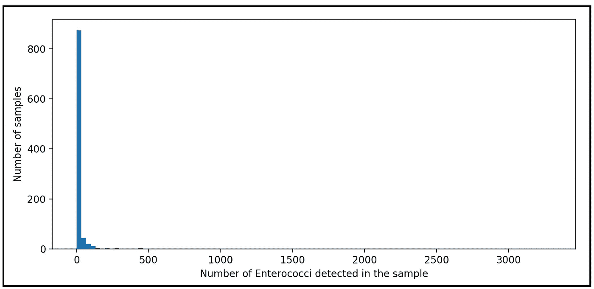

米德兰海滩样本值的频率分布(图片由作者提供)

我们看到米德兰海滩的样本有很大的差异。

让我们回顾一下到目前为止我们所了解的数据:

*   我们的**样本量*n*是 969**
*   **样本均值*Y _ bar*为 25.311042**
*   **样本标准差*S*为 149.939190**
*   **样本是高度倾斜的**有利于零值(事实上它应该为任何维护良好的公共海滩！)
*   样本有一条长尾巴。

我们**不知道**的是:

*   **人口的意思是，**。*群体平均值*是从 2005 年到 2021 年在米德兰海滩收集的理论上无限数量的样本中肠球菌计数的平均值。
*   肠球菌计数的**群体标准差 *σ***
*   人口的**频率分布**。

我们想知道的是:

*我们能否对总体均值* *可能所在的区间做一个概率估计？具体来说，我们是否可以确定一个区间[ _low，，high]，使得总体均值以某种概率比如 95%位于[ _low，，high]内？*

我们来看看如何估计这个区间。

我们将定义一个随机变量 ***Y*** 来表示我们要测量的量，即水样中的肠球菌数。

我们知道 ***Y*** 取值为 *0、10、100、4、8 等。*其单位为每 100 毫升 MPN(单位无关紧要，只要它们都采用相同的单位)。

给定一个给定的概率ρ，我们希望找出两个数 *_low* 和*，high* ，使得随机变量 Y 位于 *_low* 和 *_high* 之间的概率是某个实数 *ρ* ，其中 0 ≤ *ρ* ≤1。

在符号方面，我们将这一要求表述如下:


随机变量 **Y** 的区间估计(图片由作者提供)

习惯上用符号 *(1-α)* 代替 *ρ* 。

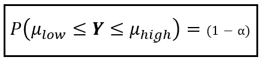

随机变量 **Y** 的区间估计(图片由作者提供)

我们在这里说的是，我们想从 **P** 概率 **D** 分布 **F** 功能**Y***，*中划出一个区域，这样:

1.  该区域的面积为 *(1-α)* ，
2.  该区域从 X 轴*上的*低*和*高*开始延伸。*

下图以随机变量 ***Y*** 的纯假设分布为背景说明了这种情况。记住，我们不知道人口的实际分布 ***Y*** ！请注意，我们在下图中使用习惯符号 *x* 和 *f(x)* ，因为在 *X 轴*上显示一个名为 ***Y*** 的变量可能会让人晕头转向！所以看到这个图中的 *x* 时，只要想到 ***Y*** 。

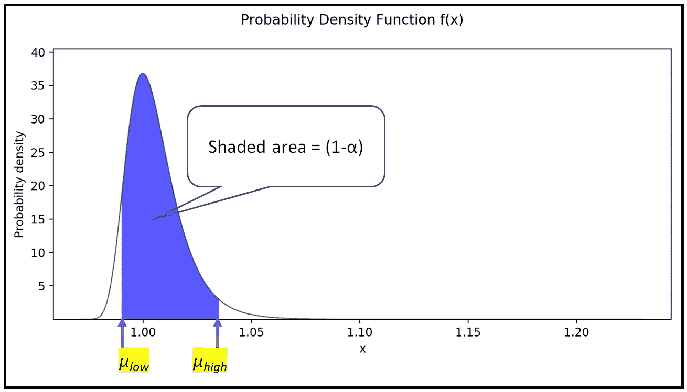

随机变量 **x** 的区间估计图(图片由作者提供)

我们再来看看下面这个表情:


随机变量 **Y** 的区间估计(图片由作者提供)

我们知道概率密度函数曲线下的总面积是 1.0。所以无阴影区域等于 *α* 。我们可以将上述等式重新表述如下:

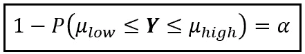

总体平均值的置信区间(图片由作者提供)

我们可以沿着 PDF 曲线的 X 轴*来回滑动 *_low* 和 *_high* ，直到每个*无阴影*区域都有面积 *α/2* 。下图说明了这一点:*

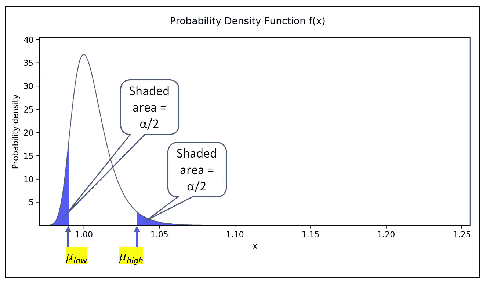

随机变量 **x** 的区间估计的重构(图片由作者提供)

因此，我们有:

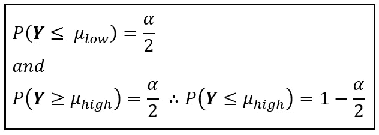

***Y*** 的区间估计用尾部概率 *α/2【作者图片】*

*P(****Y****≤_ 低)和 P(****Y****≤_ 高)*都是简单的累积概率，分别用****C****汇总* ***D*** *分配* ***Y*** *。*例如*P(****Y****≤_ low)=*F(*_ low)=α/2。*由此，我们有:*

*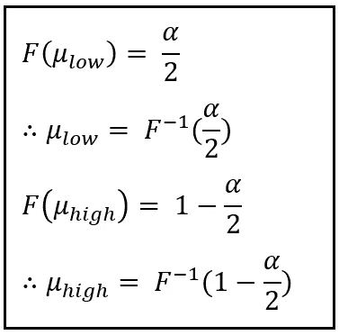*

*表示为反向 CDFs 的区间界限 _low 和 _high*

*我们现在(暂时)假设 ***Y*** 遵循标准正态分布 *N(0，1)* ，即正态分布有一个零均值和一个单位标准差。*

*你可能会感到惊讶，我们假设 ***Y*** 是 *N(0，1)* 分布，因为我们已经看到 ***Y*** 远非正态分布，更不用说 *N(0，1)* 分布了！这里提醒一下样本***【Y】***的分布如何看起来像 ***:****

**

*米德兰海滩样本值 ***Y*** 的频率分布(图片由作者提供)*

*但是不用担心。*

*你会看到，我们将冒这个相当大胆的风险，我们仍然会逃脱！*

*现在，假设 ***Y*** *~ N(0，1)* 的一个重要结果就是 ***Y*** *的 *CDF，即 F(。)成为φ表示的标准正态分布的 CDF(读作 Phi)* **。**由此，*F(x)=φ****(****【x】)*，因而我们有:**

*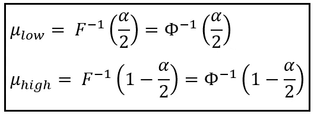*

*根据 N(0，1)分布的逆 CDF 的高低区间估计(图片由作者提供)*

*让我们再跳一小步，定义一个实数 p 如下:*

*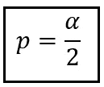*

*介绍 p 和α的关系(图片由作者提供)*

*由于 *0≤ α ≤ 1* ，我们有: *0 ≤ p ≤ 1**

*接下来，我们定义一个量 *z_p* 如下:*

*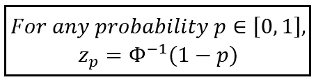*

*使用 CDFφ(x)定义标准正态分布的 z 值(图片由作者提供)*

*在上面的定义中， *(1-p)* 解释为累积概率。例如:*

*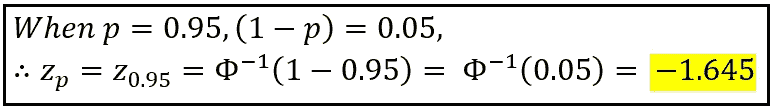*

*p=0.95 时的 z 值(图片由作者提供)*

*这在下面的 *N(0，1)* 分布的 PDF 中有所说明:*

*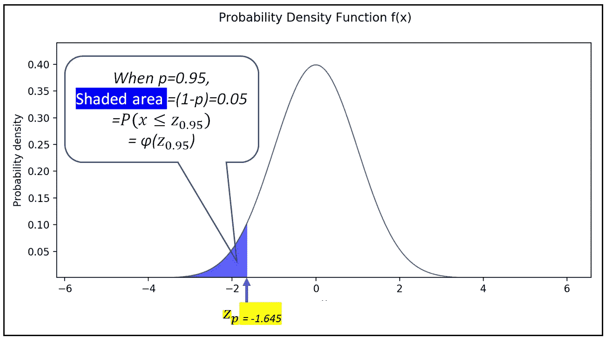*

*p=0.95 时的 z 值(图片由作者提供)*

*类似地:*

*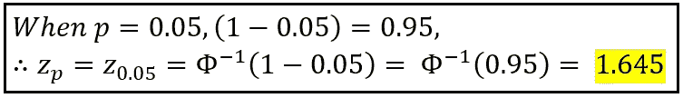*

*p=0.05 时的 z 值(图片由作者提供)*

*如下图所示:*

*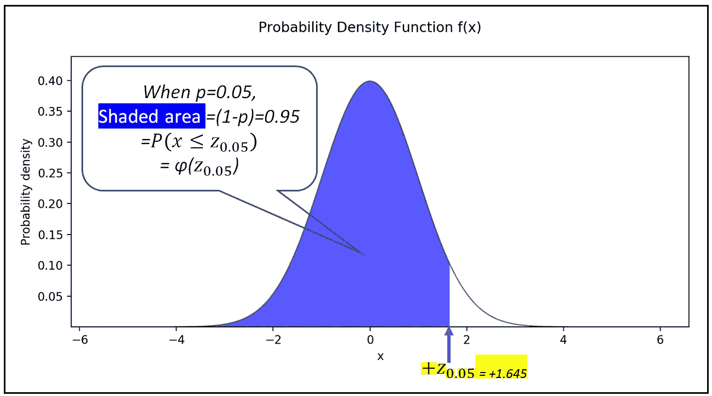*

*p=0.05 时的 z 值(图片由作者提供)*

*因此，我们看到:*

*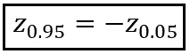*

*z 值的对称性(图片由作者提供)*

*或者，一般来说，由于围绕 *0* 的 *N(0，1)* 分布的对称性，我们有:*

*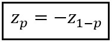*

*对于给定的 p，两个相应的 z 值围绕 0 对称(图片由作者提供)*

*现在，回想一下:*

**

*根据 N(0，1)分布的逆 CDF 的高低区间估计(图片由作者提供)*

*因为:*

*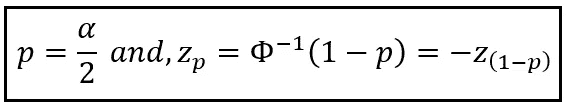*

*在结合上述等式后，我们得到以下结果:*

*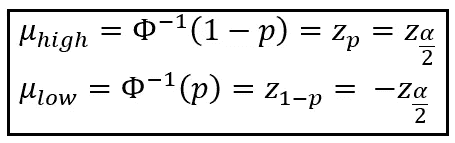*

*用 z 值表示的*随机变量* ***Y*** 的高低区间值(图片由作者提供)*

*我们现在可以用 z 值表示肠球菌计数 ***Y*** 的 *(1-α)*100%* 置信区间如下:*

*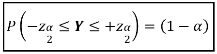*

*用 z 值表示的*随机变量* ***Y*** 的(1- *α)* 置信区间(图片由作者提供)*

*下图显示了标准正态分布零均值附近 90%置信区间的两个 z 值:*

*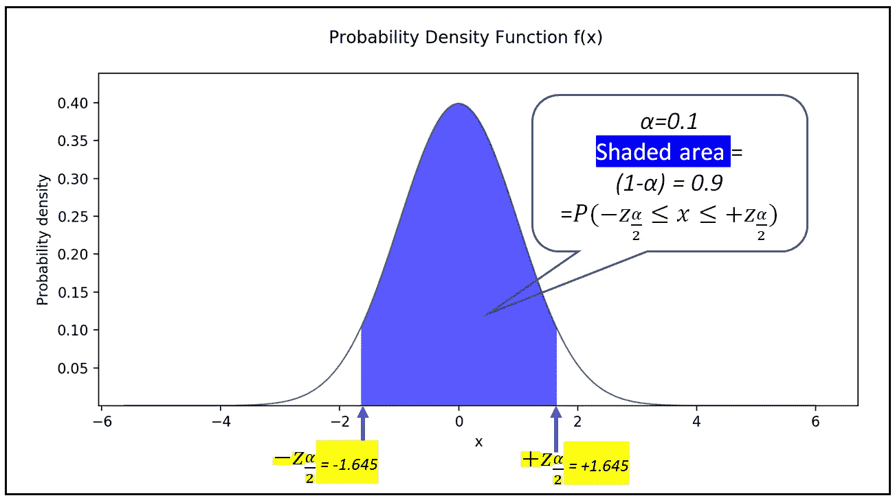*

*对应于 N(0，1)分布 90%置信区间的 z 值(图片由作者提供)*

*让我们记住，以上所有假设肠球菌计数 ***Y*** 具有标准正态分布，尽管我们非常清楚它不是。我们必须找到解决这个致命弱点的方法。*

*冒着混淆一些隐喻的风险，我们现在将使用我们的黑桃 a 并通过以下两步“治愈”我们的致命弱点:*

*   *我们将把 ***Y*** 重新定义为在 *n* 个样本中发现的肠球菌的**平均计数。回想之前， ***Y*** 只是点估计，单个计数。现在，我们将 ***Y*** 重新定义为平均值，如下所示:***

*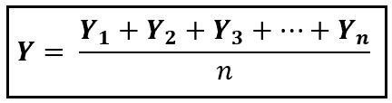*

*n 个样本的平均肠球菌计数(图片由作者提供)*

*这里， ***Y_1，Y_2，…Y_n*** 为样品 *1，2，3，…n* 中测定的肠球菌数。注意 ***Y_1，Y_2，…Y_n*** 本身是独立的，同分布的随机变量。也因此，重新定义的 ***Y*** 为 ***Y_1，Y_2，…Y_n*** 的均值，也是一个随机变量。为了理解为什么平均计数也是一个随机变量，想象一下从米德兰海滩收集另一个大小为 *n* 的样本。它将产生不同的平均值。现在收集大小为 *n* 的第三个样本，你将得到第三个，可能是平均值*的不同值，以此类推。因此， ***的肠球菌平均计数 Y 本身就是一个随机变量*** 。因此，到目前为止我们得到的关于 ***Y*** 的置信区间的一切仍然成立。**

*   **现在，让我们定义另一个随机变量 ***Z*** 使得:**

**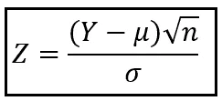**

****Z** 作为 **Y** 的函数(图片由作者提供)**

**在上面的公式中:**

*   ***n* 是样本量(在我们的数据集中， *n=969* )**
*   **和 *σ* 分别是总体均值和总体标准差。**

**可以看出，如果 *n* 是‘足够大’，那么由中心极限定理可知， ***Z*** *近似为 N(0，1)分布。***

**还可以看出，**对于大的 *n* ，样本标准差 *S* 提供了一个总体标准差****的 [**无偏估计值**](/understanding-estimation-bias-and-the-bias-variance-tradeoff-79ba42ab79c) **。***简单来说，对于 ***Z*** ，我们可以将上面公式中的 *σ* 替换为 *S* 。***

**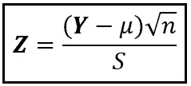**

****Z** ~ N(0，1)(图片由作者提供)**

**就像 ***Y*** 一样，变量 ***Z*** 也是随机变量，但这一次， ***Z*** 有一个近似标准的正态分布。因此，我们可以将*的 *(1-α)* 置信区间估计公式如下:***

**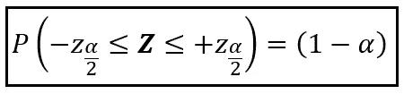**

*****Z*** *用 Z 值表示的(1- *α)置信区间估计值(图片由作者提供)****

**用公式代替上式中的 ***Z*** :**

**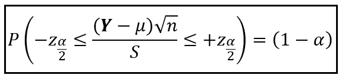**

**重新排列，我们有以下结果:**

**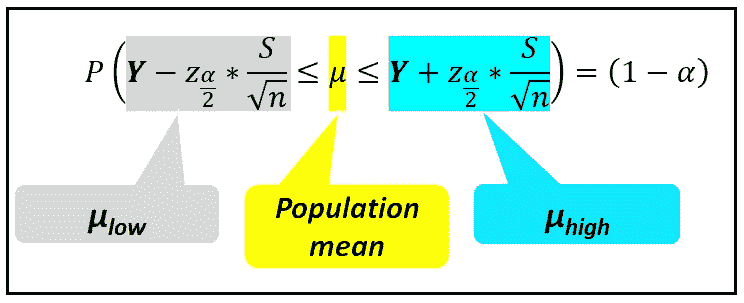**

**(1- *α)总体均值的置信区间估计(图片由作者提供)***

**我们所完成的是在 *(1-α)* 置信水平下，得出总体均值的区间估计 *[ _low，_high]* 。**

**让我们使用上述公式计算在米德兰海滩收集的样本在 95% 置信水平下*的区间估计值:***

```
*****#sample size n***n = **len**(df_midland[**'Enterococci_Results'**])***#sample mean Y* Y** = df_midland[**'Enterococci_Results'**].**mean**()***#sample standard deviation*** S = df_midland[**'Enterococci_Results'**].**std**()***#significance alpha (1-alpha)*100 = 95%*** alpha = 0.05***#p-value for required alpha*** p = alpha / 2***#z value for the specified p-value*** z_p=norm.**ppf**(1-p)***#mu_low*** mu_low = **Y** - z_p*S/math.**sqrt**(n)***#mu_high*** mu_high = **Y** + z_p*S/math.**sqrt**(n)**print**(**'95% Confidence intervals for the population mean (mu)='**+str((mu_low, mu_high)))**
```

**我们看到以下输出:**

```
**95% Confidence intervals for the population mean (mu)=(**15.870403932430401**, **34.751680690892634**)**
```

**相当宽的置信区间是由于样本值的高度偏斜分布，这反过来导致了较大的样本标准差 *S=149.94* 。**

# **区间估计在回归建模中的适用性**

**当您训练一个回归模型时，回归变量的系数会获得它们的“拟合”值，如下所示:**

**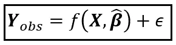**

**观察值 **Y_obs** 是回归矩阵 **X** 的某个函数，拟合系数向量 **β_cap** 和回归残差 **ε** (图片由作者提供)**

**粗体符号表示这些值是矩阵。**

**例如，**训练的线性回归模型**的方程可以表示如下:**

**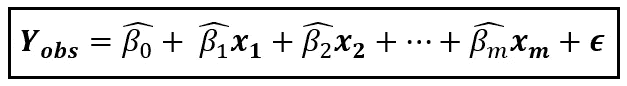**

**拟合线性回归模型的方程(图片由作者提供)**

**每个拟合系数 ***β_cap*** 都是随机变量。要了解原因，请想象该模型在另一个大小为 *n* 的训练样本上进行训练。在第二个样本上，拟合的系数可能呈现不同的向量值。在大小为 *n* ， ***β_cap*** 的第三个训练样本上，将呈现另一个值向量，如此这般。因此，β_cap 中的每个 *β_cap_j* ***都是具有某种未知分布的随机变量。*****

**因此，每当您在训练数据集上训练您的回归模型时，您得到的仅仅是对 ***β_cap 的真实总体值的点估计。*****

**在这种情况下，在某种置信水平下，知道 ***中每个 *β_cap_j* 的“真实”群体值位于哪个区间将是有用的。换句话说，在某个置信水平 *(1-α)*100%* 下，知道***β_ cap****的区间估计是有用的。******

**每当您训练回归模型时，您的建模软件通常会报告所有回归系数的这些置信区间。**

**让我们通过在肠球菌计数数据集上建立回归模型来快速演示区间估计的应用。**

**我们的变量如下:
***Y****=肠球菌 _ 结果* ***X****=【样品 _ 位置，测量 _ 星期 _ 日，测量 _ 月】，即 3 个回归变量。***

**从导入所有必需的包开始:**

```
****import** pandas **as** pd **from** patsy **import** dmatrices
**import** statsmodels.api **as** sm**
```

**使用 Pandas 将数据集载入内存:**

```
**df = pd.read_csv(**'DOHMH_Beach_Water_Quality_Data.csv'**, header=0, infer_datetime_format=**True**, parse_dates=[**'Sample_Date'**])**
```

**为米德兰海滩开拓数据:**

```
**df_midland = df[df[**'Beach_Name'**]==**'MIDLAND BEACH'**]**
```

**添加虚拟变量:*测量 _ 星期 _ 日，测量 _ 月***

```
**df_midland['**MEASUREMENT_DAY_OF_WEEK**'] = df['**Sample_Date**'].dt.**dayofweek**
df_midland['**MEASUREMENT_MONTH**'] = df['**Sample_Date**'].dt.**month****
```

**形成回归表达式:**

```
***expr = 'Enterococci_Results ~ Sample_Location + MEASUREMENT_DAY_OF_WEEK + MEASUREMENT_MONTH'***
```

**使用 [Patsy](https://patsy.readthedocs.io/en/latest/quickstart.html) 雕刻出 ***X*** 和 ***y*** 矩阵:**

```
**y_train, X_train = **dmatrices**(expr, df_midland, **return_type**=**'**dataframe**'**)**
```

**使用[泊松](/an-illustrated-guide-to-the-poisson-regression-model-50cccba15958)链接函数建立并训练[广义线性模型](/generalized-linear-models-9ec4dfe3dc3f):**

```
**poisson_training_results = sm.**GLM**(y_train, X_train, **family**=sm.families.Poisson()).**fit**()**
```

**打印适合的模型摘要:**

```
****print**(poisson_training_results.**summary**())**
```

**我们看到以下输出。我已经强调了模型的拟合系数。还要注意的是 [statsmodels](https://www.statsmodels.org/stable/index.html) 已经打印出 95%置信水平下系数的真实总体水平值的**区间估计值**:**

**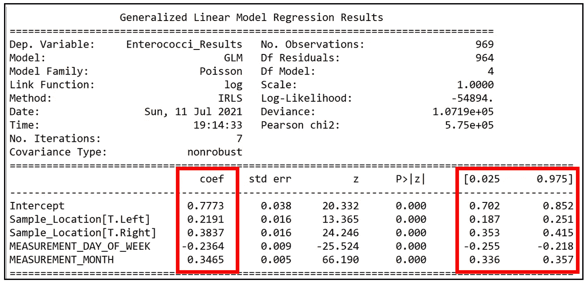**

**GLM 泊松回归模型的训练输出显示了拟合系数和 95%置信水平下的相应区间估计值(图片由作者提供)**

**以下是本文中使用的完整源代码:**

# **参考文献和版权**

## **数据集**

**[DOHMH 海滩水质数据](https://data.cityofnewyork.us/Health/DOHMH-Beach-Water-Quality-Data/2xir-kwzz)取自 [NYC OpenData](https://opendata.cityofnewyork.us/) 根据其[使用条款](https://www1.nyc.gov/home/terms-of-use.page)**

## **形象**

****横幅图片:**纽约公共图书馆美国历史、地方历史和家谱部的伊尔玛和保罗·米尔斯坦。“阳光和海水浴，米德兰海滩，斯塔滕岛，纽约[海滩上的人，远处的建筑和摩天轮。]" *纽约公共图书馆数字馆藏*。[https://digital collections . nypl . org/items/510 d47 d9-c04b-a3d 9-e040-e00a 18064 a99](https://digitalcollections.nypl.org/items/510d47d9-c04b-a3d9-e040-e00a18064a99)。*自由使用，不受限制。***

**本文中所有其他图片的版权归 [Sachin Date](https://www.linkedin.com/in/sachindate/) 所有，版权归 [CC-BY-NC-SA](https://creativecommons.org/licenses/by-nc-sa/4.0/) 所有，除非图片下方提到了不同的来源和版权。**

***感谢阅读！如果你喜欢这篇文章，请* [***关注我***](https://timeseriesreasoning.medium.com/) *获取关于回归和时间序列分析的技巧、操作和编程建议。***