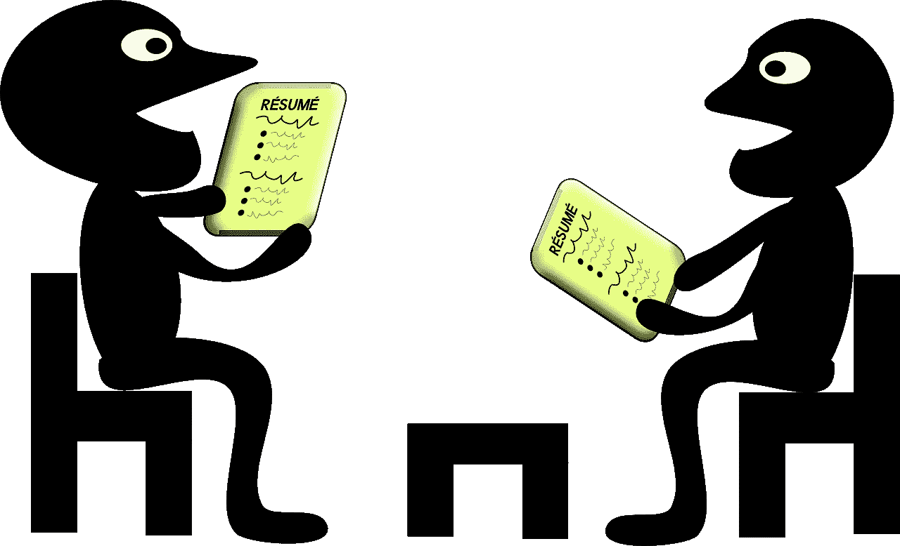

# 面试 ML 博士？下面是一些示例编码问题。

> 原文：<https://towardsdatascience.com/interviewing-for-a-phd-in-ml-here-are-some-sample-coding-questions-a0d228155f3f?source=collection_archive---------20----------------------->

## 采访者和被采访者指南。



来源:[https://pix abay . com/vectors/job-interview-career-conference-156130/](https://pixabay.com/vectors/job-interview-career-conference-156130/)

机器学习博士受访者通常会在各种维度上接受评估:人际关系、演示质量、技术基础和编码能力。

在博士期间，我有机会在 [MPI-IS](https://is.mpg.de/) 和 [CLS](https://learning-systems.org/) 对几位博士项目候选人进行编码面试。在此之前，我首先开始在脸书公司主持编码面试，并从我的导师那里学到了不少东西(谢谢，KK！).在这篇博文中，我提出了一组问题样本，用来指导求职者完成整个过程。

问题从简单和立即可解决的进展到更微妙的。这些问题的设计方式既有直截了当的解决方案(可能不正确)，也有更复杂(但不一定有效)的解决方案，为创造性讨论留下了充足的空间。

考生被鼓励写伪代码或使用他们更熟悉的语言语法；自然，鉴于这是机器学习面试，大部分考生直接用 python 写。

除了编写代码，面试还包括运行时和内存分析，涉及常用的数据结构(哈希映射和二叉树)，以及基本的组合学。

不用说，大多数候选人在这组问题上表现得相当好，大多数都按时完成了(大约 40 分钟)，并且似乎喜欢这种形式(我希望从我面试过的人那里得到反馈！)

让我们开始吧。

# 问题 1

```
def is_palindrome(s):
    ‘’’return True if `s` and its reverse are the same, False otherwise’’’
```

这个问题比较直白，无一例外，所有考生都在前 5 分钟解决。目的有两个。首先，它可以快速评估候选人，这样如果下一个问题很难回答，就可以相应地调整。更重要的是，这个问题对候选人来说是一个快速而轻松的胜利，增强了他们的信心，并为他们放松了谈话。

一些潜在的解决方案可能如下所示:

```
def is_palindrome(s):
    for i in range(len(s//2)): 
        if s[i] != s[-i-1]: 
            return False 
    return True
```

或者

```
def is_palindrome(s):
    return s == s[::-1]
```

最后，我询问运行时间，上面两个解决方案的运行时间都是 O(n)。同样，快速和轻松的胜利有助于候选人舒服地思考，就像他们在非面试环境中一样。有时，当候选人使用内置方法或库(例如，还原字符串)时，这暗示了经验，这将在接下来的问题中进一步表现出来。

# 问题 2

```
def is_anagram(a, b):
    ‘’’return True if string `a` and `b` are permutations of one another, False otherwise’’’
```

这是我最喜欢的问题之一，因为它有多种不同实现级别和运行时复杂性的解决方案。这鼓励了候选人的创造性思维，并经常导致有趣的讨论。

```
def is_anagram(a, b): 
    for c in a: 
        if c not in b: 
            return False 
    return True
```

这是一个简单而优雅的第一种解决方案，适用于某些输入对，例如{123，312}。但是它也错误地为{123，3124}对返回 True(试试看！).

那么我们该如何进行呢？一个看似简单的解决方法是断言 a 和 b 的长度相等，结果是:

```
def is_anagram(a, b): 
    assert len(a) == len(b) 
    for c in a: 
        if c not in b: 
            return False 
    return True
```

但是在对该解决方案进行更仔细的检查后(期望一个顶级候选人挑战他们自己的解决方案并测试极限情况)，我们可以看到该解决方案并不足够，因为它对于其他对是失败的，例如，对于{122，123}错误地返回 True。

然后候选人注意到(或被提醒)输入参数 a 和 b 的顺序很重要。下一个简单的步骤是在另一个方向重复嵌套的 for 循环，结果是:

```
def is_anagram(a, b): 
    assert len(a) == len(b) 
    for c in a: 
        if c not in b: 
            return False 
    for c in b: 
        if c not in a: 
            return False 
    return True
```

在这一点上，我问候选人关于运行时间的问题。给定嵌套的 for 循环结构，这是 O(n)运行时。我还问他们是否认为解决方案是完整的，对此，大多数人给出了一个反例。特别是，下一个潜在的陷阱是如何处理重复。例如，即使使用断言和双向嵌套 For 循环，上面的代码对于{1233，1123}也是失败的。

同样，有多种方法可以解决这个问题。一旦候选人意识到他们应该考虑一个解决方案来处理重复，大多数人就开始想办法用单独的字符计数器来修改上面的代码；我很快引导他们不要从头开始实现这个，因为这很耗时，也不好玩！相反，我鼓励他们考虑可以自动存储这种计数器的数据结构。

在这里，大多数候选人指向一个散列图(字典),它除了记录重复次数之外，还记录所有独特的字符。然后，解决方案依赖于为每个输入字符串分别构造两个字典，即 char_counts_a 和 char_counts_b，然后比较这两个字典的键值对。这种解决方案与前一种解决方案相比需要更多的内存，但是，它的运行时间为 O(n ),并且可以成功地处理包含非唯一字符的字符串。

在这一点上，虽然我们已经确定了问题的解决方案，虽然答案似乎是最有效的(至少就我所知)，面试可以通过评估候选人知识的其他方面继续进行。

在这里，我要求候选人创造性地思考解决这个问题的替代方法。下面是我们讨论面试中允许时间的两种额外方法。

几乎总是，当被要求创造性地思考时，候选人微笑，也许这是他们玩得开心的一个信号:)强烈鼓励！

首先，我让候选人重温一下变位词对的定义。我提醒考生，根据定义，变位词意味着两个字符串是彼此的排列。你认为基于排列的解决方案会是什么样的？提示:运行时:O(n * n！).big-O 的运行时间是相同的，有重复和没有重复，这是衡量基本组合学的另一个值得讨论的问题。

第二，我要求候选人考虑他们可能在计算机科学入门课程中学习过的替代方法(例如，排序)。你认为基于排列的解决方案会是什么样的？提示:运行时:O(n * log n)。

不言而喻，每个面试都有其独特之处，上面的回答顺序并不代表不同的候选人是如何思考和解决问题的。面试官角色的难度(是的，面试官也很难！)是在头脑中同时有许多可能的解决方案，以便帮助学生找到解决方案。评估候选人也不总是直截了当的，因为候选人在直截了当的问题上表现不佳的情况并不少见，但在更复杂的问题上很快就能看出细微差别和死角。很少有人能用一个问题来决定性地评估编码能力，因此我发现问许多小问题是加倍重要的。

# 问题 3

```
def fibonacci(n):
    ‘’’return the nth number (0-index) in the Fibonacci sequence (1,1,2,3,5,8,13), e.g., fibonacci(4) would return 5.’’’
```

候选人建议的一个常见的(也是好的)第一种解决方案包括对斐波那契数列数字进行 for 循环，如下所示:

```
def fibonacci(n): 
    fib_nums = [1,1] 
    for i in range(2,n): 
    fib_nums.append( 
        fib_nums[-1] + 
        fib_nums[-2]
    ) 
    return fib_nums[-1]
```

这个解决方案的运行时间为 O(n)。另一种常见的方法是递归，如下所示:

```
def fibonacci(n): 
    if i == 0 or i == 1: 
        return 1 
    return fibonacci(n-1) + fibonacci(n-2)
```

虽然这种解决方案看起来优雅而简洁，但不幸的是，它的运行时间呈指数级增长。与候选人一起完成这个运行时练习提供了许多好的信号。强有力的候选人不仅能快速识别出调用堆栈的缺陷，还能自如地使用数据结构(这里是二叉树)来导出最终的 O(2^n)run-time.最有经验的候选人也提出了改进的方法，通常诉诸于存储已经计算出的斐波那契数列的值，要么像第一个答案中那样显式地存储，要么通过缓存隐式地存储(例如，使用 python 中的 [@Memoize](https://www.python-course.eu/python3_memoization.php) 装饰器)。

重要的是，和许多面试一样，得出最终答案只是评估的一部分。即使候选人没有立即找到解决方案，这也是面试官评估候选人对新思想的接受程度和学习新概念的好奇心的一个机会。根据我的经验，候选人几乎总是带着这个问题愉快地离开。

最后，斐波那契数列有现有的[闭合形式表达式](https://en.wikipedia.org/wiki/Fibonacci_number#Closed-form_expression)，它依赖于黄金比例和一些相关的算术。这是一个最终的(cherry-on-top，但不是必需的)信号，候选人可以在第一个 O(n)解决方案(可以使用 8 位内存计算答案)和封闭形式的 O(1)(应该使用浮点运算运行)之间进行比较。

# 结论

希望你从这些面试问题样本中学到了一些东西。当然，这些问题不限于机器学习博士面试，可以更广泛地用于其他基于技术编码的面试。特别是对于 ML 职位，我认为超越最初的解决方案并精通在不同维度上衡量和对比解决方案是一项基本技能，因为我们很少遇到简单的无所不包的解决方案。这些问题(试图)评估这种能力，同时测试任何博士候选人都应该具备的快速原型制作技能的基本知识。最重要的是，这些问题是以这样一种方式构建的，即在一个平静和放松的环境中为候选人引导面试，从简单的建立信心到更困难的需要创造性思维的讨论。

在你的下一次面试中，你可以随意使用这些问题、修改后的问题或总体框架。如果你有反馈，一定要让我知道 [@heikalkhan](https://twitter.com/heikalkhan) ！

既然我已经分享了我的秘密问题，我必须去寻找新的问题。再见！