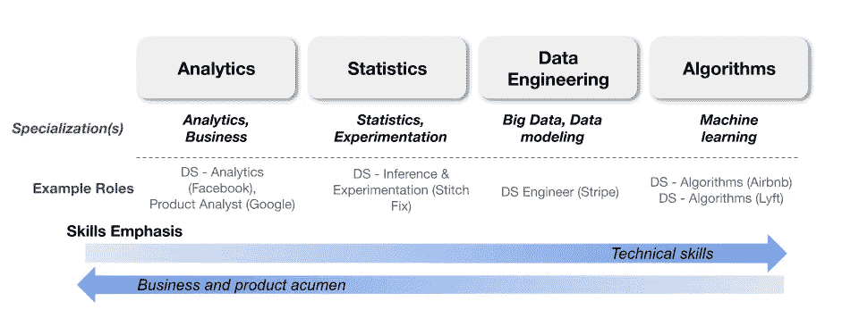
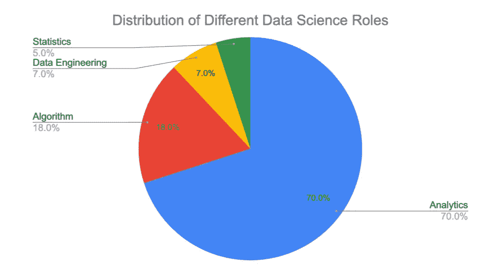
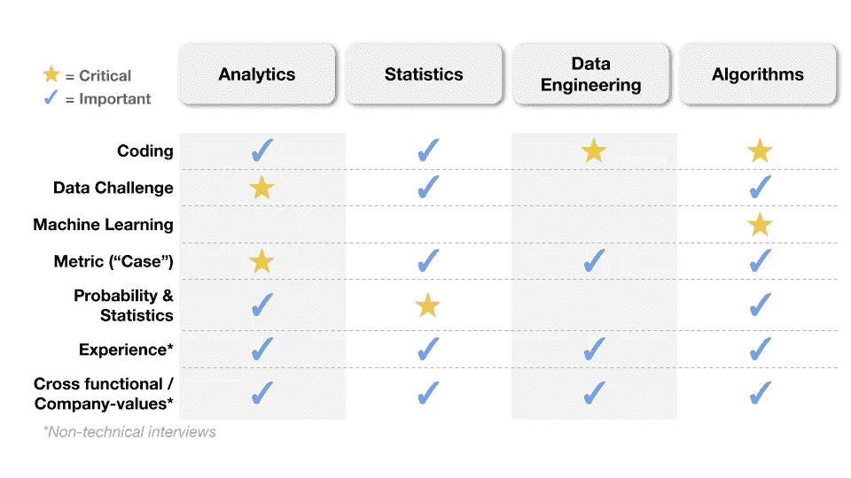

# 第一份数据科学家工作的面试:期待什么以及如何准备

> 原文：<https://towardsdatascience.com/interviewing-for-your-first-data-scientist-job-what-to-expect-and-how-to-prepare-1f3f9a977e14?source=collection_archive---------5----------------------->

## [办公时间](https://towardsdatascience.com/tagged/office-hours)，[数据科学面试](https://towardsdatascience.com/tagged/data-science-interview)

## 面试的过程、类型和成功的秘诀

由[艾玛丁](https://medium.com/@emmading)和[藏加藤](https://www.linkedin.com/in/hidek/)撰写

由[奥斯汀·迪斯特尔](https://unsplash.com/@austindistel?utm_source=medium&utm_medium=referral)在 [Unsplash](https://unsplash.com?utm_source=medium&utm_medium=referral) 上拍摄的照片

如果你对如何开始成为一名数据科学家感到不知所措，你并不孤单。当你搜索“数据科学面试”时，呈现给你的是无尽的指针，包括 Python、R、统计学、A/B 测试、机器学习、大数据中的主题。你会得到阅读无数书籍的建议。令人尴尬的是，我也给过别人类似的宽泛建议。

**在现实中，你不必为获得第一份数据科学工作做好一切准备。**

在本帖中，我们将教你四个关键领域:

1.  数据科学家角色的类型
2.  你应该准备的面试类型
3.  面试过程中会发生什么
4.  面试官在评估什么

如果您认为我们能够以任何方式让您的旅程变得更轻松，您可以在这里联系我们！

让我们开始吧。

# 目录

*   [浏览不同类型的数据科学角色](#6966)
*   [面试流程:5 个阶段](#4c42)
    1。[在线测评](#06ea)
    2。[招聘人员电话屏幕](##24b6)
    3。[数据挑战](#7a23)
    4。[技术电话屏幕](#e75b)
    5。[现场(通常 4-6 轮)](#14d2)
*   [7 种面试类型](#3120)
    1 .[编码面试](#dc51)2
    。[数据挑战](#2a23)
    3。[公制("案例")面试](#8912)
    4。[概率&统计面试](#0085)
    5。[机器学习面试](#4a42)
    6。[经历面试](#091f)
    7。[跨职能/公司价值观面试](#672a)
*   [确定筹备工作重点领域的优先顺序](#1fa5)
*   [记住:评估属性](#2979)
*   [结束语和总结](#b11f)

# 浏览不同类型的数据科学角色

我们经常听到的一个痛点是职称令人困惑。头衔很多，产品数据科学家、机器学习数据科学家、数据科学工程师、数据分析师，名单还在不断增长。如果不熟悉行业，很难知道该报考哪些岗位。

一般来说，角色有四种类型: ***分析******统计******数据* *工程*，算法***。这种分类是基于拥有成熟数据科学团队的大公司(如脸书、Lyft、Airbnb、网飞)。*

**

*来源:图片由作者提供。*

*上面，我们描述了每个角色及其专业和示例标题。下面，我们进一步阐述。*

*   ****分析学*。**该角色通过基于数据洞察提出建议来推动业务影响。职责包括帮助利益相关者做出基于数据的决策，执行探索性分析，定义业务指标，以及进行数据可视化(例如，仪表板)。*
*   ****统计*。**该角色识别扩大实验规模的机会，并实施统计方法(如因果框架)来解决业务挑战。*
*   ****数据工程*** 。该角色构建可扩展的数据管道，以支持数据驱动的决策，通常面向精通数据的消费者(分析师和数据科学家)。这个角色类似于典型的数据工程师，但通常嵌入在数据科学团队中，而不是专注于服务更广泛的利益相关者(如工程师和产品经理)。*
*   ****算法*** 。这个角色通过开发统计、机器学习和优化模型来创造商业价值。通常，人们会执行探索性的数据分析，以获得对业务问题的更深入的理解，并生产模型。*

*尽管每个角色看起来都是独特的，但职责经常会有重叠。实际上，根据团队组成和业务需求(尤其是在较小的公司)，身兼多个角色是很常见的。了解该职位的职责类型和项目对你来说很重要，在这个过程中尽早了解(通过询问招聘人员或招聘经理)，这样你就能感觉到自己是否适合这个职位。*

*下图显示了就业市场上不同角色的分布情况。这一结果基于 2020 年 9 月至 11 月在 LinkedIn 上发布的约 1，000 个全职数据科学职位空缺。*

**

*来源:图片由作者提供。*

*很明显，占主导地位的是*分析*，而统计职位最少。因此，如果你处于数据科学职业生涯的早期， *Analytics* 将是一个很好的开始选择。*

*也就是说，哪个角色最符合你的技能、兴趣和角色可用性？选择一个，把你的注意力集中在这个角色需要的技能上，我们将在这篇文章的后面分享更多。*

*接下来，我们来走一遍面试过程中你应该期待的流程。*

# *面试流程:5 个阶段*

*在这一部分，我们将讨论面试过程的典型阶段。请注意，虽然大多数公司都有类似的阶段，但顺序可能会有所不同。*

*下面，我们将深入探讨每个阶段，包括公司的目标和期望。在下一节中，我们将更详细地介绍每种类型的面试中会问到的问题类型。*

**

*来源:图片由作者提供。*

## *1.在线评估*

**典型时长:30 分钟—1 小时采访类型:编码发生可能性:1/3**

***公司目标:**公司使用在线评估来筛选出不感兴趣的候选人和没有最低技术技能的候选人。*

*在线评估通常在一个编码网站上完成(例如 [HackerRank](https://www.hackerrank.com/) )，不涉及预定的面对面面试，因此它有助于更有效地选择候选人。*

## *2.招聘人员电话屏幕*

**典型时长:30 分钟采访类型:行为&跨职能发生可能性:3/3**

***公司目标:**招聘人员通常会确保职位、你的兴趣、时间表和要求(如签证)非常契合。这是一个突出候选人和公司潜在危险信号的机会。*

*招聘人员会从介绍公司、角色开始，有时还会介绍你面试的团队。之后，招聘人员可能会询问你的背景、时间表以及你对新职位的期望(包括薪酬)。这是一个提问的好时机，可以解决任何问题。*

## *3.数据挑战*

**典型时长:1 天— 2 周采访类型:编码发生可能性:3 个中的 2 个**

***公司目标:**数据挑战筛选出不感兴趣的候选人，并测试技术、解决问题和沟通技巧。*

*数据挑战通常要求您处理业务案例，并根据样本数据提供建议。有时，你会被要求写一份摘要文件或演示文稿。其他时候，会给你一系列问题来回答。您使用的方法通常很灵活，因为这一轮测试的是您解决问题的技能，而不是特定语言或工具的专业知识。也就是说，你可能使用的最常见的语言是 SQL、Python 和 r。一些公司要求你提交你的可交付成果，以确定你是否会继续前进，而其他公司可能不需要它。在这两种情况下，下一轮你被要求展示你的作品是很常见的。*

## *4.技术电话屏幕*

**典型时长:30 分钟—1 小时采访类型:编码发生可能性:3 分之 2.5**

***公司目标:**技术电话屏幕用于测试演示该角色所需的最低技术技能。*

*你通常会面试数据科学家或招聘经理。开始的时候，他们可能会让你介绍自己，或者谈谈你以前的经历。*

*之后，面试官可能会深入技术问题。问题的类型因角色而异，可能包括数据提取(SQL)、指标、统计和概率、机器学习和编码问题。通常，您最多会收到两种类型的问题。例如，如果你申请一个*分析*角色，你可能会得到一个数据提取和指标问题的组合。由于这种面试往往千差万别，我们建议在面试前问问你的招聘人员有什么期望。*

## *5.现场(通常 4-6 轮)*

**典型时长:4-6 小时采访类型:所有发生可能性:3/3**

***公司目标:**现场面试由多次面试组成，将测试职位所需的大部分技能。*

*现场面试是你获得工作机会前的最后一步，也是最重要的一步。现场采访通常比之前的采访更全面，因为它包含多次采访(通常为 4-6 次采访)。在新冠肺炎之前，大多数 onsites 都是托管在公司园区内，然而，现在它们都是虚拟的。根据你申请的职位类型，面试类型的组合可能会有所不同。例如，现场的*分析*角色可能有多个案例面试，而没有任何机器学习面试。我们将在下一节详细讨论这一点。*

*虽然上述流程描述了一般步骤，但该流程中的面试类型可能会有所不同。让我们潜入更深的地方。*

# *7 种类型的面试*

**

*由[尼克·莫瑞森](https://unsplash.com/@nickmorrison?utm_source=medium&utm_medium=referral)在 [Unsplash](https://unsplash.com?utm_source=medium&utm_medium=referral) 上拍摄的照片*

*在这一部分，我们将介绍 7 种常见的面试类型。我们还将介绍公司在寻找什么，以及如何表现出色的技巧。每次面试通常会评估 1-2 项技能和行为特征。有时候，招聘人员会明确告诉你应该关注什么，以便你做好准备。*

*面试可以分为技术性的和非技术性的。技术面试侧重于工作所需的“硬技能”，而非技术面试侧重于“软技能”(如沟通、领导能力)和团队配合。*

*下面，我们为每种类型的面试提供了简短的描述、示例问题和资源。*

## *1.编码面试*

*这次面试涵盖了各种问题，如应用数据提取/操作问题、计算机科学基础(数据结构、算法和编程最佳实践)和机器学习算法。*

*根据角色的类型，问题可能会有所不同。几乎所有的角色都需要 SQL，所以它是一种非常通用的测试语言。*

***例题***

*   *获取每个用户的平均购买量(SQL)。*
*   *不使用中值或百分位数函数(SQL ),查找按国家分组的收入中值。*
*   *寻找未排序数组的中间值(Python)*
*   *编码一个经典的机器学习算法，例如 k-means，k 近邻(Python)。*

***顶级技巧***

*   *在你开始编码之前，先和面试官一起完成你的计划，这样你就可以澄清问题并验证你的方法。*
*   *你应该知道基础知识，但你不必记住所有的东西。*

***资源***

*   *获得 SQL 面试的有用技巧([视频](https://youtu.be/pJeGiUTWi1s))。*
*   *关于准备 Python 问题的综合指南([博文](/the-ultimate-guide-to-acing-coding-interviews-for-data-scientists-d45c99d6bddc))。*

## *2.数据挑战*

*该面试要求候选人分析样本数据集(通常以 CSV 文件形式提供)，并提出解决业务问题的建议。因此，这通常要么在课后评估中完成，要么在你现场解决问题时被要求分享你的屏幕。问题的范围可以从探索性分析，到数据清理和提取(SQL)问题，到特征工程和建模练习(例如，预测或分割)。*

***例题***

*   *给定一个客户行为数据集，定义客户流失并找出可能影响客户流失的因素。*
*   *给定一个数据集购买行为，确定转化率的趋势，并提供改进建议。*

***顶级小贴士***

*   *在开始研究领域之前，对业务问题有一个清晰的理解。提出专注于手头问题的解决方案。*
*   *除非另有说明，否则不要假设数据是干净的。考虑检查边角案例，寻找异常值。如果你没有时间去查数据，明确的陈述你的假设。*
*   *总结您的工作并提供后续步骤(例如，进一步探索的领域)。*

***资源***

*   *解决各种数据挑战的在线社区( [Kaggle](https://www.kaggle.com/) )*
*   *完成数据科学的家庭作业([博客](/acing-the-data-science-take-home-assignment-530a93164e52))*

## *3.度量(“案例”)面试*

*给定一个商业场景，讨论你解决问题的方法并提出建议。这些有多种形式，包括:诊断度量转变，如何衡量成功(例如，度量头脑风暴)，如何权衡评估特性，以及如何改进产品。*

***例题***

*   *您将如何调查利润的负指标变化？*
*   *使用每日活跃用户(DAU)作为成功指标的利弊是什么？*
*   *你会如何为 X 特性设计一个实验？*
*   *如果 A/B 测试显示预期指标(即点击率)在上升，而另一个指标(即点击率)在下降，您将如何做出投放决策？*

***顶部提示***

*   *在回答和询问澄清性问题之前，复述练习的背景和目标。*
*   *问面试官几分钟，让你写下答案，并在说话前组织好你的交流。*
*   *在给出完整的答案之前，先考虑简单地分享多种方法，并询问你的面试官在哪里可以分享更多的细节。*

***资源***

*   *数据科学家破解商业案例面试的终极指南([第一部分](/the-ultimate-guide-to-cracking-business-case-interviews-for-data-scientists-part-1-cb768c37edf4)，[第二部分](/the-ultimate-guide-to-cracking-business-case-interviews-for-data-scientists-part-2-7bc38fbe635f#09bd))*
*   *最常见的指标问题和框架([视频](https://youtu.be/nPJKFWMiIC8))*
*   *真实公制问答([视频播放列表](https://www.youtube.com/playlist?list=PLY1Fi4XflWSvtu963rZpfH6WeX54vSrDW))*
*   *7 个常见的 A/B 测试面试问题和答案([博文](/7-a-b-testing-questions-and-answers-in-data-science-interviews-eee6428a8b63))*

## *4.概率统计面试*

**

*照片由[斯科特·格雷厄姆](https://unsplash.com/@homajob?utm_source=medium&utm_medium=referral)在 [Unsplash](https://unsplash.com?utm_source=medium&utm_medium=referral) 上拍摄*

*这次面试将测试你对应用统计学(如实验)和概率(如贝叶斯定理)的理解。*

***例题***

*   *你如何向一个 10 岁的孩子描述 p 值/置信区间？*
*   *假设检测呈阳性，患病概率为 0.1%，那么一个人感染疾病的概率是多少？*
*   *二项分布的均值和方差是什么？*
*   *如何用公平币模拟偏向币？*

***顶部提示***

*   *您可能不需要知道计算特定指标的确切公式。但是，您应该知道变量是什么以及它移动输出指标的方向(例如，置信区间随着方差的增加和样本量的减少而增加)。*
*   *对于概率问题，你通常可以通过画出排列(例如，用一棵树)并将概率相加来回答问题。如果你没有得到准确的正确答案(例如，由于数学错误)，尤其是如果你的方法是正确的。*

***资源***

*   *数据科学访谈中的五大统计概念([视频](https://youtu.be/Allap_hrjyo))*
*   *数据科学面试中的假设检验问题和答案([第一部分](https://youtu.be/IY7y-t30UJc)、[第二部分](https://youtu.be/6uw0A3aKwMc))*
*   *数据科学面试中的抽样和模拟问题([视频](https://youtu.be/-SANBbv0-Hw))*
*   *入门[统计与概率](https://www.khanacademy.org/math/statistics-probability)课程*

## *5.机器学习面试*

*这次面试包括关于机器学习基础知识和使用常用技术解决问题的问题。*

***例题***

*   *什么是过度拟合？你如何克服过度拟合？*
*   *如何处理不平衡的数据集？*
*   *描述偏差与方差。*
*   *描述随机森林分类器。*
*   *你什么时候会使用 L1 对 L2 正则化？*

***顶尖技巧***

*   *用 2 到 3 句话给出简明的定义。提供一两个例子，让面试官相信你既有理论知识又有经验。*
*   *如有必要，提供一些常见的问题解决方案。*

***资源***

*   *应对机器学习面试的终极指南*
*   *数据科学访谈中的 4 种机器学习问题([视频](https://youtu.be/21E-bUnGQQ4))*
*   *从头开始实现机器学习算法([播放列表](https://www.youtube.com/playlist?list=PLY1Fi4XflWSsLoOQr-Ee2R4qRFejtCFRh))*

## *6.体验面试*

*在这次面试中，你将与招聘经理或未来的同事讨论你以前的职业经历。这些问题大多是非技术性的行为问题。因为这种面试通常是由你面试的团队中的某个人来进行的，所以问题可能会针对团队中常见的痛点或情况。*

***例题***

*   *告诉我一个你有重大影响的时候。背景是什么，你是如何实现的，你是如何克服挑战的？*
*   *告诉我一次你解决冲突或说服利益相关者反对观点的经历。*

***顶部提示***

*   *经常停下来，问面试官是否有任何问题，或者他们是否希望你分享某个特定话题的更多细节。*
*   *在准备面试时，确定 3-5 个可以作为大多数行为面试范例的项目。写下背景、挑战、你的解决方案和影响，这样你就不必在面试时即兴发挥。*

***资源***

*   *如何展示过去的项目([第一部分](https://youtu.be/pVQ-05ZYZJE)和[第二部分](https://youtu.be/O0Kh8vh02co)*
*   *亚马逊的[领导原则](https://www.amazon.jobs/en/principles)*

## *7.跨职能/公司价值观面试*

*在这次面试中，你将被要求举例说明在以前的经历中你是如何合作的，以及在假设的情况下你会怎么做。面试的目的通常是找出非常适合公司文化的候选人。*

***例题***

*   *告诉我一次你的建议与其他人不一致的时候。你是如何找到解决方案的？*
*   *告诉我你不得不优先处理多个高紧急项目的时候。你是怎么克服的？*

***顶级技巧***

*   *回顾“公司价值观”(通常在公司网站上)。准备一些你能体现这些价值观的情景。*
*   *如果可能的话，事先调查一下你的面试官是谁。想象他们面临的挑战(例如，产品经理可能想知道你如何向利益相关者提供数据),并头脑风暴过去的经验，这些经验可能与这些情况有很好的关系。*

***资源***

*   *[谷歌搜索](https://www.businessinsider.com/the-meanings-of-googliness-2013-8#:~:text=Googliness%20means%3A,2)*
*   *[Airbnb 核心价值观](https://careers.airbnb.com/)*

# *确定筹备工作重点领域的优先次序*

*这七种类型的面试会让人不知所措！在这一节中，我们将深入探讨如何对它们进行优先排序，以便在准备过程中保持条理和效率。*

*以下是一些通用提示:*

*   *了解更多关于在准备过程中变得有条理的信息([视频](https://youtu.be/o5JoWtypDAs))。*
*   *在面试之前，询问招聘人员预期的面试类型([视频](https://youtu.be/OD1Ajq3ULTk))。*
*   *一旦你知道了这个过程，按照面试的顺序优先准备(例如，如果经验面试是第一个，那就做好准备)。如果你刚刚开始，优先考虑编码面试。*

*最后，根据你面试的职位类型，你应该比其他人更注重准备某些面试。下面的图表可以让你深入了解应该关注哪些领域。*

**

*来源:图片由作者提供。*

*您可能会注意到，编码和非技术面试是所有人都需要的，一些数据科学家不需要为每种类型的面试做充分准备。例如， *Analytics* 应该少关注机器学习，多关注度量(“案例”)面试。*

*这可以给你一个感觉，根据你的优势/劣势和你申请的职位类型，优先考虑哪里。*

# *请记住:评估属性*

*虽然为硬技能做准备是有帮助的，但这通常是不够的。在整个过程中，我们会对你的其他品质进行评估。尽管每个公司都有评估这些技能的不同框架，但他们通常会寻找相同的品质。一般来说，公司希望应聘者在整个过程中能够在以下方面展现出自己的能力:*

*   ***沟通** —向技术和非技术受众进行有效口头和书面沟通的能力。这可以通过以连贯和逻辑的方式回答问题，以及使用例子和类比解释技术概念来证明。*
*   ***商业敏锐性/产品意识** —能够从实际和战略的角度思考更大的图景，以开发问题的解决方案，考虑主要的产品和业务因素，如经济、组织约束和利益相关者的观点。这可以通过在回答问题时将业务和组织背景考虑在内来证明。*
*   ***解决问题**——将问题分解成关键部分并在给定问题约束的情况下实施适当解决方案的能力。这可以从你回答的广度和深度上看出来。*
*   ***协作&影响** —探索不同观点并与合作伙伴达成共识的能力。这可以通过你在面试中接受反馈的能力以及在你的回答中融入多种观点来证明。*

*这些属性很难准备，但是你可以通过更多的练习来展示它们。这里有三个建议:*

*   ***说话要考虑语境和受众:**不同的受众关心的方面不同。例如，管理人员对高层次的想法和业务影响更感兴趣，而个人贡献者可能更关心技术细节。大多数受众需要对背景和上下文进行充分的阐述。*
*   ***不要急:**花一分钟写下你的想法，把你的想法分成几组，用它们来交流。这将防止你东拉西扯，并帮助你的面试官了解你的思维过程。不要害怕和面试官交流。经常提问，让面试成为一场对话。*
*   *通过分享你的个人见解来展示你对这家公司的兴趣。通过阅读公司使命陈述、营销材料和测试产品来证明你做了调查。说面试官的语言。*

# *结束语和总结*

*在本文中，我们回顾了数据科学家角色的类型、常见面试、流程和成功秘诀。希望这能让你知道该期待什么，以及如何更好地寻找工作。*

*如果这是你旅程的开始，以下是你接下来的步骤:*

1.  *选择一个要关注的角色，并对与该路径最相关的面试进行优先排序。如果你是这个领域的新手，我们推荐*分析*角色，优先准备编码(SQL 问题)和度量案例面试。*
2.  ***未雨绸缪。**从你申请到录用，招聘过程通常需要 3 周多的时间。通常需要几个月。你应该争取同时收到多家公司的报价，以最大化你的选择和谈判能力。*
3.  *准备好将时间投入到流程中。是的，找一份新工作就像从事第二份全职工作！*
4.  ***练习，练习练习。**请业内朋友提供模拟面试和技巧。严格要求反馈以改进。*

# *感谢阅读！*

*如果你喜欢这个帖子，想支持我…*

*   **订阅我的* [*YouTube 频道*](https://www.youtube.com/channel/UCAWsBMQY4KSuOuGODki-l7A) *！**
*   **跟我上* [*中*](https://medium.com/@emmading) *！**
*   **连接上*[*Linkedin*](https://www.linkedin.com/in/emmading001/)*！**
*   *前往[emmading.com/resources](https://www.emmading.com/resources)获取更多关于数据科学面试技巧和策略的免费资源！*

* [## 我是如何获得 4 份数据科学工作邀请，并在被解雇后两个月内收入翻倍的

### 获得 100%现场报价率的秘诀

towardsdatascience.com](/how-i-got-4-data-science-offers-and-doubled-my-income-2-months-after-being-laid-off-b3b6d2de6938)  [## 如何应对数据科学面试中的 5 类面试官

### 介绍

towardsdatascience.com](/how-to-deal-with-the-5-types-of-interviewers-on-data-science-interviews-25c3f1eaa7aa)*