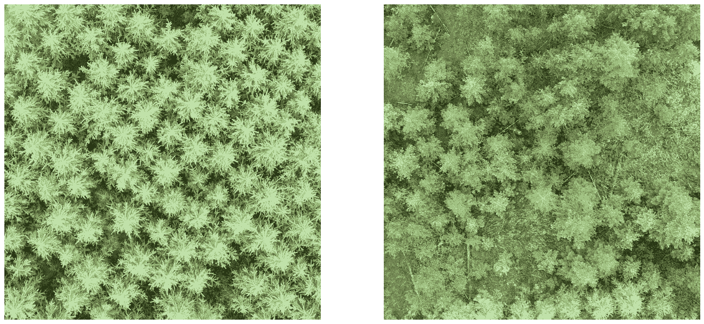
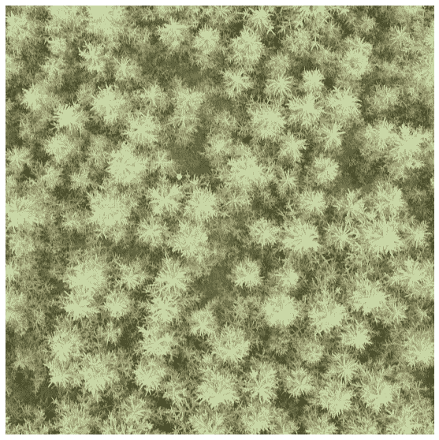
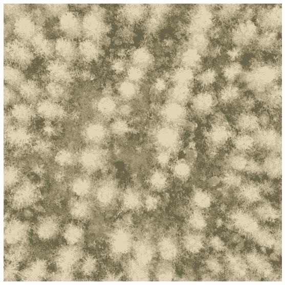
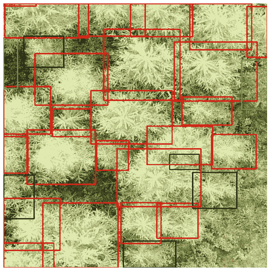
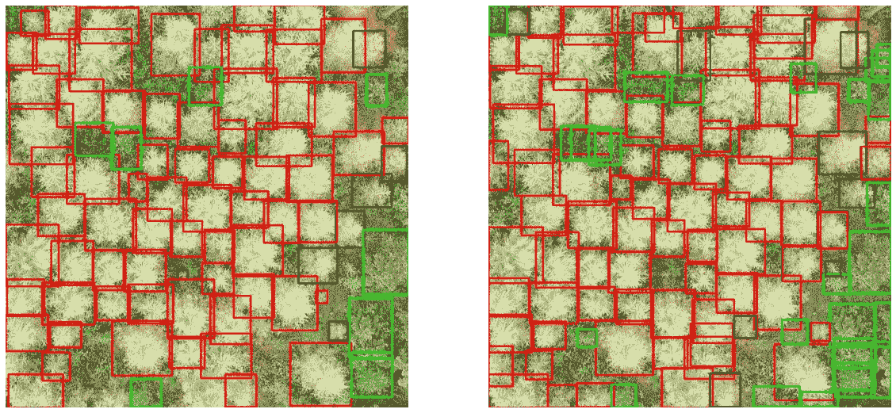
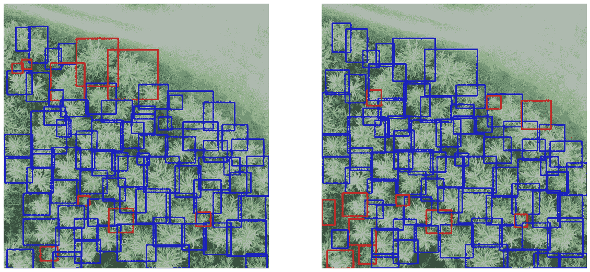
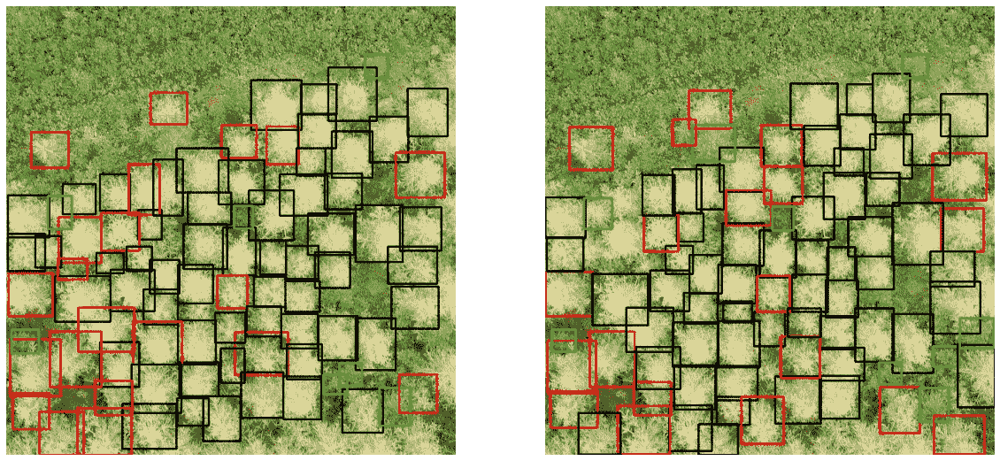

# 我走进森林

> 原文：<https://towardsdatascience.com/into-the-forest-i-go-803dfbce07db?source=collection_archive---------23----------------------->

## 威斯特格特兰落叶松林蛾害的计算机视觉检测

瑞典的森林就像瑞士的山脉；整个国家都被它们覆盖了。瑞典近 70%的土地面积是森林，这是一个值得骄傲的民族。他们是少数几个能够在保持成功的伐木业的同时增加森林覆盖率的国家之一。

这并不是说瑞典的森林没有面临挑战。和世界上其他许多地方一样，入侵的害虫会对北欧的林地造成巨大的破坏。在德国西南部地区，落叶松鞘蛾，一种小的暗灰色蛾，造成了广泛的经济损失。雌性在落叶松的针叶上产卵。然后，幼虫通过这根针的内部和邻近的针吃掉它们，将先前被吃掉的针的外部变成一个保护壳(因此有“壳携带者”的绰号)。

幼虫大约 5 毫米长(对美国人来说，不到 1/5 英寸)；看到一个的机会很小。如果只有一只或几只这样的生物落在一棵树上，它们可能永远不会被注意到。落叶松是大树，高达 45 米；任何那么大的生物都能对付一些微小的寄生虫。问题是这种蛾的数量远远不止几只。虽然昆虫本身是不可见的，但它们造成的损害是可见的。如果这是可见的，计算机视觉模型可以学习检测它。

瑞典森林机构发布了一个数据集，其中包含了威斯特格特兰五个地区落叶松林的无人机航拍照片。这些图像是在 2019 年 5 月 27 日和 8 月 19 日这两天拍摄的，拍摄地点是 vstergtland 的五个地区(Bebehojd、Ekbacka、Jallasvag、Kampe 和 Nordkap)。所有图像都带有由边界框坐标和标签组成的 XML 文件。标签指示包围在边界框中的树是落叶松还是其他物种(最有可能是云杉，尽管只有两个边界框被如此标记)。如果树是落叶松的话，五月图像的标签也包括由落叶松箱携带者造成的损害水平。伤害等级分为健康、低伤害和高伤害。

# 数据**概要**

落叶松占 5 月份数据中标记树木的近 80%，但只有 8 月份数据的 70%左右。八月份的数据包含的图片总数更少，698 对 836，但包含了 1900 多棵不是落叶松的树。

按地点划分，除了树木密度最高的 Kampe 和密度最低的 Ekbacka 之外，5 月图像中落叶松的百分比始终在四分之三到五分之四之间。

每个地区的落叶松百分比在 8 月份有相当大的变化，Jallasvag 下降幅度最大，其他地方下降幅度较小。这可能是在图片之间的三个月内剔除患病树木的结果，但这似乎不太可能，因为变化百分比最高的 Jallasvag 和变化百分比最低的 Kampe 拥有健康落叶松树的两个最高百分比。更有可能的是，在两次采集过程中对不同区域进行了采样。

欧洲落叶松不是针叶树中颜色最深的。即使在健康状态下，这些树的颜色也比它们的邻居要浅得多，针叶略带蓝色

左图:健康的落叶松林。右图:由其他树种组成的森林区域。请注意，即使是健康的落叶松也有浅色的针叶。来自落叶松案例库的原件。

随着携带病例的感染开始发生，落叶松外部的针叶开始变成褐色。

坎普地区的一片森林，由大部分受损较轻的落叶松组成。沿着树的边缘可以看到棕色的痕迹。来自落叶松案例库的原件。

当虫害达到高危害阶段时，树木留下的针叶已经变成褐色。

坎普的一片森林，由严重感染的落叶松构成。所剩无几的绿色大部分来自落叶松周围生长的小植物。来自落叶松案例库的原件。

目标检测模型将需要检测绿色的色调以区分落叶松和其他品种，以及区分表征不同程度的侵扰的绿色和棕色的色调。虽然树枝的形状和树的大小有细微差别，但颜色可能是最重要的因素。即使是一个相当简单的检测模型也能很好地解决这个问题。

# **建立模型**

最后，EfficientDet 仍然是用于单次拍摄对象检测的最先进的模型架构。EfficientDet 由一系列对象检测模型组成，旨在顺利管理大小和效率之间的权衡。最小的模型可以用于手持或远程设备，包括监控森林的无人机，而最大的模型可以在 GPU 驱动的服务器上提供更高的精度。

无人机采集的图像都是 1500x1500。虽然这种一致性值得赞赏，但除了最大效率的 Det 型号之外，其他型号的尺寸都太大了。事实上，EfficientDet 模型对用于训练的输入大小相当挑剔。最小的 D0 为 512x512，第二大的 D1 为 640x640。经验表明，不根据这些大小调整输入必然会导致性能损失。

训练数据的白蛋白预处理。

幸运的是，裁剪和调整大小是深度学习预处理管道的标准部分。裁剪和调整大小通常伴随着适度的拉伸和挤压；以 4:3 和 3:4 之间的比例随机采集作物，然后重新调整为 1:1。这样的举动对于这个问题的价值值得商榷。树木图像可以被压缩成不真实的形状吗？可能不会有这样的高宽比；由此产生的图像可能仍然反映了树木在野外的自然外观。

树的长宽比从 4:3 拉伸到 1:1 的训练图像。扭曲不足以让树看起来不真实。来自落叶松案例库的原件。

用于训练的其他有用的预处理操作是翻转、水平和垂直、旋转和转置。由于颜色是如此重要的一个特征，而且由于不同地点的类别颜色相当相似，所以没有理由增加颜色。事实上，在现代架构中，颜色增强通常会导致精度略微下降。(参见 [RandAugment](https://arxiv.org/pdf/1909.13719.pdf) 论文中的表 5。)

预处理验证数据是一件更简单的事情。由于图像已经是方形的，因此调整它们的大小以适合模型就足够了。所有预处理操作都通过[白蛋白](https://albumentations.ai)包完成。

验证数据的蛋白化预处理。

20%的数据，随机选择，但在五个位置分层，进行验证。

模型的训练参数相当标准。初始学习率为 2.56e-3，权重衰减的 Adam 优化器 4e-5 表现良好。余弦学习率衰减规则略优于指数衰减；似乎该模型需要一段时间内采取大的步骤来找到它的最优区域，但是之后学习速率需要迅速衰减。因为亚当被认为是在狭窄的山谷中找到最优解，所以这种行为并不奇怪。焦点损失是该 EfficientDet 实现的缺省值；这是幸运的，因为班级严重失衡。该模型被训练 200 个时期，在验证集上保存三个表现最好的时期。

模型的大小，或者更准确地说是 Colab 的内存限制，决定了批量大小。对于 EfficientDet0 和 EfficientDet1，批处理大小为 8，但对于 EfficientDet2，批处理大小必须减少到 4。最终结果是从 D1 到 D2 的准确性略有下降。

# **结果**

总体识别结果良好，EfficientDet0 的 COCO 图为 48.6，EfficientDet1 的 COCO 图为 50.8。对于 EfficientDet2，该值下降到 50.1，因为培训中使用的批量较小。越实际，因为它反映了实际使用的预测，AP@50 对 D0 是 75.9，对 D1 是 79.0，对 D2 是 77.4。不同类别的分数随着类别频率的不同而不同，低损害最高，健康最低。

EfficientDet0 的平均精度

效率的平均精度 1

EfficientDet2 的平均精度

D2 模型准确性的下降主要是检测健康树木能力的下降。对低伤害的探测会略微上升，而高伤害大致保持不变。健康班也显示了从 D0 到 D1 的最大进步。由于从 D0 到 D1 的准确性确实全面提高，似乎没有什么理由在生产中使用 D0(除非 CPU 限制非常严格)。在 D1 和 D2 之间的选择是一个判断的问题，但是由于 D1 在不太频繁的课程上做得更好，它可能是更好的模型。

回忆是极好的。考虑到每幅图像有大量的地面实况观测数据，平均 65 个，像 AR@1 和 AR@10 这样的传统测量方法没有多大意义。AR@100 和所有检测的总平均召回率是有用的度量。D1 再次成为表现最好的模特。

有趣的是，当从 AR@100 移动到 AR 时，对高伤害的回忆超过了对其他伤害的回忆。由于其他类别最容易与其他三个类别区分开来，通常是更深的绿色阴影，因此在两者都出现的图像中，其他类别检测的排名可能高于高损害。

所有型号的平均召回率。

平均精度和平均召回率是模型性能的有效度量，但它们本身并不说明模型如何在实践中使用。为此还需要一个东西，门槛。阈值的简单选择是 0.5，所有高于阈值的检测将被保留，所有低于阈值的检测将被丢弃。在多类问题中，天真的选择几乎从来都不是正确的选择。要选择最佳阈值，请找到平衡精确度和召回率的阈值。没有明显的理由让一个优先于另一个；F1 分数适合于确定最佳阈值。

使用一系列阈值`0.0:1.0:0.01`计算每个阈值的 F1 分数。为每个类别独立计算 F1，然后取平均值。对于 D0 模型，最佳 F1 分数出现在 0.4，而对于 D1，最佳是 0.409。D2 模型的最佳阈值为 0.379。

用于图像的颜色代码。

有代表性的形象。左是地面真理；右是来自 D1 的探测。来自落叶松案例库的原件。

上图有贴图 56.2，略高于整体贴图 50.8。预测和现实显然非常接近。最明显的差异是预测倾向于过多计算除落叶松以外的树木。在某些情况下，不清楚是模型检测到了太多的树，还是注释器遗漏了一些树。左上方的三个绿色检测框应该只有两个，但是右边高伤害假阳性正下方的小绿色假阳性看起来确实像应该在地下真相中的树。就此而言，高损害假阳性似乎是一棵死亡或垂死的树；是否是落叶松有待商榷。

当模型落叶松树检测与地面真实数据的损害水平不匹配时，树通常表现为边界情况。被模型标记为高损害的低损害树通常比标记为低损害的低损害树看起来更差。类似地，高伤害树被标记为低伤害，在他们的类别中看起来是最健康的。上面图像中被模型标记为健康的那棵树可能是图像中最好看的落叶松。如果不知道更多关于基本事实注释过程的信息，我们能说的是有限的，但是这并不是第一次一个模型胜过人类注释者。很明显，该模型在三个落叶松类之间确定的阈值与人类注释者确定的阈值略有不同。

另一个清楚的事实是，图像中最常见的类别的准确度通常最高。一棵树的健康往往取决于它的邻居，这并不奇怪。这个模型似乎已经意识到了这一点。单幅图像的类别级映射与同一幅图像中的类别频率相关。这种相关性随着模型大小而略微降低(除了主要的低损伤等级)，这表明较小的模型比数据保证的更有可能“聚集”更多的识别。

健康树木比例最高的图像。左是地面真理；右是来自 D1 的探测。来自落叶松案例库的原件。

上图的上半部分是聚类的一个例子。标记为低损害的少数树木被模型分类为健康的，或者在两个小树的情况下，被完全忽略。左下角的情况正好相反；四棵健康的树被标记为低损害。在这两种情况下，都不清楚模型或地面真相是否正确。

高伤害树木比例高的图像。左是地面真理；右是来自 D1 的探测。来自落叶松案例库的原件。

在以高伤害树为主的图像中也是如此。在上面的图片中，如果附近有其他高伤害的树，那么将这些树标注为高伤害会有一点偏向。在具有模型预测边界框的图像中，左下方的低损害树的集群较小，并且左中间的一些低损害树已经被丢弃或被一起标记为高损害。

关注预测误差很容易；它们在视觉上总是显而易见的，但是模型的准确性总体上保持良好。在足够大的批量上训练的更大的模型仍然会表现得更好，但是目前用 Colab 是不可能的。考虑到现有的工具，这种模式可以说是成功的。

# **样本代码**

[培训高效模特的笔记本](https://colab.research.google.com/github/DanielMorton/Larch/blob/main/Larch%20Edet1.ipynb)。

[包含生成预测代码的笔记本](https://github.com/DanielMorton/Larch/blob/main/Larch%20Predict.ipynb)。(仅用于解释目的。)

[包含评估代码的笔记本](https://github.com/DanielMorton/Larch/blob/main/Predict.ipynb)。(仅用于解释目的。)

任何用户都可以运行用于训练模型的代码。预测和评估的代码需要调整一些引用，以指向用户生成的模型和输出文件。

# **许可证**

直接引自[数据仓库](https://lila.science/datasets/forest-damages-larch-casebearer/):

标签根据[社区数据许可协议(许可变体)](https://cdla.io/permissive-1-0/)发布。

对于无人机图像，瑞典森林机构已经从 lantmteriet 获得了[传播地理数据的许可](https://www.lantmateriet.se/en/about-lantmateriet/Rattsinformation/permit-for-dissemination-of-geographical-data/)，lantmteriet 是瑞典财政部下属的一个机构。

# 参考

谭明星，庞若明，郭伟民诉乐。EfficientDet:可扩展且高效的对象检测。2020 年 IEEE 计算机视觉和模式识别会议录。

瑞典林业局(2021):森林损害-落叶松案例 1.0。[国家森林数据实验室](https://skogsdatalabbet.se/)[数据集](https://lila.science/datasets/forest-damages-larch-casebearer/)。