# 马尔可夫链多触点归因简介

> 原文：<https://towardsdatascience.com/into-to-markov-chain-multi-touch-attribution-bb1968ff1f54?source=collection_archive---------1----------------------->

## 使用 R 进行模拟和建模

# 什么是归因建模？

归因建模是`Digital Marketing`中出现的一项任务。概括地说，归因建模的目标是改善驾驶`Marketing Objectives`中各种`Advertising Channels`的评估。在开始数据分析之前，让我们首先为`Markov Chain Attribution`建模解决的问题设置一个背景。

在这篇文章中，我的目标是涵盖以下内容:

1.  什么是归因建模？
2.  什么是多点触控归因？
3.  马尔可夫链简介
4.  使用 R 表示:

*   从马尔可夫链模拟消费者旅程
*   从消费者旅程估计马尔可夫链
*   使用马尔可夫链进行数据驱动的归因

# 许多广告渠道

当营销人员在广告上花钱时，他们战略性地将预算分配给不同的活动，这些活动反过来使用大量的广告渠道。一些常见的广告渠道包括有线电视和流媒体电视、节目、社交、付费搜索、印刷品。这些是如何定义的，以及使用哪些媒体合作伙伴和平台来花费计划的预算各不相同，但广告商通过多种渠道进行沟通的事实仍然存在。

# 目标和 KPI

让我们记住，营销人员不是为了做广告而做广告。他们有特定的目标和目的，围绕这些目标和目的建立营销传播战略。`Analytics`的角色之一是帮助建立一个衡量计划，该计划将定义一组`Key Performance Indicators` (KPI)来衡量营销工作的成功。根据目标和技术能力，选择这些 KPI，并准备好测量它们的工具。例如，我们可能希望:

*   产生对网站或网页的访问
*   通过表单提交产生销售线索
*   让用户在我们的网站上执行某些操作
*   提高我们品牌的知名度
*   或者只是推动销售

无论 KPI 是什么，完成的 KPI 的一个单元被称为`Conversion`。

# 投资回报率和归因

在我们开展活动和花费预算时，我们需要回答一个关键问题:

> 我们如何评估不同渠道在推动 KPI 方面的重要程度？

显然，如果我们的目标是推动销售，但在其他条件相同的情况下，我们的销售没有增加，那么没有一个渠道工作得很好。但是，如果我们真的成功推动了增量销售，哪种渠道效果最好呢？换句话说，我们如何`Attribute`不同渠道的增量销售并计算我们的投资回报(`ROI`，有时被称为广告回报(`ROAS`))？我们是否应该因为其中一个渠道的表现不如预期而从战术上改变我们的计划？回答这些问题是单向的`Analytics`广告对`Advertising`的价值。

# 消费者路径中的最后一步

有了数字广告，我们衡量消费者何时以及如何与广告互动的能力变得更加容易。这种易处理性允许我们收集数据并分析`Consumer Path`到`Conversion`的部分。无论是否被跟踪，消费者的旅程都是存在的，没有人能够真正跟踪整个旅程。我们能追踪的是一些`Media Touchpoints`。往往`Attribute`到`Conversions`最简单的方法就是简单的看一下`Consumer Path`中的`Last-Touch`。这是因为默认情况下，这是我们看到的唯一接触点。对推动`Conversion`的`Last-Touch`给予完全的信任将导致对我们媒体效果的不公平评估，并且不能解释混合渠道旨在创造的`Synergy`。


幸运的是，如果做了足够的努力来跟踪我们的媒体，我们可以生成路径数据，并希望以一种更复杂的方式进行归因，即使用`Multi-Touch Attribution` ( `MTA`)。这使我们能够更好地判断所用渠道的有效性，并做出更好的投资决策。

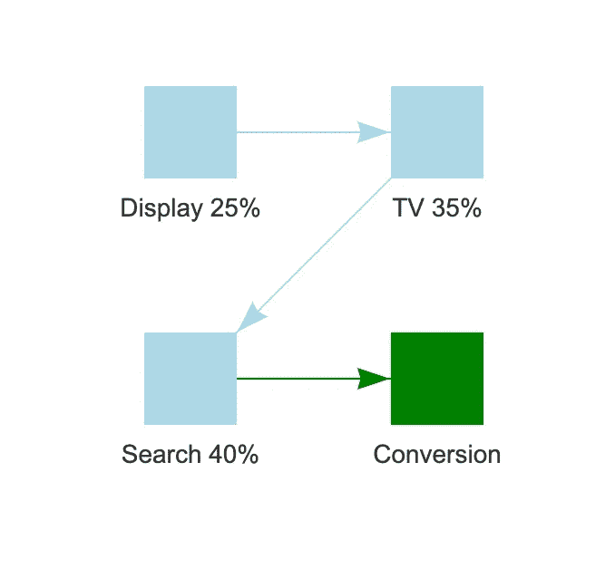

# 多点触摸归因

`MTA`方法主要有两类；`Rule-Based`和`Data-Driven`。当然，这两种方法都使用数据，但区别在于它们如何对消费者路径上的接触点赋予重要性。`Rule-Based`方法基于触摸点的位置启发式地为其分配权重。

`Data-Driven`方法采取不同的方式。他们不是根据位置分配任意的规则，而是在接触点和他们在驱动中的角色之间建立概率关系`Conversions`。

# 马尔可夫链属性

`Markov Chain Attribution`是一种比较流行的数据驱动方法，顾名思义，它利用了`Markov Chains`。除非你在大学学过运筹学或数学，否则你可能不知道这些链是什么，所以让我们做一个高层次的介绍。

# 马尔可夫链

关于`Markov Chains`要记住的关键概念是`Transition Matrix`。它们本身是描述(随机)系统的概念工具。所有这一切意味着，当一个过程存在随机性或概率性成分时，`Markov Chains`可能是一个很好的工具来首先描述，然后分析这个过程。我们这里关注的过程是`Customer Journeys`走向`Conversions`。

# 基本面

我们可以把一个`Markov Chain`想象成一个有向网络。每个节点都是一个`State`,消费者可以在其中沿着一条路径前进。每个箭头都是一个`Transition`，有了它，就有了关联的概率。因此，你可能有一组预先确定的接触点，但接下来会发生什么是不确定的。

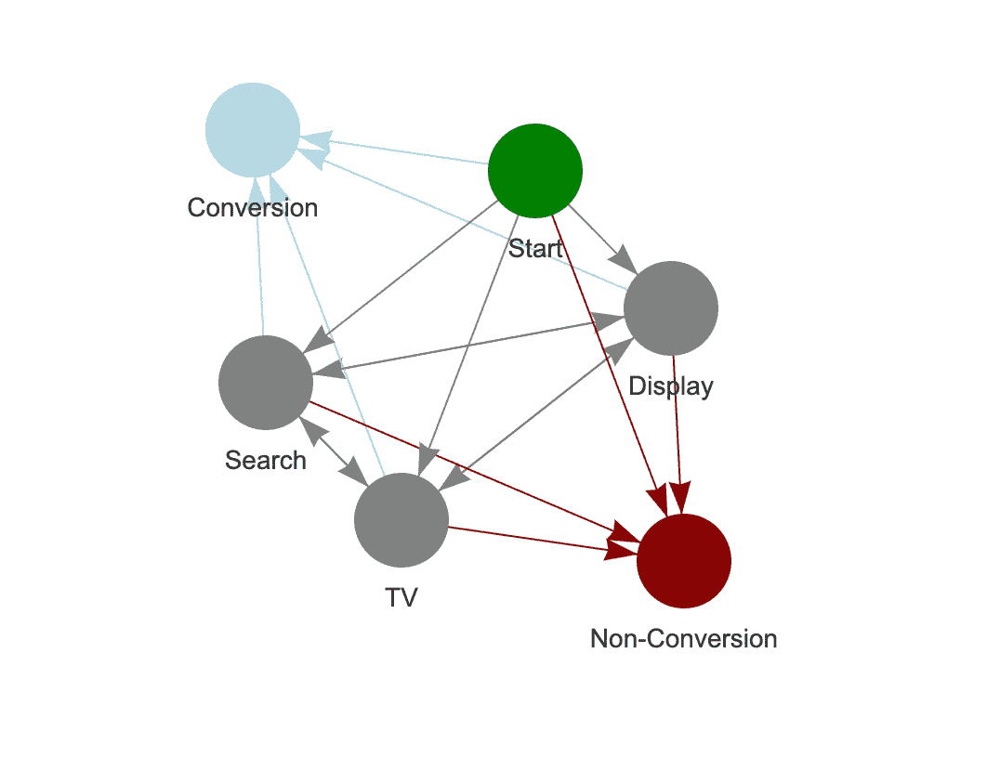

转换和非转换节点有从所有通道指向它们的箭头，但没有从它们发出的箭头。这些被称为`Absorbing States`，对我们来说，它们意味着旅程的结束。当我们收集了从一个状态转移到下一个状态的所有概率时，我们将它们组织成一个正方形`Transition Matrix`。

```
M = t(matrix(c(1,0,0,0,0,
               200,0,300,350,10,
               160,300,0,350,8,
               150,200,200,0,20,
               0,0,0,0,1), nrow = 5))M = M/rowSums(M) colnames(M) = c("Non-Conversion","Display",
"TV","Search", "Conversion")row.names(M) = c("Non-Conversion","Display",
"TV","Search","Conversion")
```

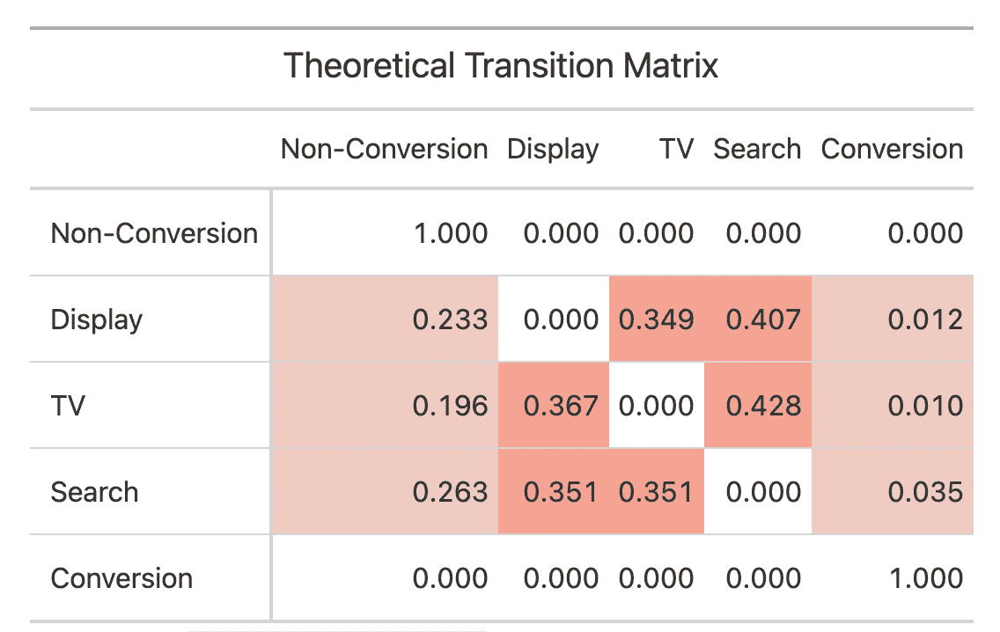

上面是一个例子`Transition Matrix`，我只是把它放在一起举例说明。为了更现实，我将转换概率设置为相对较低的值。稍后我们将使用此矩阵进行`Simulation`！

要记住的一个重要属性是，行的总和等于 1，因为我们处理的是概率。行代表旅程中的当前状态，列代表下一个状态。

```
rowSums(M)## Non-Conversion Display   TV         Search     Conversion
   1              1         1          1          1
```

关于`Markov Chains`，还有一件更重要的事情需要了解，那就是`Markov Property`或者无记忆性。对某些人来说，这可能是 TMI，但这确实是用一个简单的`Transition Matrix`来概括整个过程的原因。该属性是一个简化的假设，即**你转移到下一个地方的概率**只取决于你现在的位置，而不取决于你的整个旅程历史。需要说明的是，这并不意味着旅程历史不重要。这绝对会影响归因结果。不影响的是概率。从数学的角度来看，这使得分析变得非常简单。

# 从链到路径(模拟)

在实践中，给定一个消费者路径的数据集(构建这个数据集是一个很大的任务，所以“给定”是一个很强的词)，我们可以估计一个`Transition Matrix`。反之亦然。给定一个`Transition Matrix`，我们可以模拟一组消费者路径。事实上，模拟在得出每个通道的实际重要程度方面起着重要的作用，因此有必要了解一下这一过程的机制。

下面我们定义一个函数，它将与上面的样本矩阵 **M** 一起工作。给定这个矩阵和我们想要执行的`num_sim`步骤，我们执行以下操作:

1.  从一组媒体接触点中随机选择一个起点。

*   在实践中，我们实际上会估计起点概率。

2.对于每个步骤:

*   从 **M** 中选择一行与当前状态/触摸点相对应的概率。
*   从概率设置为行的`Multinomial`分布中抽取一个样本。
*   将样本设置为新的当前状态并重复。

3.如果我们点击了`Conversion`或`Non-Conversion`，我们就结束了路径。

```
simulate_path = function(M, num_sim){
   num_sim = num_sim   
   path = vector(mode = "integer", length = num_sim)   
   path[1] = sample(2:(nrow(M)-1), 1) 

   for(i in 1:(num_sim-1)){
        p = M[path[i],]
        sn = which(rmultinom(1, 1, p) == 1)
        path[i+1] = sn     
        if(sn == 1 | sn == 5){
           break     
        }   
    }   
    return(path[path > 0]) 
}
```

# 模拟一条路径

让我们测试一下这个函数。第一个例子是非转换器。

```
set.seed(124) 
num_sim = 100 
path = simulate_path(M, num_sim) 
plot(seq_along(path),path ,type = "l",
     axes=FALSE, 
     ylim = c(1,5),
     main = "Non-Converter",
     ylab = "Channel Touchpoint",
     xlab = "Touchpoint Number") 
points(seq_along(path), path) 
axis(side = 2, at = 1:5) 
axis(side = 1, at = seq_along(path))
```

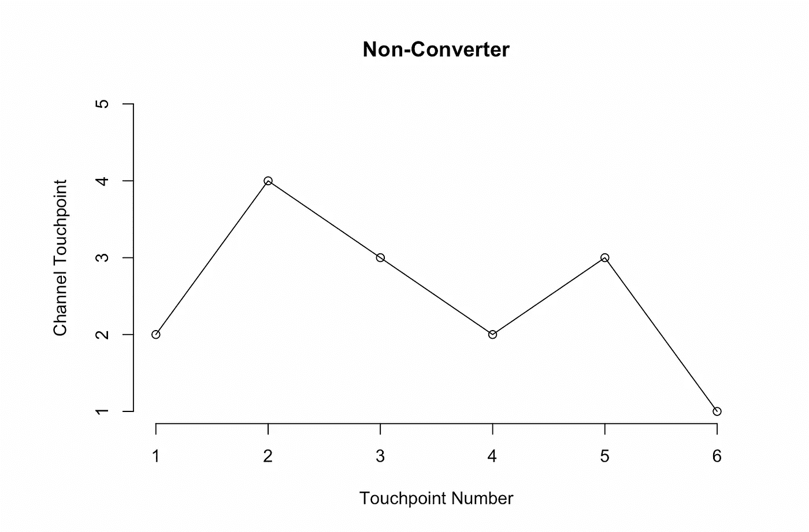

我们看到，我们从`Display`开始，移动到`Search`，然后`TV`，继续这个旅程，直到第 6 步，在这里我们没有转换就退出。

这是另一个例子，但这次我们有一个转换器。

```
set.seed(007) 
num_sim = 100 
path = simulate_path(M, num_sim) 
plot(seq_along(path),path ,type = "l",
     axes=FALSE, 
     ylim = c(1,5),
     main = "Non-Converter",
     ylab = "Channel Touchpoint",
     xlab = "Touchpoint Number") 
points(seq_along(path), path) 
axis(side = 2, at = 1:5) 
axis(side = 1, at = seq_along(path))
```

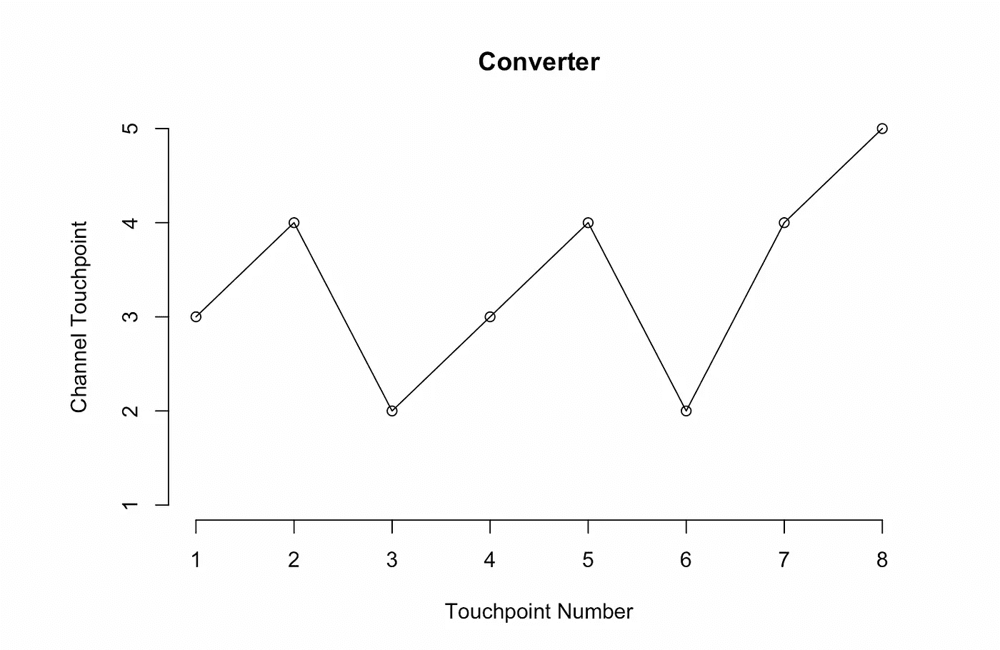

这一次，我们从`TV`开始，在第 8 步进行转换，将`Search`作为我们的最后一个接触点。

# 模拟完整的旅程数据集

我们现在可以简单地通过重复函数调用`simulate_path`来模拟一整套路径。随着更多的数据操作，我们有了一个`pathdf`。这里我将生成`10,000`路径。

```
num_sim = 100 
num_paths = 10000  
paths = purrr::map(1:num_paths, ~simulate_path(M, num_sim)) conversion = 
    purrr::map(paths, ~ data.frame(
    conversion = ifelse(.x[length(.x)] == 5, 
                        "converter", "non-converter"))) %>%     bind_rows(.id = "path_num") pathdf = 
   map(paths, ~data.frame(touchpoint = 1:length(.x), channel = .x)) %>% bind_rows(.id = "path_num") 
%>% left_join(conversion) %>% 
left_join(data.frame(channel_name = colnames(M), channel = 1:5)) 
head(pathdf,10) %>% 
       gt::gt() %>%
       gt::tab_header(title = "Simmulated Paths")
```

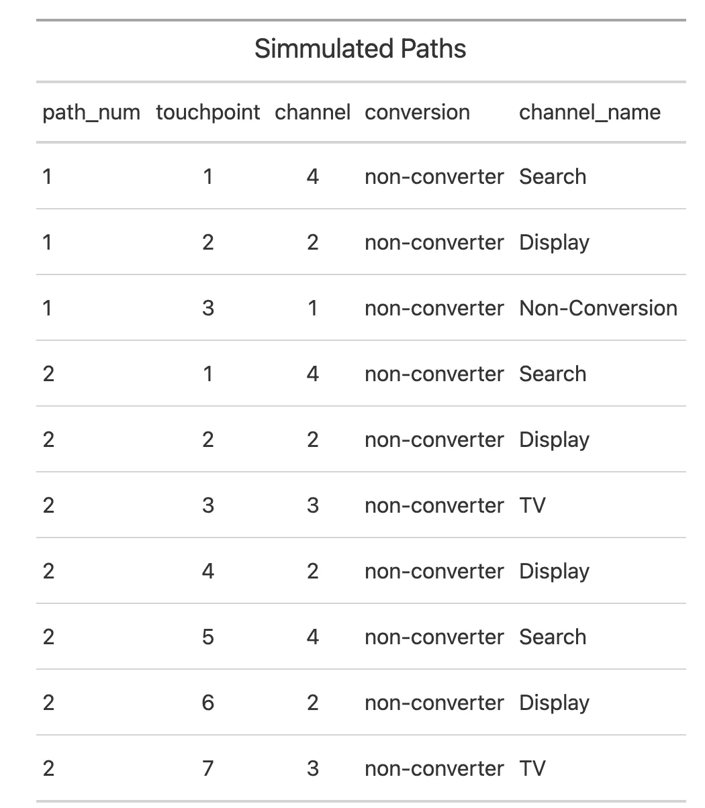

现在让我们将所有这些路径一个接一个地绘制出来，看看这个`Markov Chain`是如何工作的。

```
plotly::ggplotly(
    pathdf %>% 
      ggplot(aes(touchpoint, channel, color = conversion, 
                 group = path_num)) + geom_line() +   
      labs(x = "Touchpoint Number", 
           y = "Channel Touhcpoint") +  
      theme_minimal() 
)
```

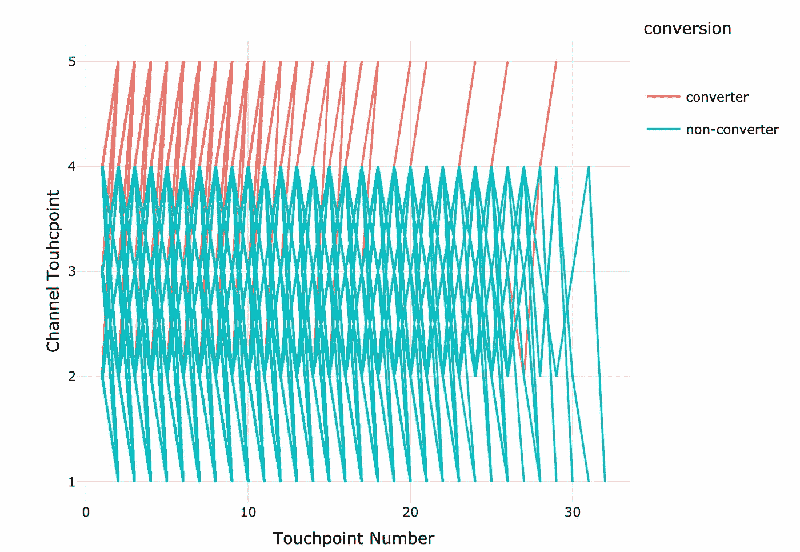

从图中我们可以看到，更常见的是直线下降，这表示非转换器。这是意料之中的。我们可以看到模拟的转化率刚刚超过 8%。

```
table(conversion$conversion)/nrow(conversion)##     converter non-converter  
##        0.0808        0.9192
```

# 从道路到锁链

既然我们已经从我们的马尔可夫链 **M** 中模拟了一组消费者路径，我们可以尝试用它们来估计最初的 **M** 和 **M^** ，看看这种估计方法的效果如何。在这里，我将介绍大卫·阿尔托马雷创作的精彩的`ChannelAttribution`软件包。它是开源的，托管在 [GitLab 这里](https://gitlab.com/session-tech/ChannelAttribution)。这个包包含一个名为`transition_matrix`的函数，它接收一组路径数据并估计`Transition Matrix`。

# 数据准备

首要任务是按照要求的格式组织数据。首先，我们需要解析出每个路径中的最终接触点，因为它们代表一个`conversion` / `non-conversion`事件。然后，我们总结按路径分组的数据，并对观察到的每个唯一路径计数`converters`和`non-converters`。

```
named_paths =
      pathdf %>% group_by(path_num) %>% 
      group_split() %>% 
      map(~pull(.x,channel_name)) path_trim = 
 map(named_paths, ~.x[.x != "Non-Conversion" & .x != "Conversion"]) journeydf = as_tibble(
 cbind(
    as.data.frame(do.call(rbind,
       map(path_trim, ~str_c(.x, collapse = " > "))
       )
    ),conversion$conversion)
) names(journeydf) = c("path","conversion")  
journeydf = 
journeydf %>% 
group_by(path) %>% 
summarise(converters = 
    sum(if_else(conversion == "converter",1, 0)),             
          non_converters = 
     sum(if_else(conversion == "non-converter", 1, 0)
          )
) %>%  
arrange(-converters, -non_converters) head(journeydf, 15) %>% gt::gt() %>% 
gt::tab_header(
title = "Simmulated Journey Data (Top 15 Converters)"
)
```


下面是一些关于生成的路径数据的快速汇总统计。

```
data.frame(
metric = c("Converters",
           "Non Converters",
           "Number of Paths",
           "Conversion Rate %",
            "Unique Journeys"),
value = c(sum(journeydf$converters),
          sum(journeydf$non_converters),
          sum(journeydf$non_converters) + sum(journeydf$converters),
          100*sum(journeydf$converters) / num_paths,
          nrow(journeydf))) %>% 
gt::gt() %>%
gt::tab_header(title = "Summary")
```

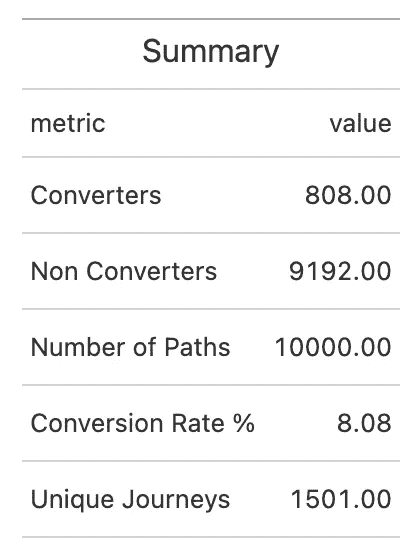

还有许多其他方法来探索这种数据。一个快一个交集一个是`path lengths`的分布。

```
path_lengths = map_int(path_trim, ~length(.x)) 
summary(path_lengths)##    Min. 1st Qu.  Median    Mean 3rd Qu.    Max.  
##   1.000   2.000   3.000   4.002   5.000  31.000hist(path_lengths, main = "Path Length Distribution")
```

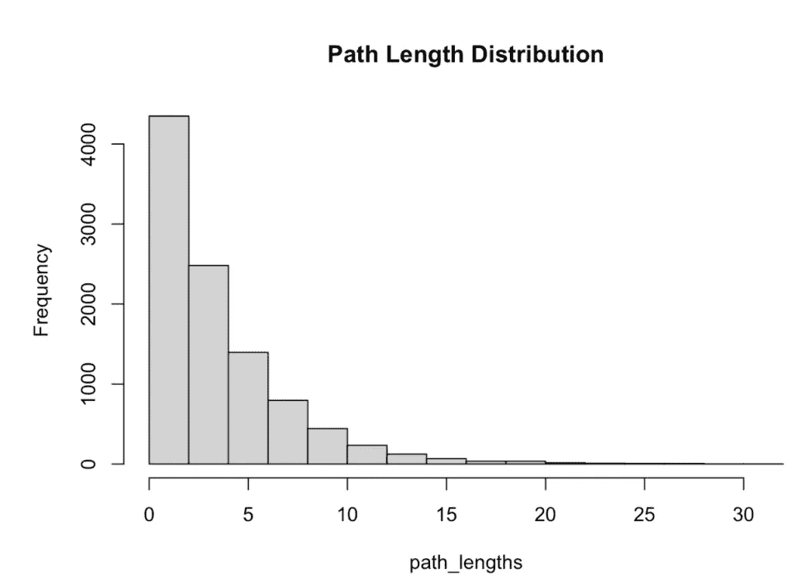

# 转移矩阵估计

最后，现在我们有了已知转移矩阵 m 的模拟数据集，我们现在可以看到如何通过估计和计算 M^从数据回到转移矩阵。这里我们将`ChannelAttribution::transition_matrix()`函数应用于我们的数据。该函数返回频道 id 的查找表和转移概率表。

```
library(ChannelAttribution)  
tM = transition_matrix(journeydf,
                       var_path = "path",
                       var_conv = "converters",
                       var_null = "non_converters") tM$transition_matrix %>% gt::gt() %>% 
gt::tab_header(title = "Transition Probabilities")
```

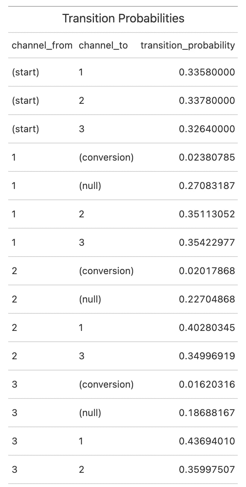

我们可以格式化表格并以某种方式输出，以便于我们比较估计的和真实的转移矩阵

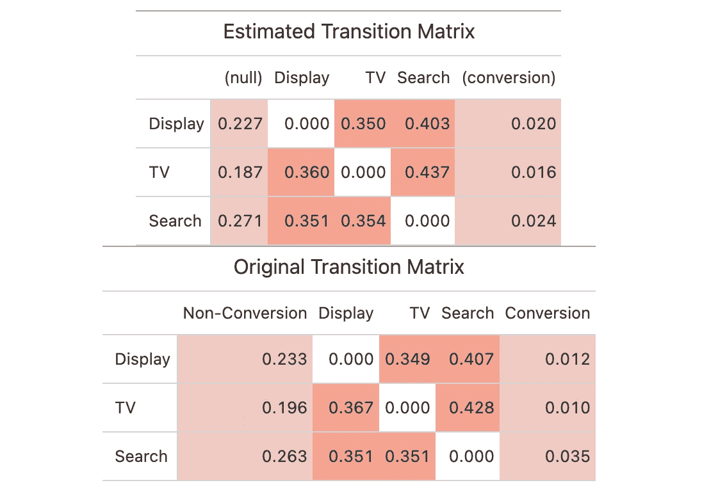

我们可以看到，估计工作得很好，特别是对于较大的概率。因为转换事件非常罕见，所以对它们的估计有更大的可变性/更低的精度。

# 属性

到目前为止，我们以转移矩阵 **M** 的形式引入了一个理论`Markov Chain`，用它来模拟一个数据集`Consumer Journeys`，并通过估计 **M^** 返回到一个`Transition Matrix`。现在是转换的时候了，继续实际的归因模型！

# 移除效应

`Markov Chains`作为`Consumer Journeys`的样板似乎是个好主意。但是我们如何使用它们来实现属性转换还不是很清楚。

这里的主要思想是计算`Removal Effects`。`Removal Effects`测量如果从路径中省略/移除一个通道，观察到的转换会减少多少。如果我们对`Markov Chain`中的每个通道进行计算，那么`Relative Removal Effects`将是我们缩放总转换量的因子。

# 运行归因

正如我们刚刚了解到的，运行马尔可夫归因模型包括估计一个`Transition Matrix`，然后计算`Removal Effects`。为此，我们只需使用`markov_model`函数，它以准备好的格式获取数据。通过指定`out_more = TRUE`，除了属性结果之外，我们还可以获得`transition matrix`和`removal effects`。

```
mm_res = markov_model(journeydf,
                       var_path = "path",
                       var_conv = "converters",
                       var_null = "non_converters",
                       out_more = TRUE)##  
## Number of simulations: 100000 - Convergence reached: 2.32% < 5.00% ##  ## Percentage of simulated paths that successfully end before maximum number of steps (32)
```

# 归因结果

首先，我们来看看结果。转换总数为`808`。下表显示了我们的`Data-Driven`模型是如何确定这些属性的。

```
mm_res$result %>% gt::gt()
```

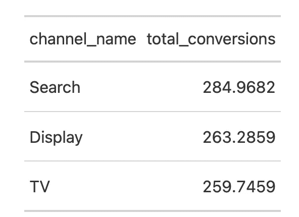

我们看到，每个渠道的转换数量相似，但`Search`的转换数量最多。这并不奇怪，因为转移概率被导向`Search`，但只是轻微的。此外，在我们的模拟中，每个通道都同样有可能被选为第一接触点，而这在现实中是不会发生的。

为了显示如何从移除效果计算这些结果，下面是显式代码:

```
total_coversions = sum(journeydf$converters)
removal_effects =  mm_res$removal_effects$removal_effects
relative_removal_effects = removal_effects/sum(removal_effects)
attributed_conversions = total_coversions * relative_removal_effectsattributed_conversions## [1] 284.97 263.29 259.75
```

去除效果本身可以容易地被访问和解释

```
removal_effects## [1] 0.7806 0.7212 0.7115
```

从这些数字中，我们看到，如果移除`Search`，将会观察到约 78%的转换减少。对于这样一个小而相互关联的国家来说，这很有戏剧性，但并不奇怪。

# 与基于规则的模型进行快速比较

使用`ChannelAttribution`包也很容易获得一些基于规则的模型的结果，并将它们与数据驱动的结果进行比较。

```
heuristic_models(journeydf, 
                 var_path = "path", 
                 var_conv = "converters") %>% 
  left_join(mm_res$result) %>% 
  gt::gt()
```

我们可以清楚地看到`Last-Touch`和`Markov Chain`模型结果之间的差异，因为`Display`尤其是`TV`的重要性被大大低估了。`Last-Touch`与`Markov Chain`车型相比，`50`的电视转换率更低。这个例子清楚地说明了`Markov Chain`属性如何能够纠正`Last-Touch`属性的固有偏差。`Linear Touch`这里的结果是相似的，再次因为通道之间的转移概率相差不太远。

```
mta_res %>% 
  pivot_longer(-channel_name, 
         names_to = "MTA_Model", values_to = "Conversions") %>% 
  ggplot(aes(MTA_Model, Conversions, fill = channel_name)) + 
  geom_col(position = "dodge") +
  labs(title = "MTA Model Result Comparison")
  theme_minimal()
```

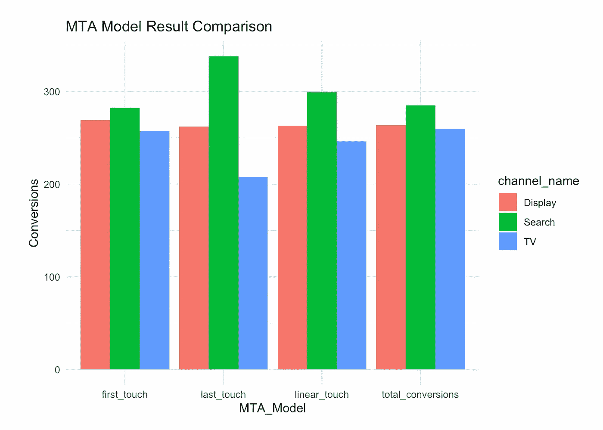

# 主要考虑事项

希望你和我一样对 MTA 和马尔可夫链归因这个话题感兴趣。尽管这篇介绍相当冗长，但这种类型的分析仍有许多方面需要考虑。下面是接下来需要考虑的几个关键问题:

1.  **数据是任何数据分析的关键要素，因此分析的质量取决于数据的质量。**
2.  数据质量取决于几个因素:

*   可测量性——一个通道可以测量到什么程度？数字广告很容易衡量，而 OOH(街头横幅)很难追踪。
*   衡量——仅仅因为某样东西容易衡量并不意味着它被很好地衡量了。如果没有实施、维护和管理适当的工具，就无法正确收集数据。
*   数据管理—即使正确收集了数据，仍然需要对其进行管理，这意味着命名约定和数据分类必须到位。
*   跨设备/跨平台(围墙花园)—为了将`Customer Journey`数据缝合在一起，我们需要能够识别跨不同平台和设备的用户，并通过这些平台和设备联系他们。这也许是今天 MTA 的最大局限。

3.如果需要频繁有效地交付 MTA 结果，数据工程方面是很重要的。灵活性越大，就会越复杂。

4.我们可能还想考虑是否有更好的方法来估计转移矩阵，例如使用贝叶斯方法。