# 简介:Go 中的 GraphQL

> 原文：<https://towardsdatascience.com/intro-graphql-in-go-9fed8e2a3e18?source=collection_archive---------19----------------------->

## 什么是 GraphQL，为什么使用它，以及如何在 Golang 中使用它

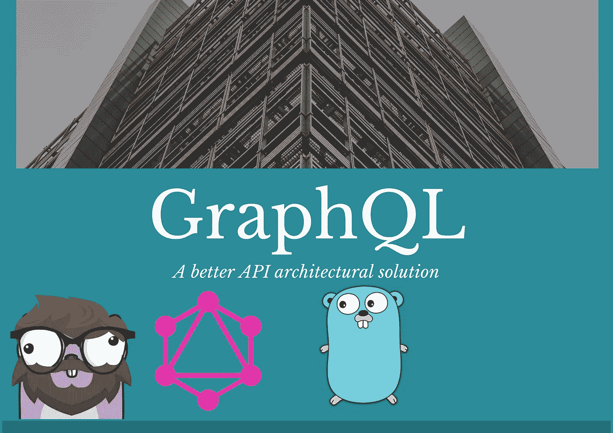

GraphQL 作为 Go——Gopher 中的架构解决方案由[上田拓也](https://twitter.com/tenntenn)绘制，灵感来自勒内·弗伦奇(CC BY 3.0)的作品

在本文中，我们将使用 Go 内置的 GraphQL 服务器为地鼠构建一个雇佣代理 API。与其他介绍不同，我不会用一个简短的声明列出所有组件的名称。相反，我们将一步一步地构建一个应用程序，并解释每个步骤中发生的事情。希望这种方法能让你更容易避免信息泛滥。我不仅会介绍 GraphQL，还会介绍我在使用`[graphql-go](https://github.com/graphql-go/graphql)`时如何构建架构

我们需要澄清的第一件事是一个非常普遍的误解。

> GraphQL 不是数据库！— [图表 QL](https://graphql.org/faq/#is-graphql-a-database-language-like-sql)

我觉得这个误解来源于名字，开发者习惯于听到所有的数据库名字`MySQL`、`PostgreSQL`等。重要的是最后两个字母，QL。如果你已经有一段时间了，你可能知道这是`Query Language`的简称，但是我遇到的很多人只是把它和数据库联系起来。

因此，GraphQL 是一种查询语言，旨在使服务器和客户端之间的通信更加容易和可靠。我们需要马上解决的另一件事是，GraphQL 是数据库不可知的。这意味着它不关心正在使用的底层数据库。

> 本文中的所有图片均由珀西·博尔梅勒绘制，地鼠由[拓也·上田](https://twitter.com/tenntenn)绘制，灵感来自蕾妮·弗伦奇的作品。图像中的地鼠已被修改。

你问这怎么可能？那么，您应该将 GraphQL 视为数据库和客户端之间的中间件。您有一个 GraphQL 服务器，它接收查询格式的请求，查询精确地指定您想要返回什么数据，服务器返回请求中定义的数据。

在这里定义并记录了查询语言[。](https://graphql.org/learn/schema/)

这是搜索地鼠时查询的样子

这是示例查询的响应，请注意，只显示了需要的字段

如果你有任何关于 GraphQL 的问题，他们有一个非常好的 FAQ[FAQ](https://graphql.org/faq/)。

在这篇文章中，我们将涵盖基础知识，我们将建立一个应用程序来搜索和寻找地鼠雇用。我们不会涵盖 GraphQL 的所有方面，那会太长。

## 为什么以及何时应该使用 GraphQL

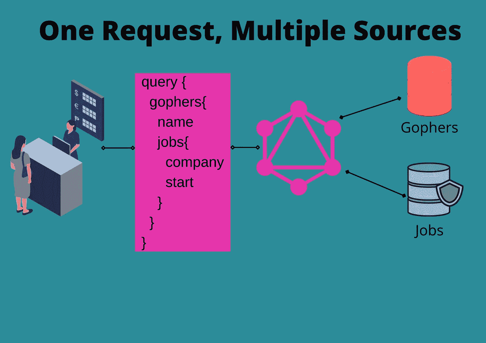

GraphQL —使用多个数据源，但只有一个响应和一个请求

我承认，当我第一次听说 GraphQL 时，我持怀疑态度。我知道很多人也是如此。听起来好像只是在 API 和调用者之间增加一层会使事情变得更复杂。

但事实并非如此，我希望能让你相信这一点。

我发现使用 GraphQL 的一个最好的原因是能够组合数据源。我是`RepositoryPattern`的忠实用户，你可以在我的领域驱动设计文章中找到讨论。

[](https://programmingpercy.tech/blog/how-to-domain-driven-design-ddd-golang/) [## 如何在 Golang 中实现领域驱动设计(DDD)

### 近年来，微服务已经成为一种非常流行的构建软件的方法。微服务用于构建…

编程 percy.tech](https://programmingpercy.tech/blog/how-to-domain-driven-design-ddd-golang/) 

简而言之，每个数据源都有一个存储库。对于我们正在构建的代理，我们将有存储地鼠的`GopherRepository`和存储工作的`JobRepository`。GraphQL 可以轻松地将这两种结构组合成一个输出，而无需耦合后端的数据源。在我们将要构建的服务器中，它看起来像是`Gopher`结构有`Jobs`与之相关，但它实际上将是两个不同的存储解决方案。

我喜欢 GraphQL 的第二个原因是，它允许用户精确地指定请求什么字段，从而避免了[过度提取](https://www.howtographql.com/basics/1-graphql-is-the-better-rest/)。您只发送一个请求，并且只获得您所请求的信息，没有未使用的额外字段。

GraphQL 的一个原则是开发过程应该从模式定义开始。这被称为`Schema Driven Development`，我不会在这里讨论它，但是基本上，我们从模式而不是业务逻辑开始。

> 在 GraphQL 中，你的 API 从定义所有类型、查询和变化的模式开始，它帮助其他人理解你的 API。这就像是服务器和客户端之间的契约。— GraphQL 网站

## 如何在 Go 中使用 GraphQL

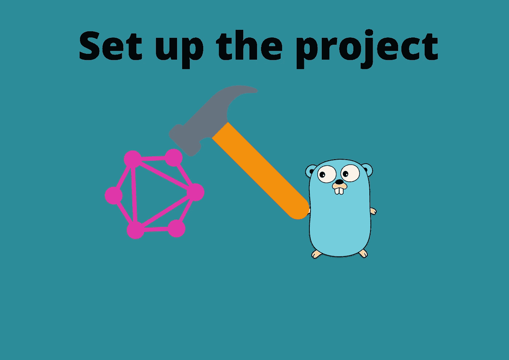

下载所需的包并创建 go 模块

首先要做的是决定使用什么样的 Go 包。GraphQL 网站维护着所有可用包的列表[。](https://graphql.org/code/#go)

在本文中，我们将使用 [graphql-go/graphql](https://github.com/graphql-go/graphql) ，这是一个在官方 [graphql-js](https://github.com/graphql/graphql-js) 参考之后构建的包。这个包不读取 graphql 模式文件，而是在 go 代码中定义模式。定义模式的方式与 javascript 端使用的方式相同，这很好。

我们将从创建一个包并获得所需的库开始。我们将获取用于构建和定义模式的`graphql-go/graphql`,以及用于托管 graphql 服务器的`graphql-go/handler`。

```
go mod init github.com/programmingpercy/gopheragency
go get github.com/graphql-go/graphql
go get github.com/graphql-go/handler
touch main.go
```

## 查询和解析器—提取数据

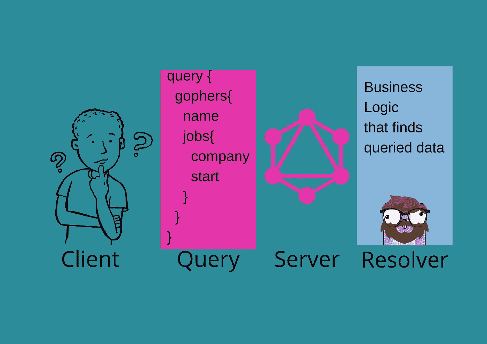

查询是对数据的请求，解析器处理业务逻辑来查找数据

查询是从服务器获取数据的操作。通过根据[模式](https://graphql.org/learn/schema/)声明发送请求来执行查询。您在本文前面看到了一个示例查询，我们将以此为起点。响应中将只返回在`query`中使用的`fields`。

在继续之前，我们需要了解两个关键词。

*   [字段](https://graphql.org/graphql-js/basic-types/) —某一数据类型的值，`String`，`Int`，`Float`，`Boolean`，`ID`
*   [对象](https://graphql.org/graphql-js/object-types/) —一个带`fields`的对象，把它想象成一个 struct。

我们展示查询中每个事物是什么的例子

要开始实现它，我们需要开始构建模式，记得`Schema Driven Development`吗？

我们将从创建可以查询的`Gopher`对象开始。创建一个`schema`文件夹，并在其中创建一个`gopher.go`。

我们将从创建`GopherType`开始，它是一个可以使用 GraphQL 发送的`object`的声明。为了在`graphql-go/graphql`中创建一个新的`object`，我们使用了`graphql.NewObject`函数，`NewObject`的输入是一个`ObjectConfig.`

这个`ObjectConfig` 是一个用于配置如何定义`object`的结构。config 保存了一个`graphql.Fields`对象，它是`map[string]*graphql.Fields`的别名，记住`Objects`是一组`Fields`。

schemas/Gopher . go-Gopher 对象类型的声明

现在我们已经定义了`GopherType`,我们必须设置并托管一个能够响应查询的 GraphQL 服务器。

为了拥有一个 GraphQL 服务器，我们需要一个`[RootQuery](https://graphql.org/learn/execution/#root-fields-resolvers)`，它是每个查询的基础。根查询将在顶层保存所有可用的查询。

当请求到达服务器时，必须获取数据。获取数据由`Resolvers`完成，它是一个接受查询和所有`arguments`的函数。我们将创建一个简单的服务器，在添加`GopherType`之前先用一个简单的`Hello`进行响应。

main.go —一个简单的 graphQL 服务器，在端口 8080 上公开

更新 main.go 之后，在端口`8080`上托管服务器，然后访问 [localhost:8080/graphql](http://localhost:8080/graphql) ，您将看到一个 UI，我们可以在其中测试当前的实现。

在左边你可以写下你的`Query`，在中间你可以看到来自`Resolver`的响应，在右边你可以看到一个可点击的树形结构，你可以用它来查看所有可用的查询。

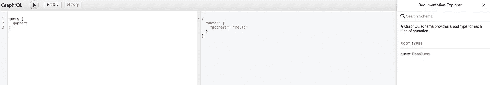

GraphiQL——一个测试和实验查询的网站

尝试一下，看看你是否得到了正确的反应，以确保一切正常。

现在是时候实现一个真正的解析器了，我们将创建一个名为`gopher`的新文件夹，其中包含一个用于获取地鼠的`Resolver`。创建`resolver.go`文件，该文件将定义我们期望从地鼠数据存储中得到的所有`Resolver`函数。

记住，任何看起来像`funcName(p graphql.ResolveParams) (interface{},error)`的函数都可以用作解析器。

gopher/resolver.go —定义我们的 gopher 解析器的解析器接口

既然我们已经定义了一个解析器接口，我们需要实现它。让我们使用包含几个地鼠的内存数据存储。Gopher 结构必须有`JSON`标签来匹配定义的`GopherType`。如果标签不匹配，则不会返回响应。

创建一个`gopher.go`并填充该结构。

gopher/gopher . go-与 GopherType 对象匹配的 gopher 结构

让我们创建一个`Repository`来定义充当 Gopher 存储所需的函数。创建`repository.go`并插入以下要点。

gopher/repository.go —定义 gopher 存储的存储库接口

接下来，我们实现一个简单的内存数据存储库。我们将创建一个`memory.go`并填充超级简单的存储解决方案，为我们生成两个地鼠。

memory . go——内存地鼠的简单存储解决方案

很好，我们现在可以开始实现用于处理查询的`Resolvers`。让我们从简单开始，用所有可用的地鼠实现响应。我们将有一个实现`Resolver`接口的结构。我们采用这种结构的原因将在后面变得更加清楚，但是一个`Resolver`可以容纳许多`Repositories`来组合数据。

resolver.go 添加了一个 ResolveGophers 函数，可用作服务器根查询中的解析器

要开始使用来自`GopherService`的`ResolveGophers`，我们需要在`main.go`中创建一个服务，并让`RootQuery`返回一个`GopherType`的`List`。记住`GopherType`是我们之前创建的自定义`Object`，而`List`是 GraphQL 中的一个数组。

main.go —更新了 GraphQL 根查询，以返回一个地鼠列表，并使用我们的 InMemoryRepository 解析它们

现在重启程序`go run main.go`并访问 [localhost:8080/graphql](http://localhost:8080/graphql) ，看看 graphql 是如何让我们避免过度获取和不足获取的。

请记住，在 GraphQL 中，我们定义了在查询中返回哪些字段，因此只有您查询的字段会被返回。请看下面的两张图片，在我只获取地鼠名称中，第二张图片显示了如何获取所有可用的数据。

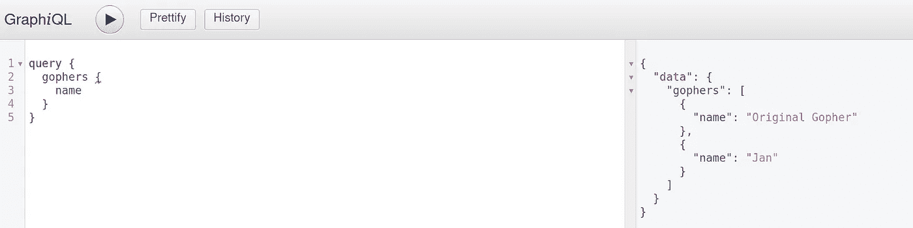

GraphiQL —只获取所有地鼠的名称的查询

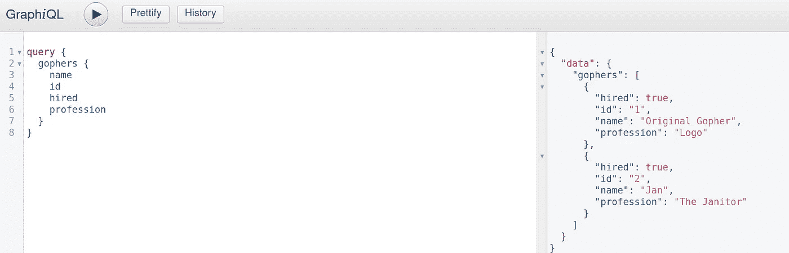

GraphiQL —查询以获取对地鼠可用的所有值

## **在不耦合数据源的情况下组合查询中的数据**

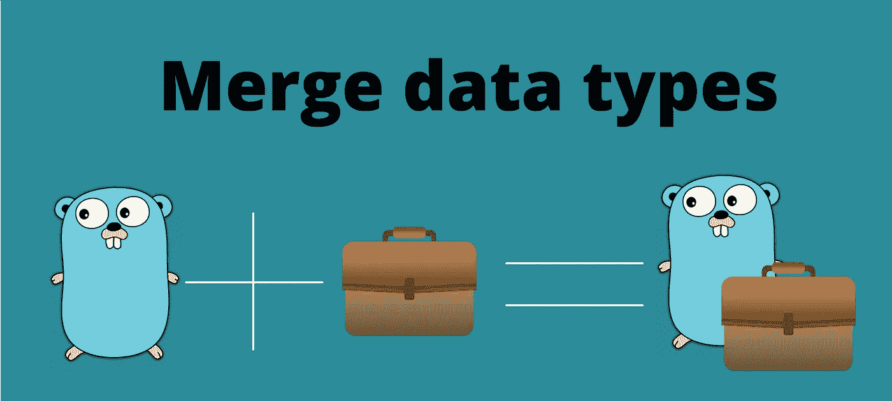

组合对象而不耦合它们

在我们继续之前，是时候展示如何使用多个存储库从许多来源获取数据了。这是 GraphQL 的另一个伟大特性。

每个`graphql.Field`都有一个`Resolve`字段，所以你可以给每个`graphql.Field`输入一个解析函数。通常，我们需要访问解析器中的存储库，最简单的方法是使用`Service`生成`Schema`，因为它拥有所有需要的访问权限。

让我们看看何时实现一个用于处理作业的`JobRepository`。我们将在`GopherService`中存储`JobRepository`和`GopherRepository`，并在`schema`包中创建一个`GenerateSchema`函数，该函数接受服务作为输入，并创建我们可以用于 GraphQL 的模式。这种方法允许我们构建可以访问所有数据源的解析器，这样我们就可以组合它们。

首先创建一个`job`文件夹，并创建我们将在内部使用的`job`结构。我们还将为该作业创建一个`Repository`。

job/job.go —后端域中使用的作业结构

接下来，我们需要一个作为存储库一部分的结构，这次也是一个内存解决方案。

job/memory.go —一个用于作业存储库的内存解决方案

在我们开始修复解析器之前，要做的最后一件事是升级`Service`，这样它就可以访问`JobRepository`

gopher/resolver . go-gopher 服务现在接受作业存储库

现在是时候关注这里发生的事情了。我们将添加一个`ResolveJobs`函数，在这个函数中我们将访问一个`Source`字段，这个字段是对象的`Parent`。当我们想要使用来自查询本身的数据时，这非常有用，就像在这种情况下，当我们搜索一个`Job`时，我们需要地鼠的`ID`。

`Source`将是一个`Gopher`对象，所以我们需要对它进行类型转换。然后使用那个地鼠的 ID 到`jobRepository`

gopher/resolver . go-resolve jobs 希望父对象是 gopher

是时候开始构建模式了，这是我们可以组合来自`GopherService`的数据的地方。

创建 GraphQL 对象来表示`schemas/factory.go`中的`JobType`。

schemas/factory . go-表示作业的 GraphQL 对象

让我们从固定`Jobs`数组的`Field`开始。请注意我们是如何将服务作为参数传递的，这样我们就可以到达所需的`Resolver`函数。

factory.go 构建作业字段，该字段是作业类型的列表

既然我们已经完成了`Job`字段，我们希望将其设置为`Gopher`类型的可用数据字段。我们将删除`gopher.go`文件并将内容移动到它的生成器函数中，因为我们再次需要`GopherService`的存在。记住`Jobs`字段将是`Gopher`的子字段，这使得`Source`是正确的。

factory.go —生成包含作业字段的 GopherType。

是时候完成 RootQuery 和导出到其他包的`GenerateSchema`中的模式了。

factory . go——generate schema 将所有部分链接成一个根查询

要实现这个功能，删除`main.go`中旧的`main`函数，使用新创建的存储库和模式生成器。

main . go——更简单的版本，不需要主函数的领域知识

重新启动应用程序并尝试查询作业。您应该看到，在每个 Gopher 下，都有一个 JSON 响应中呈现的作业列表。很神奇吧？

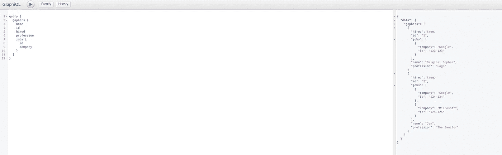

对 Gophers 查询的 JSON 响应

如果您想知道我们创建的`job`解析器和`gopher`解析器，那么我们为什么还没有实现它们是有原因的。我们不想每次都获取所有项目，但是我们希望能够只查询某些 Gophers。输入参数。

## 参数—指定搜索值的能力

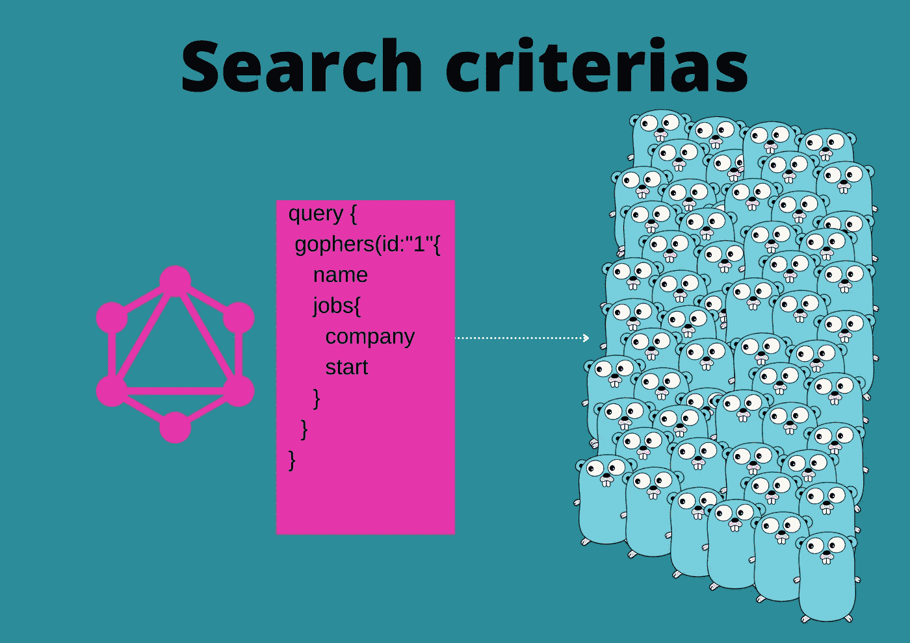

使用参数指定要查询的特定数据

有一种搜索特定数据的方法是有意义的。这种方式是通过在查询中使用`Arguments`来实现的。参数是包含在查询中的命名值。

一个 GraphQL 字段可以有零个或多个可用参数。

可能实现它来学习更容易，所以让我们添加查询特定地鼠和作业的能力。

在`graphql.ResolveParams`中，我们有一个`Args`字段，它将包含查询中发送的所有参数。

我们可以使用 Args 字段来搜索我们添加的任何参数。让我们先给`Jobs`解析器添加一个参数，其中我们要求一个公司参数。

更新`JobRepository`以接受另一个参数`companyName`。

job/memory . go-更新 GetJobs 以获取公司名称

我们还修正了`Repository`来关联新的变化。

job/job . go-存储库更改

现在让我们修复`ResolveJobs`来检查参数。

gopher/Resolver . go-解析器现在接受参数 Company

我们需要做的最后一件事是让`graphql.Field`也接受参数。每个`graphql.Field`都有一个`Args`可以用来定义可能的参数，Args 是一个`map[string]*ArgumentConfig`，我们必须在其中设置名称和数据类型。让我们把它加到`schemas/factory`

模式/工厂-作业字段现在有一个参数

现在，您可以通过在查询中使用参数来请求某些公司。通过在字段后使用以下语法添加参数。

```
jobs(company: "value"){
```

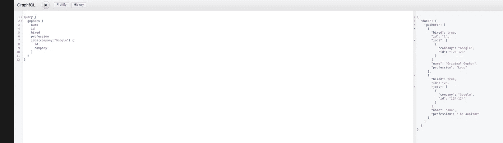

该图显示了我们如何通过使用和参数来筛选某些作业

## 突变-修改数据

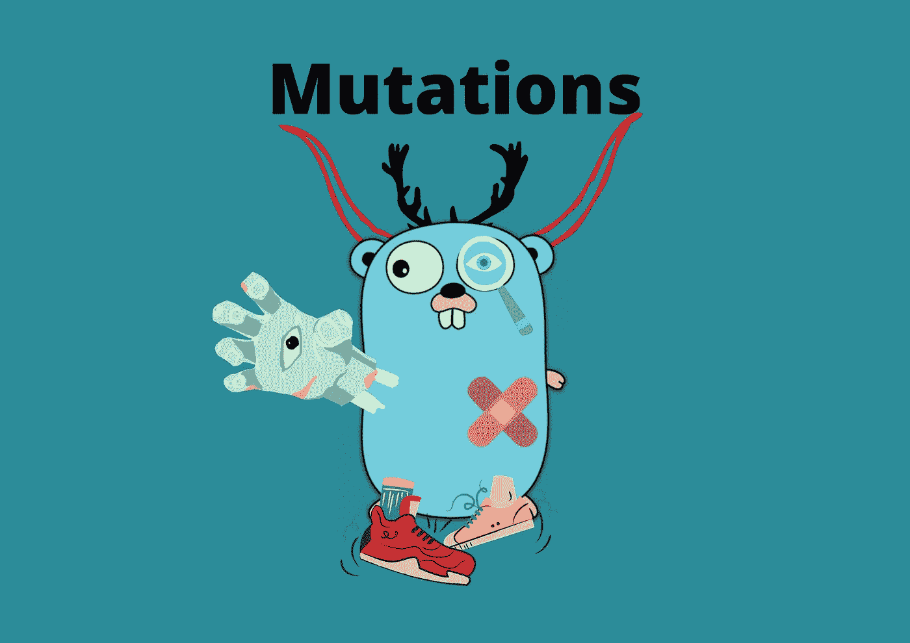

GraphQL 中的突变允许对数据进行更改

太好了，我们可以从服务器上查询数据。当我们想修改数据的时候呢？

这就是我们在 GraphQL 中拥有`mutations`的时候。突变是由一个`RootMutation`定义的，就像我们有一个 RootQuery 一样。因此，我们需要为所有可用的突变、它们的参数和可用的字段建立一个模式。

GraphQL 中的一个`Mutation`看起来非常像一个查询，事实上，它也将返回结果。因此，变异可以用于应用新值，也可以在应用新值后获取新值。就像查询一样，您定义了要返回什么值。

让我们允许`JobRepository`通过一个 ID 到`GetJob`并到`Update`该作业，这样我们可以稍后创建一个变异来修改作业的开始和结束日期。

job/job.go —用两个新函数更新存储库

然后打开`memory.go`并更新存储解决方案来处理这些新功能。

job/memory.go —用于处理作业更新的内存解决方案

接下来，我们需要给`GopherService`添加一个`Resolver`函数，我注意到 graphql-go 的一个特点是开销很大，因为我们要处理大量的`interface{}`。您可以通过创建助手函数来处理类型断言来避免很多开销，在下面的代码片段中，您可以看到一个用于提取字符串形式的 GraphQL 参数的`grabStringArgument`。变异解析器就像查询解析器一样，所以这里没有什么新东西。

gopher/resolver . go-添加了更新作业的突变解析器。

接下来，我们需要更新模式以进行突变。正如您可能已经注意到的，创建所有的`graphql.Fields`可能会变成相当多的代码，所以我通常会创建一个生成器函数来减少代码重复。

为了创建一个字段，我们需要一个`Type`，它是实现输出接口的任何东西，类似于下面的代码片段

```
type Output interface {
    Name() string
    Description() string
    String() string
    Error() error
}
```

第二个参数是解析器，它是别名`FieldResolveFn func(p ResolveParams) (interface{},error)`，第三个是字符串描述，第四个是允许的参数映射。

schemas/factory . go-graph QL 字段的通用工厂

构建变异查询时，在`schemas`包中创建一个`mutation.go`文件。我们首先创建请求中可用的参数。我们希望突变请求有`require`两个参数，所以我们使用`graphql.NewNonNull`函数创建它们。使用`NewNonNull`将使 GraphQL 服务器在发送空值请求时触发一个错误。

schemas/mutation . go-可用于 Mutatejob 请求的参数。

我们需要创建包含新变异的`RootMutation`，就像创建查询一样。我们现在将使用`generateGraphQLField`来缩短代码。

schemas/mutation.go —构建根变异

在我们尝试变异之前要做的最后一件事是将 RootMutation 应用到`factory.go`中的模式

schemas/factory . go-将根变异添加到模式配置中。

打开 GraphiQL 试用一下。我们发送`Mutation`的方式与发送`Query`相同，只需替换关键字。

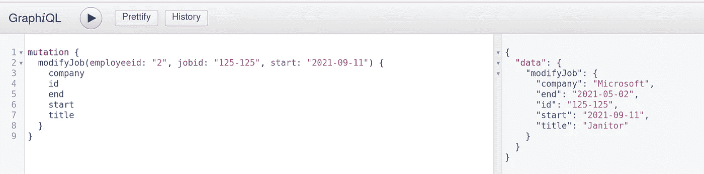

GraphiQL —发送变更请求以更改开始日期

## 结论

我们已经讨论了 GraphQL 的核心。在本文中，您了解了如何查询数据、对数据进行变异以及 GraphQL 的基本工作原理。您已经看到了我们如何将数据源组合成一个单一的输出，以及如何构建项目。

GraphQL 已经成长了很多，并且提供了更多。这里有一些你应该自己调查的主题，以增加你的知识。

*   列举
*   接口、片段和内联片段
*   捐款

如果你想了解更多，我可以推荐 Robin Wieruch 的[通往 GraphQL 之路](https://amzn.to/3BIZNaP)。这本书并不关注 Go，而是从前端的角度关注 GraphQL。这本书将介绍如何使用 GraphQL 与节点后端进行交互。

> 完全披露——这本书的链接是一个附属链接，这意味着我有权获得一些销售收入。

你是否会使用 GraphQL？

你可以在 [GitHub](https://github.com/percybolmer/graphql-in-go) 上找到完整代码。

感谢您的阅读，并随时以任何可能的方式联系我，在 T [witter](https://twitter.com/percybolmer) 、 [Instagram](https://www.instagram.com/programmingpercy/) 、 [Linkedin](https://www.linkedin.com/in/percy-bolmer-bb223b122/) 上发表评论。