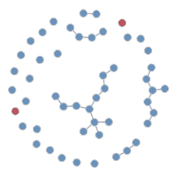
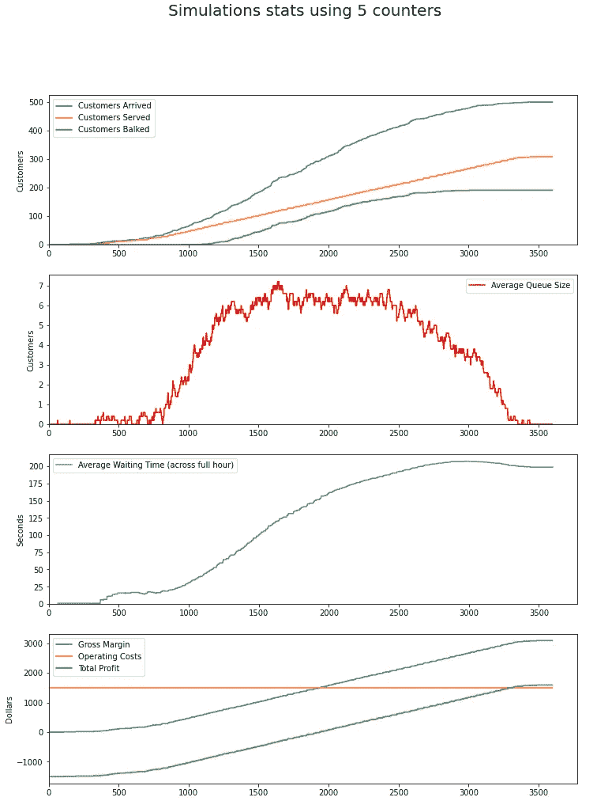
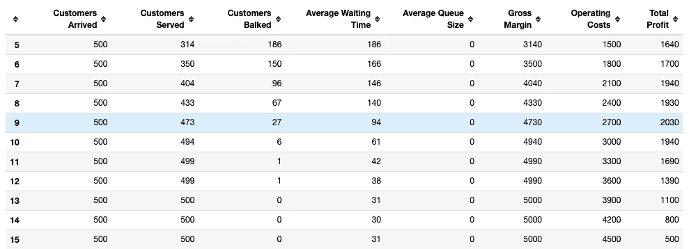

# 基于代理的建模介绍

> 原文：<https://towardsdatascience.com/intro-to-agent-based-modeling-3eea6a070b72?source=collection_archive---------3----------------------->

## Python 中基于代理的建模如何帮助确定超市柜台数量的例子


图片由[皮克斯拜](https://pixabay.com/?utm_source=link-attribution&utm_medium=referral&utm_campaign=image&utm_content=2457842)的 Gerd Altmann 提供

**目录:**

1-简介:为什么是基于代理的建模？

2-我们的超市排队问题

三模型设计

4-模型执行

5-结论

## **简介**

基于代理的建模(ABM)是一种**自下而上的模拟**技术，其中我们通过其**个体代理**相互**交互**来分析系统。

假设我们想预测特定地区的 COVID 病例数，我们可以创建代表该地区人民的代理。

我们模拟了几个代理人(人)的行为，其中一些人可能戴着口罩，而其他人没有，一些人接种了疫苗，一些人非常喜欢社交，而其他人没有，等等。然后，我们模拟它们之间的相互作用以及相关的 COVID 被传输的概率…



Gif 由 [statnet](https://statnet.org/nme/movie.gif)

运行模拟后，我们能够更好地了解整个系统……我们可以看到人群中的感染人数、康复人数、传播率、是否达到群体免疫等。我们还可以分析系统的情况(感染、恢复等)。)如果我们实施强制接种疫苗等措施。

ABM 的基石是理解微观行为中出现的宏观现象的能力。

在上面的例子中，使用 ABM 的替代方法是直接查看宏观级别的统计数据，如感染和恢复的数量，并直接分析这些统计数据的趋势。相反，ABM 强调个体代理的行为，这是一种更灵活、更精细的自下而上的方法，可以捕捉宏观模型无法捕捉的方面。

ABM 在生物学、社会科学、交通管理和供应链管理以及许多其他学科中都有应用。

这些代理的行为应该尽可能地代表现实(我们可以验证这一点)，因此，例如，如果该地区 75%的人戴面具，那么我们创建的代理中有 75%被建模为戴面具的代理。

## 超市排队问题

假设我们正在管理一家超市的员工成本。

问题:对于一个特定的小时，我们预计会有 500 名顾客出现，我们想确定在那个小时我们应该开多少个柜台。

普通顾客价值 10 美元的毛利润，而操作一个柜台一小时的平均成本是 300 美元。


很不幸，此时此地由[拍摄的图片结束了我在](https://pixabay.com/users/alexas_fotos-686414/?utm_source=link-attribution&utm_medium=referral&utm_campaign=image&utm_content=1165437) [Pixabay](https://pixabay.com/?utm_source=link-attribution&utm_medium=referral&utm_campaign=image&utm_content=1165437) 的旅程

与标准的排队理论模型(M/M/1，M/G/1，M/M/c 等)不同。)，基于代理的建模可以更容易地捕捉这种多排队、多服务器环境中的行为方面。

常见的行为包括排队**犹豫**(客户因为排队太长而不加入)**反悔**(客户加入队列但等待太久后离开)**哄抢**(客户从较长的队列移到较短的队列)。

我们将尝试使用反弹道导弹来解决这个问题。

## 模型设计

我们将基于以下假设构建一个简单的 ABM 模型:

> 1-我们正在优化这一小时的净利润。
> 
> 在这一小时内，正好有 500 名顾客会到达超市。
> 
> 3-每个顾客价值 10 美元。
> 
> 4-每个柜台的运营成本为 300 美元。
> 
> 基于 beta 分布，顾客在一天中的不同时间到达超市排队，这样他们更有可能在一小时的中间到达。
> 
> 6-处理客户订单的平均时间为 45 秒，但处理时间因客户而异。它遵循泊松分布(为简单起见，并确保我们得到离散的非负数)，平均值为 45。
> 
> 7-每个顾客都有一个犹豫的容忍度，即顾客愿意加入的排队人数。如果排队的人多了，顾客就不会排队，我们就失去了销售。顾客的拒绝容忍度服从泊松分布。平均容忍度为 6，即如果队列中有 6 个或更多的其他顾客，大多数顾客会犹豫。
> 
> 8-顾客选择排队最短的柜台。

**注意**在实际应用中，我们根据可用数据验证假设(或将其作为待优化的参数)。同样，在这个介绍性的例子中，犹豫是我们考虑的唯一行为。

我们运行 ABM 模拟 3600 步(滴答),代表一小时 3600 秒。下面是初始配置代码。

```
# Config
ticks = 3600 # 3600 ticks = 3600 seconds = 1 hour
no_customers = 500
avg_service_time = 45 # ticks/seconds per customer
gross_margin_per_customer = 10 # dollars
cost_per_counter = 300 # dollars
```

现在，我们使用 python 中的 [**Mesa**](https://mesa.readthedocs.io/en/stable/) 库来编码我们模型的其余部分。让我们从定义我们的客户类和所需的属性开始。客户类是我们将要打交道的两类代理之一，另一类是柜台。

```
from mesa import Agentclass Customer(Agent):
    def __init__(self, unique_id, model):
        super().__init__(unique_id, model)
        # Time required to process the customer's transaction
        self.service_time = ss.poisson(45).rvs()
        # Time of arrival at queue
        self.entry_time = np.int(ss.beta(3, 3).rvs() * ticks) + 1
        self.balk_tolerance = ss.poisson(5).rvs() + 1
        # Whether or not the customer has arrived at the queue
        self._arrived = False
        self._chosen_counter = None
        self._q_entry = None
        self._q_exit = None
        # Start time when customer is being served
        self._service_entry = None
        # End time
        self._service_exit = None
```

我们还需要为我们的客户创建一个“分步”方法，描述他们在模拟的每一步(滴答/秒)做什么。

```
class Customer(Agent):
    def __init__(self, unique_id, model):
        super().__init__(unique_id, model)
        # Time required to process the customer's transaction
        self.service_time = ss.poisson(45).rvs()
        # Time of arrival at queue
        self.entry_time = np.int(ss.beta(3, 3).rvs() * ticks) + 1
        self.balk_tolerance = ss.poisson(5).rvs() + 1
        # Whether or not the customer has arrived at the queue
        self._arrived = False
        self._chosen_counter = None
        self._q_entry = None
        self._q_exit = None
        # Start time when customer is being served
        self._service_entry = None
        # End time
        self._service_exit = None def select_counter(self):
        self._arrived = True
        # Queue at shortest counter
        self._chosen_counter_idx = np.argmin([
            len(counter.queue) for counter in self.model.counters])
        self._chosen_counter = self.model.counters[
            self._chosen_counter_idx]
        # Balk if there are too many people at the counter
        if len(self._chosen_counter.queue) < self.balk_tolerance:
            self._chosen_counter.queue.append(self)
            self._q_entry = self.model._current_tick def pay_n_leave(self):
        self._service_exit = self.model._current_tick
        self._chosen_counter.active_customer = None def step(self):
        if (self._arrived == False) & \
        (self.model._current_tick >= self.entry_time):
            self.select_counter()
        elif isinstance(self._service_entry, int):
            if self.model._current_tick - self._service_entry \
            == self.service_time:
                self.pay_n_leave()
```

在上面的代码中，在每个模拟步骤中，如果我们到达的模拟步骤/时间与客户的进入时间(他到达超市队列的时间)相匹配，那么我们运行 select_counter 方法，在该方法中，他选择具有最短队列的柜台，或者如果队列太长，他会停止。

如果顾客已经在柜台接受服务，我们检查是否已经运行了足够的步骤到达他的服务时间(处理他的交易所需的时间),然后我们运行 pay_n_leave 方法。

同样，下面的代码用于第二类代理，计数器。

```
class Counter(Agent):
    def __init__(self, unique_id, model):
        super().__init__(unique_id, model)
        self.queue = []
        self.active_customer = None def dequeue(self):
        try:
            self.active_customer = self.queue.pop(0)
            self.active_customer._service_entry = self.model._current_tick
            self.active_customer._q_exit = self.model._current_tick
        except:
            pass def step(self):
        if self.active_customer is None:
            self.dequeue()
```

最后，我们创建一个 QueueModel 类，用于管理代理所属的整个模拟/系统。

```
from mesa import Model
from mesa.time import RandomActivationclass QueueModel(Model):
    """Queueing model with customers and counters as two
    types of agents that interact with each other
    """ def __init__(self, no_customers, no_counters, ticks):
        self.ticks = ticks
        self._current_tick = 1
        self.no_customers = no_customers
        self.no_counters = no_counters
        self.schedule = RandomActivation(self)
        # Create agents
        self.customers = []
        self.counters = []
        for i in range(self.no_customers):
            customer = Customer(i, self)
            self.schedule.add(customer)
            self.customers.append(customer)
        for i in range(self.no_counters):
            counter = Counter(i + no_customers, self)
            self.schedule.add(counter)
            self.counters.append(counter) def step(self):
        self.schedule.step()
        self._current_tick += 1
```

QueueModel 类可以用客户数量(在我们的示例中为 500)、计数器数量(这是我们试图确定的)和节拍(模拟步骤的数量，3600 代表一小时 3600 秒)来初始化。

我们有一个“schedule”属性，其中描述了哪些代理将在何时被激活。我们使用随机激活，以随机的顺序激活所有的代理。您可以阅读不同设置的[台面文档](https://mesa.readthedocs.io)。

在初始化时，有两个 for 循环，我们在其中创建客户和计数器代理。我们还将它们添加到模型的时间表中。

还有一个“step”方法，它协调运行模拟的一个步骤，还触发作为时间表一部分的代理的“step”方法。

我们现在可以通过运行以下代码来运行模拟…

```
model = QueueModel(ticks=ticks,
    no_customers=no_customers, no_counters=no_counters)for i in range(ticks):
    model.step()
```

然而，我们也可以在 QueueModel 类中添加一个“数据收集器”,帮助我们跟踪感兴趣的指标。我们可以在模拟的每一步跟踪这些指标。

让我们跟踪 8 项指标:

> 1-到达的顾客数量。在 3600 个模拟步骤(代表 1 小时)结束时，我们应该有 500 个客户。
> 
> 2-已经服务的客户数量。
> 
> 3-到达队列但犹豫不决的顾客人数。我们失去了那些顾客。
> 
> 4-所有计数器的平均队列大小。
> 
> 5-顾客得到服务前的平均等待时间。
> 
> 6-毛利润=服务的客户数量 x 每位客户 10 美元
> 
> 7-运营成本=柜台数量 x 300 美元
> 
> 8-利润总额=毛利率-运营成本

为了将指标添加到我们的 ABM 模型中，我们首先将它们创建为以我们的队列模型作为参数的函数…

```
def get_customers_arrived(model):
    customers_arrived = [
        customer._arrived for customer in model.customers]
    no_customers_arrived = np.sum(customers_arrived)
    return no_customers_arriveddef get_customers_served(model):
    customers_served = [not(customer._service_exit is None)
                        for customer in model.customers]
    no_customers_served = np.sum(customers_served)
    return no_customers_serveddef get_customers_balked(model):
    customers_arrived = [
        customer._arrived for customer in model.customers]
    # Customers who never joined a queue
    customers_no_q = np.array([
        customer._q_entry is None for customer in model.customers])
    no_customers_balked = np.sum(customers_arrived * customers_no_q)
    return no_customers_balkeddef get_avg_queue_size(model):
    queue_size = [len(counter.queue) for counter in model.counters]
    avg_queue_size = np.mean(queue_size)
    return avg_queue_sizedef get_avg_waiting_time(model):
    customers_wait = [np.nan if customer._q_exit is None else
                      customer._q_exit - customer._q_entry for customer in model.customers]
    avg_customer_wait = np.nanmean(customers_wait)
    return avg_customer_waitdef get_gross_margin(model):
    return gross_margin_per_customer * get_customers_served(model)def get_operating_costs(model):
    return cost_per_counter * no_countersdef get_total_profit(model):
    return get_gross_margin(model) - get_operating_costs(model)
```

最后，我们如下更新我们的 QueueModel 类…

```
from mesa.datacollection import DataCollectorclass QueueModel(Model):
    """Queueing model with customers and counters as two
    types of agents that interact with each other
    """ def __init__(self, no_customers, no_counters, ticks):
        self.ticks = ticks
        self._current_tick = 1
        self.no_customers = no_customers
        self.no_counters = no_counters
        self.schedule = RandomActivation(self)
        # Create agents
        self.customers = []
        self.counters = []
        for i in range(self.no_customers):
            customer = Customer(i, self)
            self.schedule.add(customer)
            self.customers.append(customer)
        for i in range(self.no_counters):
            counter = Counter(i + no_customers, self)
            self.schedule.add(counter)
            self.counters.append(counter)
        self.datacollector = DataCollector(
            model_reporters={
    'Customers Arrived': get_customers_arrived,                      
    'Customers Served': get_customers_served,
    'Customers Balked': get_customers_balked,
    'Average Waiting Time': get_avg_waiting_time,
    'Average Queue Size': get_avg_queue_size,
    'Gross Margin': get_gross_margin,
    'Operating Costs': get_operating_costs,
    'Total Profit': get_total_profit}) def step(self):
        self.datacollector.collect(self)
        self.schedule.step()
        self._current_tick += 1
```

我们现在准备运行我们的模型…

## 模型执行

让我们试着用 5 个计数器运行我们的模型…

```
no_counters = 5model = QueueModel(ticks=ticks,
    no_customers=no_customers, no_counters=no_counters)for i in range(ticks):
    model.step()
```

下面是结果和用来产生它们的代码…

```
run_stats = model.datacollector.get_model_vars_dataframe()fig, (ax1, ax2, ax3, ax4) = plt.subplots(4, 1)
fig.figure.set_figwidth(12)
fig.figure.set_figheight(16)
fig.suptitle(f'Simulations stats using {no_counters} counters', fontsize=20)ax1.plot(run_stats[['Customers Arrived',
                'Customers Served',
                'Customers Balked',
               ]])
ax1.legend(['Customers Arrived',
            'Customers Served',
            'Customers Balked',
            ])
ax1.set_ylabel('Customers')
ax1.set_xlim(0)
ax1.set_ylim(0)ax2.plot(run_stats['Average Queue Size'], color='red')
ax2.legend(['Average Queue Size'])
ax2.set_ylabel('Customers')
ax2.set_xlim(0)
ax2.set_ylim(0)ax3.plot(run_stats['Average Waiting Time'], color='grey')
ax3.legend(['Average Waiting Time (across full hour)'])
ax3.set_ylabel('Seconds')
ax3.set_xlim(0)
ax3.set_ylim(0)ax4.plot(run_stats[['Gross Margin',
                'Operating Costs',
                'Total Profit'
               ]])
ax4.legend(['Gross Margin',
            'Operating Costs',
            'Total Profit'
            ])
ax4.set_ylabel('Dollars')
ax4.set_xlim(0)fig.show()
```



作者图片

x 轴代表我们正在模拟的 1 小时内的 3600 次滴答/秒。

第一个图表向我们展示了在大约 1200 秒(大约 20 分钟)后，由于太多的顾客到来，顾客开始犹豫。

在第二张图中，我们可以看到大约 10 分钟后，队列大小开始增加，并在一个小时的中间达到大约每个柜台 6 个客户的峰值。

第三张图向我们展示了平均等待时间(累积)是如何从一小时开始到一小时结束时增加的，因为许多客户在一小时中间到达，他们排着长队等待，从而推高了平均等待时间。

最后，第四张图表显示了我们的财务状况，在这一小时结束时，我们积累了 1500 多美元。

基于以上所述， **5 个柜台似乎太低了**，因为我们可以看到，不到 200 名客户 **(40%)拒绝**并流失。

现在，让我们尝试使用 5–15 个计数器运行模拟，以确定理想的计数器数量…

```
full_stats = {}for no_counters in range (5, 16):
    model = QueueModel(ticks=ticks,
    no_customers=no_customers, no_counters=no_counters)
    for i in range(ticks):
        model.step()   
    run_stats = model.datacollector.get_model_vars_dataframe()
    full_stats[no_counters] = run_stats.iloc[-1]

pd.DataFrame(full_stats).transpose().astype(int)
```

在上面的代码中，我们用 5–15 个计数器运行模拟，并在每个模拟结束时查看统计数据(不是模拟的每个步骤)。dataframe 输出显示了不同计数器数量的结果…



作者图片

我们可以看到**的总利润在 9 个柜台**的情况下最大化为 2030 美元。

我们可以根据任何感兴趣的指标进行优化…即时利润不一定是最佳指标。

使用 9 个柜台的每个顾客的平均等待时间是 94 秒…通过增加一个额外的柜台，我们将等待时间减少了 33 秒，达到 61 秒，我们只损失了 90 美元(总利润是 1940 美元)。减少等待时间可能会创造更好的客户体验，从长远来看会带来更多利润。

## 结论

上述示例的目标是介绍基于代理的建模主题及其独特的优势，包括轻松捕捉不同代理行为的能力。通常，有人认为我们基于有限理性做出决策。

此外，另一个主要好处是能够看到微观行为如何影响整个系统。例如，我们看到，个体的阻碍容忍度如何决定不同的平均排队等待时间和不同的累积利润。

在随后的文章中，我们可以看看在根据可用数据和程式化事实进行验证之后，如何为模型选择最佳的模型假设和参数。