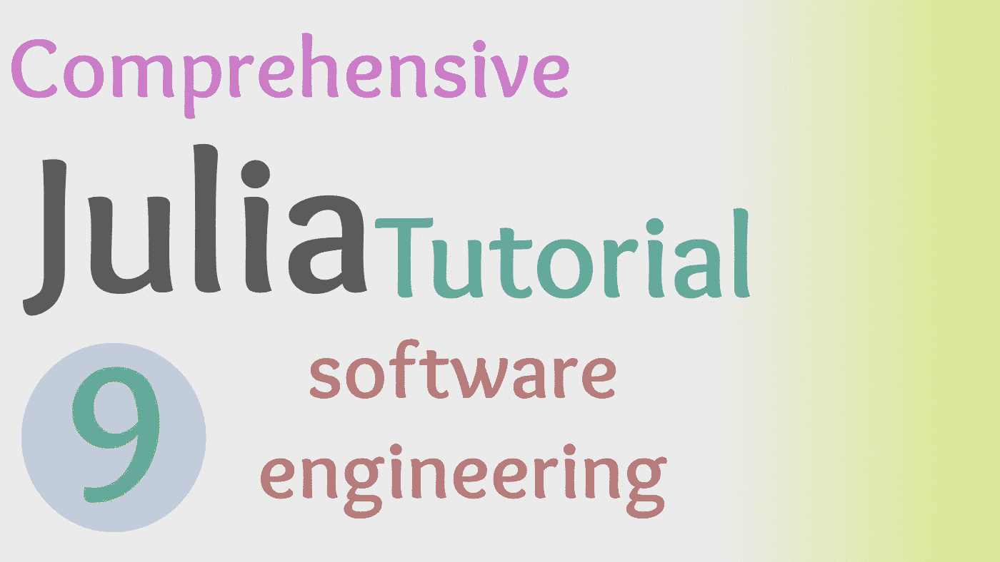

# Julia 中的算法和构造函数介绍

> 原文：<https://towardsdatascience.com/intro-to-algorithms-and-constructors-in-julia-562905d30071?source=collection_archive---------49----------------------->

## 朱莉娅综合教程

## 在 Julia 编程语言中一起使用类型和包的快速介绍。



(图片由作者提供)

> 本文视频:

> SuperFrames.jl 存储库:

[](https://github.com/ChifiSource/SuperFrames.jl) [## ChifiSource/SuperFrames.jl

### 我们一起编写的 DataFrames.jl 扩展:)如果您想了解更多信息，可以通过以下方式与我们合作…

github.com](https://github.com/ChifiSource/SuperFrames.jl) 

# 介绍

在之前版本的 Julia 综合教程中，我们设置了新的包 SuperFrames.jl，并完成了一个 Project.toml 文件。虽然我们可能没有深入研究编码，但是在 Julia 语言中如何创建和分发包的知识在这里变得很重要。然而，对无聊的人来说幸运的是，今天我们实际上要编程并研究算法的第一部分，以创建我们新的超帧类型！

# 构造器

Julia 中的构造函数是一个完整的野兽，它们有自己的属性和品质，这使它们比其他编程语言中的解决方案更有价值。虽然大多数语言可能有简单的“结构”风格的构造函数，甚至“类”构造函数，但 Julia 的范例有点不同，它使用两个构造函数串联起来，使结构更适用于科学编程。

在 Julia 中，您将使用的大多数构造函数很可能是外部构造函数。您可能对外部构造函数很熟悉，因为它们是 Julia 中最基本的构造函数类型，并被移植到许多函数式编程语言中。创建新的构造类型的关键字是 struct，后跟一个定义，如下所示:

```
struct mytype
```

然后将该构造函数的数据类型放在它的下面，returns 是分隔这些参数的语法。

```
struct mytype
    data1
    data2end
```

如果我们希望在构造这种类型后数据是动态的，我们还可以在这个表达式中添加关键字“mutable ”:

```
mutable struct mytype
    data1
    data2
end
```

在我们的例子中，我们看到一个需要传递两个参数的结构:

*   columns:抽象向量的向量，可以基于矩阵位置调用它来提供适当的观察。
*   colindex:一种索引类型，我们已经从 DataFrames 中导入了它，它将接受更多的数据。

```
**mutable struct SuperFrame <: AbstractDataFrame
        columns::Vector{AbstractVector}
        colindex::Index
end**
```

> 这有什么不好？

这种类型的问题是，任何想要使用它的最终用户都需要通过创建自己的索引类型来调用它，然后创建向量的向量，最后通过这个构造函数来调用超帧。仅仅为了得到一个数据帧就要进行大量的编程工作，而这通常只需要一行代码就可以完成。

幸运的是，我们可以使用一个内部构造函数来创建更多的输入，并且输出与这个结构相同。为了创建一个内部构造函数，我们只需在这个构造函数中创建一个函数，它将接受相同名称下的不同类型，dispatch 将为我们处理其余的事情！

```
utable struct SuperFrame <: AbstractDataFrame
        columns::Vector{AbstractVector}
        colindex::Index
        function SuperFrame(dict::Dict)
        end
end
```

虽然这还不是一个构造函数，但它展示了这两者如何随机地一起为我们创建类型的基础。如果我们用一个向量的向量和一个索引来调用超帧构造函数，我们仍然可以创建超帧类型，但是如果我们想从字典中的数据创建一个新的超帧，我们可以传递它并调用内部构造函数，这个构造函数用来获取字典。也就是说，我们现在需要一种算法，能够将字典转化为向量的向量和索引。让我们从 DataFrames.jl 中的索引类型开始。

```
struct Index
    lookup::Dict
    names::Array{Symbol}end
```

从这个结构的外观来看，为了创建我们的新索引类型，我们需要一个字典 lookup，它将保存与整数相关的行计数的值，以及一个符号数组，我假设它将是我们的列的名称。当然，这些列名与我们字典中的键相关。

伟大的软件工程的一个关键支柱是一个叫做 MVP 的概念，或者最小可行产品。这个概念的意思是，最初每当程序员想要解决一个问题时，他们不应该担心细节——而应该只担心它开始工作。我认为这是一个伟大的编程策略，功能可以随着时间的推移而改变和优化，但如果我们没有一个可行的方法，那么我们甚至不能告诉你我们是否能够得到我们想要的结果，或者我们是否需要为我们的特定问题尝试一些不同的东西。

可以这样想——我们需要做一个函数，对我们将来可能使用的东西进行概念验证。考虑到这一点，虽然我们当然有可能以更简洁的方式做到这一点，但我认为在优化之前思考问题肯定是任何算法都要走的路。我们需要做一个相对基本的小算法来为一个查找字典枚举字典的值，并将我们的名字推到一个数组中，我们可以将这个数组传递给这个新类型。让我们首先考虑我们需要什么，一个字典和一个数组:

```
index = 0
names = []
lookup = Dict()
```

首先，我决定使用索引计数器——只是为了展示循环算法的可能性。在用循环填充数据类型时，定义要在循环中填充的内容是一种非常常见的编程实践。然而，有一些更深入的方法，我们将在未来改进这个函数，这些方法将成为解决我们现在要用一个计数器和两个空数组解决的问题的替代方法。

我将索引设置为等于零的整数数据类型，将名称设置为一个空数组，我们打算用符号填充该数组，最后查找具有相应枚举计数的 Dict 数据类型。现在让我们看看如何构造一个循环。在 Julia 中，我们对待多个输出就像对待 for 循环中的返回一样。但是，这些变量名必须包含在一个列表中，否则我们将得到

> "无效的迭代规范"

扔给我们。该循环在头部看起来像这样，可以认为它类似于我们在本系列的循环重现中讨论的 zip()循环。

```
for (name, data) in dict
    append!(names, name)
    index += 1
    push!(lookup, name => index)
end
```

现在我认为谈论范围是很重要的。为什么我们要在这个循环之前初始化字典和列表数据类型？这是因为一个叫做作用域的概念，我们将在本系列的下一期更多地讨论这个概念。范围是一个重要的编程概念，它与应用程序不同级别的类型的保密性有关。这就是为什么我们可以在同一个文件中使用同一个变量名 100 次，只要使用不同的函数和类型。变量、数据和我们在这个函数中写的任何东西都是这个函数的私有范围。这意味着我们没有一个全局定义的等于零的变量 index。如果是这种情况，我们可以加载模块，然后变量将是可用的。

虽然函数、类型、模块和全局环境都有范围，但循环也有。也就是说，这个循环定义中的变量名专用于这个迭代任务。当循环返回 0 时，它们被销毁，并且除了知道函数正在保存一个执行 _ 和 _ 的循环之外，函数不会以任何方式保存它们。

最后，这个 for 循环相对简单，只需要将字典中包含的名称附加到新的名称符号数组中。然后我们在索引中添加一个，并把它作为一个对应的对放到我们正在循环的当前名称中。

这是我们创建索引类型所需的两种类型。现在所有这些都完成了，我们可以将它们插入 DataFrames.jl 中 Index 的外部构造函数，并创建一个索引:

```
names = Vector{Symbol}(names)
index = Index(lookup, names)
```

> (我还将 Vector{Symbol}类型转换成了名称。不这样做可能会导致 methoderror，但是我先发制人地把它放在了那里。)

# 结论

我对这个项目感到非常兴奋！对于新的索引类型，我们已经完成了一半的工作，并且几乎准备好开始使用来自数据帧的方法。我保证在接下来的几集里，我们在这个包的基础上自动获得的扩展功能是值得的！我还想说，在这一集里，我还想回顾一些事情，所以不要担心，我们才进行了一半，我会继续解释，进一步解释和演示范围，并优化这个函数。

我特别激动，把这个简短的算法优化成只有几行，以显示朱莉娅的力量。如果你认为你有一个更好的方法，请随意在 Github 上分叉存储库，何乐而不为呢！我很乐意解释你的代码是如何工作的！我认为最好的方法是使用 enumerate()方法(我们还没有讨论过它，所以我没有使用它)，或者按位置调用键，或者看看循环语法是否支持基于字典的键和值对以及枚举对来迭代 3 个元素。无论如何，我相信这将是一个有趣的朱利安实验步行！谢谢你的观看和阅读，它对我来说意味着整个世界！