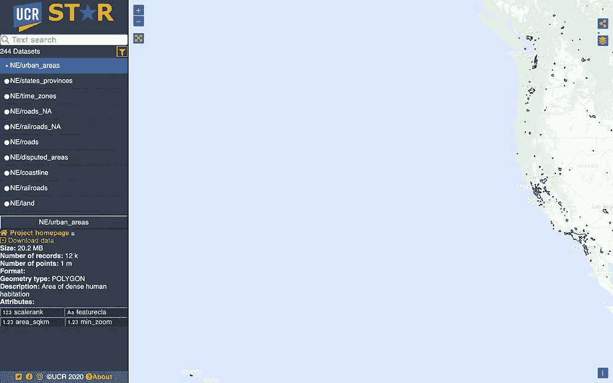
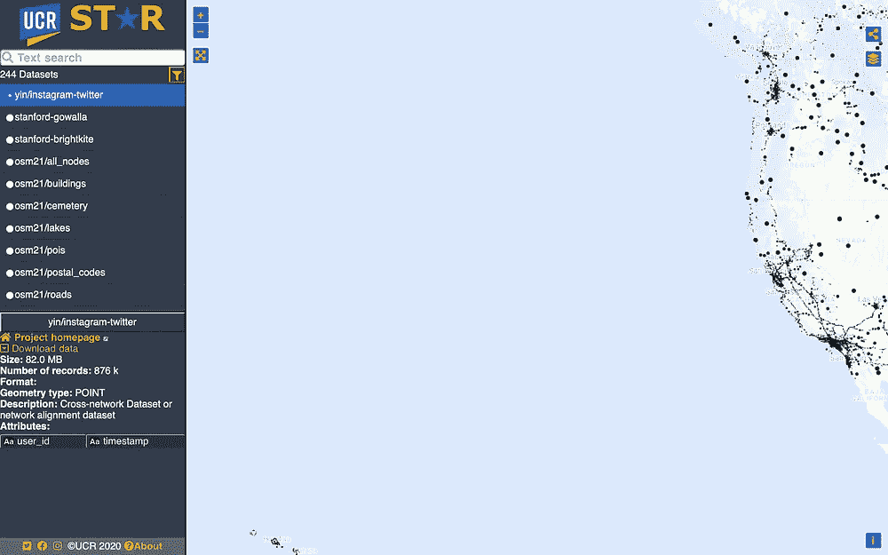
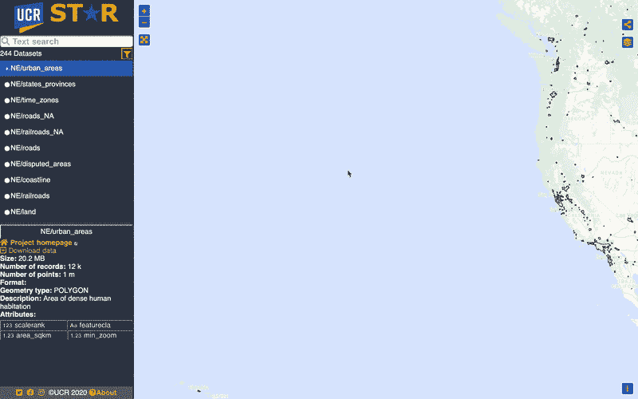
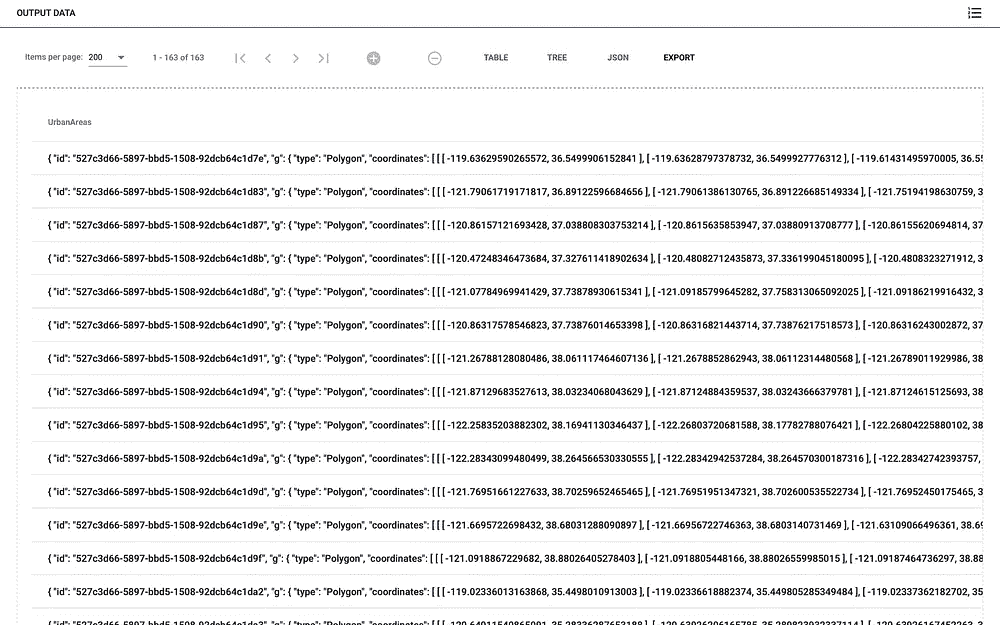
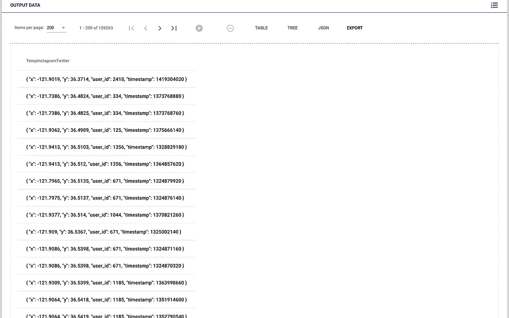
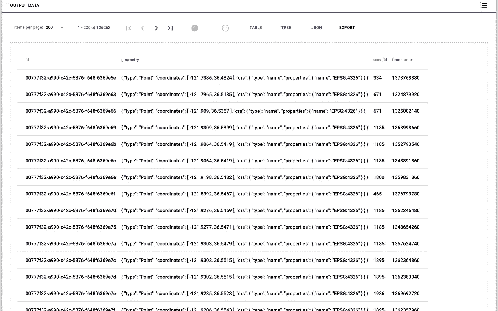

# AsterixDB 简介—第 1 部分

> 原文：<https://towardsdatascience.com/intro-to-asterixdb-part-1-13b1f0fdff56?source=collection_archive---------35----------------------->

## 具有地理空间功能的“一刀切”大数据管理系统


纳斯蒂亚·杜尔希尔在 [Unsplash](https://unsplash.com?utm_source=medium&utm_medium=referral) 上的照片

# 介绍

AsterixDB 是一个可扩展的开源大数据管理系统(BDMS ),具有地理空间功能。在这里，你可以看到[更多的特点，因此它被描述为“一个尺寸适合一群人”尽管如此，本教程不会太深入探讨 AsterixDB 的复杂性和潜力。相反，我将创建三篇博文，作为 AsterixDB 新手的通用实用教程，同时展示 AsterixDB 的新地理空间功能。帖子将按以下顺序排列:](https://asterixdb.apache.org/index.html)

1.  准备并加载数据
2.  执行空间查询
3.  衡量绩效

在这篇博客中，我将讨论如何对现有数据执行空间查询。因此，我将解释如何下载数据、创建我们的模式(dataverse、datatypes 和 datasets)、加载我们的数据以及转换和插入我们的数据。此外，我们将使用不同的文件类型，以便学习如何使用 AsterixDB 以各种格式输入数据。在下一部分，我们将下载我们的数据。

# 选择数据

首先，我们需要找到包含地理空间属性的数据。为此，我们将访问 [UCR 之星网站](https://star.cs.ucr.edu/?OSM2015/all_objects#center=33.9780,-117.3242&zoom=12)(大型空间数据集的免费可视化目录)。有各种各样的数据可供选择，欢迎您自由下载您想要的任何数据集(尽管在本教程之后这样做可能会更好)。然而，在我们的示例中，我们将使用 [NE/urban_areas](https://star.cs.ucr.edu/?NE/urban_areas#center=37.76,-139.29&zoom=5) (城市地区)和[Yin/insta gram-Twitter](https://star.cs.ucr.edu/?yin/instagram-twitter#center=37.76,-139.29&zoom=5)(insta gram-Twitter)数据集的子集。城市区域数据集利用多边形作为其地理空间属性来表示“人口密集居住”的区域。然而，Instagram-Twitter 数据集利用点数作为其地理空间属性来表示用户在 Twitter 上发推文或在 Instagram 上发帖的位置。我选择这些数据集是因为我想让我们对地理空间查询的理解简单而直观。因此，对于一个包含多边形的数据集(城市区域数据集)和另一个包含点的数据集(Twitter-Instagram 数据集)，我们将创建可以分析多边形和点之间关系的查询，即我们希望计算出每个多边形中有多少个点。因此，我们希望在本教程结束时回答的一些问题包括:

1.  我们的数据集中有多少城市地区和 Tweets & Instagram 帖子？
2.  每个市区有多少条 Tweets & Instagram 帖子？
3.  有多少 Tweets & Instagram 帖子不在市区范围内？
4.  哪个城区的推特& Instagram 帖子最多/最少？
5.  有多少条推文在近距离内？

为了简化数据量和减少查询时间，我们将只查看北美西海岸(的一部分)——从加拿大的不列颠哥伦比亚到墨西哥的下加利福尼亚。同样，这是[城市地区](https://star.cs.ucr.edu/?NE/urban_areas#center=37.76,-139.29&zoom=5)和 [Instagram-Twitter](https://star.cs.ucr.edu/?yin/instagram-twitter#center=37.76,-139.29&zoom=5) 的数据子集。这些链接会将您带到一个类似于下图的地图:



NE/urban_areas 数据集(左)和 yin/instagram-twitter(右)截图

在左下角，我们可以看到数据集的属性(除了几何属性)。单击“下载数据”查看您的下载格式选项。确保您位于“可见区域”选项卡上，而不是“完整数据集”选项卡上。对于城市区域数据集，选择 JSON+WKT 格式。如果您不认为这是一个选项，请刷新页面并重试。下载数据集的示例如下:



显示如何下载东北/城市区域数据集的 GIF

下载 Instagram-Twitter 数据集将是类似的，但是，选择 CSV 作为格式。需要注意的是，JSON+WKT 格式可以很好地与 AsterixDB 兼容。然而，CSV 不是这种情况，因此 CSV 将需要稍微多一点的努力来充分加载到 AsterixDB 中。在下一节中，我们将继续定义我们的数据模型。

# 定义数据模型

现在我们已经下载了文件，我们需要安装 AsterixDB。请看文档[这里](https://asterixdb.apache.org/docs/0.9.6/ncservice.html)开始。下载完成后，启动示例集群。现在，随着集群的运行，在浏览器中打开 [http://localhost:19006](http://localhost:19006/) 来访问 AsterixDB 管理控制台。接下来，我们将通过输入以下 dataverse 和 datatype 定义来定义我们的数据模型:

```
DROP DATAVERSE PracticeData IF EXISTS; 
CREATE DATAVERSE PracticeData;
USE PracticeData;CREATE TYPE UrbanAreasType AS {
 id: UUID,
 g: geometry?,
 scalerank: int?,
 featurecla: string?,
 area_sqkm: double?,
 min_zoom: double?
};CREATE TYPE TempInstagramTwitterType AS {
 x: double,
 y: double,
 user_id: int,
 timestamp : int32
};CREATE TYPE InstagramTwitterType AS {
 id: UUID,
 geometry: geometry,
 user_id: int,
 timestamp: int32 
};
```

首先，我们将数据节命名为`PracticeData`。这基本上是所有东西存放的地方。因此，在继续运行您的查询之前，`USE PracticeData;`出现是很重要的。

现在，请仔细检查三种不同数据类型的模式。值得注意的是，每个数据类型中的每个属性的名称都是命名的，然后属性的数据类型在冒号后指定。此外，属性的名称必须与被加载的数据的属性相对应(我们将在后面的章节中讨论一个具体的例子)。

`UrbanAreasType`比较直截了当。我们用 UUID 类型定义了`id`，一个几何属性被标记为`g`，更重要的是，我们有 int 类型的`scalerank`、string 类型的`featurecla`、double 类型的`area_sqkm`和 double 类型的`min_zoom`。我还想指出的是，我们在定义数据类型之后添加了一个`?`来表示该属性是可选的。我们这样做是因为`Urban Areas`中的数据有一些行没有属性`geometry`、`scalerank`、`featurecla`、`area_sqkm`或`min_zoom`。

至于其他两个数据集，我们将创建`TempInstagramTwitterType`作为临时数据类型来保存来自 CSV 文件的数据。然后，我们将把结果数据集中的数据转移和转换到将使用`InstagramTwitterType`的数据集中。我们这样做有多种原因:(1) CSV 缺乏对基本类型 geometry 的支持，以及(2)我们不希望通过在空间查询中创建几何来增加开销(我们将在后面的小节中讨论)。在`TempInstagramTwitterType`中举例说明了这一点，其中我们将属性标记为`x`和`y`，数据类型为 double，但是在`InstagramTwitterType`中，我们将属性标记为`geometry`，数据类型为 geometry。我们最终将把前两个属性转换成一个几何属性，存储在使用`InstagramTwitterType`的数据集中。同样的推理也适用于`TempInstagramTwitterType`中缺少`id`属性的情况。我们的临时数据集不需要一个`id`属性，但是我们需要一个`id`属性(我们将自动生成)用于将使用`InstagramTwitterType`的数据集。

在下一节中，我们将创建数据集并加载数据。

# 创建和加载数据

在这里，我们将加载数据。所以，我们做了如下工作:

```
USE PracticeData;CREATE DATASET UrbanAreas (UrbanAreasType) PRIMARY KEY id AUTOGENERATED;LOAD DATASET UrbanAreas using localfs
(("path"="127.0.0.1:///Users/andretran/Downloads/NE_urban_areas.json"), ("format"="adm")); CREATE EXTERNAL DATASET TempInstagramTwitter
(TempInstagramTwitterType) using localfs (("path"="127.0.0.1:///Users/andretran/Downloads/yin_instagram-twitter.csv"), ("format"="delimited-text"), ("header"="true"));CREATE DATASET InstagramTwitter (InstagramTwitterType) primary key id autogenerated;
```

首先，我们再次确保我们使用的是 dataverse `PracticeData`。

现在，对于第一个数据集，我们使用数据模型`UrbanAreasType`创建数据集`UrbanAreas`，我们将`primary key`设置为`id`，并指定它为`autogenerated`(这只是意味着 AsterixDB 将创建唯一的 id)。如果我们的数据集已经有一个带有唯一 id 的属性，我们可以省略`autogenerated`。然后，我们使用`localfs`在本地加载数据集。为此，AsterixDB 需要两个参数。首先，我们指定文件的路径。然后，我们需要指定我们的格式为`adm`，因为文件的格式是 JSON。设置了这两个参数后，数据应该可以正确加载了。

对于我们的第二个数据集`TempInstagramTwitter`，我们不会在本地创建数据集或加载该数据集。相反，我们将创建一个[外部数据集](https://asterixdb.apache.org/docs/0.9.2/aql/externaldata.html)，因为我们将把该数据转换成我们的第三个数据集— `InstagramTwitter`。这减少了加载文件的开销，因为这是一个临时数据集。加载该数据集需要三个参数。同样，我们指定路径。然后，我们指定格式为`delimited-text`，因为我们的文件格式是 CSV。最后，我们将`header`设置为`true`，这样我们就不会读取文件中的第一行。数据应该正确加载。

为了确保我们的数据已经加载，我们运行以下查询:

```
USE PracticeData;SELECT * 
FROM UrbanAreas
```

和

```
USE PracticeData;SELECT * 
FROM TempInstagramTwitter;
```

这些查询应该返回以下内容:



来自 UrbanAreas 数据集(左)和 TempInstagramTwitter 数据集(右)的查询数据的屏幕截图

有了这些信息，我们可以回答我们的第一个问题，即“我们的数据集中有多少城市地区和推文& Instagram 帖子？”正如我们在截图中看到的，我们的 UrbanAreas 数据集有 163 行，InstagramTwitter 数据集有 126263 行。

现在，将我们的两个文件加载到前两个数据集中，我们创建第三个数据集作为`InstagramTwitter`。同样，我们将我们的`primary key`设置为`id`，并且通过 AsterixDB 得到我们的 id`autogenerated`。我们故意不将任何数据加载到该数据集中，因为我们现在将转换我们的`TempInstagramTwitter`数据，并在下一节将其插入到该数据集中。

# 转换和插入数据

这里，我们将把数据从`TempInstagramTwitter`转换到`InstagramTwitter`。如前所述，CSV 缺乏对几何作为基本类型的支持。因此，我们将利用一个内置的空间函数`st_make_point`从`TempInstagramTwitter`获取`geometry`属性，并将其转换为原始类型的几何图形。此外，我们还需要将其他属性(`user_id`和`timestamp`)转移到数据集。我们通过查询来自`TempInstagramTwitter`的数据并将结果数据插入到`InstagramTwitter`数据集中来做到这一点。因此，我们的查询应该如下所示:

```
USE PracticeData;INSERT INTO InstagramTwitter
(
 SELECT st_make_point(x, y) AS geometry, user_id, timestamp
 FROM TempInstagramTwitter 
);
```

以下是对上述代码片段的一些补充说明。我们将转换后的几何图形属性的名称设置为`geometry`，以确保该属性具有正确的名称。如果我们不设置名称，AsterixDB 将把我们转换的几何数据作为一个没有名称的属性插入到`InstagramTwitter`数据集中。这将使得查询和保留没有任何数据的`geometry`属性变得几乎不可能。然后，运行下面的查询:

```
USE PracticeData;SELECT VALUE i 
FROM InstagramTwitter AS i;
```

该查询应返回以下内容:



InstagramTwitter 数据集的查询数据截图

从上面的截图中，我们可以通过检查我们之前从`TempInstagramTwitter`数据集获得的截图来验证我们的数据已经加载。同样，我们在转换后的数据集中有 126263 行，这意味着数据加载正确。我们还可以看到不再有`x`或`y`属性。相反，我们有一个 geometry 类型的单个`geometry`属性，它保存来自`x`和`y`属性的转换数据。

# 结论

随着第三个数据集的加载，我们终于完成了将数据加载到 AsterixDB 中。在下一部分中，我们将对包含几何属性的数据集执行空间查询。

# 参考

*   [https://asterixdb.apache.org](https://asterixdb.apache.org)
*   [https://star.cs.ucr.edu/?osm 2015/all _ objects # center = 33.9780，-117.3242 & zoom=12](https://star.cs.ucr.edu/?OSM2015/all_objects#center=33.9780,-117.3242&zoom=12)