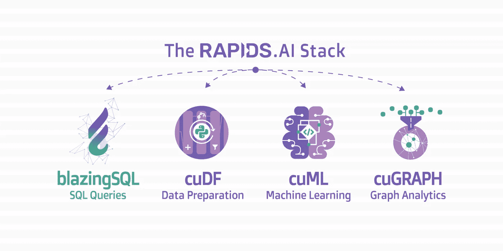
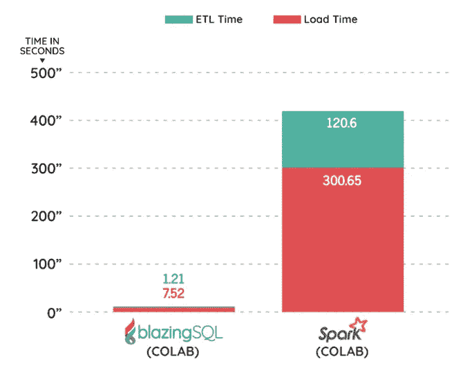

# 5 分钟 BlazingSQL 简介

> 原文：<https://towardsdatascience.com/intro-to-blazingsql-in-5-minutes-172162d3a95?source=collection_archive---------17----------------------->

## 在几秒钟内在 GPU 上更快地查询您的数据

SQL 是数据世界中大量使用的基本工具。数据工程师、数据科学家、业务分析师使用 SQL 进行任何奇特的数据查询和操作。大多数行业正在接近这个有趣的转折点，每天产生的数据量是不可想象的。以更快的速度有效处理它们的需求成为一个挑战。BlazingSQL 前来救援的情况！

尼尔·马克·托马斯在 [Unsplash](https://unsplash.com?utm_source=medium&utm_medium=referral) 上拍摄的照片

## 什么是炽热的 SQL？

BlazingSQL 是一个 GPU 加速的 SQL 引擎，完全建立在 RAPIDS AI 之上。这是一个可扩展的非常直观的 SQL 接口，用于将大量数据集加载到 GPU 内存中。它是构建的分布式 SQL 引擎，可以无缝地工作，尤其是在 RAPIDS.ai 生态系统内部。下面是急流。人工智能堆栈:

图片来自罗德里戈的[文章](https://blog.blazingdb.com/blazingsql-is-now-open-source-b859d342ec20)

BlazingSQL 运行在 Dask 上，Dask 是另一个并行化工作流、功能等的开源工具。，跨多个内核/机器。Dask 可以将任务分配到多个 GPU 上，使其速度快如闪电。当您听到 SQL 时，您会认为它需要一个数据库来存储数据，但事实是——对于 BlazingSQL，不需要任何数据库。

## BlazingSQL 的诞生:

BlazingSQL 徽标

Felipe 和 Rodrigo Aramburu 是开发 BlazingSQL 的负责人。在为秘鲁财政部工作时，他们进行了大量的 SQL 操作，需要大约 30-40 个小时才能完成。他们看到了 GPU 的利用不足，并想到利用 GPU 的能力来执行 SQL 操作。花了 35 个小时的 SQL join 执行，用 GPU 只用了 30 秒，BlazingSQL 就这样诞生了。它于 2018 年首次发布，现在是 Apache 2.0 许可下的开源包。观看以下视频，了解有关 BlazingSQL 的更多信息:

## 安装:

GPU 是运行 BlazingSQL 的唯一最低要求。BlazingSQL 可以通过以下方式与 condo 一起安装:

作者创造的形象

## 用法:

使用 BlazingSQL 非常简单。如前所述，它使用 GPU 来执行更快的计算，因此建立在 RAPIDS 生态系统上。下面是如何将数据帧加载到 BlazingSQL 中，然后在其上执行所需操作的示例:

它还有其他几个重要的组件，可以用来增强 BlazingSQL 的使用并提高其灵活性和性能。

1.  内存管理:它有一个界面，可以用来跟踪内存消耗。你可以在这里找到更多信息。
2.  通信:BlazingSQL 有一个模块，允许使用 TCP 或 UCX 协议进行高性能的节点到节点通信。
3.  Interops: Interops 代表解释操作，这是一个强大的基于行的数据转换引擎。这里基于行的操作指的是以相同方式应用于所有行的任何转换，而与任何其他行无关。
4.  数据结构:BlazingSQL 使用自己的方式通过燃烧表处理数据。Blazing Table 是 cudf 表的包装器。更多细节可以在[这里](https://docs.blazingsql.com/engine/data_structures.html)找到。

## 比较:

Blazing SQL 的创始人已经写了几篇文章，展示了它与 Spark 等其他方法相比的速度。例如，从 Google Drive 加载 CSV 到 dataframes 的时间比 Apache Spark 快 71 倍。下面是从罗德里戈的[文章](https://blog.blazingdb.com/blazingsql-100x-faster-than-apache-spark-on-google-colab-17a97642605)中截取的速度对比截图:

图片来自 Rodrigo 关于速度比较的文章

## 优势:

*   可用于不同的格式:Blazing SQL 的伟大之处在于它兼容多种数据格式，并且速度惊人。它们是:

1.  战斗支援车
2.  阿帕奇拼花地板
3.  GDF — GPU 数据框架
4.  熊猫
5.  JSON

*   与各种文件系统一起使用:BlazingSQL 不仅限于在本地集群上工作。它可以用于在亚马逊 S3、谷歌存储或 Hadoop 等云平台上外部查询数据。
*   如果您的 groupby 函数需要花费很长时间，那么尝试使用 BlazingSQL 在创纪录的时间内完成这些情况。在大型数据集上需要几小时或几天的查询可以在几秒钟内完成。
*   我觉得最大的优势是，即使你的笔记本电脑/系统上有一个小的 GPU，你也可以利用它来执行复杂的 SQL 查询。

## 局限性:

尽管我想到了一些限制:

*   在处理较小的数据集时没有帮助。
*   总是需要 GPU 来运行查询。
*   Spark 已经相当成熟，可能很难很快被取代。Spark 可以处理 HDFS、HBase、Cassandra、Hive 和任何 Hadoop InputFormat 中的数据，而 BlazingSQL 还不能处理这些数据。

## 结论:

BlazingSQL 是人工智能领域的游戏规则改变者。随着时间的推移，我确实相信它将取代许多其他工具，成为许多组织的工作马。感谢你抽出时间阅读这篇文章。

> 在[推特](https://twitter.com/pratikkgandhi)或 [LinkedIn](https://www.linkedin.com/in/pratikkgandhi/) 上关注我。你也可以通过 pratikkgandhi@gmail.com 联系我

*想成为* [*中等会员*](https://pratikkgandhi.medium.com/membership) *享受无限制阅读文章的乐趣，请注册成为会员。Medium 将与我分享一部分给使用以上链接注册的成员！谢了。*