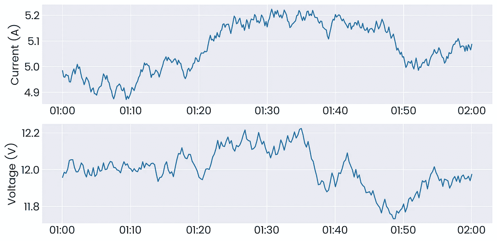
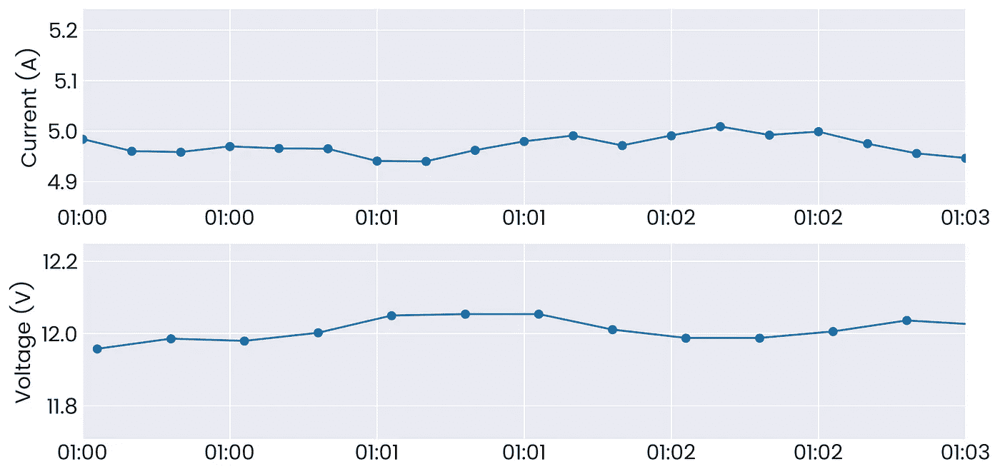
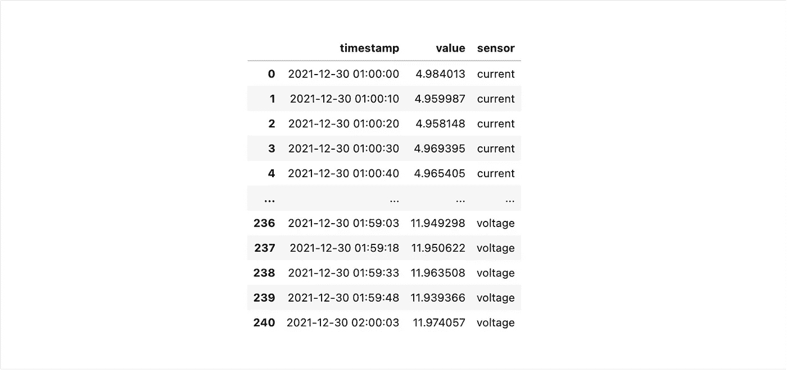
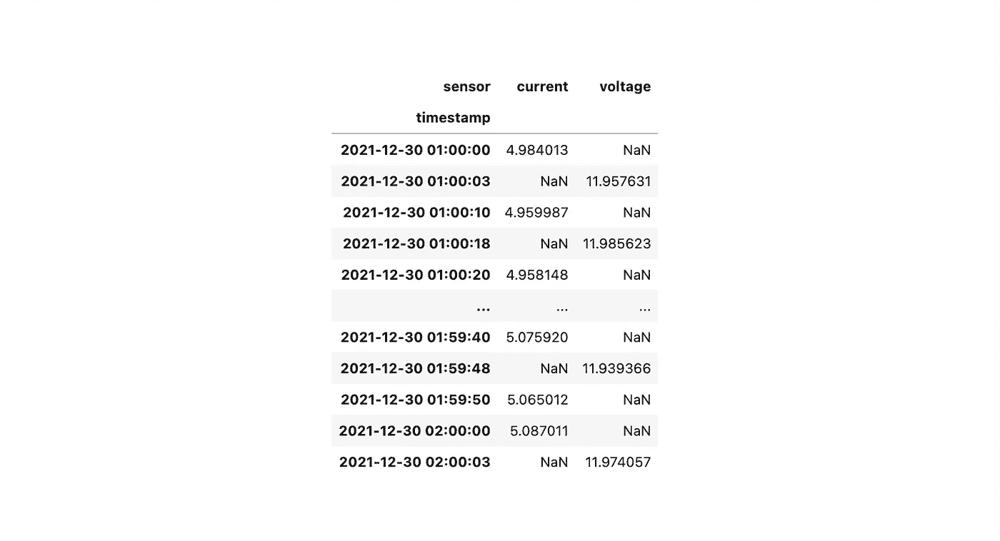
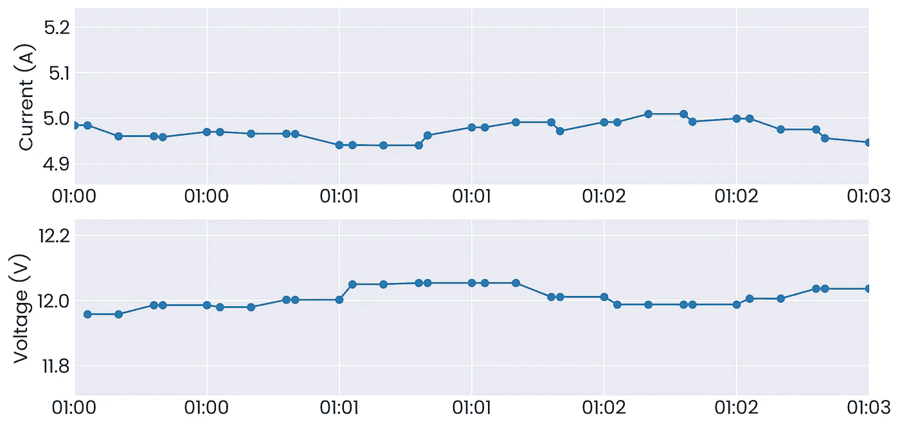
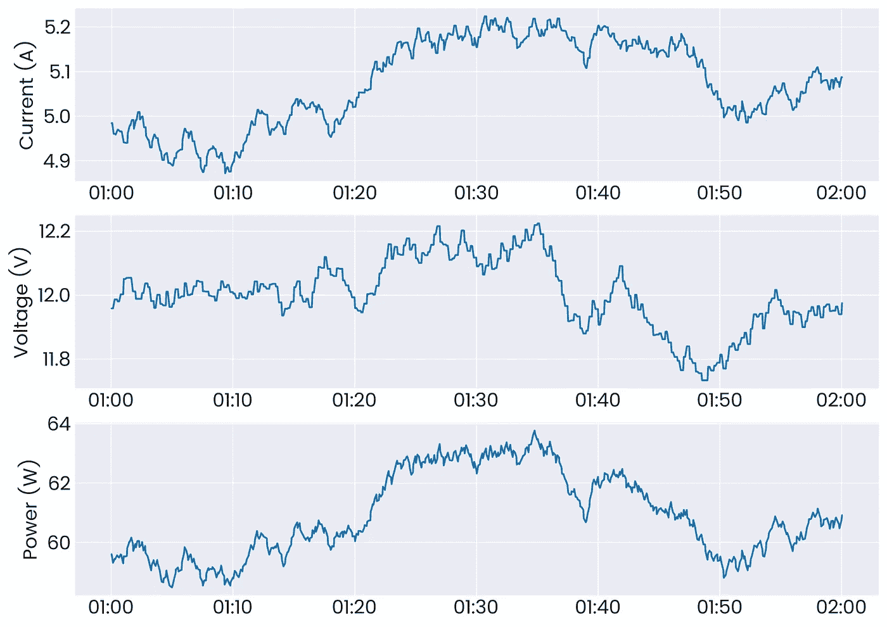
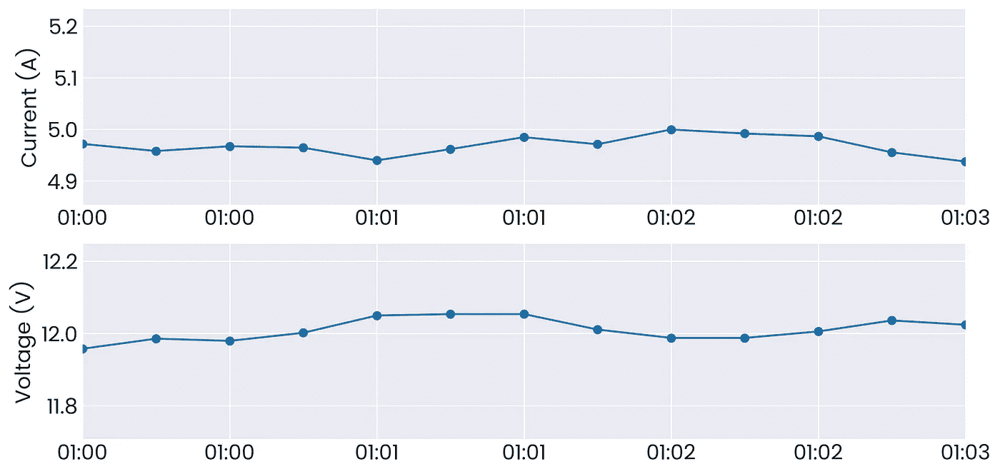
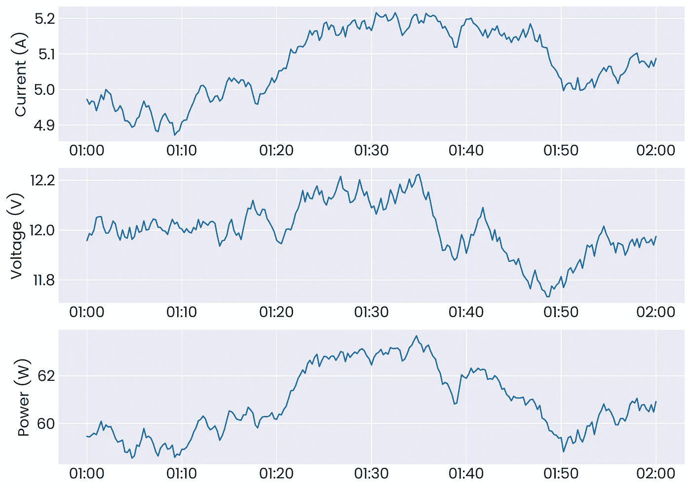

# 介绍如何比较和分析多个间隔不均匀的时间序列信号

> 原文：<https://towardsdatascience.com/intro-to-comparing-and-analyzing-multiple-unevenly-spaced-time-series-signals-e46b2347972a?source=collection_archive---------8----------------------->

## 分析多个时间序列信号的方法，这些信号发生在同一时间段，但具有不同的时间戳和时间间隔


照片由[内森·杜姆劳](https://unsplash.com/@nate_dumlao?utm_source=medium&utm_medium=referral)在 [Unsplash](https://unsplash.com?utm_source=medium&utm_medium=referral) 上拍摄

假设我们有以下场景——我们有两个不同的传感器测量电池组上的电流和电压。现在，我们想对这些信号进行一些基本分析，即查看一段时间内的功耗(等于电流乘以电压)，然后对该信号进行数值积分，以计算给定时间内经过的能量。然而，当您打开数据时，您会注意到尽管时间窗口相同，但数据点的各个时间戳并不匹配—我们现在该怎么办？

让我们从模拟这个场景开始。我们将为电流和电压创建两个时间序列数据集，电流在一小时内每 10 秒收集一次，电压在一小时内每 15 秒收集一次。更复杂的是，我们将为所有电压数据增加一个 3 秒的偏移。我们可以使用名为`date_range()`的内置`pandas`函数来创建时间范围，该函数接受开始时间、结束时间和频率。要添加常数时间偏移，我们可以使用`pd.Timedelta()`。最后，为了在我们的电流和电压测量中引入一些噪声，我们将使用`np.random.random()`通过`numpy`从-0.05 至 0.05(电流)或-0.1 至 0.1(电压)之间的均匀分布中进行采样。

```
**# Package Imports** import pandas as pd
import numpy as np
import matplotlib.pyplot as plt**# Current Data** np.random.seed(11)
t_current = pd.date_range("01:00:00", "02:00:00", freq="10s")
noise = 0.05 * (np.random.random(len(t_current)) - 0.5)
current = 5 + noise.cumsum()**# Voltage Data** np.random.seed(7)
t_voltage = pd.date_range("01:00:00", "02:00:00", freq="10s") + pd.Timedelta("3s")
noise = 0.05 * (np.random.random(len(t_voltage)) - 0.5)
voltage = 12 + noise.cumsum()
```

现在，让我们将这些数据集转换成`pandas`数据帧，并绘制出我们的两个信号:

```
**# Make current and voltage dataframes** df_current = pd.DataFrame({"timestamp": t_current, "current": current})
df_voltage = pd.DataFrame({"timestamp": t_voltage, "voltage": voltage})**# Plot two signals** plt.style.use("seaborn-darkgrid")
plt.rcParams["font.family"] = "Poppins"
plt.rcParams["font.size"] = 16**# Create subplots and plot** fig, (ax1, ax2) = plt.subplots(nrows=2, ncols=1, figsize=(12, 6))
ax1.plot(df_current["timestamp"], df_current["current"])
ax2.plot(df_voltage["timestamp"], df_voltage["voltage"])**# Edit x-tick time format** ax1.xaxis.set_major_formatter(mdates.DateFormatter("%H:%M"))
ax2.xaxis.set_major_formatter(mdates.DateFormatter("%H:%M"))**# Add axis labels** ax1.set(ylabel="Current (A)")
ax2.set(ylabel="Voltage (V)")
plt.show()
```



原始电流和电压数据

现在，如果我们放大一小部分图，并在实际时间戳所在的线上添加标记，我们会注意到当我们试图将这两个信号相乘时会出现的问题:

```
**# Create subplots and plot** fig, (ax1, ax2) = plt.subplots(nrows=2, ncols=1, figsize=(12, 6))
ax1.plot(df_current["timestamp"], df_current["current"])
ax2.plot(df_voltage["timestamp"], df_voltage["voltage"])**# Edit x-tick time format** ax1.xaxis.set_major_formatter(mdates.DateFormatter("%H:%M"))
ax2.xaxis.set_major_formatter(mdates.DateFormatter("%H:%M"))**# Add axis labels** ax1.set(ylabel="Current (A)", xlim=[pd.Timestamp("01:00:00"), pd.Timestamp("01:03:00")])
ax2.set(ylabel="Voltage (V)", xlim=[pd.Timestamp("01:00:00"), pd.Timestamp("01:03:00")])
plt.show()
```



原始数据的放大视图

两个信号之间的时间戳都不一致，那么我们如何将它们相乘呢？我们现在来看两种不同的策略来处理这个问题——填充值和重采样。

首先，让我们结合电流和电压数据帧。为此，我们将添加一个描述测量值的列`sensor`和一个包含传感器值的`value`列。这样，我们在两个数据帧之间就有了一致的模式，并且可以通过追加来轻松地组合它们。

```
**# Update dataframe schemas** df_current["sensor"] = "current"
df_current = df_current.rename(columns={"current": "value"})df_voltage["sensor"] = "voltage"
df_voltage = df_voltage.rename(columns={"voltage": "value"})**# Combine dataframes** df_sensor = df_current.append(df_voltage)
```



组合电流和电压数据框架

# 创建数据透视表

我们应该做的第一件事是透视我们新的组合数据框架— *即*我们希望我们的新列是`sensor`列的唯一值和它们相应的值。这将允许我们并排查看两个传感器的测量值。我们使用`df_sensor.pivot()`来实现这一点，它接受以下参数:

`index` —用作数据透视表索引的列

`columns` —我们将从中获取唯一值来创建新列的列

`values` —我们新栏目的价值

```
**# Pivot the dataframe** df_sensor_pivot = df_sensor.pivot(index="timestamp", columns="sensor", values="value")
```



传感器上带枢轴的数据框

这里我们可以直接看到我们的问题，没有来自两个传感器的值重叠的行——或者`current`或者`voltage`为空。我们将从填充值的策略开始。

# 向前或向后填充

我们可以做的最简单的事情就是简单地用它前面的值填充所有的空值——我们可以向前(`ffill()`)或向后(`bfill()`)这样做。一般来说，我们希望向前填充，因为向后填充是使用未来的信息来创建过去的数据。这种填充过程的结果是产生一个阶梯状信号，因为我们保持传感器值不变，直到它下一次改变。我们按如下方式进行，并绘制数据:

```
**# Forward fill data** df_sensor_pivot = df_sensor_pivot.ffill()**# Create subplots and plot** fig, (ax1, ax2) = plt.subplots(nrows=2, ncols=1, figsize=(12, 6))
ax1.plot(df_sensor_pivot["current"], marker="o")
ax2.plot(df_sensor_pivot["voltage"], marker="o")**# Edit x-tick time format** ax1.xaxis.set_major_formatter(mdates.DateFormatter("%H:%M"))
ax2.xaxis.set_major_formatter(mdates.DateFormatter("%H:%M"))**# Add axis labels** ax1.set(ylabel="Current (A)", xlim=[pd.Timestamp("01:00:00"), pd.Timestamp("01:03:00")])
ax2.set(ylabel="Voltage (V)", xlim=[pd.Timestamp("01:00:00"), pd.Timestamp("01:03:00")])
plt.show()
```



正向填充时的电流和电压数据

我们看到应用正向填充如何产生突变的阶跃信号，特别是对于测量频率较低的电压。然而，我们仍然可以将这些值相乘来得到功率，因为我们现在有重叠的时间戳:

```
**# Calculate Power** df_sensor_pivot["power"] = df_sensor_pivot["current"] * df_sensor_pivot["voltage"]**# Create subplots and plot** fig, (ax1, ax2, ax3) = plt.subplots(nrows=3, ncols=1, figsize=(12, 9))
ax1.plot(df_sensor_pivot["current"])
ax2.plot(df_sensor_pivot["voltage"])
ax3.plot(df_sensor_pivot["power"])**# Edit x-tick time format** ax1.xaxis.set_major_formatter(mdates.DateFormatter("%H:%M"))
ax2.xaxis.set_major_formatter(mdates.DateFormatter("%H:%M"))
ax3.xaxis.set_major_formatter(mdates.DateFormatter("%H:%M"))**# Add axis labels** ax1.set(ylabel="Current (A)")
ax2.set(ylabel="Voltage (V)")
ax3.set(ylabel="Power (W)")
plt.show()
```



正向填充电流和电压信号以及计算功率

# 数据重采样

另一种选择是将数据完全重新采样到一个已知的时间间隔。然而，为了使其有效；我们希望对较低频率的数据进行重新采样，在本例中为 15 秒。我们现在的问题是，由于电流是每 10 秒收集一次，因此我们将在每个 15 秒窗口内收集多个电流数据点。因此，我们需要使用一个聚合函数来处理这个问题。一种常用的方法是取落入每个时间窗口的所有值的平均值，因此我们将这样做(假设`df_sensor_pivot`处于我们之前进行的向前填充之前的状态)。为了重新采样，我们必须确保我们的 dataframe 中有一个索引列，它是一个 datetime 对象(我们在执行 pivot 操作时设置了`index`参数，从而做到了这一点)。

```
**# Resample our dataframe to 15 seconds** df_sensor_pivot = df_sensor_pivot.resample("15s").mean()**# Create subplots and plot** fig, (ax1, ax2) = plt.subplots(nrows=2, ncols=1, figsize=(12, 6))
ax1.plot(df_sensor_pivot["current"], marker="o")
ax2.plot(df_sensor_pivot["voltage"], marker="o")**# Edit x-tick time format** ax1.xaxis.set_major_formatter(mdates.DateFormatter("%H:%M"))
ax2.xaxis.set_major_formatter(mdates.DateFormatter("%H:%M"))**# Add axis labels** ax1.set(ylabel="Current (A)", xlim=[pd.Timestamp("01:00:00"), pd.Timestamp("01:03:00")])
ax2.set(ylabel="Voltage (V)", xlim=[pd.Timestamp("01:00:00"), pd.Timestamp("01:03:00")])
plt.show()
```



带重采样的电流和电压数据

现在，我们可以看到，通过重新采样，电流和电压信号中的点间隔均匀。现在，我们可以用与正向填充示例类似的方式来计算功率。



重新采样的电流和电压信号以及计算的功率

我们从两种方法中得到了相似的结果——现在，为了了解两种结果之间的差异，让我们来计算总能量，即功率的时间积分。我们将使用梯形积分，因此我们首先取连续值的平均值，乘以它们之间的时间间隔，然后将它们全部求和。

```
**# Reset index to get timestamp column** df_sensor_pivot = df_sensor_pivot.reset_index()**# Get average of consecutive values** df_sensor_pivot["midpoint"] = (df_sensor_pivot["power"] + df_sensor_pivot["power"].shift()) / 2**# Get the time difference between rows** df_sensor_pivot["time_diff"] = (df_sensor_pivot["timestamp"] - df_sensor_pivot["timestamp"].shift()).apply(lambda t: t.total_seconds())**# Calculate the area of the trapezoid** df_sensor_pivot["energy_kJ"] = df_sensor_pivot["midpoint"] * df_sensor_pivot["time_diff"] / 1000**# Get total energy** df_sensor_pivot["energy_kJ"].sum().round(3)
```

我们为这两个方法获取以下值:

**正向填充:**219.233 kJ
重采样: 219.229 kJ

误差仅为 0.004 kJ，因此在这种情况下，两种方法都能产生可接受的结果。一般来说，正向填充将导致更大的积分值，因为它保持相同的值，直到重新采样和聚集(在这种情况下)导致窗口中信号的平均值发生变化。如果足够频繁地获取数据点，这两种方法都应该工作得很好，并允许您处理来自多个不匹配的源的时间序列数据。

# 结论

感谢阅读这篇教程，学习如何在信号空间不均匀和不匹配的情况下进行时间序列分析。在这个 [Github 资源库](https://github.com/venkatesannaveen/python-science-tutorial)中可以找到一个笔记本，上面有本文中的例子。

感谢您的阅读！我感谢任何反馈，你可以在 [Twitter](https://twitter.com/naveenv_92) 上找到我，并在 [LinkedIn](https://www.linkedin.com/in/naveenvenkatesan/) 上与我联系，以获取更多更新和文章。