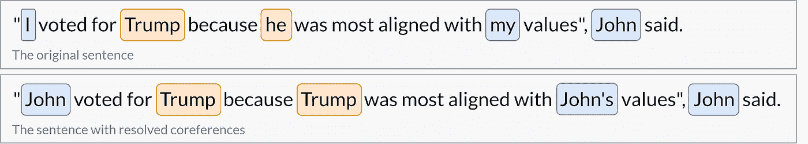
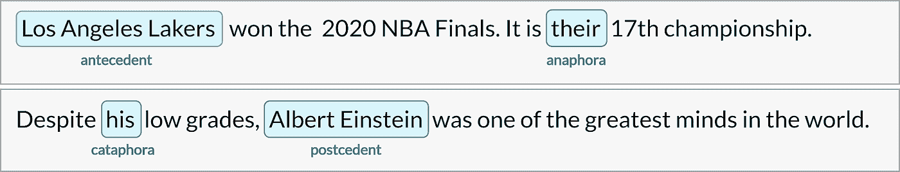
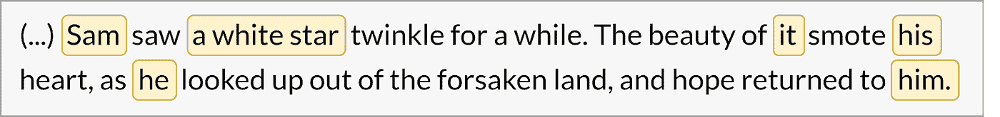
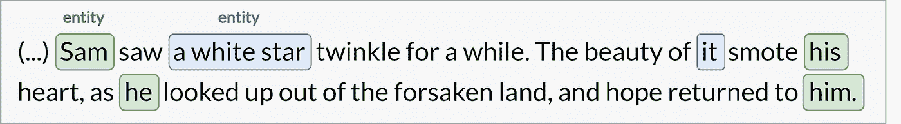

# 自然语言处理中共指消解简介

> 原文：<https://towardsdatascience.com/intro-to-coreference-resolution-in-nlp-19788a75adee?source=collection_archive---------10----------------------->

## 共指消解如何在不需要额外上下文的情况下获得大量信息。

*作者*[*pawemielniczuk*](https://medium.com/@p.mielniczuk)*和*[*Marta malankowska*](https://medium.com/@m.maslankowska)*。*

照片由 [Richa Sharma](https://unsplash.com/photos/u8m5JYqW0Zg) 拍摄

# 介绍

自然语言处理(NLP)是指人类和机器之间的交流。NLP 是人工智能中最具挑战性的分支之一，这主要是因为我们的人类语言充满了计算机难以学习的例外和歧义。让他们更容易理解的一个方法是去掉任何需要上下文才能清楚理解的不精确的表达。一个很好的例子是代词(如 it，he，her)，可以用它们所指的特定名词来替换。

但是现实世界的应用呢？

在为 LMS 平台开发问答系统的时候，我们遇到了几个问题。尤其是句子嵌入——文本的向量表示。有时一个句子会由许多代词组成。当没有提供足够的上下文时，这样的嵌入通常不能正确地反映原始句子。为了获得更丰富的嵌入，我们在管道中应用了共指解析。

# 什么是共指消解？

共指消解(CR)的任务是在一个给定的文本中找到所有语言表达式(称为提及),这些表达式指的是同一个现实世界的实体。在找到并分组这些提及之后，我们可以通过用名词短语替换代词来解决它们，如上所述。

共指消解是一个非常通用的工具，可以应用于各种 NLP 任务，如文本理解、信息抽取、机器翻译、情感分析或文档摘要。这是获得计算机更容易理解的明确句子的好方法。

# 共指与回指消解

应该注意的是，我们将共指消解称为寻找和解析文本中的引用的一般问题。然而，从技术上讲，有几种提法，它们的定义是有争议的。

与共指消解(CR)最不同的一种情况是回指消解(AR)。当一个术语指代另一个术语并决定第二个术语的一种解释时，回指关系就出现在语篇中。在下面的例子中，我们看到(1)和(2)直接指的是不同的现实世界的实体，但是它们在相同的上下文中使用，我们对(2)的解释依赖于(1)。这些提及并不共指，而是回指关系。

尽管回指消解不同于共指消解，但在大多数情况下，两者是等同的。还有更多这种差异的例子和各种其他类型的参考。然而，责任范围最广，涵盖绝大多数情况。为了简化这个主题，从现在开始，我们假设术语之间的所有类型的关系都是共指的。

# 不同类型的参考

即使我们假设可以把各种指称当作共指，术语之间仍然有许多不同形式的关系值得注意。这是因为每种类型都可以区别对待，大多数经典的自然语言处理算法都是针对特定类型的引用而设计的。[ [1](https://arxiv.org/abs/1805.11824)

## 回指和下指

这些是我们话题的主要内容。主要区别是，回指出现在句子中它所指的词之后，下指出现在它之前。出现在回指之前的词叫做先行词，出现在下指之后的词叫做后置词。

## 分裂前因

这是一种回指表达，代词(2)指代不止一个先行词(1)。

## 指代名词短语

这也是一个照应的例子，其中第二个名词短语(2)是对一个表达式(1)的早期描述形式的引用。

## 预设/约束变量

一些人争论预设是否可以归类为共指(或任何其他“指称”)消解类型。这是因为代词(2)并不完全是指称的——在某种意义上，我们不能用量化的表达式(1)来代替它。然而，代词毕竟是一个受先行词[ [3](https://web.stanford.edu/class/archive/cs/cs224n/cs224n.1162/handouts/cs224n-lecture10-coreference.pdf) ]约束的变量。

## 误导的代词指代

也有某些情况会产生误导。当代词和文本中的其他词之间没有关系时，代词仍然存在。在创建 CR 算法时，我们需要特别注意这些类型的引用，因此了解我们在什么情况下会接触到它们是很好的。

## 使分开

分裂句被认为是一个复杂的表达，有一个更简单，更少欺骗性的替代。在这种情况下，代词“It”是多余的，我们可以很容易地找到一个意思相同但没有使用代词的句子。

## 冗长的“它”

这种提法在英语中很常见，所以需要强调。代词“it”不指任何其他术语，但它在句子中是必要的，以便组成一个语法表达式。

# 通过示例解决共指的步骤

最好是将一个想法形象化，并提供一个具体的例子，而不是仅仅对一个主题进行理论化。此外，我们将尝试解释并给出最常见术语的具体示例，这些术语与我们在文章和论文中可能遇到的共指消解相关。

应用共指消解的第一步是决定我们是希望使用单个单词/标记还是范围。

但是到底什么是跨度呢？最常见的情况是，我们想要交换的不是一个单词，而是多个相邻的标记。因此跨度是一个整体表达。你可能遇到的另一个名字是提词。它们经常互换使用。

在大多数现有技术解决方案中，只考虑跨度。之所以如此，是因为跨度在其中携带了更多的信息，而单个标记本身可能无法传达任何特定的细节。

步骤 1 —确定潜在跨度

下一步是以某种方式将跨度组合成组。

正如我们从 J.R.R .托尔金的名言中看到的，有几个潜在的跨度可以组合在一起。这里我们有像“Sam”或“his”这样的跨度，其中只有一个标记，但我们也看到跨度“一颗白星”由三个连续的单词组成。

组合项目被称为聚类或分组。顾名思义，这是一种将任意对象组合成簇/组的方法，在这些簇/组中，这些项目共享一个共同的主题。从自然语言处理中的单词，到网飞的电影分类，再到基于营养价值的食物分类。

有许多方法可以分组，但重要的是同一组中的事物应该具有相似的属性，并尽可能与其他组不同。

步骤 2 —组跨度

这里，我们正在寻找的“属性”是指同一个现实世界实体的跨度。

产生的组有[Sam，his，he，him]以及[a white star，it]。请注意，“山姆”和“一颗白星”被标记为实体。这是消解共指的关键一步。我们不仅需要识别相似的跨度，还需要确定它们中的哪一个是现实世界中的实体。

现实世界的实体没有单一的定义，但我们将简单地将其定义为一个任意的对象，不需要任何额外的上下文来阐明它是什么，在我们的示例中:“Sam*”*，或“一颗白星”。另一方面，“他的”或“他”不是真实世界的实体，因为它们必须伴随着额外的背景信息。

第三步——用真实世界的实体替换代词

正如我们所看到的，[his，he，him]和[it]已经被替换为现实世界的实体，分别来自相应的组——“Sam”和“a white star”。结果，我们获得了一个没有任何代词的文本，同时在语法和语义上仍然有效。

# 摘要

共指消解的目的是找到、分组任何不明确的表达式，然后用它们所指的真实世界的实体替换它们。

我们已经讨论了共指和回指解析之间的区别，并展示和解释了一些与它们相关的常见问题。我们还设法通过一个例子介绍了 CR 的典型过程。

通过这样做，句子变得独立，计算机不需要额外的上下文来理解它们的意思。我们并不总是拥有定义良好的实体，但通常情况下，共指消解会带来信息增益。

这只是关于共指消解和自然语言处理系列的第一篇文章。在下一篇文章中，我们将展示我们已经测试过并最终决定在我们的系统中实现的最大深度学习解决方案的利弊。

*更多类似的文章请看一下* [*神经系统博客*](https://neurosys.com/blog/category/rd/#blog-posts-blog-list) *。*

第 2 部分- [最流行的共指消解框架](/most-popular-coreference-resolution-frameworks-574ba8a8cc2d)

# 参考

[1]: [Rhea Sukthanker，Soujanya 茯苓，Erik Cambria，ram Kumar Thirunavukarasu(2020 年 7 月)*回指和共指消解:综述*](https://arxiv.org/abs/1805.11824)

[2]: [沙丽德·洛艾西加，莲恩·吉尤，克里斯蒂安·哈德迈尔(2017 年 9 月)*是什么？消除代词“it”的不同读法的歧义*](https://www.aclweb.org/anthology/D17-1137/)

[3]: [克里斯托弗·曼宁的斯坦福讲座(cs 224n)(2019)](https://web.stanford.edu/class/archive/cs/cs224n/cs224n.1162/handouts/cs224n-lecture10-coreference.pdf)