# 数据结构介绍

> 原文：<https://towardsdatascience.com/intro-to-data-structures-2615eadc343d?source=collection_archive---------5----------------------->

## [实践教程](https://towardsdatascience.com/tagged/hands-on-tutorials)

## 优化您的代码，并拆除 FAANG 采访

由[乔尔·菲利普](https://unsplash.com/@joelfilip?utm_source=medium&utm_medium=referral)在 [Unsplash](https://unsplash.com?utm_source=medium&utm_medium=referral) 上拍摄的照片

想象一下，你开发了一个非常受欢迎的应用程序，它的用户数量正在迅速增长到一百万。(恭喜！)虽然用户喜欢这款应用，但他们抱怨这款应用变得越来越慢，以至于一些用户开始离开。您会注意到，主要的瓶颈是如何在身份验证期间检索用户信息:目前，您的应用程序搜索一个未排序的 Python 字典列表，直到找到请求的用户 ID。

诅咒你凌晨 3 点写的代码，你想知道如何解决这个问题。我们如何以一种让我们尽可能快地检索任何 ID 的方式存储用户 ID？对列表进行排序可能会有所帮助，但如果我们每次都从头开始搜索，拥有高编号 id 的新客户将需要数十万个步骤来进行身份验证。我们可以从列表的后面开始搜索，但是从一开始就和我们在一起的客户会受到惩罚。

你会意识到，一个更好的方法是将用户数据安排在一个**二叉查找树中，这将允许我们平均在一个少得可怜的*二十步*中找到我们一百万个 id 中的任何一个。实际上，这种数据结构的一个版本[是数据库索引记录的一种方式，以便进行闪电般的检索。悄悄地将用户信息迁移到数据库，你的应用程序的延迟下降，每个人都很高兴，你发誓永远不会告诉任何人你最初是如何存储数据的。](https://en.wikipedia.org/wiki/B-tree)**

**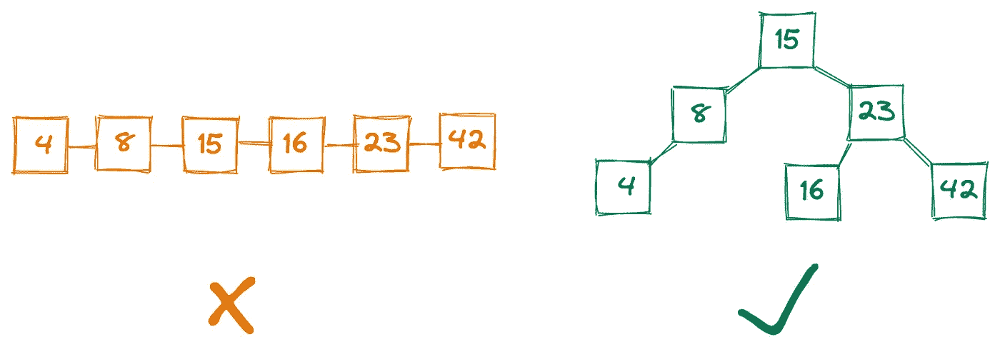**

**作者图片**

**这个例子强调了重要的一点:**我们的程序使用的数据结构可以决定我们的代码是否会随着数据量的增长而伸缩，或者我们是否需要每六个月重写一次。**从快速找到位置之间的最短路径，到始终为不断变化的列表中的最高优先级项目提供服务，到即时安全地确认输入的密码是否正确，选择正确的数据结构对于可伸缩代码至关重要。**

**在本帖中，我们将介绍一些常见的数据结构，讨论它们的优缺点以及何时使用它们。(例如，二叉查找树对于索引数据库非常有用，但是对于生成密码散列却很糟糕。)我们将用 Python 实现这些结构，然后用 [Leetcode](https://leetcode.com/) 问题演示一些用例。**

**即使您的日常工作从未涉及到低到担心内存管理的语言，您也将了解 R 和 Python 如何在幕后存储您的数据。更直白地说，这篇文章会给你 [FAANG](https://en.wikipedia.org/wiki/Big_Tech#FAANG) tech 面试的编码部分的基础知识，如果你感兴趣的话！**

# **目录**

*   **入门指南**
*   **数组**
*   **链接列表**
*   **树**
*   **图表**
*   **哈希表**

# **入门指南**

**在我们开始使用任何数据结构之前，我们需要理解数据结构到底是什么，以及如何比较它们。我们将从区分工具(数据结构)和它们更广泛的用途([抽象数据类型](https://en.wikipedia.org/wiki/Abstract_data_type))开始，然后讨论[大 O 符号](https://en.wikipedia.org/wiki/Big_O_notation)，这是一种比较数据结构操作速度的度量。然后，我们将快速浏览数据结构存储的基本数据类型。**

**最后，我们会定期重申**没有“完美”的数据结构**。*数据结构的效用完全取决于它的使用方式。*因此，理解你的程序的需求以确定合适的工作工具是很重要的。**

# **数据结构与抽象数据类型**

**无论是在编程中，还是在现实生活中！—完成一项任务通常有多种方式。比方说，你想在你的后院挖一个洞。你可以随意使用干草叉、锤子、锯子和铲子。每一个都可以被认为是一个“数据结构”,因为它们是完成你的任务的特定手段。**

**但是如果你把任务从你如何完成任务的*中分离出来，你可以看到这些特定的工具正在扮演“挖掘工具”的角色这个“挖掘工具”就是你的**抽象数据类型:**一种挖掘的手段。*你实际上如何挖掘*是数据结构。抽象数据类型是一个理论实体，而数据结构是该实体的一个*实现*。***

**这是另一个例子。假设你想去城市另一头拜访你的朋友。你可以自由支配你的自行车、汽车和双脚。这里的 *vehicle* 是抽象数据类型:一种交通工具。*你实际上如何旅行*是数据结构——你的自行车、汽车或脚。**

**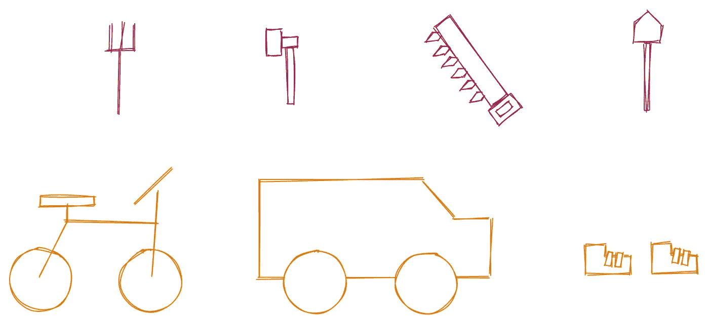**

**作者图片**

**这个区别很重要，因为**完成一项任务有多种方式，每种方式都有利弊，这取决于你的具体项目。**在挖洞的情况下，铲子无疑是赢家。但是对于穿越城镇，“正确的”数据结构取决于外部环境:汽车行驶最快，但需要道路，而我们的脚步很慢，但可以穿过高高的草地和楼梯。**

**数据结构是我们开发人员所关心的，因为它是我们用来完成任务的特定工具。但是我们的用户只关心抽象数据类型。你的朋友不在乎你怎么去他们家，只在乎你准时到达。**

**再举一个例子来说明这一点。想象你需要收拾一些干净的衣物。写时间*低而读时间*高的数据结构将会是地上的一堆衣服。添加到这个堆中非常快，但检索任何特定的项目都很慢，因为您必须在未排序的堆中搜索。****

**另一种方法是把你的衣服整齐地放在你的衣柜里。这种方法会有一个*高的写时间*但是*低的读时间*，因为它会花费更长的时间来放好你的衣服，但是你将能够更快地访问你搜索的任何物品。**

****

**作者图片**

**虽然这个例子听起来可能很傻，但它实际上与将数据转储到 [AWS S3](https://aws.amazon.com/s3/) 而不是数据库的策略相差不远，或者在某种程度上将其存储在[高度结构化的 SQL 而不是灵活的 NoSQL 数据库](/a-hands-on-demo-of-sql-vs-nosql-databases-in-python-eeb955bba4aa)中。梳妆台和壁橱并不一定是最好的方法——电子商务商店的交易日志可能写得比读得多，因此将原始输出保存到 S3 的“一堆衣服”方法实际上可以很好地工作。**

# **大 O 符号**

**虽然用铲子挖洞比用锤子容易是有道理的，但我们如何量化性能上的差异呢？挖掘所需的秒数是一个很好的度量，但是为了处理不同大小的洞，我们可能想要更接近每立方英尺*秒*。**

**然而，这仅仅让我们了解了一部分——我们如何解释不同大小的铲子，或者进行挖掘的人？一个用锤子的健美运动员比一个蹒跚学步的小孩用铲子挖一个洞要快，但这并不意味着锤子是更好的挖掘工具。**

**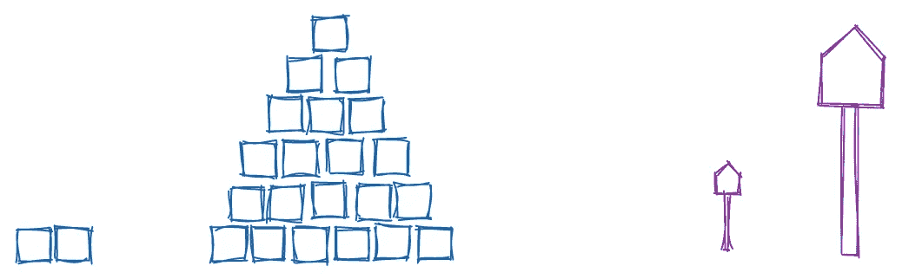**

**作者图片**

**用计算机术语来说，这两个考虑因素可以重新定义为 ***正在处理的数据量*** ，以及正在使用的 ***。*****

**为此，我们可以求助于 [**大 o 符号**](https://en.wikipedia.org/wiki/Big_O_notation) ，记为 O(⋅).大 O 是衡量“最坏情况”效率的指标，是完成一项任务需要多长时间(或者需要多少内存，我们在这里不讨论)的上限。例如，在未排序的列表中搜索一个元素是 O(n ),因为在最坏的情况下，您必须搜索整个列表。**

**这是另一个时间复杂度为 O(n)的运算的例子。打印 Python 列表中的每个元素需要更多的时间，这取决于列表中有多少元素。具体来说，*花费的时间线性增长*:如果元素数量加倍，显示所有元素的时间也会加倍。**

**如果我们打印数组中的每一对元素，同时，我们的复杂度变成 O(n)。4 个元素的数组需要 16 步，10 个元素的数组需要 100 步，依此类推。**

**O(n)算法并不好。理想情况下，我们想要一个在*常数*时间内工作的算法，或者 O(1)，其中运行时间与数据量无关。例如，不管数组的大小如何，打印一个数组的随机值总是要花相同的时间。**

**我们可以在 Jupyter 笔记本中用`%%timeit`命令量化这些函数的效率。下面，我们已经看到 O(n ) `print_pairs`的执行时间显著增加。我们还看到了 O(1) `print_idx`的强大功能，它的执行时间在 0.153 ms 左右，不管数组的大小，也不管我们请求的是第一个还是最后一个元素。**

**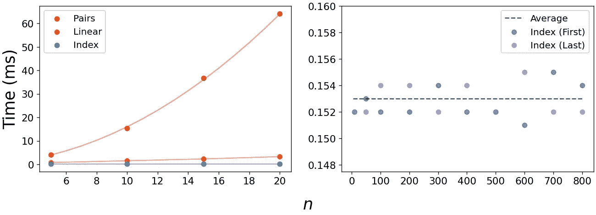**

**作者图片**

**我们可以使用如下图来比较各种效率的算法是如何扩展的。绿色区域是最理想的——它们是可伸缩性最好的运行时，增长速度远远低于数据量。灰色很好，如果可以的话，避免橙色，尽可能避免红色区域。**

**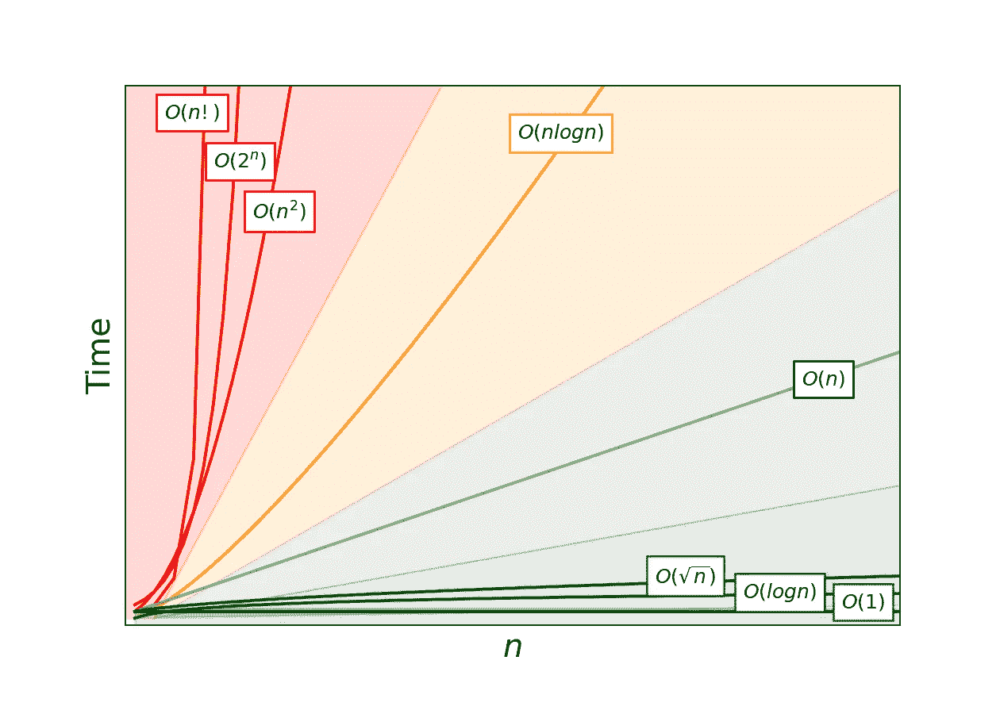**

**作者图片**

**哪些问题可能需要红区中的算法？对于那些你需要知道问题的每一个可能答案的问题，红区算法通常是必要的。o(2ⁿ算法的一个例子是寻找一个数组的所有 [**子集**](https://en.wikipedia.org/wiki/Subset) 。集合中的每个元素可以 1)包含在子集中，也可以 2)排除在子集中。因此，像`[A,B,C,D]`这样的四个元素的集合将具有 2⁴，或者 16 个子集:**

*   **`[]`、`[A]`、`[B]`、`[C]`、`[D]`**
*   **`[A,B]`、`[A,C]`、`[A,D]`、`[B,C]`、`[B,D]`、`[C,D]`**
*   **`[A,B,C]`、`[A,B,D]`、`[A,C,D]`、`[B,C,D]`**
*   **`[A,B,C,D]`**

**但是更糟糕的运行时是 O(n！). [**排列**](https://en.wikipedia.org/wiki/Permutation) 是 n 阶乘复杂性的经典例子。为了找到`[A, B, C, D]`的每一种可能的排列，我们从第一个位置的四个字母中的一个开始，然后从第二个位置的其余三个中的一个开始，以此类推。因此，将有 4 * 3 * 2 * 1 或 24 种排列:**

*   **`[A,B,C,D]`、`[A,B,D,C]`、`[A,C,B,D]`、`[A,C,D,B]`、`[A,D,B,C]`、`[A,D,C,B]`**
*   **`[B,A,C,D]`、`[B,A,D,C]`、`[B,C,A,D]`、`[B,C,D,A]`、`[B,D,C,A]`、`[B,D,A,C]`**
*   **`[C,A,B,D]`、`[C,A,D,B]`、`[C,B,A,D]`、`[C,B,D,A]`、`[C,D,B,A]`、`[C,D,A,B]`**
*   **`[D,A,B,C]`、`[D,A,C,B]`、`[D,B,A,C]`、`[D,B,C,A]`、`[D,C,A,B]`、`[D,C,B,A]`**

**这些问题的运行时间以惊人的速度增长。10 个元素的阵列具有 1，024 个子集和 3，628，800 个排列。20 个元素的数组有 1，048，576 个子集和 2，432，902，008，176，640，000 种排列！**

**如果你的任务是找出一个输入数组的所有子集或排列，这就很难避免 O(2ⁿ)或 O(n！)运行时。但是，如果您不止一次地运行这个操作，并不是所有的希望都落空了——您可以使用一些架构技巧来减轻负担。[1]**

# **数据类型**

**最后，我们应该简单提一下基本的*数据类型*。如果数据结构是数据的集合，那么在我们的结构中可以有哪些类型的数据？有一些跨编程语言通用的数据类型:**

****整数**是整数，像`1`、`-5`、`256`。在 Python 之外的语言中，可以更具体地定义整数的类型，比如有符号的(`+` / `-`)或无符号的(只有`+`)，以及整数可以容纳的位数。**

****浮点数**是带小数位的数字，像`1.2`、`0.14`。在 Python 中，这包括用科学符号定义的数字，比如`1e5`。像 C 或 Java 这样的低级语言有一个相关的 *double* 类型，指的是小数位数以外的额外精度。**

****字符**是字母，像`a`、`b`、`c`。它们的集合是一个字符串(从技术上讲是一个字符数组)。数字和符号的字符串表示，如`5`或`?`，也是字符。**

****Void** 是 null，就像 Python 中的`None`一样。Voids 明确表示缺少*数据，这在初始化将被填充的数组时是一个有用的缺省值，或者是一个执行动作但不返回任何内容的函数(例如发送电子邮件)。***

**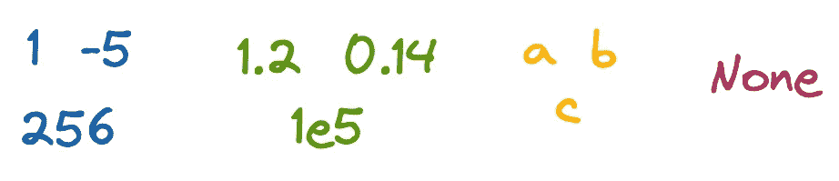**

**作者图片**

**有了抽象数据类型、大 O 符号和基础数据类型之后，让我们开始实际的数据结构吧！我们将首先讨论数组。**

****

**罗兰·罗斯林在 [Unsplash](https://unsplash.com?utm_source=medium&utm_medium=referral) 上的照片**

# **数组**

## **理论**

**数组是计算机科学中最基本的数据结构之一，它们内置于语言中，甚至是低级语言如 C 语言或汇编语言。一个**数组**是一组相同类型的元素，如`[5, 8, -1]`或`['a', 'b', 'c']`，位于*计算机内存*的一个连续片上。因为数组元素在物理上彼此相邻，所以我们可以在 O(1)时间内访问任何索引——比如第一个、第三个或最后一个元素。[2]**

****

**作者图片**

**像 C 和 Java 这样的语言要求预先指定数组的大小和数据类型。Python 的`list`结构能够通过将数据存储为指向内存中元素位置的[指针(它们不一定彼此相邻)，并在空间耗尽时自动调整数组大小，来规避这些要求。](https://docs.python.org/3/faq/design.html#how-are-lists-implemented-in-cpython)**

## **履行**

**我们可以用 Python 实现一个非常基本的`Array`类，它模仿了低级语言中数组的核心功能。主要限制包括:**

1.  **一旦我们为一个数组分配了空间，如果不创建一个新数组，我们就无法获得更多空间。**
2.  **数组中的所有值必须是同一类型。**

**我们现在可以和我们的`Array`班一起玩了。下面，我们创建一个实例，确认第一个索引中没有任何内容，用 char 填充那个槽，然后返回它。我们还确认我们的数组拒绝非字符值。这不是世界上最令人兴奋的代码，但它确实有效！**

## **例子**

**如果你遇到一个涉及数组的问题，你很可能会想使用 Python 的内置`list`或`numpy`数组，而不是我们的`Array`类。但是本着使用不改变大小的数组的精神，让我们来看看 Leetcode 问题 [**LC 1089:** 重复零](https://leetcode.com/problems/duplicate-zeros/)。这个问题的目标是复制一个数组中的所有零，就地修改它，以便元素向下游移动并弹出，而不是增加数组大小或创建一个新的数组。**

**在英语中，我们迭代遍历列表，直到找到一个零。然后我们插入另一个零并弹出最后一个元素来保持数组的大小。**

**这里一个重要的细节是使用一个`while`循环，而不是`for`，因为我们在遍历数组时会修改数组。对索引`i`更好的控制让我们跳过插入的零，以避免重复计算。**

****

**照片由 [Edge2Edge 媒体](https://unsplash.com/@edge2edgemedia?utm_source=medium&utm_medium=referral)在 [Unsplash](https://unsplash.com?utm_source=medium&utm_medium=referral) 上拍摄**

# **链接列表**

## **理论**

**链表是计算机科学中另一个关键的数据结构。像数组一样，链表是一组值。但是与数组不同，**链表中的值不一定是同一类型，我们也不需要提前指定列表大小。****

**链表的核心元素是一个**节点**，它包含 1)一些数据，以及 2)一个指向内存中某个位置的指针。确切地说，*内存中的任何*位置。下面是一个值为`[1, 'a', 0.3]`的链表——注意元素大小是如何不同的(四个字节用于整数和浮点，一个字节用于字符)，每个节点有一个四字节的指针，节点之间的距离不同，最后一个节点包含一个[空指针](https://en.wikipedia.org/wiki/Null_pointer)指向空间。**

**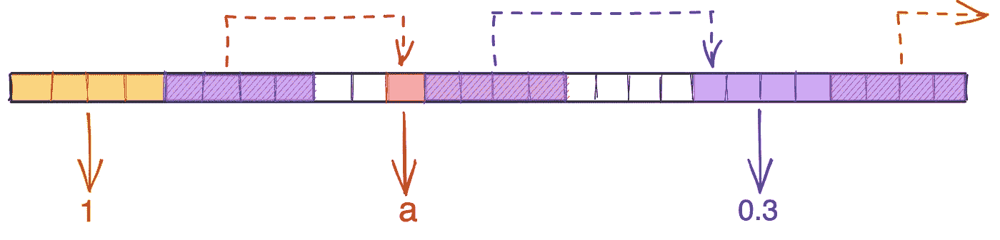**

**作者图片**

**对数据类型和列表长度没有限制使得链表很有吸引力，但是这种灵活性是有代价的。典型地，只有列表的头*被暴露给程序，这意味着我们必须遍历列表来找到任何其他节点。换句话说，对于除了第一个节点之外的任何元素，我们都失去了甜蜜的 O(1)检索。如果你请求第 100 个元素，需要 100 步才能到达:一个 O(n)模式。***

**我们可以通过[添加指向*前*节点的指针并暴露尾部](https://www.tutorialspoint.com/data_structures_algorithms/doubly_linked_list_algorithm.htm)，或者通过[使列表循环](https://www.tutorialspoint.com/data_structures_algorithms/circular_linked_list_algorithm.htm)，来使我们的链表更加通用。但是总的来说，选择链表而不是数组意味着要为灵活性付出代价。**

## **履行**

**为了在 Python 中创建一个链表，我们从定义节点开始。我们只需要两部分:节点保存的数据和指向列表中下一个节点的指针。我们还添加了一个`__repr__`方法，以便更容易看到节点包含的内容。**

**我们现在可以和我们的`ListNode`类一起玩了。请注意列表的头部是我们的变量`head`，以及我们如何迭代地追加`.next`来访问更深的节点，因为我们不能键入像`[1]`或`[2]`这样的索引来访问它们。**

**我们可以编写一些函数来使添加一个节点到末尾和开头变得更容易。我们会这样做:**

**在`add_to_end`中，我们创建了一个名为`ptr`(“指针”)的变量，它从`head`开始遍历列表，直到到达最后一个节点，它的`.next`属性是一个空指针。然后，我们简单地将该节点的`.next`值设置为新的`ListNode`。我们不需要返回任何东西来使我们的更改生效。**

**`add_to_front`更简单:我们创建一个新的头，然后设置它的`.next`指针指向我们现有链表的头。但是，我们需要用这个新节点手动更新函数外部的`head`，因为否则`head`仍然指向旧的头。**

## **例子**

**链表的一个常见问题是返回中间节点。因为我们通常只有列表的头部，所以我们没有办法提前知道列表有多长。乍一看，我们似乎需要遍历列表两次:一次是为了找出列表有多长，另一次是为了中途遍历。**

**但是实际上有一个聪明的方法可以一次找到中间。之前，我们使用指针一次遍历列表中的一个节点，直到到达末尾。但是如果我们有两个指针，一个一次移动一个节点，另外两个一次移动两个节点，会怎么样呢？当快速指针到达列表的末尾时，我们的慢速指针会在中间。**

**下面是我们如何回答 [**LC 876:** 链表中间](https://leetcode.com/problems/middle-of-the-linked-list/)。**

**每当我做 Leetcode 问题时，我喜欢画出例子，并确保我在做我认为我在做的事情。例如，很难记住我们应该将`fast`初始化为`head`还是`head.next`。如果你画出一个简单的清单，你知道中间应该是什么，你可以很快确认`head.next`是正确的选择。**

**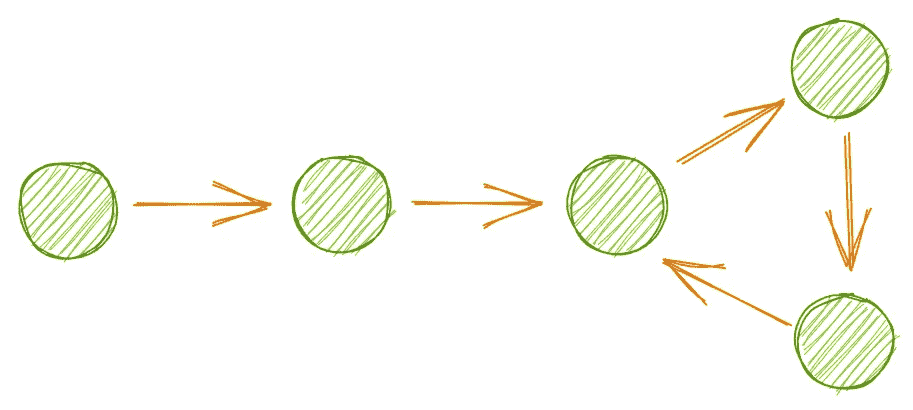**

**作者图片**

**[**LC 141:** 链表循环](https://leetcode.com/problems/linked-list-cycle/)是另一个使用快慢指针的例子。这里的想法是确定列表是否有循环，当一个节点的`next`指针指向列表中更早的节点时，就会发生循环。**

**遍历这个列表将永远继续，因为我们永远不会退出循环。第一种猜测可能是设置一些阈值，比如遍历运行了多长时间，或者在一段时间内我们看到了多少重复的模式，但是更简单的方法是再次使用两个指针。**

**我们不能再使用`while fast and fast.next`了，因为只有当我们到达列表的末尾时，它才计算为`False`。相反，我们将再次实例化第一个和第二个节点的`slow`和`fast`，然后以不同的速度在列表中移动它们，直到它们匹配。如果我们到达列表的末尾，我们返回`False`；如果两个指针指向同一个节点，我们返回`True`。**

****

**安妮·斯普拉特在 [Unsplash](https://unsplash.com?utm_source=medium&utm_medium=referral) 上的照片**

# **树**

## **理论**

**树扩展了链表的概念，允许节点有多个“下一个”节点。树节点可以有一个、两个或多个*子节点*，允许以灵活的分支模式表示数据。通过设置组织数据的规则，我们可以非常高效地存储和检索数据。**

**一种类型的树是二叉查找树树；在本文的开始，我们简要地提到了 BST 检索数据的效率。这种效率源于管理 BST 结构的两条重要规则:**

1.  **一个节点最多可以有两个子节点。**
2.  ***左子树*中的每个节点必须包含一个较小的值，而*右子树*中的每个节点必须包含一个较大的值。**

**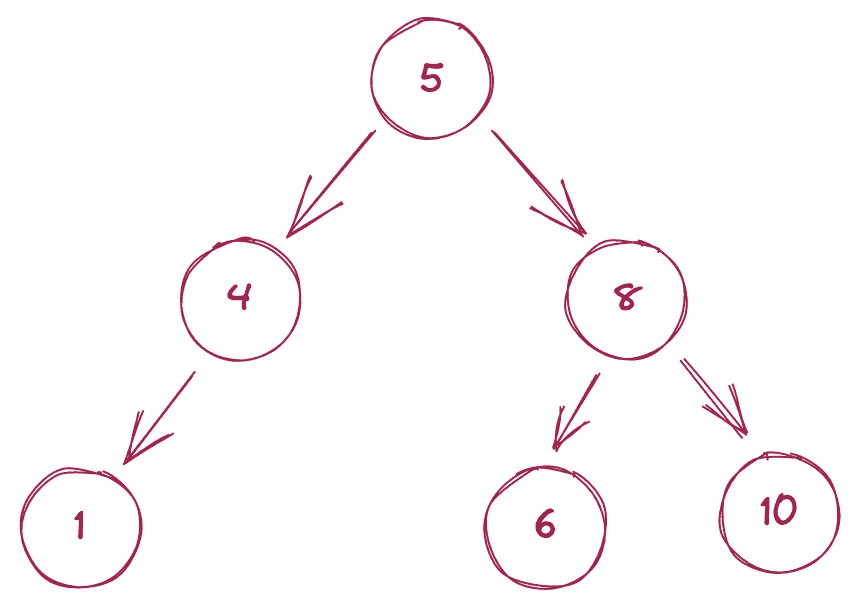**

**作者图片**

**在 BST 中搜索一个值最多需要 O(log n)时间[3]，这意味着我们可以在数百万甚至数十亿条记录中非常快速地找到一个请求的值。假设我们正在搜索值为`x`的节点。我们可以使用下面的算法在 BST 中快速找到这个节点。**

1.  **从树根开始。**
2.  **如果 x =节点值:停止。**
3.  **如果 x < the node value: go to the left child.**
4.  **If x >节点值:转到正确的子节点。**
5.  **转到步骤 2。**

**如果我们不确定请求的节点是否存在于树中，如果我们试图访问一个不存在的子节点，我们只需修改步骤 3 和 4 来停止搜索。**

## **履行**

**创建一个`TreeNode`几乎等同于创建一个`ListNode`。唯一的区别是，我们有了`left`和`right`属性，而不是一个`next`属性，它们指的是节点的左右子节点。(如果我们定义一个有两个以上孩子的树，我们可以将这些属性命名为`child1`、`child2`、`child3`等等。)**

**然后我们可以创建一个三层的树。注意，这个树只是一个二叉树，而不是 BST，因为值是不排序的。**

# **例子**

**涉及二叉树的问题通常集中在遍历节点的不同方式上。遍历通常从根节点开始，然后按照一组步骤处理每个节点及其子节点。*但是处理节点的顺序完全取决于我们处理父节点相对于子节点的顺序:*之前(**前序**)，在左右之间(**依序**)，或者之后(**后序**)。下面的每个遍历都从根节点开始，但是节点*被处理*的顺序完全不同。**

**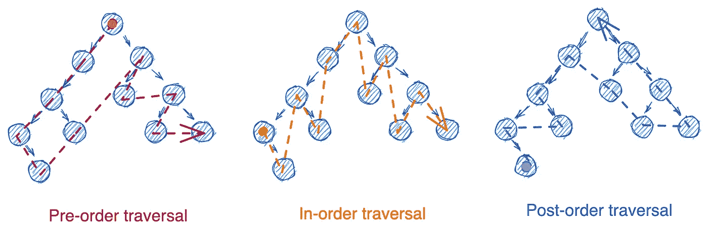**

**作者图片**

**这三种类型的遍历可以通过**迭代**(使用`while`循环和 [**堆栈**](https://en.wikipedia.org/wiki/Stack_(abstract_data_type)) )或 [**递归**](https://en.wikipedia.org/wiki/Recursion_(computer_science)) (使用调用自身的函数)来实现。还有第四种类型的遍历，**级别排序**，它利用了一个 [**队列**](https://en.wikipedia.org/wiki/Queue_(abstract_data_type)) 。在这篇文章中，我们不会讨论栈和队列，只是把它们想象成列表，你只能从末尾(栈)或开始(队列)删除它们。**

****

**作者图片**

**前三种遍历的模式几乎相同，所以我们只选择按顺序遍历。下面我们为 [**LC 94:** 二叉树顺序遍历](https://leetcode.com/problems/binary-tree-inorder-traversal/)编写迭代和递归方法，从迭代版本开始。**

**在英语中，我们执行以下步骤:**

1.  ****第 6–7 行:**为我们的答案实例化一个列表(`answer`)和一个堆栈(`stack`)，该堆栈包含我们的根节点的元组和表示我们还没有访问过这个节点的`False`。**
2.  ****第 9 行:**开始一个`while`循环，只要`stack`中有元素存在，就执行。**
3.  ****第 10–12 行:**用`.pop`移除堆栈的最后一个元素，然后检查`node`是否存在。(`node`对于没有子节点的节点，不会一直存在于以后的迭代中)。**
4.  ****第 14–15 行:**如果`node`存在，并且我们以前访问过这个节点，则将我们的节点值附加到答案中。**
5.  ****第 16–19 行:**如果我们还没有访问过这个节点，添加它的右边的子节点(用一个标志表示我们还没有看到它)，当前节点(用一个标志表示我们*已经*看到了它)，然后添加左边的子节点，用一个“还没有看到”标志。**
6.  ****第 9–19 行:**重复步骤 3–6，直到我们处理完所有节点。**
7.  ****第 21 行:**返回一个按顺序排序的节点值列表。**

**我们将节点添加到堆栈的方式(第 17–19 行)可能看起来有些混乱——左边的节点不是应该先出现吗？但是因为堆栈是[后进先出](https://www.geeksforgeeks.org/lifo-last-in-first-out-approach-in-programming/)，所以我们想要处理的第一个节点需要是我们添加到堆栈中的*最后一个*节点。因此我们先加右，再加左。**

**现在是递归方法:**

**在英语中，我们执行以下步骤:**

1.  ****第 2–4 行:**创建一个用我们的答案列表初始化的类(`self.answer`)。**
2.  ****第 6–11 行:**定义一个函数`traverse_inorder`，取一棵树的根节点，调用递归函数`_traverse`，然后返回`self.answer`。**
3.  ****第 13–22 行:**定义了一个接受节点的递归函数`_traverse`。该函数在对节点的左侧子节点调用自身之前检查`node`是否存在，将节点的值附加到`self.answer`，然后对节点的右侧子节点调用自身。**

**我们如何从有序转变为前序或后序？对于这两种方法，我们简单地重新安排了`node`相对于其子节点的处理顺序。代码的其余部分保持不变。**

****

**照片由[纳斯蒂亚·杜尔希尔](https://unsplash.com/@dulgier?utm_source=medium&utm_medium=referral)在 [Unsplash](https://unsplash.com?utm_source=medium&utm_medium=referral) 拍摄**

# **图表**

## **理论**

**树通过允许每个节点有多个子节点来扩展链表的范围。有了图，我们通过放松树的严格父子关系来再次扩展范围。图中的节点没有明确的层次结构，任何节点都可以连接到任何其他节点。**

**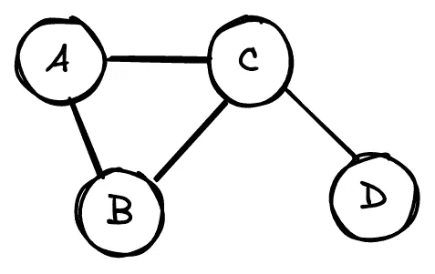**

**作者图片**

**图通常被表示为**邻接矩阵。**例如上图，会有如下矩阵。**

****

**每行和每列代表一个节点。第 *i* 行和第 *j* 列的 1，或 *A_{ij}=1* ，代表节点 *i* 和节点 *j* 之间的连接。A_{ij}=0 意味着节点 *i* 和 *j* 没有连接。**

**该图中的节点都不与自身相连，这意味着矩阵对角线为 0。同样， *A_{ij} = A_{ji}* 因为连接是无向的:如果 A 连到 B，那么 B 连到 A，结果邻接矩阵是沿对角线对称的。**

**我发现矩阵中的一堆 1 和 0 有点难以理解，所以这是同样的图表和带颜色的矩阵。**

**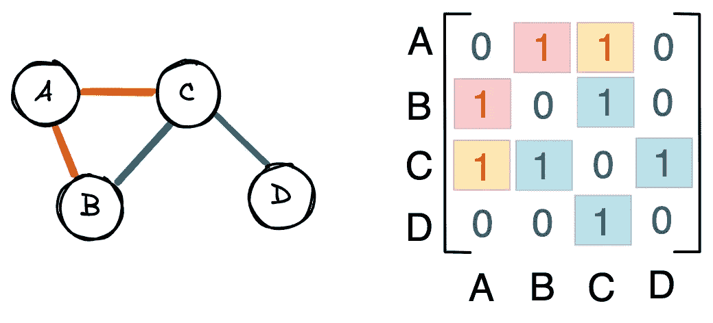**

**作者图片**

**带有*定向*边的*加权*图看起来像这样。注意这些关系不再是对称的——例如，邻接矩阵的第二行现在是空的，因为 B 没有出站连接。我们也有介于 0 和 1 之间的数字，它们反映了连接的强度。例如，C 对 A 的反馈比 A 对 C 的反馈更强烈。**

**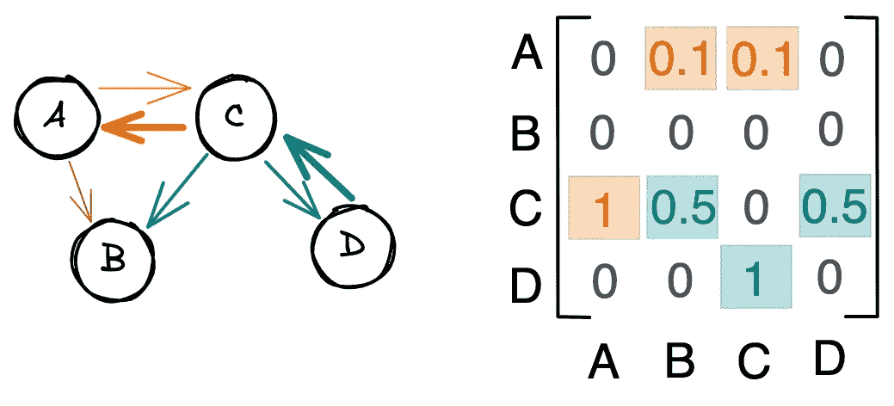**

**作者图片**

## **履行**

**为了简单起见，让我们实现一个未加权且无向的图。我们类中的主要结构是一个列表列表:每个列表都是一行，列表中的索引代表列。实例化一个`Graph`对象需要指定节点的数量`n`，以创建我们的列表列表。然后我们可以通过`self.graph[a][b]`访问节点`a`和`b`之间的连接。**

**我们可以像这样重新创建本节第一个示例中的图形:**

## **例子**

**一个更棘手的图形问题是识别图形中连通分量或子簇的数量。例如，在下图中，我们可以识别三个不同的组件。**

****

**作者图片**

**为了回答 [**LC 323:** 连通分量的数量](https://leetcode.com/problems/number-of-connected-components-in-an-undirected-graph/)，我们将检查图中的每个节点，访问它的邻居，它的*邻居的*邻居，等等，直到我们只遇到我们已经见过的节点。然后，我们将检查图中是否有我们没有访问过的节点——如果有，这意味着至少还有一个集群，因此我们获取一个新节点并重复这个过程。**

**在英语中:**

1.  ****第 5–8 行:**实例化一个队列(`q`)、节点列表(`unseen`)和组件数量(`answer`)。**
2.  ****第 10 行:**开始一个`while`循环，只要队列中有要处理的节点或者我们还没有访问的节点，这个循环就会执行。**
3.  ****第 13–15 行:**如果队列为空，从`unseen`中移除第一个节点，并增加组件数量。**
4.  ****第 18–19 行:**选择队列中的下一个可用节点(`focal`)。**
5.  ****第 22 行:**开始一个`while`循环，只要我们没有处理完所有剩余的节点，这个循环就会执行。**
6.  ****第 23 行:**命名我们当前所在的节点，使接下来的几行更加易读。**
7.  ****第 28–30 行:**如果我们所在的节点连接到`focal`，则将它添加到当前集群中的节点队列中，并将其从可能位于另一个集群中的节点列表中删除(`unseen`)。**
8.  ****第 31–32 行:**如果我们所在的节点*没有*连接到`focal`，继续到下一个潜在节点。**

****

**照片由[拍摄于](https://unsplash.com/@sixteenmilesout?utm_source=medium&utm_medium=referral) [Unsplash](https://unsplash.com?utm_source=medium&utm_medium=referral) 上外 16 英里处**

# **哈希表**

## **理论**

**让我们用一个更基本的数据结构来结束这篇文章:散列表，也叫做散列表。 [4]当我们离开数组时，我们留下了令人羡慕的 O(1)检索时间，以获得数据类型和数组大小的灵活性。但是，如果我们能够再次获得那种闪电般的效率，即使数据的类型和存储位置不同，又会怎样呢？**

**这就是哈希表的用武之地。这些表中的数据与键-值对相关联——输入键，一个 [**散列函数**](https://en.wikipedia.org/wiki/Hash_function) 在 O(1)时间内将您带到相关联的值。哈希表实际上使用指针数组来达到这个速度；哈希函数的工作是识别数组中的索引，该索引包含指向键值的指针。**

**下面是我们之前的链表作为散列表的样子。绿色的盒子是我们的桌子，里面存放着钥匙`key1`、`key2`和`key3`。当用户将这些键中的一个传入表中时，该键通过散列函数发送，以在指针数组中找到一个索引(紫色)。然后指针把我们带到内存中存储实际值的区域。数组中的每个指针都是四个字节，而它们所指向的值的大小是可变的。**

**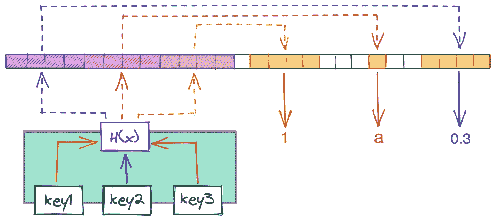**

**作者图片**

**该表的主要工作是散列函数，它在某个范围内将输入映射到输出*。*以 Python 的`hash`函数为例，输出-9223372036854775808 和 9223372036854775807 之间的值[。然后我们*存储散列值*——通常通过除以数组长度并取余数——返回指针数组中的一个索引。在上面的例子中，输出将是 0、1 或 2:指针数组的索引。](https://stackoverflow.com/questions/19132927/determining-the-range-of-values-returned-by-pythons-hash)**

**因为我们的数组不会有无限的索引，所以两个不同的输入可能会收到相同的散列输出。这种**冲突**意味着两个输入，比如用户 id`1005778`和`9609217`，都将落在返回`Jane Reader`的指针上，即使它们是不同的用户。我们不想那样！**

**第一个修正是确保我们的散列函数均匀地分布输出*。每个数组索引被选中的概率应该是相等的——如果某些索引比其他索引更有可能被选中，我们就会比我们需要的更频繁地遇到冲突。***

***一个更复杂的解决方案是引入另一种数据结构:链表。不是让每个指针指向内存中的一个确切值，**每个指针可以指向一个链表。**如果我们试图保存一个新的键值对，其中散列的键与现有的键冲突，我们只需在内存中的那个位置向列表添加另一个节点。为遍历列表和知道何时停止添加一点逻辑，您就可以开始了！***

***但是冲突本身也不是坏事——有时我们希望不同的输入得到相同的输出。如果你的酷酷的应用程序有四台服务器处理流量，你可以使用一个基本的哈希函数来平衡服务器之间的负载[。](https://www.f5.com/services/resources/glossary/load-balancer)***

## ***履行***

***散列表听起来可能类似于 Python 字典，事实上 Python `dict` [*就是*散列表](https://stackoverflow.com/questions/114830/is-a-python-dictionary-an-example-of-a-hash-table)！但是如果我们必须从头创建一个，我们可以像下面这样做。***

***为了处理散列冲突，我们为`self.array`使用一个列表列表，然后在检索或添加值时遍历该列表。我们将键和值都存储在我们的列表中，以便能够识别我们正在寻找的键-值对，假设多个键将具有相同的数组索引。***

***下面，我们实现一个*非常*基本的登录系统。我们在用户密码存储在`self.array[slot]`之前对其进行哈希处理，这意味着即使密码被盗，破解密码所需的时间也可能给用户足够的时间来修改密码。([这个由电脑爱好者制作的精彩视频](https://www.youtube.com/watch?v=7U-RbOKanYs)对此进行了深入探讨，它应该激励你永远不要使用像`password`这样的密码！)***

## ***例子***

***为了结束这篇文章，让我们来回答经典的 Leetcode 问题 [**LC 1:** 两个 Sum](https://leetcode.com/problems/two-sum/) 。就像我们处理数组一样，我们将只使用 Python 内置的类(`dict`)。问题如下:*给定一个整数数组和一个目标，返回对目标求和的两个数组元素的索引。假设只有一个答案。例如，对于数组`[1, 2, 3]`和目标`4`，我们将返回`[0, 2]`，因为 1 + 3 = 4。****

***这个问题有多种解决方法，幽默地概括在[这个对技术面试的模仿](https://www.youtube.com/watch?v=kVgy1GSDHG8)中。第一种是蛮力比较每一对数字(例如`1+2`、`1+3`、`2+3`)，这种方法肯定有效，但需要 O(n)时间。更好的方法是对数组进行排序，然后使用两个指针，一个在开始，一个在结束，如果它们的总和小于或大于目标，则分别迭代地移动左指针或右指针。由于排序的原因，这种方法需要 O(nlogn)时间。***

***但是我们实际上可以实现 O(n)时间，通过使用一个散列映射，访问每个元素最多一次。这里的关键概念是，对于每个数字`num`，我们需要查看是否有其他*数字等于`target-num`。我们可以使用 Python 字典(即 hash map)来存储我们已经看到的数字，然后使用 sweet O(1)查找时间来查看我们是否已经看到匹配`target-num`的数字。如果匹配，我们返回两个数的索引。****

***这是我们用目标`4`寻找数组`[1, 2, 3]`的方式。这里我们写出了`for`循环的每次迭代的逻辑。***

******

***照片由[穆罕默德·里什法恩](https://unsplash.com/@rishfaan?utm_source=medium&utm_medium=referral)在 [Unsplash](https://unsplash.com?utm_source=medium&utm_medium=referral) 拍摄***

# ***结论***

***这篇文章承担了介绍数据结构的卑微任务，数据结构是编程语言存储数据的方式。我们从区分任务(抽象数据类型)和实现(数据结构)开始，使用大 O 符号来量化数据结构上的操作效率，最后是我们在结构中存储的数据类型。然后我们讲述了数组、链表、树、图和散列映射的理论，并用 Python 实现了每一个，并回答了一两个 Leetcode 问题。***

***尽管这篇文章非常庞大，但是关于数据结构还有很多东西需要学习。例如，树可以被重塑以解决几十个用例，如代表二维空间的，[自动完成输入的字符串](https://en.wikipedia.org/wiki/Trie)，[快速运行区间数据的计算](https://en.wikipedia.org/wiki/Segment_tree)等等。如果您感兴趣，请查看本页中的一些高级结构及其常见用例。***

***最后，再次区分*数据结构*和*抽象数据类型*很重要。在这篇文章中，我们没有涉及堆栈、队列或堆，因为每种方法都有多种实现方式。例如，根据您的需要，可以用数组或链表来实现堆栈。请关注即将发布的关于这些更常见的抽象数据类型的文章。***

***暂时就这样了。下次见！***

***最好，
马特***

# ***脚注***

## ***1.大 O 符号***

***对于第一个*T21 用户请求特定阵列的所有排列，我们可能无能为力。但是我们*可以*将数组及其答案存储在哈希表中。对于随后的每个用户，我们可以检查我们的表，看看该数组是否已经被查询过。(我们希望对数组进行排序，删除空值，等等。否则会使相同的数组看起来不同。)如果用户请求一个排列已经被计算过的数组，我们可以以闪电般快的 O(1)运行时间来响应。如果没有…回到 O(n！).****

***这个概念被称为缓存或记忆。这是 Python 中的样子。***

***另一种方法是[动态编程](https://www.geeksforgeeks.org/dynamic-programming/)，它涉及递归地将一个问题分解成尽可能小的部分，然后缓存这些部分的结果。例如，如果我们的问题稍微修改一下，返回排列的数量，而不是实际的排列，那么缓存像 5 这样的值会很有帮助！还是 10！以避免每次都必须计算它们。***

## ***2.理论***

***数组索引需要 O(1)时间，因为总是只需要三个步骤:***

1.  ***转到内存中数组开始的位置***
2.  ***确定数组中的数据类型(例如浮点型)***
3.  ***在`array start` + `index * (size of data type)`返回内存中的值***

***数据类型很重要，因为不同的数据类型需要不同的内存。char 是一个字节，[例如](https://www.ibm.com/docs/en/ibm-mq/7.5?topic=platforms-standard-data-types)，而 int 是四个字节。获取索引 3 处的元素意味着从字符串的开始处遍历三个字节，而从整数数组的开始处遍历十二个字节。***

***步骤 3 暗示了为什么这么多编程语言都是 0 索引的:数组的第一个元素距离开始处有 0 个元素。如果`index * (size of data type)`是零，那么返回这个值就很容易，我们可以在`array start`返回这个值。***

## ***3.理论***

***注意，O(logn)是 log₂，而不是 log₁₀或自然对数。这种模式在二叉树中很容易看到，因为我们在搜索中的每一步，我们都将剩余的节点减少一半。***

## ***4.理论***

***这个[栈溢出帖子](https://stackoverflow.com/questions/32274953/difference-between-hashmap-and-hashtable-purely-in-data-structures)很好地解释了哈希映射和哈希表之间的区别。从技术上讲，哈希映射是一种抽象数据类型，但是这两个术语在很大程度上是可以互换的。***