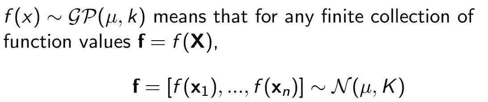
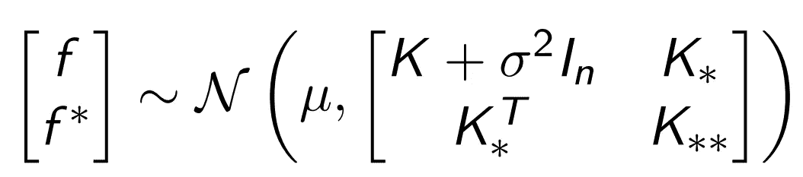
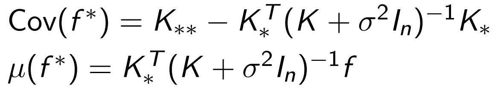
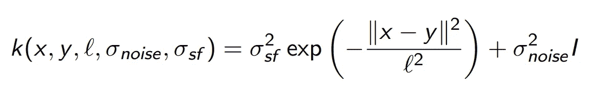
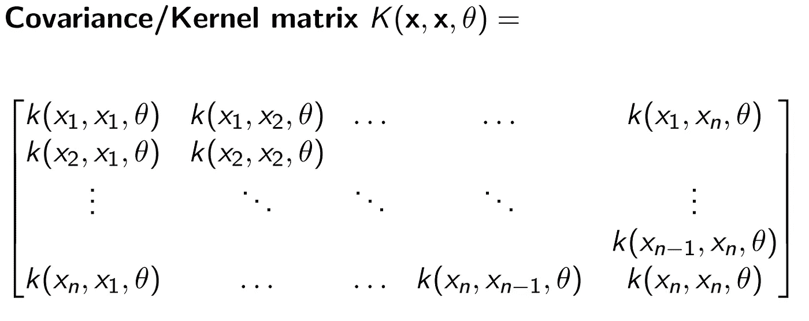
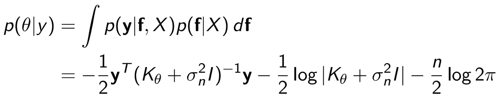
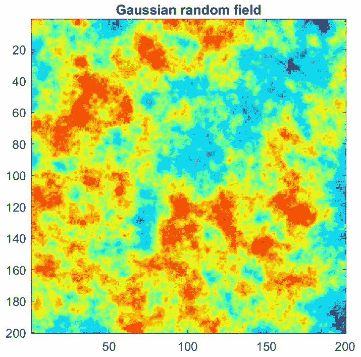
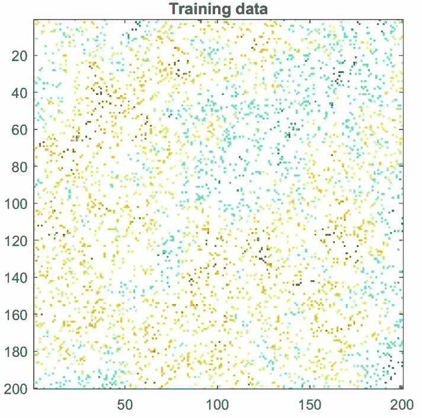
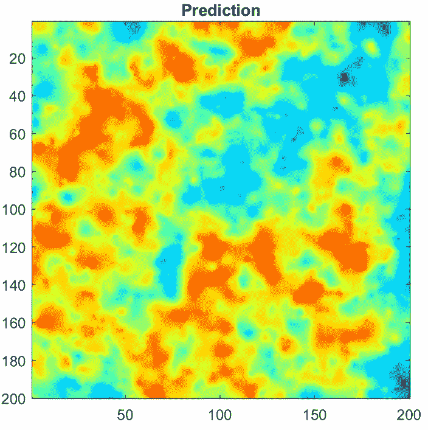
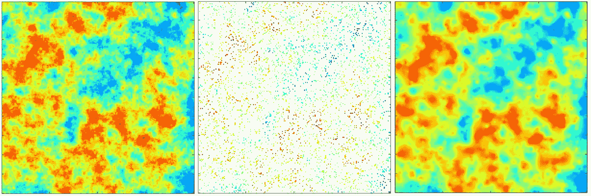

# 高斯过程回归

> 原文：<https://towardsdatascience.com/intro-to-gaussian-process-regression-14f7c647d74d?source=collection_archive---------22----------------------->

## 概念指南

高斯过程(GPs)是一类灵活的[非参数](https://en.wikipedia.org/wiki/Parametric_model)机器学习模型，通常用于空间和时间序列数据建模。GPs 的一个常见应用是回归。例如，给定不完整的地理天气数据，如温度或湿度，如何恢复未观测位置的值？如果有充分的理由相信数据是正态分布的，那么使用 GP 模型可能是明智的选择。在接下来的内容中，我们将介绍 GP 模型背后的机制，然后举例说明它在恢复丢失数据方面的用途。

# GP 模型

形式上，GP 是一个随机过程，或者是函数的分布。前提是函数值本身是随机变量。当将函数建模为高斯过程时，假设任何有限数量的采样点形成多元正态分布。

为什么这个假设有用？事实证明，高斯分布很容易处理，因为它们易于处理。事实上，高斯家族是[自共轭的](https://en.wikipedia.org/wiki/Conjugate_prior)，并且享有许多性质，例如在边缘化下是封闭的，在条件限制下是封闭的。因此，全球定位系统自然与贝叶斯机器学习相吻合，贝叶斯机器学习通常涉及先验的规范——在超参数上坚持自己的先验信念——并在参数上边缘化以获得后验预测分布。

回想一下[多元正态分布](https://en.wikipedia.org/wiki/Multivariate_normal_distribution)的特征是一个均值向量和协方差矩阵。这些是 GP 建模的核心概念。

# GP 推理/预测方程

在根据观察到的训练点对试验点进行预测时，假设如下的 ansatz。

这反映了前面的正态假设，除了这里我们区分训练点和测试点，后者用星号表示。我们还假设训练标签被高斯随机噪声破坏，因此修改了上面的核矩阵中左上的块。使用正态分布的特性，可以计算测试数据的条件分布:

(完整的推导见 GPML 书。)这些等式允许人们根据训练数据在测试点获得预测平均值和协方差。

# GP 核函数

为了使用上面的等式，必须能够模拟训练和测试数据的所有组合之间的[协方差](https://en.wikipedia.org/wiki/Covariance)和交叉协方差。粗略地说，协方差矩阵编码了训练值和测试值如何相互关联。为了能够明确地形成核矩阵，必须假设一个特定的核函数来模拟协方差。据说核是 GP 模型的核心，因为选择正确的核函数对于实现良好的模型拟合至关重要。

最常用的核函数是径向基函数(RBF ),它是通过取数据位置之间的比例平方欧几里得距离的指数而产生的。

例如，通过将核函数应用于每对数据位置(回想一下，每个数据点都与一个位置-值对相关联)，可以在观察到的数据之间形成核矩阵。

注意，核函数(以及矩阵)包含未确定的超参数，以允许对一大类函数进行建模。在实践中，通过使用 MLE 和优化似然函数，或给定观察数据的超参数的概率，调整这些参数以拟合训练数据。更具体地，在给定训练标签的情况下，最小化超参数的负对数似然(NLL ):

一旦优化了超参数，就可以将核矩阵插入到测试数据的均值和协方差的预测方程中，以获得具体的结果。

# GP 回归

GP 回归的前提是我们正在建模一个在有限数量的点上可访问的函数，然而我们对它在未被观察到的位置上的值感兴趣。降雨量是在地理上相隔很远的气象站测量的，海水盐度是沿着一定的轨迹测量的，森林中某种树木的密度也是在固定的地点采样的。GP 建模的核心是找到一个合适的核函数来对分布在空间中的这些数据点之间的相似性进行建模。一旦使用训练集优化了核函数参数，就可以使用预测方程对测试集进行预测。

为了说明这个过程，我们生成一个合成的高斯随机场，执行训练测试分割，并使用 GP 模型在未观察到的位置进行预测。

合成生成的马尔可夫随机场。图片作者。

随机二次抽样训练点。图片作者。

测试位置或未观察位置的 GP 预测平均值。该预测类似于原始高斯随机场的平滑版本。图片作者。

基本事实(左)、训练集(中)和预测(右)的比较。图片作者。

# GP 软件包

GP 回归有很多软件包！可用流行语言实现，如 [Python](https://scikit-learn.org/stable/modules/gaussian_process.html) 、 [PyTorch](https://gpytorch.ai/) 、 [Matlab](http://www.gaussianprocess.org/gpml/code/matlab/doc/) 和 [Julia](https://github.com/STOR-i/GaussianProcesses.jl) 。

# 结论

GP 模型是一种非参数模型，它足够灵活，可以适应多种数据，包括地理空间和时间序列数据。GP 回归的核心是指定合适的核函数，或位置已知的数据点之间的相似性度量，这构成了模型选择(MO)步骤。高斯分布的易处理性意味着可以找到以训练数据为条件的后验预测分布的封闭形式的表达式。虽然已经很好地建立，GPs 是一个正在进行研究的领域:最近的发展跨越了[多输出 GPs](https://proceedings.neurips.cc/paper/2007/file/66368270ffd51418ec58bd793f2d9b1b-Paper.pdf) 、GP 回归的[变分推断](https://arxiv.org/abs/1511.06499)和可伸缩 GPs。

# 进一步阅读

*   Rasmussen 和 Williams 的[机器学习的高斯过程](http://www.gaussianprocess.org/gpml/)