# 自然语言处理导论——如何对单词的含义进行编码

> 原文：<https://towardsdatascience.com/intro-to-natural-language-processing-how-to-encode-meaning-of-a-word-b1742d4beca2?source=collection_archive---------11----------------------->

## [实践教程](https://towardsdatascience.com/tagged/hands-on-tutorials)

## 理解 Word2Vec 的数学和实现

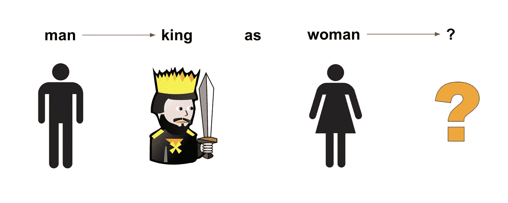

作者图片

***男人之于国王如同女人之于什么？***

你如何训练一个机器学习算法来正确预测正确答案，“女王”？

在这篇文章中，我将谈论一种自然语言处理模型——word 2 vec——它可以用来进行这样的预测。

在 Word2Vec 模型中，词汇表中的每个单词都由一个向量表示。这个向量的长度是我们人类设定的一个超参数。在本文中我们用 100。

因为每个单词都是 100 个数字的向量，所以你可以把每个单词想象成 100 维空间中的一个点。

Word2Vec 的最终目标是相似的单词具有相似的向量，从而在这个 100 维空间中更紧密地组合在一起。

那么，你如何训练一个算法，使得相似的单词最终有相似的向量呢？这如何帮助解决类比问题“男人对国王就像女人对什么？”

# 第一部分。带梯度下降的训练字 2Vec

为了训练 Word2Vec，你需要一个大的文本语料库。比如[棕色文集](https://en.wikipedia.org/wiki/Brown_Corpus)。NLTK 已经编译了一个可供访问的语料库的[列表。](http://www.nltk.org/nltk_data/)

Word2Vec 的核心是预测一个单词出现在另一个单词附近的概率(在一个句子中)。

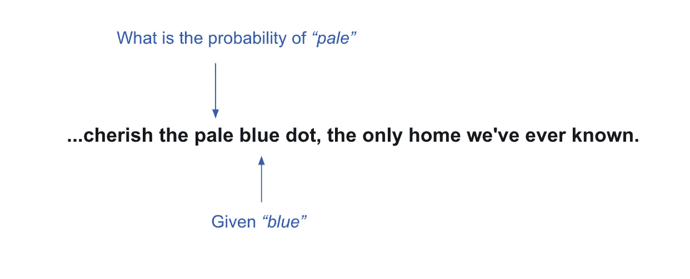

作者图片

上例:*“…珍惜淡蓝色的小点，我们所知的唯一家园”*，“蓝”是**中心**字，“淡”是或**上下文**字外的一个**。我们希望算法预测“苍白”是“蓝色”的上下文单词的概率注意:在这篇文章中，我将在**单词和**上下文**单词之外互换使用**。**

我们计算在定义的窗口大小内的每个上下文单词的概率。如果窗口大小为 1，我们希望预测紧接在中心单词之前和之后的单词的概率。如果窗口大小是 2，我们想要预测紧接在中心单词之前和之后的 2 个单词的概率。

因此，对于算法，我们遍历语料库中的每个单词。在每个位置 *t* 处，给定位置 *t* 处的中心单词，我们计算窗口 *w* 内上下文单词的概率。

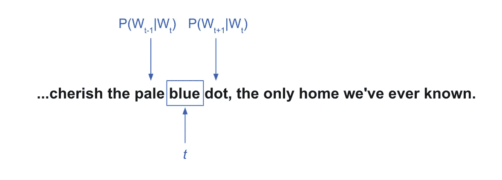

作者图片

好的模型将给出这些上下文单词的高概率，而坏的模型给出低概率。

实际值和预测值之间的差异被计入损失，在梯度下降中用于更新模型的参数(θ)。这就是许多监督学习算法的中心主题。

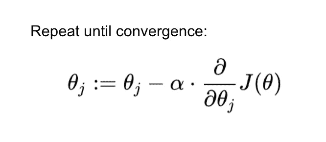

梯度下降

在 Word2Vec 中，theta 到底是什么？损失函数是什么？

## Word2Vec 的参数和损失函数

回想一下，每个单词都由 100 个数字组成的向量表示。还记得每个单词都可以作为中心词或上下文词。因此，**语料库中的每个唯一单词由两个向量**表示:一个向量作为中心单词，另一个向量作为上下文单词。

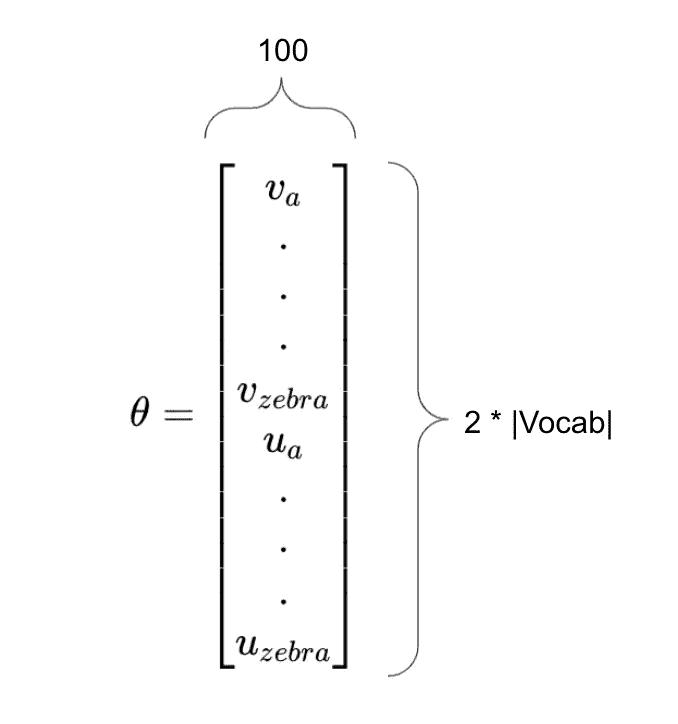

参数θ

Word2Vec 的参数 theta 是语料库中所有唯一单词的中心和外部向量。theta 的维数是词汇行和 100 列长度的 2 倍。

在图片中，我用小写的 *v* 表示一个单词的中心词向量，小写的 *u* 表示一个单词的上下文词向量。因此，当斑马是中心单词时， *v_zebra* 是斑马的向量。当 zebra 是某个其他中心词的上下文词时，u_zebra 是 zebra 的向量。稍后，我将使用大写字母 *U* 来引用一个包含所有外部向量 *u* 的矩阵。

我们将使用的损失函数是负对数似然(NLL)损失。NLL 用于许多机器学习算法，如逻辑回归。

NLL 的计算公式为:

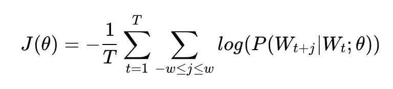

负对数似然损失函数

我们对唯一单词 *T、*的长度求和，并且在每个索引 *t* 处，我们对给定索引 *t* 处的中心单词的每个上下文单词(在窗口 *w* 内)的概率求和。

因此，给定一个中心单词，丢失一个上下文单词是:

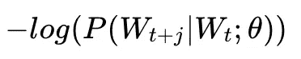

你如何计算概率？我们使用 Softmax 方程。下面是在给定一个中心词(c)的情况下，如何计算上下文词(o)的概率。

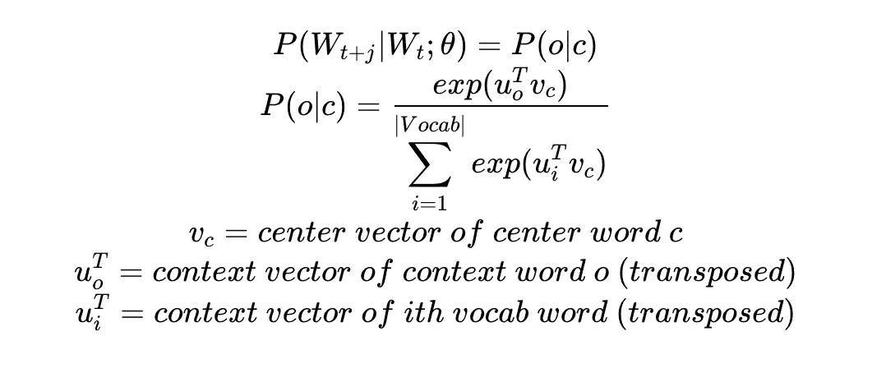

命名符是上下文词 *o* 的上下文向量与中心词 *c* 的中心向量的点积的指数。分母是每个词汇单词的上下文向量与中心单词向量的点积的指数之和。哇，那是一口！

正如您可能已经猜到的那样，这个 naive-softmax 概率的计算成本很高，因为我们必须对整个词汇表求和。还有另一种更有效的方法来做亏损；稍后我会描述它。

在梯度下降法中，你对损失函数求关于参数的导数，以找到如何在每次迭代中更新参数。

对于给定的中心词，我们需要计算中心词向量的梯度以及所有上下文词向量的梯度。

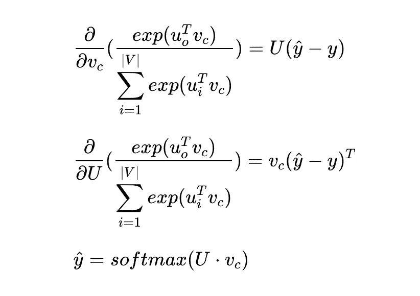

计算梯度的损失函数导数

我不会在这里求导，但是为了计算中心向量的梯度，你要取 *U* 和(y_hat 减 y)的点积。正如我提到的，U 是整个词汇的所有外部向量的矩阵。为了计算外部向量的梯度，你取中心向量和(y_hat 减 y)的点积。这种情况下的 y_hat 是 *U* 和中心向量的点积的 Softmax。

总的来说，算法是这样工作的:

对于每次迭代:

1.  计算小批量(如 50 号)的损耗和梯度。
2.  像这样更新模型参数:

`theta = theta — learning_rate * gradients`

为了计算尺寸为 50 的小批量的梯度，您迭代 50 次，并且在每次迭代期间，您:

1.  获取一个随机的中心词及其上下文词。
2.  对于每个上下文单词，计算梯度(通过对损失函数求导)。
3.  聚合上下文单词的所有梯度。

然后，小批量的聚集梯度被用于更新θ。

这里有一个 Github 的要点和一些相关的代码。注意:我已经排除了一些部分，如解析语料库和 Softmax 方程的代码。

我刚才描述的算法叫做跳格算法。在 Skip-Gram 中，给定一个中心词，预测上下文词的概率。还有另一种算法叫做 CBOW，根据上下文预测中心词的概率。

正如我提到的，我们使用的损失函数计算起来很昂贵。还有另一种训练 Word2Vec 的技术叫做“负采样”在负采样中，不是交叉熵损失(即 Softmax 函数的负对数似然)，而是为一个真实对和几个噪声对训练二元逻辑回归。真正的对是一个中心词和它的上下文词之一。噪声对是相同的中心词和随机词。在负抽样中，损失函数更有效，因为你不是对整个词汇求和。

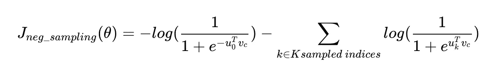

负采样的损失 fxn

# 第二部分。Word2Vec 如何解决类比问题

男人之于国王就像女人之于什么？

当你让 Word2Vec 算法来解决这个类比时，你实际上是在让它找出一个与“国王”和“女人”最相似，但与“男人”最不相似的词。这里的相似度是指两个向量的**余弦相似度。**

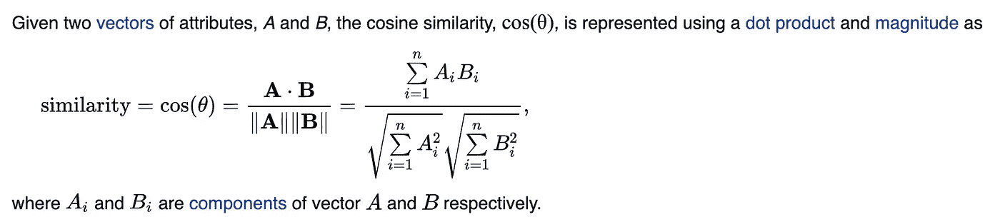

[https://en.wikipedia.org/wiki/Cosine_similarity](https://en.wikipedia.org/wiki/Cosine_similarity)

因此，经过训练后，单词“女王”的向量与“国王”和“女人”的向量最相似，但与“男人”的向量不同

此外，因为相似的单词在高维空间中聚集在一起，所以您可以将“queen”的向量想象为“king”的向量减去“man”的向量加上“woman”的向量。

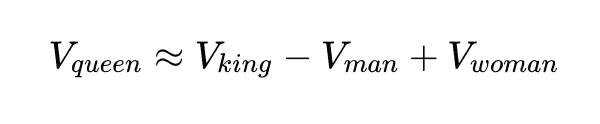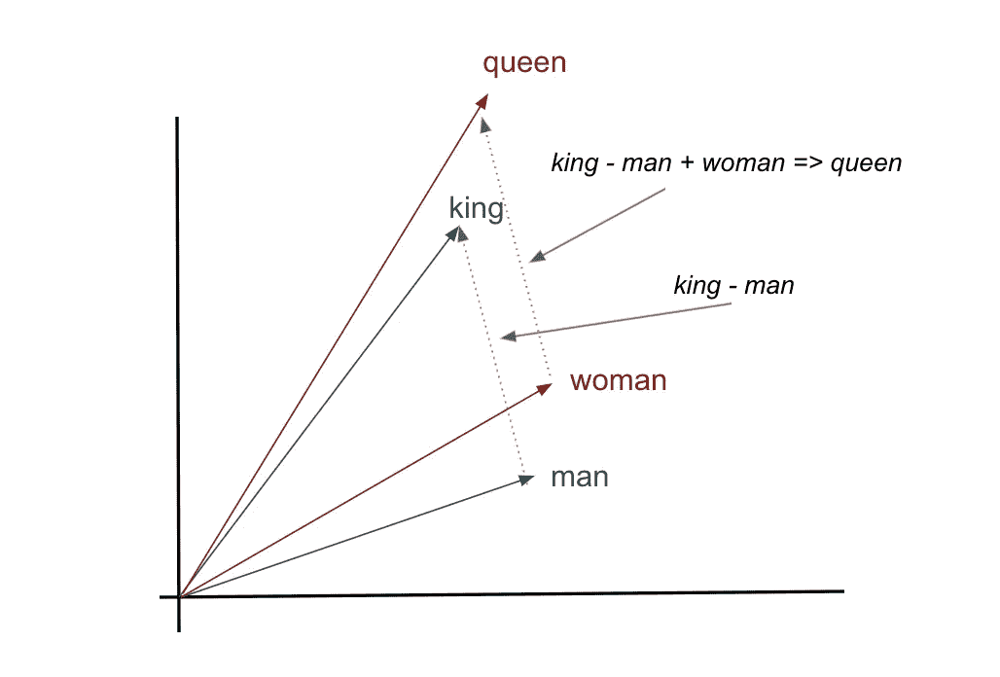

作者图片

这就是我们如何训练计算机解决类比问题！

查找相似词和解决类比只是 Word2Vec 的两个基本应用。Word2Vec 嵌入还可以用于更复杂的任务，比如情感分析。对于情感分析，特征将是句子中所有单词向量的平均值。标签当然是一种情绪(积极、消极、中性)。然后，您可以使用随机森林、Softmax 回归甚至神经网络等分类器进行多类分类！

敬请关注 NLP 的更多文章！