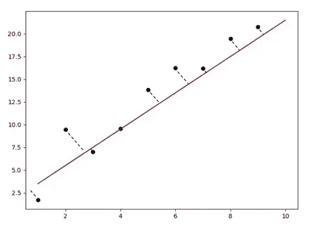
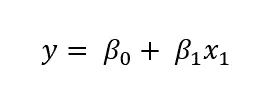
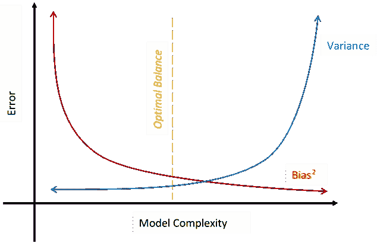
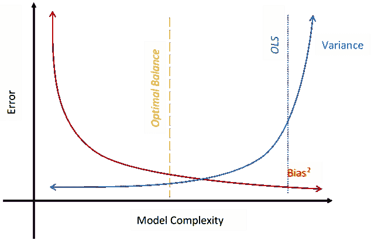
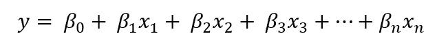
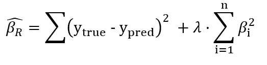
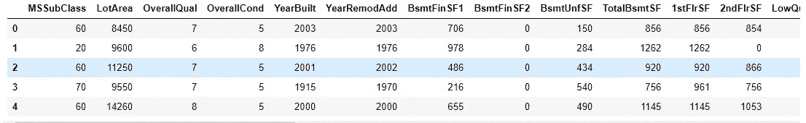
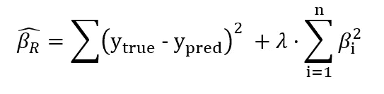
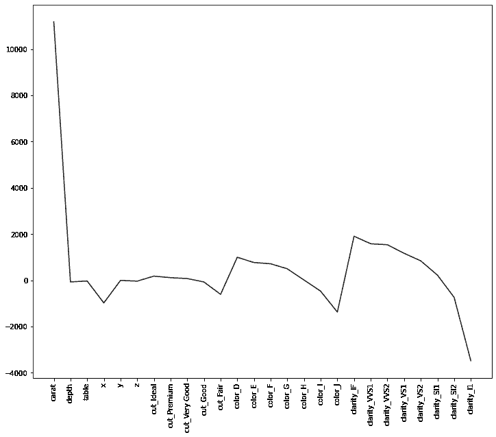

# 介绍使用 Sklearn 的岭和套索回归正则化

> 原文：<https://towardsdatascience.com/intro-to-regularization-with-ridge-and-lasso-regression-with-sklearn-edcf4c117b7a?source=collection_archive---------8----------------------->

## 你还不如放弃线性回归


**照片由** [**瑞秋克莱尔**](https://www.pexels.com/@rachel-claire?utm_content=attributionCopyText&utm_medium=referral&utm_source=pexels) **上** [**像素**](https://www.pexels.com/photo/rough-mountain-near-grassy-terrain-under-sky-4992636/?utm_content=attributionCopyText&utm_medium=referral&utm_source=pexels)

## 线性回归问题

线性回归又称普通最小二乘法，是最简单、应用最广泛的最大似然算法之一。但它有一个致命的缺陷——算法非常容易过度拟合训练数据。

对于最简单的情况-2D 数据，一切都很直观:最佳拟合线是最小化残差平方和(SSR)的线:



**作者图片**

公式也没那么难:



但是随着预测变量(或维数)的增加，系数 *β_i* 也会变得非常大。有了大的系数，就很容易预测几乎所有的事情——你只需要得到各个斜率的相关组合( *β* s)就可以得到答案。这就是为什么线性回归模型通常会过度拟合训练数据。

LR 的另一个问题是它不关心特征的权重。只要它们之间存在线性关系，你就会得到一个 OLS 最小化的模型。但是在现实中，您确实希望您的模型关心每个特征的权重。例如，如果您试图预测某个城镇的新生儿数量，一个显而易见的因素就是育龄妇女的数量。

然而，在那个特定的城镇里，鹳的数量是完全不相关的。但是，如果这些数字恰好代表一个线性关系，你用这两个数字进行线性回归，你会得到一个蹩脚的模型，但 OLS 仍然被最小化。

在实践中，这是一个真实而普遍的问题:今天的数据集包含许多对你试图预测的目标有用和无用的特征。

> 你可以在 Kaggle 上的这里运行这篇文章的笔记本。

[](https://ibexorigin.medium.com/membership) [## 通过我的推荐链接加入 Medium-BEXGBoost

### 获得独家访问我的所有⚡premium⚡内容和所有媒体没有限制。支持我的工作，给我买一个…

ibexorigin.medium.com](https://ibexorigin.medium.com/membership) 

获得由强大的 AI-Alpha 信号选择和总结的最佳和最新的 ML 和 AI 论文:

[](https://alphasignal.ai/?referrer=Bex) [## 阿尔法信号|机器学习的极品。艾总结的。

### 留在循环中，不用花无数时间浏览下一个突破；我们的算法识别…

alphasignal.ai](https://alphasignal.ai/?referrer=Bex) 

## 偏差和方差权衡

要了解岭回归是如何解决上述两个问题的，我们还得了解另外两个重要的话题:**偏差**和**方差**。

方差总是与模型在新的(测试)集上表现不佳有关。高方差会导致过度拟合，这是有意义的，因为过度拟合模型会为不同的数据集生成非常不同的不一致的结果。

相反，偏差是模型无法对训练数据进行归纳。一个有太多偏差的模型不能在训练集和测试集上都通用化。

理想情况下，完美的模型应该具有低偏差和低方差，但这说起来容易做起来难。因为，偏倚和方差在模型复杂度上是一种权衡关系。



作者图片

> 模型的复杂性是由输入到模型中的维数决定的，即特征的数量。

由于线性回归是无偏的(不关心预测值)，它非常适合训练数据。但是拟合过于具体，导致模型具有非常高的方差，将线性回归置于模型复杂性图的最右侧:



作者图片

## 脊正则化

与偏差和过度拟合相关的两个问题都可以使用脊和套索回归优雅地解决。对于新的两个回归，最佳拟合线的等式仍然是相同的:



改变的是成本函数。岭回归和套索回归都为 OLS 引入了一个新的超参数——𝜆.我们先来看岭的成本函数:



除了 OLS(第一部分)，岭回归对特征变量的每个单独的斜率进行平方，并通过一些数字𝜆.对它们进行缩放这被称为岭回归惩罚。这种惩罚本质上是收缩所有系数(斜率)。这种收缩具有双重效果:

*   我们避免用较低的系数过度拟合。因为λ只是一个常数，所以它对所有系数都有相同的缩放效果。例如，通过为*λ*选择一个低值，如 0.1，我们可以缩放所有大的和小的系数。
*   这种缩放还会给完全无偏的 LR 带来一些偏差。这么想吧——如果你对一个大数字求平方，你会得到一个更大的数字。通过选择一个像 0.01 这样的低值，你可以缩小这个数字很多。但是如果你平方小的数，比如小于 1 的数，你得到的不是一个更大的数，而是一个更小的数。乘以 0.01，你就能让它变得更小。通过这种方式，岭回归可以使重要的特征更加明显，而不重要的特征缩小到接近于 0，从而得到一个更加简化的模型。

您可能会说，缩放的平方斜率的总和会更大，这与训练数据以及简单的旧 OLS 不相符。这是真的，但从稍微差一点的拟合开始，从长远来看，山脊和套索提供了更好和更一致的预测。通过引入少量的偏差，我们得到了方差的显著下降。

让我们使用 Scikit-learn 来看看 Ridge 的运行情况。`Ridge`遵循与`sklearn`提供的任何其他模型相同的 API。我们将处理来自 Kaggle 的 [Ames 住房数据集](https://www.kaggle.com/c/house-prices-advanced-regression-techniques)。使用要素的子集，我们将在本节中使用山脊预测房价，在下一节中使用套索预测房价。简而言之，我正在加载一个已经处理过的数据集(选择、缩放和估算的要素):



作者图片

首先，我们将拟合一个`LinearRegression`模型，并使用 MAE(平均绝对误差)将其性能与`Ridge`进行比较。在我们这样做之前，需要做一些预处理，比如缩放变量和填充缺失值。所以，我将创建一个简单的`Pipeline`实例来处理它们:

> 如果你想了解更多关于使用`sklearn`的`pipelines`的信息，请查看 Kaggle 上的这篇[文章](/how-to-use-sklearn-pipelines-for-ridiculously-neat-code-a61ab66ca90d)或[笔记本](https://www.kaggle.com/bextuychiev/lasso-regression-with-pipelines-tutorial)。

现在，让我们首先拟合一个线性回归方程:

如您所见，测试分数明显低于培训分数，这表明过度适应。现在，让我们试试山脊:

对于 Ridge，我们得到了几乎相同的结果，因为我们为`alpha`选择了太小的值。如果你回到岭的成本函数，你可以看到，如果我们设置*λ*为 0，我们得到平原老 OLS 回来:



> 注意在`sklearn` API 中，超参数`lambda`被给定为`alpha`。不要混淆。

现在，我们可以使用`RidgeCV`进行交叉验证，而不是盲目地为`alpha`尝试一堆值。RidgeCV 没有为`alpha`取一个单一的值，而是取一个可能 alphas 的列表，并使用交叉验证来尝试它们，就像 GridSearch 一样:

在 10 倍交叉验证下，我们通过了 1 到 100 范围内的`alpha`,步长为 5。拟合完成后，我们可以使用`.alpha_`属性获得最佳 alpha:

```
>>> ridge.alpha_86
```

最后，让我们用超参数评估一个脊，并与线性回归进行比较:

不幸的是，即使有了α的最佳值，我们也得到了与线性回归几乎相同的结果。(在撰写本文时，我意识到这是一个很晚才显示山脊和拉索的糟糕数据集😶).

## 套索回归正则化

套索回归也很像山脊。在成本函数中只有很小的差别:


Lasso 回归不是取每个系数的平方，而是取它们的绝对值。其余的几乎相同。让我们来看看回归变量在新数据集上的作用。我将加载来自 Seaborn 的内置钻石数据集:

```
diamonds = sns.load_dataset('diamonds')
diamonds.head()
```


利用所有的特征，我们将使用 Lasso 来预测价格:

Lasso 和 LassoCV 以同样的方式导入。我们将使用 CV 找到α的最佳值:

看起来选择一个非常低的 alpha 就足够好了。现在，让我们拟合该值并评估性能:

拉索回归做得相当不错。关于套索回归的一个很酷的事情是它可以用于特征选择。由于它在引擎盖下的工作方式，套索回归有能力将不重要的参数一直缩小到零。我们可以通过使用`coef_`属性绘制上面拟合的`lasso`系数来检查这一点:



正如你所看到的，除了克拉似乎是钻石价格的决定因素，所有其他系数都缩小到接近 0:

这就是山脊和套索的主要区别。Lasso 可以将系数缩小到 0，而 Ridge 则不能。

## 结论

总之，山脊和套索是两个最重要的正则化技术。它们都通过引入一些导致较低方差的偏差，从而避免过拟合，来解决简单的老式 LR 的问题。超参数`lambda`控制不同量级特征的正则化程度。

尽管我们涵盖了很多内容，但我们并没有深入研究支持这两种优雅算法的复杂数学。因此，我留下了一些可能有所帮助的参考资料:

*   怎么推荐都不过分:在[山脊](https://www.youtube.com/watch?v=Q81RR3yKn30)和[套索](https://www.youtube.com/watch?v=NGf0voTMlcs)上的任务
*   [线性、脊形和套索回归背后的数学原理](https://medium.com/analytics-vidhya/math-behind-linear-ridge-and-lasso-regression-b9de216ebdf8)
*   [山脊正则化和套索正则化背后的数学原理](https://medium.datadriveninvestor.com/the-math-behind-ridge-regularization-and-lasso-regularization-c4473332dbda)
*   [套索回归导致稀疏，而岭回归不会！—展开数学运算](https://www.analyticsvidhya.com/blog/2020/11/lasso-regression-causes-sparsity-while-ridge-regression-doesnt-unfolding-the-math/)